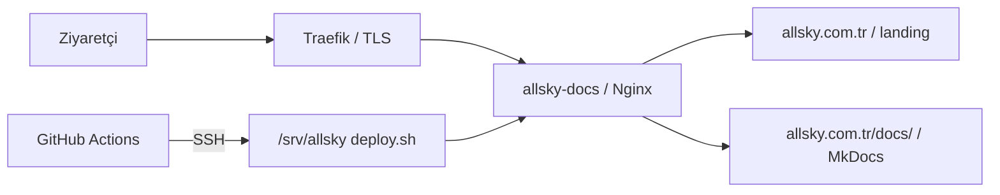

# Production Deployment

Bu dizin, `allsky.com.tr` için production deployment altyapısını tanımlar.

## Mimari



- `https://allsky.com.tr/` minimal landing page sunar.
- `https://allsky.com.tr/docs/` MkDocs çıktısını sunar.
- Traefik TLS termination ve host routing yapar.
- Nginx aynı container içinde landing ile documentation dosyalarını sunar.
- GitHub Actions doğrulama tamamlandıktan sonra SSH üzerinden dedicated deployment checkout içindeki scripti çalıştırır.

## Ön koşullar

- Ubuntu sunucuda Docker Engine ve Docker Compose plugin
- Çalışır durumda Traefik kurulumu
- Traefik'in bağlı olduğu external Docker network: `proxy`
- Repository için salt deployment amacıyla kullanılan `/srv/allsky` checkout'u
- GitHub Actions deploy kullanıcısına ait SSH public key

## İlk sunucu kurulumu

1. Proje dizinini oluşturun ve deployment kullanıcısına verin:

   ```bash
   sudo mkdir -p /srv/allsky
   sudo chown DEPLOY_USER:DEPLOY_GROUP /srv/allsky
   ```

2. Repository'yi doğrudan bu dizine clone edin ve `main` branch'ine geçin:

   ```bash
   git clone https://github.com/esenbaytekin/PixInsight-Master-Guide.git /srv/allsky
   cd /srv/allsky
   git switch main
   ```

3. Environment örneğini yerel production dosyasına kopyalayın:

   ```bash
   cp .env.example .env
   ```

   Gerekirse `.env` içindeki `TRAEFIK_CERTRESOLVER` değerini sunucudaki Traefik resolver adıyla eşleştirin. `.env` Git tarafından izlenmez.

4. External network'ü doğrulayın; yoksa yalnız Traefik kurulumunuzun network tasarımına uygunsa oluşturun:

   ```bash
   docker network inspect proxy
   ```

5. Deployment kullanıcısının `~/.ssh/authorized_keys` dosyasına GitHub Actions için oluşturulan public key'i ekleyin. Private key yalnız GitHub secret olarak saklanmalıdır.

6. Script iznini ve ilk deployment'ı doğrulayın:

   ```bash
   chmod +x deployment/scripts/deploy.sh
   ./deployment/scripts/deploy.sh
   ```

!!! warning "Dedicated checkout"
    `deploy.sh`, `/srv/allsky` checkout'unu `origin/main` durumuna hard reset eder. Scripti geliştirme çalışma ağacında veya saklanmamış değişiklik bulunan bir checkout'ta çalıştırmayın. `.env` ignored olduğundan reset sırasında korunur.

## GitHub Actions secrets

Repository veya `production` environment altında şu secrets tanımlanmalıdır:

| Secret | İçerik |
|---|---|
| `DEPLOY_HOST` | Production sunucunun DNS adı veya yönetilen bağlantı hedefi |
| `DEPLOY_USER` | `/srv/allsky` ve Docker erişimi bulunan sınırlı deployment kullanıcısı |
| `DEPLOY_SSH_KEY` | İlgili kullanıcının private SSH key'i |
| `DEPLOY_PORT` | SSH portu; boşsa workflow `22` kullanır |

Password authentication kullanılmaz. Secret değerlerini repository dosyalarına, issue'lara veya workflow loglarına yazmayın.

## DNS gereksinimleri

- Apex `allsky.com.tr` için production ingress hedefine yönelen bir `A` kaydı gerekir.
- `www.allsky.com.tr` için aynı hedefe yönelen `A` veya apex'e yönelen `CNAME` kaydı gerekir.
- Compose yapılandırması `www` isteklerini HTTPS üzerinde apex domaine yönlendirir.
- Cloudflare proxy kullanılıyorsa SSL/TLS modu, origin certificate akışı, WebSocket/HTTP davranışı ve gerçek istemci IP aktarımı mevcut Traefik politikasıyla uyumlu olmalıdır. Cloudflare credential'ları bu repository'de saklanmamalıdır.

## Deployment akışı

```text
local commit
→ push main
→ MkDocs ve Docker doğrulaması
→ production environment onayı/kuralları
→ SSH deployment
→ Docker rebuild
→ healthy container replacement
```

Workflow aynı anda yalnız bir production deployment çalıştırır. Validation başarısız olursa SSH adımı başlamaz.

## Manuel doğrulama

Sunucuda:

```bash
docker compose config
docker compose ps
curl --fail https://allsky.com.tr/healthz
curl --fail --location https://allsky.com.tr/docs/
```

`/healthz` yanıtı plain text `ok` ve HTTP 200 olmalıdır.

## SEO, robots.txt ve Search Console

MkDocs, `site_url: https://allsky.com.tr/docs/` değerinden canonical bağlantıları ve `sitemap.xml` dosyasını üretir. Repository'deki `docs/robots.txt`, build sonrasında `/docs/robots.txt` altında yer alır. Nginx aynı dosyayı origin kökündeki `/robots.txt` isteğine de sunar; iki konum aynı sitemap hedefini bildirir.

Google Search Console doğrulamasında tercih edilen yöntem **Domain Property / DNS TXT** yöntemidir. Maintainer, Google'ın ürettiği gerçek TXT kaydını Cloudflare DNS'e eklemelidir. Repository'ye doğrulama token'ı veya sahte HTML verification dosyası eklenmemelidir. Google daha sonra gerçek bir HTML verification dosyası verirse dosya adı ve içeriği değiştirilmeden `docs/` altına konur.

Search Console sitemap işlemleri production deploy sonrasında manuel yürütülür:

1. `allsky.com.tr` sahipliğini Google'ın verdiği DNS TXT kaydıyla doğrulayın.
2. Search Console içindeki **Sitemaps** raporunu açın.
3. `https://allsky.com.tr/docs/sitemap.xml` adresini gönderin.
4. Sitemap'in okunabildiğini ve `/docs/` URL'leri içerdiğini doğrulayın.
5. Indexed ve excluded URL raporlarını izleyin.
6. `https://allsky.com.tr/docs/` adresini URL Inspection ile inceleyin.
7. Yalnız production deploy ve son kontrollerden sonra indexing isteyin.

## Google Analytics 4 maintainer kontrolü

Repository, GA4 Measurement ID'yi yalnız `mkdocs.yml` içindeki native Material entegrasyonunda tutar. Google hesabındaki aşağıdaki ayarlar repository tarafından değiştirilemez ve tamamlanmış sayılmaz:

- Web data stream URL: `https://allsky.com.tr/docs/`
- Enhanced Measurement ve page views
- Scroll ve outbound click ölçümü
- Site search ölçümü
- Internal traffic filtering
- Data retention
- Google Signals; bilinçli ihtiyaç yoksa kapalı olmalıdır
- Ads personalization; bilinçli ihtiyaç yoksa kapalı olmalıdır
- Unwanted referrals
- Cross-domain tracking; zorunlu değilse etkinleştirilmemelidir

Production doğrulamasında consent öncesi GA4 isteği ve `_ga` çerezi oluşmadığı; kabul sonrası tekil page view akışı; tercih kaldırıldıktan sonra yeni analytics gönderiminin durduğu tarayıcı network araçları ve GA4 Realtime ile kontrol edilmelidir.

## Rollback

Rollback için daha önce doğrulanmış tam commit SHA'sını kullanın. Bu işlem dedicated deployment checkout'ta manuel yapılır:

```bash
cd /srv/allsky
git fetch --prune origin
git switch --detach COMMIT_SHA
docker compose build --pull
docker compose up -d --remove-orphans
docker compose ps
```

Rollback sonrası health endpoint ve `/docs/` kontrol edilmelidir. Sonraki normal deployment checkout'u yeniden `main` ve `origin/main` durumuna getirir:

```bash
git switch main
git reset --hard origin/main
```

## Güvenlik notları

- Repository'ye `.env`, private key, token, password veya production IP eklemeyin.
- Deployment kullanıcısına yalnız gerekli repository ve Docker yetkilerini verin.
- SSH private key'i periyodik olarak döndürün.
- Traefik certificate resolver secret'ları Traefik'in kendi güvenli ortamında tutulmalıdır.
- CSP bilinçli olarak eklenmemiştir; MkDocs Material ile ayrıca test edilmeden etkinleştirilmemelidir.
