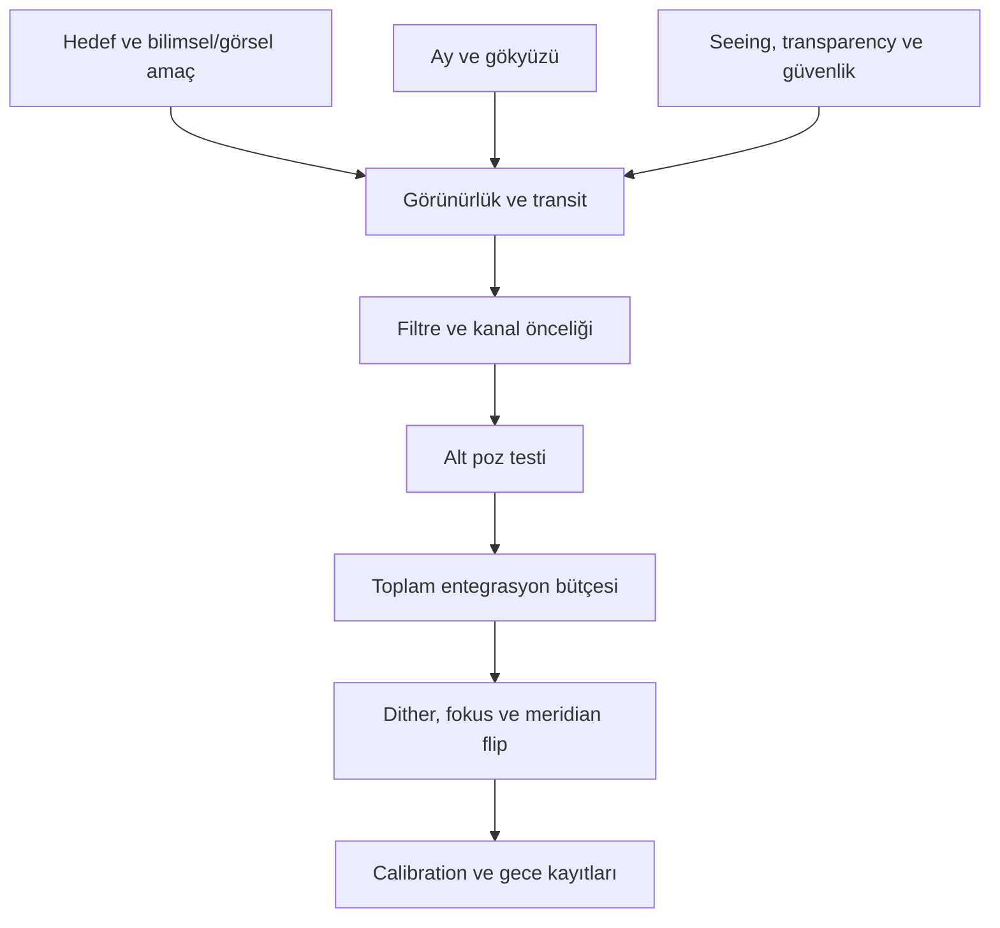

# Çekim Planlama

!!! info "Sayfa Bilgisi"
    **Kategori:** Görüntüleme Temelleri · **Düzey:** Beginner · **Tahmini okuma:** 15 dk
    **Anahtar kelimeler:** `çekim planlama` · `target visibility` · `Moon phase` · `seeing` · `transparency` · `sub exposure` · `dithering` · `multi-night`

## Bu konu neden önemlidir?

İşleme kalitesi, sahada kaydedilen verinin sınırlarını aşamaz. Hedef ufka yakınken, Ay hedefe yaklaşmışken, fokus sıcaklıkla kaçmışken veya depolama dolmuşken en iyi process zinciri bile kaybedilen ölçümü geri getiremez. Çekim planlama; hedef geometrisini, hava koşullarını, kamera sınırlarını ve operasyon risklerini tek bir uygulanabilir gece planına dönüştürür.

Plan sabit poz reçetesi değildir. Aynı hedef için en uygun sıra; konum, mevsim, ekipman, gökyüzü parlaklığı, filtre ve kalite hedefiyle değişir. Bu sayfa tarih vermeden karar çerçevesi sunar.

## Temel kavramlar

### Target visibility ve transit

Bir hedefin ufkun üzerinde olması tek başına uygun olduğu anlamına gelmez. Yükseklik arttıkça ışığın atmosferde katettiği yol genellikle azalır. Transit, hedefin gözlem gecesinde meridyene ulaşıp en yüksek konumuna yakın olduğu andır. Kritik broadband veya zayıf kanal süresi, mümkünse hedefin daha yüksek olduğu pencereye yerleştirilir.

Ufuk engelleri, güvenli mount limitleri ve meridian flip zamanı gerçek kullanılabilir pencereyi daraltır. Planlama yazılımındaki teorik görünürlük, saha geometrisiyle doğrulanmalıdır.

### Moon phase ve angular separation

Ay’ın fazı tek başına yeterli ölçüt değildir. Ay’ın hedefe açısal uzaklığı, gökyüzündeki yüksekliği, atmosferik saçılma, haze ve kullanılan filtre birlikte arka planı etkiler. Geniş bant toz veya yansıma hedefleri parlak Ay’dan daha çok etkilenebilir; narrowband veri de Ay etkisinden tamamen bağımsız değildir.

!!! note "TODO Illustration"
    Hedef, Ay ve ufuk geometrisi: transit, açısal ayrım ve kullanılabilir çekim penceresi.

### Seeing ve transparency

- **Seeing**, atmosferik türbülansın yıldız profilini ve ulaşılabilir açısal ayrıntıyı nasıl etkilediğini anlatır.
- **Transparency**, atmosferin hedef ışığını ne kadar ilettiğiyle ilgilidir; ince bulut, nem, aerosol ve haze bunu düşürebilir.

İyi seeing ile düşük transparency aynı gecede görülebilir. Küçük ölçekli luminance ayrıntısı seeing’e duyarlıyken zayıf broadband yapı transparency’den güçlü biçimde etkilenebilir. İkisini tek “hava iyi/kötü” etiketinde birleştirmemek gerekir.

### Clouds, humidity ve güvenlik

Bulut yalnız kare kalitesini değil ekipman güvenliğini de etkiler. Nem ve dew point optik yüzeylerde yoğuşma riskini artırır. Yağış, rüzgâr ve güç kesintisi için otomatik kapanma davranışı gerçek donanımla test edilmelidir; internet bağlantısı güvenlik mekanizmasının tek halkası olmamalıdır.

### Sub exposure ve integration planning

Alt poz süresi, tek karenin gökyüzü tabanı, read noise katkısı, yıldız doygunluğu, takip performansı ve rejection için elde edilecek kare sayısı arasında dengedir. Toplam entegrasyon ise hedef SNR ve kanal derinliğini belirleyen ana bütçedir.

Uzun tek poz her zaman daha verimli değildir. Doygunluk, uydu izi, rüzgâr veya guiding hatası nedeniyle kaybedilen uzun kare daha büyük süre kaybı yaratır. Çok kısa pozlar da toplam veri hacmini ve her karedeki read noise katkısını artırabilir. Test pozlarıyla ölçüm yapılır; evrensel saniye değeri kullanılmaz.

### Dithering

Dithering, kareler arasında teleskop pointing’ini küçük miktarlarda değiştirerek hedefin sensör üzerindeki konumunu kaydırır. Registration sonrasında gökyüzü sinyali hizalanırken sensöre bağlı pattern farklı konumlara dağılır; yeterli kare ve uygun rejection ile walking noise ve sabit desen kalıntıları azaltılabilir.

Dither büyüklüğü, sıklığı ve settle süresi mount, pixel scale, guiding ve toplam poz sayısına bağlıdır. Dithering bozuk calibration’ın yerine geçmez.

### Meridian flip ve autofocus

German equatorial mount meridyeni geçerken flip gerektirebilir. Flip sonrasında framing, guiding, rotasyon davranışı ve autofocus tekrar doğrulanır. Autofocus yalnız gecenin başında yapılacak işlem değildir; sıcaklık değişimi, filtre değişimi veya HFR/FWHM eğilimi yeni fokus koşusunu gerektirebilir.

### Calibration frames

Light planı, calibration planından ayrı değildir:

- Dark kareleri ilgili gain, offset, sıcaklık, readout mode ve gerektiğinde poz süresiyle eşleşir.
- Flat kareleri filtre, optik tren, fokus bölgesi, kamera açısı ve sensör üzerindeki gölge/toz geometrisini temsil eder.
- Bias veya dark-flat seçimi kamera davranışı ve calibration yöntemine göre belirlenir.

Ayrıntılı işleme ilişkisi için [Calibration Pipeline](../03-kalibrasyon/calibration-pipeline.md) kullanılmalıdır.

### Multi-night projects

Çok geceli projede tekrar üretilebilirlik önemlidir. Rotation, framing, sıcaklık hedefi, gain/offset, filter mapping ve dosya adlandırma tutarlı tutulur. Her geceye ait hava, fokus, meridian flip ve anomali kayıtları daha sonra Subframe seçimi ve normalization kararlarını destekler.

### Power, storage ve operasyon bütçesi

Plan yalnız gökyüzü süresi değildir. Kamera, mount, dew heater, mini PC ve ağ ekipmanının güç tüketimi; soğutma başlangıcındaki yük ve güvenli kapanma rezervi hesaplanır. Beklenen kare sayısı dosya boyutuyla çarpılır; geçici dosyalar, kalibrasyon çıktıları ve yedekleme için ek alan ayrılır.

## Kavramlar nasıl ilişkilidir?

## Gerçek astrofotoğraf örnekleri

### LRGB galaksi gecesi

Luminance, iyi seeing ve yüksek hedef konumuna ayrılır. RGB kanalları renk dengesi için yeterli örnek alacak biçimde planlanır. Ay ve gradient riski yükseldiğinde arka plan test kareleri karşılaştırılır; yalnız takvim fazına bakılmaz.

### Çok geceli SHO projesi

Kanallara eşit süre vermek yerine test karelerinde hedef çizgisinin gücü değerlendirilir. Zayıf OIII için daha fazla pencere ayrılabilir. Her filtre değişiminde fokus davranışı doğrulanır; geceler arasında frame type ve filtre metadata’sı korunur.

### Değişken hava koşulu

İnce bulut başladığında otomasyonun “çekmeye devam etmesi” verinin kullanılabilir olduğu anlamına gelmez. Subframe ölçümleri ve gece notlarıyla etkilenmiş kareler işaretlenir. Güvenlik eşiği aşılırsa veri hedefinden önce ekipmanın güvenli kapanması gelir.

## Yaygın kavram yanılgıları

- Hedef ufkun üstündeyse bütün gecenin eşdeğer olduğu düşüncesi.
- Ay fazının açısal ayrım ve yükseklikten bağımsız yorumlanması.
- Seeing ile transparency’nin aynı koşul sayılması.
- Tek bir “ideal alt poz” değerinin bütün hedef ve filtrelerde geçerli olduğuna inanılması.
- Dithering’in dark/flat kalibrasyonunun yerine geçtiği düşüncesi.
- Parfocal filtrelerin fokus kontrolünü gereksiz kıldığı varsayımı.

## Başlangıçta yapılan hatalar

- Transit, meridian flip ve ufuk engellerini aynı zaman çizelgesinde göstermemek.
- İlk test pozunda histogram, doygun yıldız ve guiding sonucunu incelememek.
- Dither settle süresini toplam gece bütçesine katmamak.
- Multi-night projede rotation ve framing referansı kaydetmemek.
- Flat planını optik tren değişikliklerinden bağımsız ele almak.
- Güç ve depolama için güvenlik payı bırakmamak.
- Hava bozulduğunda otomatik kapanmayı daha önce gerçek koşulda test etmemiş olmak.

## Pratik karar rehberi

| Gözlem veya ihtiyaç | İlk karar | Gerekçe |
|---|---|---|
| Hedef kısa süre yüksek kalıyor | En kritik kanalı transit çevresine yerleştirin | Atmosferik yol ve ayrıntı koşulları genellikle daha elverişlidir. |
| Ay hedefe yakın ve yüksek | Broadband test karesini değerlendirin veya pencereyi değiştirin | Faz tek başına gerçek arka planı göstermez. |
| Seeing iyi, transparency düşük | Küçük ölçekli ve zayıf yapı hedeflerini ayrı değerlendirin | İki kalite ölçütü farklı sinyalleri etkiler. |
| Parlak yıldızlar doyuyor | Alt poz/gain testini kısaltın | Doymuş bilgi toplam entegrasyonla geri gelmez. |
| Walking noise riski var | Dither planı ve settle başarısını doğrulayın | Sensöre bağlı pattern’in konumu çeşitlenmelidir. |
| Birden çok gece kullanılacak | Sabit framing ve çekim günlüğü oluşturun | Normalization ve calibration kararları izlenebilir olur. |
| Uzak/otonom kurulum | Güvenli kapanma, güç ve depolamayı veri hedefinden önce test edin | Operasyon arızası bütün geceyi ve ekipmanı riske atabilir. |

## Hazırlık kontrol listesi

### Hedeften önce

- [ ] Hedef yüksekliği, transit ve ufuk engelleri kontrol edildi.
- [ ] Ay yüksekliği, fazı ve hedefe açısal ayrımı değerlendirildi.
- [ ] Kanal/filtre öncelikleri hedef spektrumuna göre belirlendi.
- [ ] Beklenen seeing ve transparency ayrı kaydedildi.

### Çekimden önce

- [ ] Gain, offset, sıcaklık ve readout mode kaydedildi.
- [ ] Test pozunda arka plan, doygunluk ve yıldız profili kontrol edildi.
- [ ] Dither, settle, autofocus ve meridian flip senaryosu test edildi.
- [ ] Calibration frame planı optik konfigürasyonla eşleştirildi.
- [ ] Güç, depolama ve güvenli kapanma rezervi kontrol edildi.

### Gece sonunda

- [ ] Eksik veya sorunlu kanal süresi kaydedildi.
- [ ] Bulut, nem, fokus ve guiding anomalileri not edildi.
- [ ] Verinin en az bir doğrulanmış kopyası oluşturuldu.
- [ ] Sonraki gecenin framing ve rotation referansı saklandı.

!!! note "TODO Illustration"
    Acquisition gecesi zaman çizelgesi: hedef yüksekliği, Ay, filtre blokları, meridian flip, autofocus ve dither overhead.

## PixInsight ile ilişkisi

Çekim günlüğü ve tutarlı metadata, PixInsight’ta dosyaların doğru gruplandırılmasını ve sonuçların açıklanmasını kolaylaştırır:

- [WBPP](../03-kalibrasyon/wbpp.md): frame type, filter ve acquisition metadata grupları.
- [Calibration Pipeline](../03-kalibrasyon/calibration-pipeline.md): master frame stratejisi ve ham görüntünün yaşam döngüsü.
- [StarAlignment](../03-kalibrasyon/star-alignment.md): meridian flip ve çok geceli registration.
- [ImageIntegration](../03-kalibrasyon/image-integration.md): weighting, normalization, rejection ve çıktı tanısı.
- [Veri Kalitesi Stratejileri](../15-workflows/data-quality-strategies.md): kötü kareyi belirleme ve çok geceli veri yönetimi.

Planlama process parametresi öğretmez; process’lerin ihtiyaç duyduğu tutarlı girdinin sahada nasıl üretileceğini açıklar.

## Nereden devam edilmeli?

1. Ham verinin ilk işlem zinciri için [Calibration Pipeline](../03-kalibrasyon/calibration-pipeline.md).
2. Otomatik ön işleme için [WBPP](../03-kalibrasyon/wbpp.md).
3. Kamera türüne göre örnekler için [OSC İş Akışı](../15-workflows/osc-workflow.md) ve [Mono İş Akışı](../15-workflows/mono-workflow.md).
4. Hedef bazlı seçimler için [İş Akışı Rehberi](../15-workflows/index.md).
5. Beklenmeyen sonuçları ayırmak için [Sorun Giderme](../14-hata-kutuphanesi/index.md).
6. Terimler için [Terimler Sözlüğü](../glossary.md) ve kısa kontroller için [Hızlı Referans](../quick-reference.md).

## Önceki Bölüm

[← SNR ve Dinamik Aralık](snr-ve-dinamik-aralik.md)

## Sonraki Bölüm

[Histogram ve Tonal Dönüşüm →](../02-pixinsight-temelleri/histogram.md)
