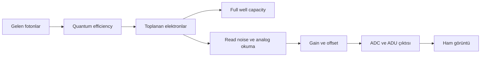

# CMOS ve Monokrom Kamera

!!! info "Sayfa Bilgisi"
    **Kategori:** Görüntüleme Temelleri · **Düzey:** Beginner · **Tahmini okuma:** 15 dk
    **Anahtar kelimeler:** `CMOS` · `monokrom kamera` · `Bayer matrix` · `gain` · `offset` · `read noise` · `full well capacity` · `quantum efficiency`

## Bu konu neden önemlidir?

Kamera yalnızca gökyüzünün fotoğrafını çeken bir kutu değildir; fotonları ölçülebilir sayılara dönüştüren sistemin ilk halkasıdır. Sensörün nasıl okunduğu, hangi sinyalin kaydedilebildiğini, parlak yıldızların ne zaman doyduğunu ve kalibrasyon karelerinin hangi koşullarda eşleşmesi gerektiğini belirler. Bu kavramlar anlaşılmadan yalnız poz süresine veya tek bir `gain` değerine bakmak yanıltıcıdır.

Bu sayfa kamera modeli önermek yerine özellikler arasındaki ilişkileri açıklar. Üreticilerin `gain`, `offset`, readout mode ve binning uygulamaları farklı olduğundan kesin ayarlar kameranın ölçüm grafikleri ve gerçek çekim testiyle belirlenmelidir.

## Temel kavramlar

### CMOS mimarisi

Bir CMOS sensör, ışığa duyarlı piksel dizisi ile bu piksellerde biriken elektrik yükünü okuyan devrelerden oluşur. Bir foton algılandığında doğrudan “renk” kaydedilmez; sensörün duyarlılığı ve fotonun dalga boyuna bağlı bir olasılıkla bir fotoelektron üretilir. Bu olasılık quantum efficiency (QE) ile ifade edilir.

Poz tamamlandığında pikseldeki yük analog sinyal zincirinden geçirilir ve ADC tarafından sayısal bir değere dönüştürülür. Kaydedilen ADU değeri; hedef sinyali, gökyüzü arka planı, karanlık akım, okuma belirsizliği ve elektronik ofsetin birleşimidir.

!!! note "Planlanan görsel kanıt · CMOS sinyal zinciri"
    **Kategori:** Concept Illustration · **Durum:** Açıklayıcı diyagram üretilecek · **Öncelik:** P2
    **Soru:** Foton olayı hangi aşamalardan geçerek sayısal ADU değerine dönüşür?
    **Girdi:** Üreticiye özgü olmayan şematik pixel well, analog readout, offset ve ADC.
    **Gösterim:** Foton → elektron → analog sinyal → ADC → ADU; noise ve offset girişleri ayrı işaretlenir.
    **Öğrenme çıktısı:** ADU'nun doğrudan foton veya renk olmadığı anlaşılmalıdır.
    **Erişilebilirlik:** Ok yönleri metinle desteklenmeli; bütün etiketler büyütmede okunmalıdır.

### Monokrom ve OSC

Monokrom sensör her pikselde, önündeki optik filtrenin geçirdiği toplam ışığı ölçer. Renkli veya one-shot color (OSC) kamerada sensörün üzerinde çoğunlukla Bayer matrix bulunur; komşu pikseller farklı renk bantlarını örnekler. Eksik renk bileşenleri daha sonra demosaicing/debayering sırasında komşu örneklerden hesaplanır.

| Özellik | Monokrom kamera | OSC kamera |
|---|---|---|
| Renk seçimi | Harici filtre ve filtre çarkı | Bayer matrix |
| Piksel başına kayıt | Seçili filtrenin yoğunluğu | Bayer hücresinin geçirdiği renk bandı |
| Çekim karmaşıklığı | Kanal planı ve filtre değişimi gerekir | Daha basit saha kurulumu sağlar |
| Esneklik | LRGB ve dar bant kanalları ayrı yönetilebilir | Renk örnekleme düzeni sensörde sabittir |
| Kalibrasyon | Her optik konfigürasyon için uyumlu flat gerekir | Debayer öncesi kalibrasyon ve CFA uyumu önemlidir |

Monokrom her koşulda üstün, OSC her koşulda kolay çözüm değildir. Hedef, gökyüzü, toplam süre, optik hız, otomasyon ve filtre bütçesi birlikte değerlendirilir.

### Sensör özellikleri

| Kavram | Ne anlatır? | Tek başına ne anlatmaz? |
|---|---|---|
| Pixel size | Bir pikselin fiziksel boyutunu | Teleskop odak uzaklığı olmadan gökyüzü örneklemesini |
| Quantum efficiency | Gelen fotonun elektrona dönüşme olasılığını; dalga boyuna bağlıdır | Filtre, optik kayıp ve gürültü dahil sistem verimini |
| Full well capacity | Pikselin doygunluk öncesi tutabildiği yaklaşık elektron miktarını | Kullanılabilir dinamik aralığı tek başına |
| Read noise | Okuma zincirinin ölçüme eklediği belirsizliği | Gökyüzü ve foton shot noise bileşenlerini |
| ADC bit depth | Bir okumada kodlanabilen sayısal seviye sayısını | Sensörün gerçek dinamik aralığını |
| Dark current | Poz sırasında termal olarak oluşan elektron hızını | Dark current’ın istatistiksel gürültüsünü tek başına |

ADC bit depth ile dinamik aralık aynı değildir. ADC daha fazla kod üretebilse bile sensörün alt sınırını gürültü, üst sınırını doygunluk belirler. Yaklaşık sensör dinamik aralığı full well capacity ile read noise oranı üzerinden değerlendirilebilir; kamera modları bu iki değeri birlikte değiştirebilir.

### Gain ve offset

`Gain`, fotoelektron sayısı ile sayısal çıktı arasındaki dönüşümü etkiler. Gain yükseldiğinde zayıf sinyal daha fazla ADU ile temsil edilebilir ve bazı sensörlerde read noise davranışı değişebilir; buna karşılık ADC aralığında erişilebilen elektron kapasitesi azalabilir ve parlak bölgeler daha erken doyabilir. Bu yüzden “yüksek gain daha fazla foton toplar” ifadesi yanlıştır: foton toplama optik açıklık, throughput, QE ve poz süresiyle ilgilidir.

`Offset`, sıfıra yakın ölçümlerin sayısal tabanın altında kırpılmasını önleyen black-level ekidir. Offset astronomik sinyal üretmez ve gürültüyü ortadan kaldırmaz. Çok düşük offset karanlık değerleri kırpabilir; gereksiz yüksek offset ise kullanılabilir kod aralığını daraltabilir. Kamera sürücüsündeki ölçek üreticiye bağlıdır.

!!! warning "Kamera ayarı eşleşmesi"
    Light, dark ve bias/dark-flat karelerinde gain, offset, readout mode ve sıcaklık gibi ilgili çekim koşulları tutarlı tutulmalıdır. Bir ayarın aynı sayısal etiketi farklı sürücü veya kamerada aynı fiziksel dönüşümü garanti etmez.

### Soğutma ve termal sinyal

Sensör sıcaklığı düştükçe dark current genellikle azalır. Regüle soğutmanın asıl operasyonel avantajı, yalnız daha düşük sıcaklık değil, geceler arasında tekrarlanabilir bir sıcaklık hedefidir. Böylece uygun master dark kütüphanesi oluşturmak kolaylaşır.

Soğutma bütün gürültüyü yok etmez. Read noise, foton shot noise ve gökyüzü arka planı termal sensör sinyalinden farklı kaynaklardır. Ortamın çok altındaki hedef sıcaklık, soğutucu kapasitesi ve yoğuşma riski dikkate alınmadan seçilmemelidir.

### Binning, sampling ve pixel scale

Binning, komşu piksel örneklerinin birlikte temsil edilmesidir. Modern CMOS kamerada bunun sensör üzerinde analog mu, dijital mi veya yazılım aşamasında mı yapıldığı modele bağlıdır; klasik CCD binning kazanımları doğrudan varsayılmamalıdır.

Pixel size, odak uzaklığıyla birlikte pixel scale’i; pixel scale ise seeing ve optik kaliteyle birlikte sampling durumunu etkiler. Çok ince örnekleme her zaman daha fazla gerçek ayrıntı sağlamaz, çok kaba örnekleme de küçük yapıları kaybedebilir. Bu sprintte konu yalnız bağlantı düzeyinde tutulmuştur; sampling ve seeing bağımsız foundations sayfaları için adaydır.

!!! note "Planlanan görsel kanıt · Sampling karşılaştırması"
    **Kategori:** Comparison · **Durum:** Kontrollü açıklayıcı örnek üretilecek · **Öncelik:** P2
    **Soru:** Aynı optik yıldız profili farklı pixel scale altında nasıl örneklenir?
    **Girdi:** Aynı normalize PSF'nin kaba, dengeli ve aşırı ince üç pixel grid temsili.
    **Before/After:** Dönüşüm sırası değil; yan yana aynı ölçekli üç karşılaştırma.
    **İşaretleme:** Pixel sınırı, profile merkezi ve ölçülen FWHM; değerler “temsili” etiketlenir.
    **Öğrenme çıktısı:** Daha çok pixel'in otomatik olarak daha çok gerçek ayrıntı olmadığı görülmelidir.

## Kavramlar nasıl ilişkilidir?

Bu zincirin herhangi bir halkası tek başına görüntü kalitesini belirlemez. Yüksek QE zayıf sinyali desteklerken düşük full well parlak yıldızlarda doygunluğu sınırlayabilir. Düşük read noise kısa alt pozları daha uygulanabilir kılabilir, fakat gökyüzü arka planı ve toplam entegrasyon hâlâ sonucu belirler.

## Gerçek astrofotoğraf örnekleri

### Parlak çekirdekli galaksi

Bir galaksinin zayıf dış bölgeleri uzun toplam entegrasyondan yararlanırken parlak çekirdek ve yıldızlar tek karede doygunluğa yaklaşabilir. Karar yalnız gain değildir: alt poz süresi, full well erişimi, optik hız ve doygun piksel sayısı birlikte incelenir. Gerekirse kısa ve uzun poz serileri ayrı tutulur.

### Dar bant emisyon nebulası

Dar filtre foton akışını sınırlar. Düşük read noise yararlı olabilir, ancak daha yüksek gain’in otomatik olarak daha iyi sonuç vereceği söylenemez. Yıldız doygunluğu, gökyüzü seviyesi, takip kalitesi ve toplam kare sayısı test pozlarıyla değerlendirilir.

### Çok geceli proje

Geceler arasında aynı sıcaklık, gain, offset, readout mode ve optik tren düzeninin korunması kalibrasyonu kolaylaştırır. Kamera açısının veya filtrenin değişmesi özellikle flat eşleşmesini etkiler.

## Yaygın kavram yanılgıları

- Daha yüksek gain’in sensörü fiziksel olarak daha duyarlı yaptığı düşüncesi.
- ADC bit depth’in doğrudan gerçek dinamik aralık olduğu varsayımı.
- Soğutmanın bütün gürültü kaynaklarını ortadan kaldırdığı inancı.
- Monokrom kamerada her pikselin renk kaydettiğinin sanılması.
- OSC kamerada Bayer verisinin kalibrasyondan önce debayer edilmesi gerektiği düşüncesi.
- Küçük piksellerin her teleskop ve seeing koşulunda daha fazla ayrıntı verdiği varsayımı.

## Başlangıçta yapılan hatalar

- Kamera ayarlarını FITS/XISF metadata veya çekim günlüğünde kaydetmemek.
- Test pozunda yıldız doygunluğunu ve histogram tabanını kontrol etmemek.
- Farklı gain, offset veya sıcaklıktaki dark karelerini tek master altında birleştirmek.
- Offset’i estetik arka plan parlaklığı ayarı gibi kullanmak.
- Yalnız üreticinin tek bir “önerilen gain” değerine bakıp hedef koşullarını yok saymak.
- Binning davranışını kamera dokümantasyonundan doğrulamadan klasik CCD gibi yorumlamak.

## Pratik karar rehberi

| Durum | İlk karar | Gerekçe |
|---|---|---|
| Filtre bazında en yüksek esneklik gerekiyor | Monokrom sistemi değerlendirin | Her bant ayrı örneklenir ve ayrı süre planlanabilir. |
| Saha süresi ve kurulum sadeliği öncelikli | OSC sistemini değerlendirin | Tek sensör pozunda renk örneklemesi sağlar. |
| Parlak yıldızlar hızla doyuyor | Gain ve alt poz süresini birlikte test edin | Doygunluk full well erişimi ve pozla birlikte değişir. |
| Histogram tabanında kırpılma görülüyor | Offset ve sürücü ölçeğini doğrulayın | Siyah değerler geri getirilemeyecek biçimde kesilmiş olabilir. |
| Çok geceli kalibrasyon tutarsız | Kamera modu, sıcaklık ve metadata eşleşmesini denetleyin | Master kare fiziksel çekim koşulunu temsil etmelidir. |
| Görüntü aşırı örneklenmiş görünüyor | Pixel scale, seeing ve binning seçeneğini birlikte inceleyin | Piksel boyutu tek başına sampling kararı değildir. |

## PixInsight ile ilişkisi

PixInsight ham elektronları değil, kamera sürücüsünün ADC sonrasında kaydettiği sayısal örnekleri işler. Kamera ayarları şu aşamaları doğrudan etkiler:

- [Calibration Pipeline](../03-kalibrasyon/calibration-pipeline.md): metadata ve master eşleştirmesi.
- [ImageCalibration](../03-kalibrasyon/image-calibration.md): dark, flat, bias/dark-flat ve CFA koşulları.
- [StarAlignment](../03-kalibrasyon/star-alignment.md): sampling ve interpolation ilişkisi.
- [ImageIntegration](../03-kalibrasyon/image-integration.md): çoklu karelerin weighting, normalization ve rejection süreci.
- [SNR ve Dinamik Aralık](snr-ve-dinamik-aralik.md): sensör sınırlarının entegrasyon sonucuna etkisi.

Bu sayfa PixInsight process parametrelerinin yerine geçmez; acquisition kararlarının işleme aşamasında neden görünür olduğunu açıklar.

## Nereden devam edilmeli?

1. Işığın sensöre ulaşmadan nasıl seçildiğini anlamak için [Filtreler](filtreler.md).
2. Kare sayısı ve toplam sürenin ölçüm kalitesini nasıl etkilediği için [SNR ve Dinamik Aralık](snr-ve-dinamik-aralik.md).
3. Kamera ayarlarını gece planına dönüştürmek için [Çekim Planlama](cekim-planlama.md).
4. Ham verinin işleme yaşam döngüsü için [Calibration Pipeline](../03-kalibrasyon/calibration-pipeline.md).
5. Hedefe göre uçtan uca örnekler için [İş Akışı Rehberi](../15-workflows/index.md).

## Kaynaklar

- [Hamamatsu — Camera Simulation Engine](https://www.hamamatsu.com/sp/sys/en/camera_simulator/index.html): QE, full well capacity ve offset kavramları.
- [Hamamatsu — Calculating SNR](https://camera.hamamatsu.com/us/en/learn/technical_information/thechnical_guide/calculating_snr.html): sinyal, shot noise ve read noise ilişkisi.
- [Teledyne Vision Solutions — Dynamic range and linearity for scientific CMOS cameras](https://www.teledynevisionsolutions.com/learn/learning-center/scientific-imaging/new-era-in-dynamic-range-and-linearity-for-scientific-cmos-cameras/): full well, read noise, ADC ve dinamik aralık ayrımı.

## Önceki Bölüm

[← Foundations](index.md)

## Sonraki Bölüm

[Filtreler →](filtreler.md)
