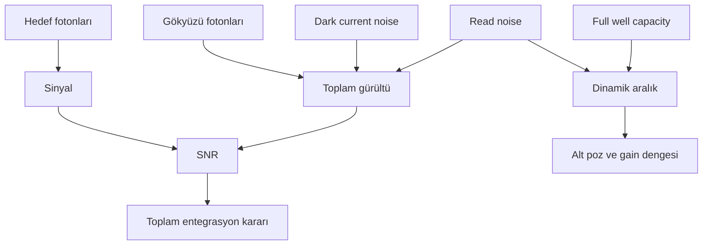

# SNR ve Dinamik Aralık

!!! info "Sayfa Bilgisi"
    **Kategori:** Görüntüleme Temelleri · **Düzey:** Beginner · **Tahmini okuma:** 15 dk
    **Anahtar kelimeler:** `SNR` · `signal-to-noise ratio` · `sinyal` · `gürültü` · `dinamik aralık` · `integration` · `saturation` · `clipping`

## Bu konu neden önemlidir?

Astrofotoğrafta ayrıntının görünür olup olmaması yalnız “görüntünün ne kadar parlak” olduğuyla belirlenmez. Hedefe ait ölçümün rastlantısal değişimlerden ne kadar güvenle ayrılabildiği önemlidir. Signal-to-noise ratio (SNR), bu ayrımı; dinamik aralık ise aynı veri içinde zayıf ve güçlü sinyalin birlikte temsil edilebildiği sınırı anlatır.

SNR ve dinamik aralık birbirine bağlıdır fakat aynı kavram değildir. Uzun entegrasyon zayıf yapının güvenilirliğini artırabilir; tek karede doymuş bir yıldızın kaybolan çekirdek bilgisini geri getiremez. İyi plan, zayıf sinyali biriktirirken parlak yapıları da ölçülebilir aralıkta tutar.

## Temel kavramlar

Gürültü türleri, pattern noise, quantization, uzamsal ölçek ve stretch sonrası görünürlük için ayrı canonical sayfa [Sinyal ve Gürültü](../02-pixinsight-temelleri/sinyal-ve-gurultu.md) kullanılmalıdır. Bu sayfa SNR, integration time ve acquisition dinamik aralığına odaklanır.

### Sinyal

Sinyal, yorumlamak istediğimiz hedef kaynaklı ölçümdür. Bir emisyon nebulasında H-alpha fotonları, bir galakside yıldız popülasyonu ve tozdan gelen broadband ışık veya bir yıldızın fotometrik akısı örnek olabilir. “Arka plan” her zaman gereksiz değildir; bilimsel amaca bağlı olarak bir bileşen başka bir çalışmada sinyal sayılabilir.

### Gürültü

Gürültü, ölçümün tekrarlanabilirliğini sınırlayan rastlantısal değişimdir. Başlıca bileşenler:

- **Photon shot noise:** Fotonların gelişindeki Poisson değişimi; hedefte ve gökyüzü arka planında bulunur.
- **Read noise:** Sensörün okuma zincirinin her kareye eklediği belirsizlik.
- **Dark current noise:** Termal elektron üretiminin istatistiksel değişimi.
- **Pattern bileşenleri:** Tam rastlantısal olmayan sensör ve optik izleri; uygun calibration, dithering ve rejection ile ele alınır.

Noise reduction görüntüdeki görünümü değiştirebilir, fakat acquisition sırasında kaydedilmemiş hedef fotonlarını üretmez. Bu nedenle SNR sorunu ile gürültü azaltma process’i aynı şey değildir.

### Signal-to-noise ratio

SNR, sinyalin toplam gürültüye oranıdır:

\[
\mathrm{SNR} = \frac{S}{\sigma_{\mathrm{total}}}
\]

Basitleştirilmiş, elektron birimindeki tek kare modeli şu ilişkiyi gösterir:

\[
\mathrm{SNR} \approx \frac{S}{\sqrt{S + B + D + R^2}}
\]

Burada `S` hedef elektronları, `B` gökyüzü arka planı, `D` dark current katkısı ve `R` read noise’tur. Gerçek kamera ve entegrasyon modeli; flat-field belirsizliği, kare sayısı, normalization ve başka terimler içerebilir. Formül sabit poz reçetesi değil, hangi kaynakların birlikte değerlendirilmesi gerektiğini gösterir.

!!! note "TODO Illustration"
    Aynı zayıf nebula sinyalinin düşük, orta ve yüksek SNR durumlarında temsilî piksel dağılımı.

### Integration time ve stacking

Birden çok bağımsız, uyumlu kare aynı hedef sinyalini tekrar ölçer. Ortalama tabanlı entegrasyonda toplam sinyal karelerle birlikte birikirken bağımsız rastlantısal gürültünün göreli etkisi daha yavaş büyür. İdeal ve eşdeğer kareler varsayımında SNR yaklaşık olarak toplam entegrasyon süresinin veya kare sayısının kareköküyle artar:

\[
\mathrm{SNR}_{N} \propto \sqrt{N}
\]

Bu ilişki azalan getiri anlamına gelir: SNR’yi yaklaşık iki katına çıkarmak için, diğer koşullar aynı kalırsa, yaklaşık dört kat toplam entegrasyon gerekir. Gerçek sonuç; transparency, seeing, gradient, kayıt hatası, weighting ve calibration kalitesine bağlıdır.

### Dinamik aralık

Dinamik aralık, ölçülebilen en güçlü sinyal ile gürültü tabanından ayrılabilen en zayıf sinyal arasındaki aralıktır. Sensör düzeyinde yaygın yaklaşık ifade:

\[
\mathrm{Dynamic\ Range} \approx \frac{\mathrm{Full\ Well\ Capacity}}{\mathrm{Read\ Noise}}
\]

Bu oran ADC bit depth ile aynı değildir. ADC’nin kod sayısı, gürültü tabanının altında kalan veya full well öncesinde erişilemeyen fiziksel bilgiyi yaratmaz. Kamera gain/readout mode seçimi read noise ile adreslenebilir full well arasında veri setine bağlı bir denge kurabilir.

### Saturation ve clipping

Saturation, pikselin veya okuma zincirinin daha fazla sinyali ayırt edemediği üst sınıra ulaşmasıdır. Clipping ise değerlerin temsil aralığının alt veya üst sınırına kesilmesidir. Üst clipping parlak yıldız çekirdeğindeki yoğunluk ilişkisini; alt clipping zayıf arka plan ve gölge bilgisini geri döndürülemez biçimde kaybedebilir.

STF ile parlak görünen bir yıldızın gerçekten doymuş olup olmadığı ekrandaki görünüşten değil, sayısal değer ve kanal incelemesinden anlaşılır. Benzer şekilde koyu görünen arka plan sıfıra kırpılmış olmak zorunda değildir.

### Weak signal ve bright star dengesi

Zayıf sinyal için toplam entegrasyon artırılır; parlak yıldızları korumak için tek alt pozun doygunluk davranışı izlenir. Bu iki hedef çelişmek zorunda değildir: çok sayıda ölçülü alt poz zayıf yapıyı biriktirebilir. Hedefin çok geniş parlaklık aralığı varsa kısa ve uzun poz setleri ayrı kazanım/entegrasyon stratejileriyle değerlendirilebilir.

## Kavramlar nasıl ilişkilidir?

## Gerçek astrofotoğraf örnekleri

### Zayıf dış galaksi kolları

Tek karede kollar histogram tabanına yakın olabilir. Alt pozu körlemesine uzatmak yerine yıldız doygunluğu ve gökyüzü seviyesi kontrol edilir; ardından kaliteli kare sayısı artırılır. Registration ve normalization sonrasında entegrasyon, ortak sinyali güçlendirir.

### Parlak yıldızlı emisyon nebulası

Uzun narrowband poz, zayıf nebula yapısını desteklerken parlak yıldız merkezlerini doyurabilir. Kısa test serisiyle doygunluk ölçülür. Gerekirse yıldızlar için daha kısa pozlar veya ayrı yıldız iş akışı planlanır; bu karar yalnız stretch aşamasına bırakılmaz.

### Değişken transparency ile çok geceli veri

Aynı poz süresindeki kareler aynı kaliteye sahip olmayabilir. İnce bulut hedef sinyalini azaltabilir ve arka plan dağılımını değiştirebilir. Yalnız kare sayısı yerine Subframe quality, normalization ve weighting sonuçları incelenir.

## Yaygın kavram yanılgıları

- SNR’nin yalnız görüntü parlaklığı olduğu düşüncesi.
- Stacking’in her karede aynı olan sabit desenleri otomatik olarak rastlantısal gürültü gibi yok edeceği varsayımı.
- Dört kat kareyle dört kat SNR kazanılacağı inancı.
- Yüksek ADC bit depth’in sensör dinamik aralığını garanti ettiği düşüncesi.
- Doymuş yıldız çekirdeğinin stretch veya HDR işlemiyle gerçek yoğunluk bilgisine geri getirilebileceği varsayımı.
- Noise reduction’ın düşük toplam entegrasyonun fiziksel yerine geçebileceği inancı.

## Başlangıçta yapılan hatalar

- Toplam entegrasyon yerine yalnız tek alt poz süresini kalite ölçütü kabul etmek.
- Test karesinde kanal bazında saturation kontrolü yapmamak.
- Çok düşük offset nedeniyle alt clipping oluşup oluşmadığını incelememek.
- Farklı gecelerin karelerini kalite ve normalization farklarına bakmadan birleştirmek.
- Dithering uygulanmamış sabit pattern bileşenini rastlantısal noise sanmak.
- Görüntüyü aşırı noise reduction ile pürüzsüzleştirip zayıf yapıyı da silmek.

## Pratik karar rehberi

| Gözlem | İlk karar | Gerekçe |
|---|---|---|
| Zayıf yapı kareler arasında tutarlı | Kaliteli toplam entegrasyonu artırın | Ortak sinyal, bağımsız rastlantısal gürültüye göre güçlenir. |
| Parlak yıldızlar alt pozda doyuyor | Alt pozu/gain’i test ederek azaltın | Kayıp üst aralık stacking ile geri gelmez. |
| Arka plan sıfıra dayanıyor | Offset ve ham histogramı kontrol edin | Alt clipping zayıf sinyali silebilir. |
| Kare kalitesi geceler arasında değişiyor | Quality ölçümü ve weighting uygulayın | Kare sayısı tek başına katkıyı temsil etmez. |
| Diagonal pattern veya walking noise görülüyor | Dithering, calibration ve rejection zincirini inceleyin | Yapı bağımsız rastlantısal noise değildir. |
| Görüntü pürüzsüz ama ayrıntısız | Entegrasyon ve noise reduction geçmişini karşılaştırın | Aşırı işlem hedef yapısını bastırmış olabilir. |

## PixInsight ile ilişkisi

- [ImageIntegration](../03-kalibrasyon/image-integration.md), normalization, weighting ve rejection kararlarıyla çoklu ölçümleri birleştirir.
- [Calibration Pipeline](../03-kalibrasyon/calibration-pipeline.md), sabit desen ve sensör bileşenlerinin entegrasyondan önce ele alınmasını sağlar.
- [NoiseXTerminator](../06-ai-eklentileri/noisexterminator.md), kayıtlı görüntüde noise reduction uygular; acquisition SNR’sini veya kayıp sinyali geri getirmez.
- [Histogram ve Tonal Dönüşüm](../02-pixinsight-temelleri/histogram.md), clipping ile yalnız görüntüleme stretch’i arasındaki farkı açıklar.
- [Veri Kalitesi ve Entegrasyon Stratejileri](../15-workflows/data-quality-strategies.md), çok geceli veri seçimlerini iş akışı düzeyinde ele alır.

## Nereden devam edilmeli?

1. SNR hedefini gözlem koşullarına dönüştürmek için [Çekim Planlama](cekim-planlama.md).
2. Ham karelerin entegrasyona hazırlanması için [Calibration Pipeline](../03-kalibrasyon/calibration-pipeline.md).
3. Birleştirme seçenekleri için [ImageIntegration](../03-kalibrasyon/image-integration.md).
4. Görüntüleme ile kalıcı tonal değişimi ayırmak için [STF](../02-pixinsight-temelleri/stf.md) ve [Histogram](../02-pixinsight-temelleri/histogram.md).
5. Belirti tabanlı inceleme için [Sorun Giderme](../14-hata-kutuphanesi/index.md).

## Kaynaklar

- [Hamamatsu — Calculating SNR](https://camera.hamamatsu.com/us/en/learn/technical_information/thechnical_guide/calculating_snr.html): SNR, photon shot noise, background ve read noise ilişkisi.
- [Teledyne Vision Solutions — Dynamic Range and Linearity](https://www.teledynevisionsolutions.com/learn/learning-center/scientific-imaging/new-era-in-dynamic-range-and-linearity-for-scientific-cmos-cameras/): full well, read noise, ADC ve dinamik aralık ayrımı.
- [Hamamatsu — Readout Noise in CMOS Cameras](https://camera.hamamatsu.com/us/en/learn/technical_information/thechnical_guide/read_noise.html): CMOS read noise ölçümünün RMS bağlamı.

## Önceki Bölüm

[← Filtreler](filtreler.md)

## Sonraki Bölüm

[Çekim Planlama →](cekim-planlama.md)
