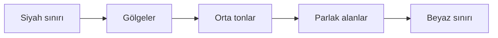

# Histogram ve Ton Dağılımı

!!! info "Sayfa Bilgisi"
    **Kategori:** Görüntü İşleme Temelleri · **Düzey:** Beginner · **Tahmini okuma:** 10 dk
    **Anahtar kelimeler:** `histogram` · `ton dağılımı` · `black point` · `white point` · `midtones` · `clipping` · `RGB histogram` · `dynamic range`

## Bu konu neden önemlidir?

Histogram, görüntüdeki piksel değerlerinin dağılımını özetler. Bir görüntünün karanlık, düşük kontrastlı veya kırpılmış görünmesinin nedenini araştırırken güçlü bir ölçüm aracıdır; ancak görüntünün nerede hangi yapıyı içerdiğini göstermez. Bu sayfa evrensel histogram okumasını açıklar. PixInsight arayüzü ve slider kullanımı ayrı [HistogramTransformation](../07-stretch/histogram-transformation.md) process sayfasının sorumluluğundadır.

## Temel kavram

Histogram, piksel değerlerini aralıklara (bin) ayırır ve her aralığa kaç örnek düştüğünü sayar.

- **Yatay eksen:** Solda düşük, sağda yüksek piksel değerleri.
- **Dikey eksen:** Her değer aralığındaki piksel sayısı veya göreli sıklık.
- **Gölgeler (shadows):** Dağılımın düşük değerli bölgesi.
- **Orta tonlar (midtones):** Siyah ve beyaz sınırları arasındaki ara değerler.
- **Parlak alanlar (highlights):** Dağılımın yüksek değerli bölgesi.

!!! note "Ölçek önemlidir"
    Dikey eksen doğrusal veya logaritmik gösterilebilir. Logaritmik görünüm seyrek histogram kuyruklarını daha görünür kılar; piksel verisini değiştirmez.

## Siyah nokta, beyaz nokta ve kırpılma

Siyah nokta (black point), en düşük çıktı sınırına; beyaz nokta (white point), en yüksek çıktı sınırına karşılık gelir. Dönüşüm sırasında bu sınırların dışına itilen farklı giriş değerleri aynı çıktı değerine yığılırsa kırpılma (clipping) oluşur. Kırpılan değerler arasındaki ayrım kaybolur.

Histogramın sol veya sağ kenara değmesi tek başına clipping kanıtı değildir. Sensörün doğal sıfırları, kalibrasyon, doygun pikseller ve seçilen görüntüleme ölçeği birlikte incelenmelidir. Histogramla birlikte sayısal readout, kanal kontrolü ve görüntü konumu gerekir.

!!! note "Planlanan görsel kanıt · Clipping"
    **Kategori:** Histogram Evidence · **Durum:** Gerçek proje verisi gerekli · **Öncelik:** P0
    **Eğitim amacı:** Sağlıklı histogram kuyruğu ile alt/üst clipping farkını göstermek.
    **Gerekli kaynak:** Aynı doğrusal astro görüntünün kontrollü kopyaları.
    **Durumlar:** Orijinal, shadow-clipped ve highlight-clipped.
    **İşaretleme:** Siyah nokta, beyaz nokta, kaybolan kuyruk ve etkilenen görüntü bölgeleri.
    **Gerçek proje verisi:** Evet.
    **Kanıt düzeni:** Görüntü ve histogram yan yana; bütün varyantlarda aynı eksen, zoom ve channel görünümü.
    **Alt text özeti:** Hangi kuyruk değerlerinin tek çıktı değerine yığıldığı ve hangi görüntü ayrıntısının kaybolduğu söylenmelidir.

## Kanal histogramları, luminance ve RGB

R, G ve B histogramları kanalların değer dağılımını ayrı gösterir. Kanalların tepe noktalarının farklı olması otomatik olarak renk hatası değildir; hedef spektrumu ve arka plan da farklı kanal değerleri üretebilir. Buna karşılık tek kanalın sınıra dayanması, birleşik görünüm kabul edilebilir olsa bile kanal bazlı clipping işareti olabilir.

Parlaklık (luminance), RGB kanallarının basit aritmetik ortalaması olmak zorunda değildir; kullanılan renk uzayı ve ağırlık tanımı sonucu etkiler. Bir luminance histogramı renk kanallarındaki bütün ayrıntıları temsil etmez. Renk dengesini yalnız birleşik histogram üzerinden teşhis etmek bu nedenle sınırlıdır.

## Dinamik aralığın histogramda dağılımı

Doğrusal deep-sky veride hedef örneklerinin büyük bölümü sayısal aralığın soluna yakın, dar bir bölgede toplanabilir. Bu durum verinin boş olduğu anlamına gelmez. Zayıf sinyal küçük değer farkları içinde kayıtlı olabilir; ekran bunu varsayılan doğrusal sunumla ayıramaz.

Bir stretch, düşük ve orta değerler arasındaki farkları ekranda daha geniş bir aralığa dağıtır. Histogram genişler ve şekil değiştirir. Bu değişim yeni hedef sinyali üretmez; var olan değerlerin temsilini dönüştürür.

## Görüntü verisinde nasıl görünür?

| Görünüm | Histogram olasılığı | Ek kontrol |
|---|---|---|
| Neredeyse siyah doğrusal görüntü | Dar dağılım sol bölgede | Geçici display stretch ile yapıyı görünür kılın. |
| Sol kenarda yığılma | Gerçek sıfırlar veya shadow clipping | Sayısal readout ve önceki aşamayla karşılaştırın. |
| Sağ kenarda yığılma | Doygun yıldızlar veya highlight clipping | Kanalları ve parlak çekirdekleri ayrı inceleyin. |
| Geniş fakat düz görünüm | Değer aralığı geniş, yerel kontrast düşük olabilir | Uzamsal yapı ve lokal ölçüm yapın. |
| Ayrık kanal kuyrukları | Gerçek renk farkı veya kanal dönüşümü | Renk kalibrasyonu ve kanal clipping durumunu inceleyin. |

## Histogramın işlem boyunca değişimi

- **Calibration ve normalization:** Dağılımın konumunu ve genişliğini değiştirebilir.
- **Gradient correction:** Alan boyunca değişen arka planı düzelttiği için arka plan dağılımını daraltabilir.
- **Color calibration:** Kanal ölçeklerini değiştirir.
- **Stretch:** Tonları doğrusal olmayan biçimde yeniden dağıtır.
- **Local contrast:** Benzer global histogramla farklı uzamsal görünüm üretebilir.
- **Clipping:** Dağılımı sınırlara yığarak bilgi kaybettirir.

## Histogram yorumunun sınırları

Histogram uzamsal konum taşımaz. Aynı histogramı paylaşan iki görüntü, pikseller farklı yerlere dağıtıldığında tamamen farklı görünebilir. Halo, ringing, gradient geometrisi, yıldız şekli ve maske sınırı yalnız histogramdan teşhis edilemez.

Seçili Preview histogramı ile tüm görüntü histogramı da aynı soruyu yanıtlamaz. Arka plan Preview’u noise ve black point için yararlı olabilirken parlak çekirdeği temsil etmeyebilir.

## Pratik örnek

Doğrusal bir nebula entegrasyonu ekranda karanlık görünür. Histogram sol tarafta dar bir tepe gösterir. Geçici ekran stretch’i uygulandığında nebula görünür olur, fakat ham piksel histogramı değişmez. Kalıcı stretch sonrasında piksel değerleri yeniden dağıtılır ve histogram genişler. Siyah nokta nebula kuyruğunun içine taşınırsa zayıf yapı aynı siyah değere yığılır ve geri getirilemez.

## Yaygın yanlış anlamalar

- Histogram tepesinin solda olmasını veri yokluğu sanmak.
- Histogramı görüntünün uzamsal haritası gibi yorumlamak.
- Birleşik RGB histogramı temizse hiçbir kanalda clipping olmadığını varsaymak.
- Her histogram boşluğunu siyah veya beyaz noktayı taşımak için güvenli alan kabul etmek.
- STF ile görünen histogram değişimini kalıcı veri dönüşümü sanmak.
- “Dengeli” histogram şeklinin evrensel estetik veya teknik hedef olduğunu düşünmek.

## Karar rehberi

| Soru | Sonraki kontrol | Neden |
|---|---|---|
| Görüntü karanlık ama doğrusal mı? | Geçici display stretch kullanın. | Ekran görünümü ile veri durumunu ayırır. |
| Siyah nokta taşınabilir mi? | Sol kuyruğu, background readout’u ve hedef yapısını birlikte inceleyin. | Boş görünen kuyruk zayıf sinyal içerebilir. |
| Yıldızlar doymuş mu? | Kanal bazlı üst değerleri kontrol edin. | Bir kanal diğerlerinden önce kırpılabilir. |
| Gradient var mı? | Uzamsal arka plan örneklerini inceleyin. | Histogram gradient yönünü göstermez. |
| Stretch aşırı mı? | Kırpılma, yıldız profili, renk ve zayıf yapı sürekliliğini kontrol edin. | Histogram tek başına görsel artefaktları açıklamaz. |

## PixInsight ile ilişkisi

- [ScreenTransferFunction](stf.md) geçici ekran görünümü sağlar; görüntü verisini değiştirmez.
- [HistogramTransformation](../07-stretch/histogram-transformation.md) histogram ve transfer kontrollerini kalıcı piksel dönüşümüne uygular.
- [Stretch Temelleri](stretch-temelleri.md) geçici ve kalıcı stretch’in kavramsal ayrımını kurar.
- [Gradient Teorisi](../04-gradient/gradient-theory.md) histogramın gösteremediği uzamsal arka plan değişimini açıklar.
- [Renk ve Kanallar](renk-ve-kanallar.md) RGB, luminance, chrominance ve kanal clipping ilişkisini açıklar.

## Nereden devam edilmeli?

1. [Lineer ve Nonlineer Görüntü](lineer-ve-nonlineer-goruntu.md)
2. [Stretch Temelleri](stretch-temelleri.md)
3. [HistogramTransformation](../07-stretch/histogram-transformation.md)
4. [LRGB Galaksi İş Akışı](../15-workflows/lrgb-galaxy.md)
5. [Hata Kütüphanesi](../14-hata-kutuphanesi/index.md)

## Kaynaklar

- [PixInsight — HistogramTransformation Reference Documentation](https://pixinsight.com/doc/tools/HistogramTransformation/HistogramTransformation.html)
- [PixInsight Staff — Linear and nonlinear image discussion](https://pixinsight.com/forum/index.php?threads/what-is-a-linear-verus-non-linear-image.428/)

## Önceki Bölüm

[← Çekim Planlama](../01-temeller/cekim-planlama.md)

## Sonraki Bölüm

[Lineer ve Nonlineer Görüntü →](lineer-ve-nonlineer-goruntu.md)
