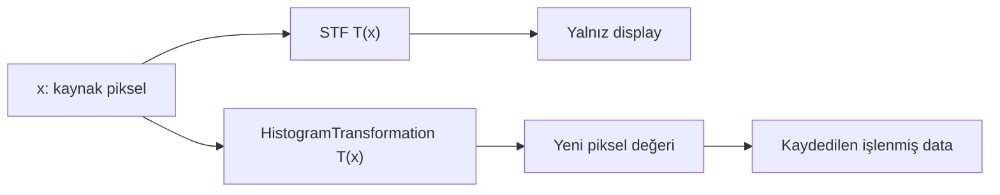
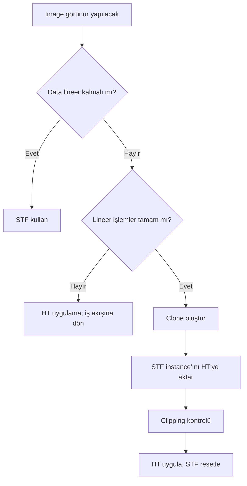

# Histogram ve HistogramTransformation

**Durum: Tamamlandı — Faz 1A**

## Amaç

Histogramı image data dağılımının özeti olarak okumak ve HistogramTransformation ile yapılan kalıcı dönüşümün ScreenTransferFunction’dan neden temelden farklı olduğunu açıklamak.

## Kavramsal Açıklama

Histogram, belirli yoğunluk aralıklarına düşen örneklerin frekans dağılımıdır. Histogramın şekli tek başına “iyi görüntü” ölçütü değildir; hedef, kanal, maske, lineerlik ve örnekleme bağlamıyla yorumlanır.

**HistogramTransformation (HT), hedef image’ın piksel değerlerini gerçekten değiştirir.** Shadows clipping, midtones ve highlights ayarları uygulandığında yeni örnek değerleri image data’ya yazılır. Tipik bir nonlinear stretch sonrası image artık lineer süreç aşamasında değildir.

**ScreenTransferFunction (STF) ise piksel değerlerini değiştirmez.** Yalnızca aynı tür transfer fonksiyonunu ekran sunumunda kullanabilir. STF’yi kapatmak görünümü geri alır; HT’yi uyguladıktan sonra geri dönüş için Undo, History Explorer, clone veya önceki dosya gerekir.

## Matematiksel Arka Plan (gerekiyorsa)

Histogram, (N) örneği (B) bin’e ayırır; bin sayımı görüntünün uzamsal düzenini içermez. Aynı histogramı paylaşan iki image görsel olarak farklı olabilir.

PixInsight midtones transfer function, kontrol noktaları ({0,0}), ({m,0.5}), ({1,1}) olan rasyonel bir interpolasyondur:

[
MTF(m,x)=\frac{(m-1)x}{(2m-1)x-m}
]

uygun parça tanımlarıyla uç noktaları korur. (m=0.5) identity; (m<0.5) midtones’u yükseltir, (m>0.5) düşürür. Shadows ve highlights noktaları giriş aralığını yeniden eşler; clipping seçimi geri döndürülemez bilgi kaybı yaratabilir.

## Ne zaman kullanılır?

- Lineer image’ı kontrollü biçimde nonlinear aşamaya geçirmek
- Siyah/beyaz nokta ve midtones dağılımını incelemek
- STF başlangıç mapping’ini kalıcı dönüşüme aktarmak
- Kanal bazlı veya RGB/K dönüşümlerini değerlendirmek
- Önce/sonra histogramını nicel bağlamla karşılaştırmak

## Ne zaman kullanılmaz?

- Yalnızca lineer data’yı ekranda görmek için; bunun için STF yeterlidir.
- Lineer süreçler tamamlanmadan gelişigüzel stretch yapmak için.
- Arka planı “siyah yapmak” amacıyla sinyal clip etmek için.
- Histogram şekline bakıp spatial artefact hakkında tek başına karar vermek için.

## PixInsight Menü Yolu

`Process > IntensityTransformations > HistogramTransformation`

## Parametreler

| Parametre | İşlev | Risk |
| --- | --- | --- |
| Shadows clipping point | Alt giriş değerlerini siyaha eşler | Zayıf sinyal kaybı |
| Midtones balance | Nonlinear orta ton dönüşümü | Aşırı stretch/noise görünürlüğü |
| Highlights clipping point | Üst değerleri beyaza eşler | Yıldız çekirdeği clipping |
| Low/High range | Çıkış aralığını sınırlar | Dinamik aralık sıkıştırması |
| Channel selector | RGB/K veya tek kanal | Renk dengesinin değişmesi |

Evrensel bir “doğru” slider değeri yoktur. Parametreler image statistics, hedef ve sonraki aşamaya göre doğrulanır.

## Uygulama Adımları

1. Lineer süreçlerin tamamlandığını doğrulayın.
2. Image’ın bir clone’unu oluşturun.
3. STF ile kabul edilebilir başlangıç görünümü üretin.
4. STF instance’ını HT kontrol çubuğuna sürükleyin.
5. HT preview’u etkinleştirerek shadows ve highlights clipping’i inceleyin.
6. Histogramın sol kenarına agresif yaklaşmayın; zayıf sinyali kontrol edin.
7. HT’yi clone’a uygulayın.
8. STF’yi resetleyin. Image görünür kalıyorsa stretch data’ya uygulanmıştır.
9. Yeni histogramı, yıldız çekirdeklerini ve arka planı kontrol edin.
10. Sonucu yeni bir aşama adıyla kaydedin.

## Beklenen Sonuç

Image data kontrollü biçimde nonlinear hale gelir; STF resetlense bile görünür yapı korunur. Zayıf sinyal ve highlights gereksiz clip edilmemiş olmalıdır.

## Gerçek Kullanım Senaryosu

SPCC ve lineer noise reduction tamamlanmış RGB image için Auto STF başlangıç görünümü oluşturulur. STF instance HT’ye aktarılır. HT bir clone’a uygulanır, ardından STF resetlenir. Clone görünür kalırken kaynak lineer image karanlık görünür: bu, kaynakta screen transfer; clone’da gerçek data transformation bulunduğunu açıkça gösterir.

## Sık Yapılan Hatalar

1. HT uygulamasından sonra STF’yi açık bırakıp çift stretch görünümü oluşturmak.
2. Shadows clipping ile zayıf nebula sinyalini kesmek.
3. Highlights clipping ile yıldız çekirdeklerini doyurmak.
4. Lineer süreçler bitmeden nonlinear stretch yapmak.
5. RGB/K ile kanal bazlı dönüşüm farkını göz ardı etmek.
6. Histogramı spatial kalite haritası sanmak.
7. Kaynak lineer image yerine tek kopya üzerinde geri dönüşsüz ilerlemek.

## Sorun Giderme

| Belirti | Neden | Çözüm |
| --- | --- | --- |
| Image aşırı parlak | HT sonrası STF hâlâ aktif | STF’yi resetleyin |
| Arka plan keskin siyah | Shadows clipping fazla | Undo/clone’a dönüp siyah noktayı geri alın |
| Yıldız çekirdeği düz beyaz | Highlights clipping | Üst noktayı koruyun, preview/readout kontrolü yapın |
| Renk kaydı | Yanlış channel seçimi | RGB/K ve kanal dönüşümlerini inceleyin |
| HT sonrası image hâlâ karanlık | Instance identity/yanlış target | Parametre ve target view’ı doğrulayın |

## İleri Seviye Notlar

- STF’den HT’ye aktarım, screen mapping’i data transformation için başlangıç yapar; otomatik olarak “optimum final stretch” garantilemez.
- Histogram uzamsal bilgi taşımaz; aynı dağılım farklı yapı konumlarına sahip olabilir.
- Clipping değerlendirmesi histogramla birlikte image readout ve temsilî previews gerektirir.
- Resmî referans: [HistogramTransformation documentation](https://pixinsight.com/doc/tools/HistogramTransformation/HistogramTransformation.html).

### Karar Ağacı

### SSS

??? question "HistogramTransformation image data’yı değiştirir mi?"
    Evet. Uygulandığında dönüşüm sonuçları hedef image’ın örneklerine yazılır.

??? question "STF ve HT aynı slider’lara sahipse aynı şey midir?"
    Hayır. Benzer transfer parametreleri kullanabilirler; STF display katmanında, HT data üzerinde çalışır.

??? question "HT’den sonra STF neden resetlenmeli?"
    Gerçek stretch’in görünümünü ek bir screen stretch olmadan değerlendirmek için.

??? question "Histogramın solunda boşluk bırakmak zorunlu mu?"
    Evrensel bir piksel mesafesi yoktur. Amaç zayıf sinyali clip etmeden siyah noktayı yönetmektir.

??? question "Histogram tüm artefact’ları gösterir mi?"
    Hayır. Uzamsal konumu göstermez; image incelemesi gerekir.

??? question "HT işlemi geri alınabilir mi?"
    Canlı oturumda Undo/History mümkün olabilir; güvenli yöntem ayrıca clone ve aşamalı dosya kaydıdır.

## Quick Reference

!!! tip "Quick Reference"
    **STF:** display, data değişmez. **HT:** image data değişir. HT öncesi lineer işlemleri tamamla; clone kullan; clipping’i kontrol et; uygulama sonrası STF’yi resetle.

## Sonraki Bölüme Geçiş

Dönüşümleri güvenli biçimde sınamak ve geri dönüş dalları oluşturmak için [Preview, Clone ve History Explorer](preview-clone-history.md) bölümüne geçin.

