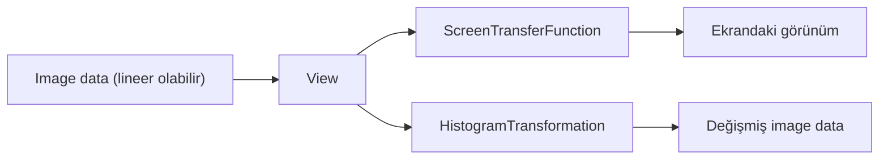
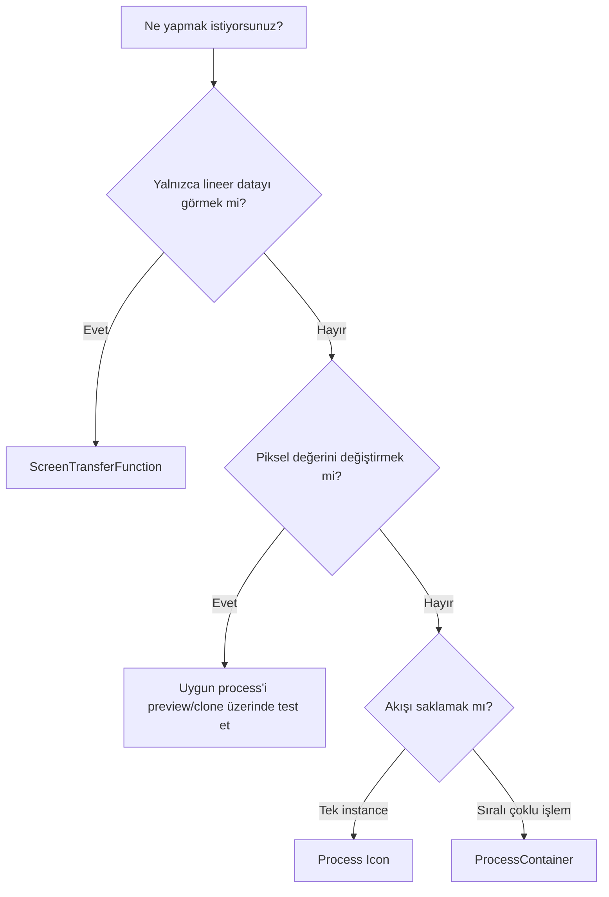

# PixInsight Temelleri

!!! info "Sayfa Bilgisi"
    **Kategori:** PixInsight Temelleri · **Düzey:** Beginner · **Tahmini okuma:** 3 dk
    **Anahtar kelimeler:** `PixInsight Temelleri` · `PixInsight` · `arayüz` · `workflow`

**Durum: Tamamlandı — Faz 1A**

## Amaç

PixInsight 1.9.3 arayüzünü dosya odaklı bir fotoğraf düzenleyici gibi değil; **image view**, **process instance**, görüntüleme dönüşümü ve işlem geçmişi kavramlarının birlikte çalıştığı bir görüntü işleme ortamı olarak öğretmek.

## Kavramsal Açıklama

PixInsight’ta profesyonel çalışma dört nesneyi birbirinden ayırmakla başlar:

- **Image**: bellekteki piksel verisi ve metadata.
- **View**: bir image’ın tamamı (**main view**) veya seçili alt bölgesi (**preview**).
- **Process instance**: belirli parametrelerle yapılandırılmış bir işlemin uygulanabilir örneği.
- **Workspace**: image window, process interface ve Process Icon’ların düzenlendiği çalışma alanı.

Bir görüntünün ekranda parlak görünmesi, piksel verisinin nonlinear olduğu anlamına gelmez. [ScreenTransferFunction](stf.md) yalnızca ekran sunumunu değiştirebilir. Buna karşılık [HistogramTransformation](histogram.md) uygulandığında hedef view’ın piksel değerleri değişir.

## Matematiksel Arka Plan (gerekiyorsa)

PixInsight yoğunlukları işlem bağlamında çoğunlukla normalize edilmiş ([0,1]) aralığında ele alır. Bir screen transfer (T_s), görüntülenen değeri (y=T_s(x)) olarak üretirken kaynak örnek (x)’i değiştirmez. Bir image transformation (T_i) ise sonucu image’a yazar: (x \leftarrow T_i(x)). Bu ayrım, lineer iş akışının korunması açısından temeldir.

## Ne zaman kullanılır?

- PixInsight’a yeni bir iş akışı kurarken
- Bir görüntünün lineer/nonlinear durumunu değerlendirirken
- Aynı işlemi previews veya clones üzerinde karşılaştırırken
- Process Icons ile tekrarlanabilir bir akış hazırlarken
- History Explorer üzerinden geri dönüş planlarken

## Ne zaman kullanılmaz?

Bu bölüm bir hedefe özgü reçete değildir; WBPP, DBE, SPCC veya stretch için kesin parametre sağlamaz. Bu konular kendi bölümlerinde ele alınır.

## PixInsight Menü Yolu

Bu bölümde kullanılan ana erişim noktaları:

- `Process`: process interfaces
- `View`: explorer windows ve görüntüleme araçları
- `Preview`: preview yönetimi
- `Workspace`: çalışma alanı yönetimi
- Image window başlık çubuğu ve view selector

Menü yerleşimi platforma ve workspace özelleştirmesine göre küçük görsel farklılıklar gösterebilir.

## Parametreler

Bu bir üst bölüm olduğundan tek bir parametre seti yoktur. Kontrol edilmesi gereken durum bilgileri şunlardır:

| Kontrol | Soru |
| --- | --- |
| Target view | İşlem doğru main view veya preview’a mı uygulanacak? |
| Linearity | Data lineer mi, yalnızca STF ile mi görünür? |
| Mask | Etkin maske var mı, ters mi? |
| İşlem state | İşlem interface beklenen instance’ı mı taşıyor? |
| History | Geri dönüş için canlı undo state mevcut mu? |

## Uygulama Adımları

1. Bir lineer image açın.
2. Image identifier ve active view bilgisini doğrulayın.
3. STF ile yalnızca ekran görünümünü açın.
4. Bir preview ve bir clone oluşturun.
5. Bir process instance’ını önce preview’a uygulayın.
6. Uygun instance’ı Process Icon olarak workspace’e bırakın.
7. History Explorer’da hedef view’ın geçmişini inceleyin.
8. Image’ın STF’sini kapatarak data ile görünüm ayrımını doğrulayın.

## Beklenen Sonuç

Kullanıcı; “ekranda gördüğüm”, “image data’da bulunan”, “process interface’te ayarlı olan” ve “history’de geri alınabilen” durumları birbirinden açıkça ayırabilir.

## Gerçek Kullanım Senaryosu

Lineer bir master luminance çok karanlık açılır. Auto STF ile yapı görünür yapılır; noise reduction ayarları bir preview’da sınanır, alternatif güçlü ayar bir clone üzerinde tutulur. Seçilen process instance Process Icon’a dönüştürülür. Stretch kararı verildiğinde STF instance’ı HistogramTransformation’a aktarılır ve işlem yalnızca çalışma clone’unda uygulanır.

## Sık Yapılan Hatalar

1. Auto STF uygulanmış image’ı nonlinear sanmak.
2. Process interface açık olduğu için işlemin image’a uygulanmış olduğunu düşünmek.
3. Main view yerine farkında olmadan preview’ı target seçmek.
4. Etkin maskeyi kontrol etmeden sonucu yorumlamak.
5. Process Icon’ı sonuç görüntüsü veya yedek sanmak.
6. Kayıtlı processing history ile canlı undo verisini aynı kabul etmek.

## Sorun Giderme

| Belirti | Olası neden | Çözüm |
| --- | --- | --- |
| Image çok karanlık | Lineer data, STF kapalı | STF ile ekran görünümünü kontrol edin |
| İşlem etkisiz | Yanlış target veya maske | Active view ve maskeyi denetleyin |
| Sonuç geri alınamıyor | Canlı undo state yok | Clone/proje/ara kayıt stratejisi kullanın |
| Preview sonucu farklı | Farklı örnek alan | Temsilî preview seçin |
| Icon beklenmeyen ayarla açılıyor | Yanlış instance kaydedildi | Icon’ı açıp parametreleri doğrulayın |

## İleri Seviye Notlar

- Bir process’in uygulanabilir hedefi genel olarak bir **view**’dır; preview da bir view’dır.
- Screen transfer ve mask visualization, image data’dan ayrı sunum katmanlarıdır.
- Tekrarlanabilirlik yalnızca ikon saklamak değildir; target, mask, lineerlik ve işlem sırasını da belgelemek gerekir.
- PixInsight’ın yerleşik process documentation’ı, kurulu build için birincil başvuru noktasıdır.

### Karar Ağacı

### SSS

??? question "STF uygulanmış image lineer kalır mı?"
    Evet. STF yalnızca ekran aktarımını değiştirir; image data’yı değiştirmez.

??? question "Preview ayrı bir dosya mıdır?"
    Hayır. Aynı image window içindeki alt view’dır.

??? question "Clone neden kullanılır?"
    Bağımsız image data üzerinde kalıcı alternatifleri karşılaştırmak için.

??? question "History Explorer dosya yedeği yerine geçer mi?"
    Hayır. Canlı undo state, kayıtlı geçmiş bilgisi ve harici dosya yedeği farklı kavramlardır.

??? question "Process Icon bir macro mudur?"
    Tek Process Icon bir process instance’ını kapsar. Sıralı çoklu işlem için ProcessContainer değerlendirilir.

## Hızlı Referans

!!! tip "Quick Reference"
    **Görmek:** STF · **Data’yı değiştirmek:** process uygulaması · **Yerel test:** Preview · **Bağımsız karşılaştırma:** Clone · **Tek ayarı saklamak:** Process Icon · **Sıralı akış:** ProcessContainer

## Sonraki Bölüm

Çalışma alanı, target seçimi ve interface düzeni için [Workspace](workspace.md) bölümüne geçin. Sonraki teknik akış: [STF](stf.md) → [Histogram](histogram.md) → [Preview, Clone ve History](preview-clone-history.md) → [Process Icons](process-icons.md).

## Önceki Bölüm

[← Dinamik Aralık ve Yerel Kontrast](dinamik-aralik-ve-yerel-kontrast.md)
