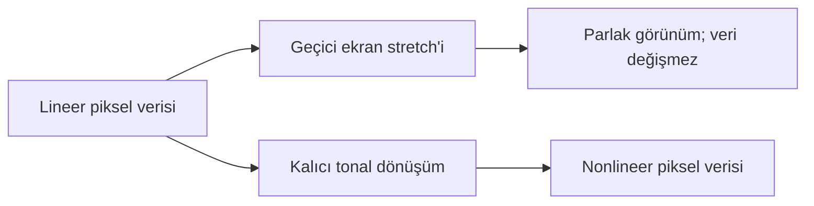

# Lineer ve Nonlineer Görüntü

!!! info "Sayfa Bilgisi"
    **Kategori:** Görüntü İşleme Temelleri · **Düzey:** Beginner · **Tahmini okuma:** 10 dk
    **Anahtar kelimeler:** `lineer görüntü` · `nonlinear image` · `linear data` · `display stretch` · `permanent stretch` · `STF` · `tonal transformation`

## Bu konu neden önemlidir?

Bir görüntünün lineer veya nonlineer olması, hangi işlemlerin anlamlı olduğunu belirleyen temel durum bilgisidir. Ekranda parlak görünmek ile piksel değerlerinin dönüşmüş olması aynı değildir. Bu ayrım kaybolduğunda geçici bir görünüm kalıcı stretch sanılabilir veya lineer veri gerektiren bir işlem yanlış aşamada uygulanabilir.

## Temel kavram

Lineer görüntüde (linear image) piksel değerleri kaynak yoğunluklarıyla doğrusal bir ilişkiyi korur: bir bölge diğerinin iki katı ışık ürettiyse, ideal kalibre edilmiş ölçümde sayısal değerler de bu oranı korur. Offset çıkarma, ölçekleme veya geçerli calibration işlemleri belirli koşullarda doğrusal ilişkiyi koruyabilir.

Nonlineer görüntüde (nonlinear image) değerler doğrusal olmayan bir fonksiyonla yeniden eşlenmiştir. Zayıf değerleri görünür kılan stretch, oranları görüntüleme amacıyla değiştirir. Bu kötü veya hatalı değildir; astronomik görüntünün ekranın sınırlı ton aralığında sunulması için çoğunlukla gereklidir.

## Sensör değerleri ve ekran görünümü

Deep-sky görüntünün büyük bölümü sensör aralığının küçük, düşük değerli kısmında bulunabilir. Lineer veri bu yüzden varsayılan ekranda neredeyse siyah görünür. Veri yine de yıldız, nebula ve arka plan farklarını içerir.

Geçici ekran stretch’i yalnız görüntüleme zincirine bir transfer fonksiyonu ekler. Kaydedilen pikseller değişmez. Kalıcı stretch ise fonksiyon sonucunu yeni piksel değerleri olarak görüntüye yazar.

!!! note "TODO Illustration"
    **Eğitim amacı:** Aynı lineer verinin normal ekran, geçici display stretch ve kalıcı stretch durumlarını ayırmak.
    **Gerekli kaynak:** Zayıf broadband veya narrowband gerçek entegrasyon.
    **Durumlar:** Lineer/unstretched, lineer/STF görünümü, kalıcı stretched.
    **İşaretleme:** Aynı pikselin kaydedilmiş değeri ve ekranda görünen değeri.
    **Gerçek proje verisi:** Evet.

## Stretch sırasında ne değişir?

Bir stretch, giriş değeri `x` için yeni çıktı `T(x)` üretir. `T(x)` doğrusal değilse farklı parlaklık bölgelerinin oranları değişir. Düşük değerler genişletilirken yüksek değerler sıkıştırılabilir; orta ton kontrastı ve renk kanallarının göreli görünümü değişebilir.

Clipping veya sınırlı bit derinliğine quantization gibi kayıplar oluştuysa ters fonksiyon gerçek bilgiyi geri getiremez. Bazı ideal, monoton dönüşümlerin matematiksel tersi bulunabilse bile ardışık lokal işlemler, maskeler, clipping ve yuvarlama sonrasında “gerçek lineer duruma dönmek” pratikte güvenilir bir workflow değildir. Güvenli geri dönüş, korunmuş lineer master veya clone’dur.

## Hangi işlemler hangi durumda yapılır?

| İşlem ilkesi | Lineer aşama neden önemlidir? | Nonlineer aşama neden tercih edilebilir? |
|---|---|---|
| Fiziksel calibration ve fotometrik ölçüm | Sensör değerleriyle oransal ilişki korunur. | Stretch sonrası oranlar görüntüleme için değiştirilmiştir. |
| Gradient ve renk kalibrasyonu | Arka plan ve kanal ölçekleri ölçülebilir yapıdadır. | Kozmetik ince ayar ayrı amaçtır. |
| Deconvolution/restoration | Model varsayımları lineer ölçüme dayanabilir. | Process’e göre uygun olmayabilir. |
| Yerel kontrast ve sunum | Çoğunlukla henüz hedef görünüm oluşmamıştır. | Görünür ölçekler ve tonal bölgeler seçilebilir. |
| Final saturation/curves | Renk görünümü geçici display’e bağlıdır. | Teslim görünümünde doğrudan değerlendirilir. |

Bu tablo evrensel reçete değildir. Her process’in giriş varsayımı canonical process belgesinden doğrulanmalıdır.

## Yaygın yanlış anlamalar

- Görüntü ekranda parlaksa nonlineer olduğunu sanmak.
- STF’yi kaydetmenin piksel verisini kalıcı stretch yaptığını düşünmek.
- Nonlineer dosyayı yeniden kaydetmenin onu lineer hale getireceğini varsaymak.
- Bütün işlemlerin lineer aşamada daha doğru olduğunu kabul etmek.
- Histogramın geniş görünmesini tek başına nonlinear durum kanıtı saymak.
- Ters curve uygulamasının kaybedilen clipping bilgisini geri getireceğine inanmak.

## Karar rehberi

| Soru | Kontrol | Sonraki adım |
|---|---|---|
| Yalnız ekranda mı parlak? | Display transform’u kapatın. | Görüntü yeniden kararıyorsa veri lineer kalmış olabilir. |
| Kalıcı stretch uygulandı mı? | History/process kaydını inceleyin. | Nonlineer workflow varsayın. |
| Process lineer veri mi bekliyor? | Canonical process belgesini kontrol edin. | Gerekirse korunmuş lineer master’a dönün. |
| Clipping oluştu mu? | Kanal histogramı ve readout’u inceleyin. | Ters dönüşüm yerine önceki checkpoint’i kullanın. |

## PixInsight ile ilişkisi

- [ScreenTransferFunction](stf.md) geçici display transform’dur.
- [HistogramTransformation](../07-stretch/histogram-transformation.md) piksel verisine kalıcı dönüşüm uygular.
- [GeneralizedHyperbolicStretch](../07-stretch/generalized-hyperbolic-stretch.md) farklı transfer fonksiyonlarıyla kalıcı stretch üretir.
- [Stretch Temelleri](stretch-temelleri.md) yöntemden bağımsız tonal hedefleri açıklar.
- [OSC İş Akışı](../15-workflows/osc-workflow.md) lineer/nonlineer sınırın workflow içindeki yerini gösterir.

## Kaynaklar

- [PixInsight Staff — What is a linear versus nonlinear image?](https://pixinsight.com/forum/index.php?threads/what-is-a-linear-verus-non-linear-image.428/)
- [PixInsight — HistogramTransformation Reference Documentation](https://pixinsight.com/doc/tools/HistogramTransformation/HistogramTransformation.html)

## Önceki Bölüm

[← Histogram ve Ton Dağılımı](histogram.md)

## Sonraki Bölüm

[Stretch Temelleri →](stretch-temelleri.md)
