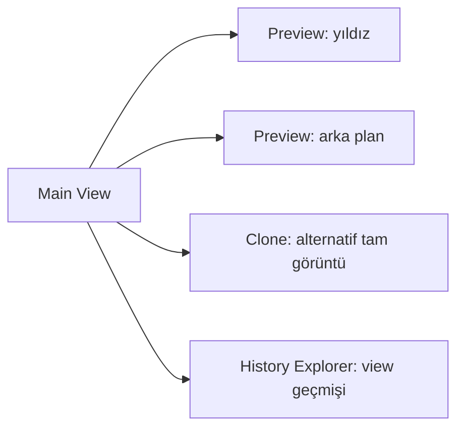
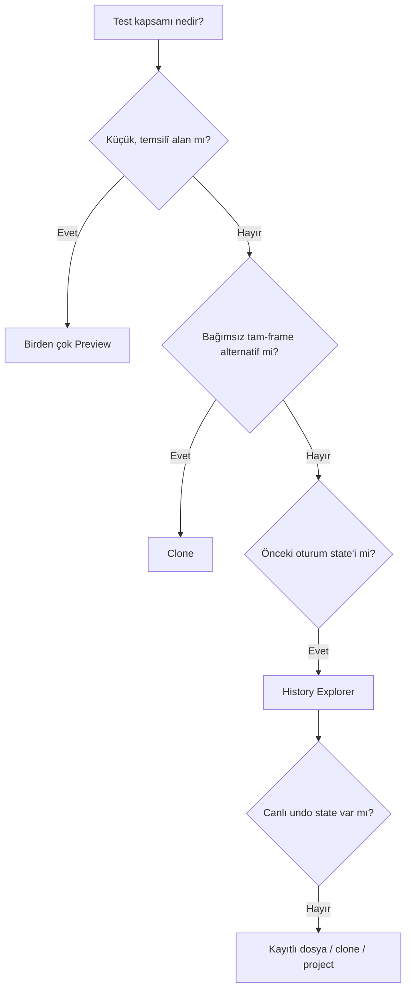

# Preview, Clone ve History Explorer

!!! info "Sayfa Bilgisi"
    **Kategori:** PixInsight Temelleri · **Düzey:** Beginner · **Tahmini okuma:** 5 dk
    **Anahtar kelimeler:** `Preview, Clone ve History` · `PixInsight` · `arayüz` · `workflow`

**Durum: Tamamlandı — Faz 1A**

## Amaç

Yerel test (**Preview**), bağımsız alternatif (**Clone**) ve oturum içi geri dönüş/inceleme (**History Explorer**) araçlarını doğru kapsamda kullanmak.

## Kavramsal Açıklama

- **Preview**: main image içindeki dikdörtgen alt view. Bağımsız dosya değildir; küçük bölgede hızlı ve temsilî test sağlar.
- **Clone**: bağımsız image data taşıyan kopya. Tüm frame’i etkileyen veya kalıcı alternatifleri karşılaştıran testler için uygundur.
- **History Explorer**: seçili view’a uygulanan işlemlerin ve mevcut undo durumlarının incelenmesini sağlar. Kaydedilmiş processing history ile canlı undo state aynı değildir.

## Matematiksel Arka Plan (gerekiyorsa)

Bir preview, image domain’inin alt kümesidir: (P=I[x_0:x_1,y_0:y_1]). Küçük örnek alan performansı artırır fakat tüm frame statistics’ini temsil etmeyebilir. Clone ise başlangıçta aynı örnekleri taşıyan bağımsız image’dır; sonraki dönüşümler iki dalı ayırır.

## Ne zaman kullanılır?

- Preview: noise, deconvolution, contrast ve mask etkisini yerel bölgede ayarlarken
- Clone: stretch, channel operation veya bütün görüntü statistics’ine bağlı sonucu kıyaslarken
- History Explorer: hangi process’in hangi sırayla uygulandığını incelemek ve mevcut state’ler arasında gezinmek için

## Ne zaman kullanılmaz?

- Tek preview’ı tüm image’ın istatistiksel temsilcisi saymayın.
- Clone’u otomatik yedek veya linked copy sanmayın.
- History Explorer’ı kalıcı sürüm kontrolü ya da harici yedek yerine kullanmayın.
- Kayıtlı history metadata’sının tüm ara image state’lerini taşıdığını varsaymayın.

## PixInsight Menü Yolu

- Preview yönetimi: `Preview` menüsü ve image window içindeki preview araçları
- Clone/duplicate: `Image` menüsündeki image duplication işlevi veya image identifier sürükleme iş akışı
- History Explorer: `View > Explorer Windows > History Explorer`

Kesin kısayollar işletim sistemi keymap’ine göre değişebileceğinden kurulu 1.9.3 menüsünden doğrulanmalıdır.

## Parametreler

| Araç | Kritik seçim | Neden |
| --- | --- | --- |
| Preview | Konum ve boyut | Yıldız, zayıf sinyal ve arka planı temsil etmeli |
| Clone | Identifier | Kaynak ve alternatif karışmamalı |
| History Explorer | Target view | Her view’ın geçmişi ayrıdır |
| History state | Canlı/kayıtlı oluşu | Görsel geri dönüş imkânını belirler |
| İşlem extraction | Instance geçerliliği | Dynamic/script işlemlerinde yeniden kullanım sınırlı olabilir |

## Uygulama Adımları

1. Main image üzerinde en az üç preview oluşturun: yıldız alanı, zayıf hedef yapısı, boş arka plan.
2. Preview’ları anlamlı biçimde adlandırın.
3. Process’i her preview’da aynı instance ile test edin.
4. Global statistics kullanan bir işlemse preview sonucunu tek başına final karar yapmayın.
5. Tam-frame alternatif için clone oluşturup kaynak/aşama adı verin.
6. Seçilen ayarı clone’a uygulayın ve aynı STF ile kaynakla kıyaslayın.
7. History Explorer’da doğru view’ı seçin.
8. İşlem sırasını ve mevcut geri dönüş state’lerini inceleyin.
9. Kritik aşamalarda clone veya dosya kaydıyla kalıcı geri dönüş noktası oluşturun.

## Beklenen Sonuç

Yerel ayar testleri hızlıdır; tam image yan etkileri clone’da görülür; işlem sırası History Explorer’da izlenir. Hiçbiri tek başına yedek stratejisiyle karıştırılmaz.

## Gerçek Kullanım Senaryosu

Noise reduction ayarı için bir yıldızlı preview, düşük SNR nebula preview’ı ve arka plan preview’ı oluşturulur. Seçilen ayar üçünde de dengeli sonuç verirse tam clone’a uygulanır. Clone aynı STF ile kaynakla karşılaştırılır. Aşırı yumuşatma görülürse History Explorer’dan önceki canlı state’e dönülür; kabul edilen sonuç yeni XISF olarak kaydedilir.

## Sık Yapılan Hatalar

1. Yalnız parlak hedef preview’ında ayar yapıp arka planı kontrol etmemek.
2. Preview’a uygulanan işlemin main view’a da uygulanmış olduğunu sanmak.
3. Clone ile kaynağı benzer identifier nedeniyle karıştırmak.
4. Farklı Auto STF’lerle clone karşılaştırmak.
5. History Explorer’ı dosya yedeği sanmak.
6. Kayıtlı processing history’nin tüm undo image’larını içerdiğini varsaymak.
7. Dynamic process instance’ını başka target’a körlemesine yeniden uygulamak.

## Sorun Giderme

| Belirti | Neden | Çözüm |
| --- | --- | --- |
| Preview iyi, full frame kötü | Preview temsilî değil/global statistics | Birden çok preview ve clone kullanın |
| İşlem main image’da görünmüyor | Target preview idi | Main view selector’ı doğrulayın |
| Clone farkı görünmüyor | Farklı STF/zoom | Aynı STF ve zoom kullanın |
| Eski state görüntülenemiyor | Yalnız kayıtlı history bilgisi | Canlı undo yoksa önceki dosya/clone’a dönün |
| History yanlış image’ı gösteriyor | Yanlış target view | Explorer target’ını değiştirin |

## İleri Seviye Notlar

- Main view ve her preview ayrı process target olabilir; history bağlamı view’a göre izlenmelidir.
- XISF processing history referans bilgisi saklayabilir; bu, canlı undo için gereken tüm ara image buffer’larının saklandığı anlamına gelmez.
- Bir PixInsight project bazı oturum durumlarını daha kapsamlı koruyabilir; boyut ve yedek politikasını ayrıca yönetin.
- History’den çıkarılan process instances, özellikle dynamic process veya script bağlamında hedefe özgü veri taşıyabilir.

### Karar Ağacı

### SSS

??? question "Preview bağımsız image mıdır?"
    Hayır. Main image içindeki alt view’dır.

??? question "Preview sonucu tüm frame’i temsil eder mi?"
    Her zaman değil. Özellikle global statistics kullanan işlemlerde tam-frame clone testi gerekir.

??? question "Clone kaynak değişince güncellenir mi?"
    Hayır. Oluşturulduktan sonra bağımsız işlem dalıdır.

??? question "History Explorer kalıcı yedek midir?"
    Hayır. Yedek için dosya sürümleri ve harici depolama gerekir.

??? question "Kaydedilmiş history neden eski görüntüyü göstermiyor?"
    Processing history kaydı işlem bilgisini taşıyabilir; canlı undo için gereken ara image state’leri bulunmayabilir.

??? question "Kaç preview kullanmalıyım?"
    Sabit sayı yoktur; yıldız, hedef yapısı ve arka plan gibi farklı risk bölgelerini temsil edecek kadar kullanın.

## Hızlı Referans

!!! tip "Quick Reference"
    **Preview:** hızlı yerel test · **Clone:** bağımsız tam-frame dal · **History Explorer:** view işlem sırası/canlı undo · **Yedek:** bunlardan ayrı dosya ve depolama politikası

## Sonraki Bölüm

Seçilen process ayarlarını tekrar kullanılabilir nesnelere dönüştürmek için [Process Icons ve ProcessContainer](process-icons.md) bölümüne geçin.

## Önceki Bölüm

[← Histogram](histogram.md)
