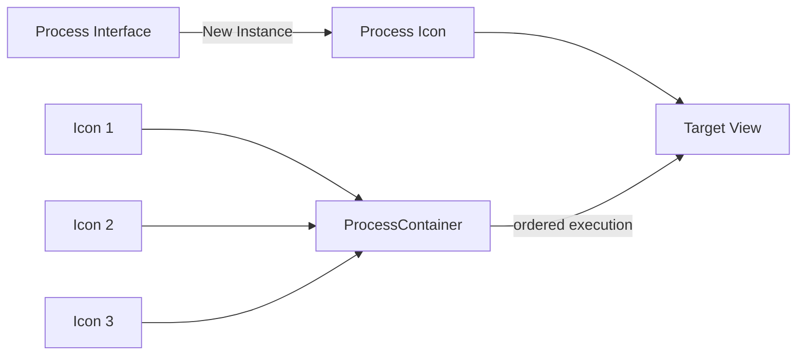
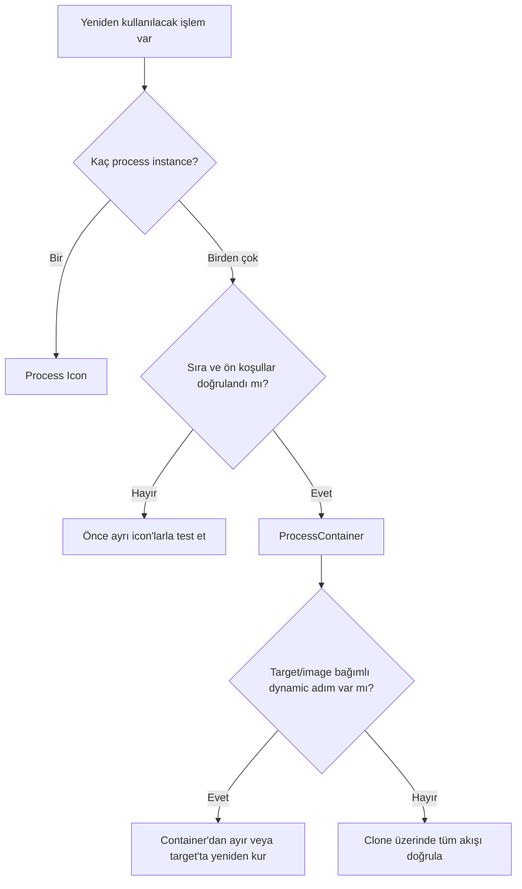

# Process Icons ve ProcessContainer

**Durum: Tamamlandı — Faz 1A**

## Amaç

Tek process instance’larını Process Icons ile saklamak; sıralı çoklu işlemleri ProcessContainer ile yürütmek ve ikisini güvenli, belgelenebilir iş akışlarında ayırmak.

## Kavramsal Açıklama

**Process Icon**, belirli parametrelere sahip tek bir process instance’ının workspace üzerindeki nesnesidir. Interface’in **New Instance** üçgeni workspace’e sürüklenerek oluşturulabilir; çift tıklamak instance’ı interface’te açar, bir view’a sürüklemek onu uygular.

**ProcessContainer**, birden çok process instance’ını belirli sırada tutan ve hedef üzerinde sıralı çalıştırabilen bir process’tir. “Bir sürü icon’ı görsel olarak yan yana dizmek” ile aynı değildir: sıra container’ın iç yapısındadır.

| Özellik | Process Icon | ProcessContainer |
| --- | --- | --- |
| Kapsam | Tek process instance | Sıralı çoklu instance |
| Amaç | Ayarı sakla/uygula/paylaş | Küçük pipeline yürüt |
| Sıra bağımlılığı | Kendi başına yok | Temel özelliktir |
| Hata izolasyonu | Tek adım kolay incelenir | Adımlar tek tek test edilmelidir |
| Target bağımlılığı | Process’e göre değişir | İçindeki her process için geçerlidir |

## Matematiksel Arka Plan (gerekiyorsa)

Tek icon bir (T) dönüşümünü temsil eder. ProcessContainer sıralı bileşke uygular:

[
I_{out}=T_n(\dots T_2(T_1(I_{in}))\dots)
]

Genellikle (T_2(T_1(I)) \neq T_1(T_2(I))); dolayısıyla sıra dekoratif değil, sonucun parçasıdır. Mask, target geometry ve lineerlik her (T_k) için ön koşuldur.

## Ne zaman kullanılır?

- Process Icon: doğrulanmış bir ayarı tekrar kullanmak, paylaşmak veya açıklamayla belgelemek
- ProcessContainer: hedefleri ve ön koşulları uyumlu, test edilmiş sıralı işlemleri birlikte çalıştırmak
- History’den yararlı bir instance çıkarıp kontrollü biçimde yeniden kullanmak
- Aynı veri setinde tutarlı process başlangıçları oluşturmak

## Ne zaman kullanılmaz?

- Dynamic process instance’larını farklı geometry/target üzerinde otomatik güvenli varsaymayın.
- Image’a özgü statistics kullanan ayarları evrensel preset gibi uygulamayın.
- ProcessContainer’ı hataları gizleyen “tek tık” reçete olarak kullanmayın.
- Script ve process davranışlarının aynı history/instance semantiğine sahip olduğunu varsaymayın.

## PixInsight Menü Yolu

- Process interface açma: `Process` menüsü veya Process Explorer
- ProcessContainer: `Process > ProcessContainer`
- Process Icon yönetimi: workspace bağlam menüsündeki `Process Icons` komutları
- Instance oluşturma: process interface altındaki **New Instance** üçgeni

## Parametreler

| Alan | Önerilen yaklaşım |
| --- | --- |
| Icon identifier | İşlem + amaç + aşama; Türkçe karakter içermeyen kısa ad |
| Instance description | Target türü, lineerlik, mask ve doğrulama notu |
| Container order | Bağımlılık sırasına göre |
| Enabled state | Test edilmeyen adımı devre dışı bırak |
| Target | Uygulamadan önce view identifier’ını kontrol et |
| Portability | Eklenti/sürüm bağımlılığını belgeleyin |

## Uygulama Adımları

1. Process interface’te ayarı temsilî previews ve clone üzerinde doğrulayın.
2. **New Instance** üçgenini workspace’e sürükleyin.
3. Icon’a anlamlı bir identifier ve description verin.
4. Icon’ı çift tıklayıp parametrelerin beklenen instance olduğunu kontrol edin.
5. Tek adımlı kullanımda icon’ı doğru target view’a sürükleyin.
6. Çoklu akış için ProcessContainer açın.
7. Yalnız ayrı ayrı doğrulanmış instances’ları doğru sırayla container’a ekleyin.
8. Mask ve lineerlik geçişlerini sıra içinde açıkça değerlendirin.
9. Container’ı önce clone üzerinde çalıştırın.
10. Gerekirse process icons setini workspace bağlam menüsünden kaydedin.

## Beklenen Sonuç

Tek process ayarları açık adlarla yeniden kullanılabilir; sıralı akışlar ProcessContainer içinde deterministik bir düzende yürür. Kullanıcı hangi adımın nerede hata verdiğini izleyebilir.

## Gerçek Kullanım Senaryosu

Lineer luminance için doğrulanmış iki ayrı icon hazırlanır: noise reduction ve local contrast için başlangıç instances. Bunlar önce ayrı previews üzerinde test edilir. Local contrast nonlinear veri gerektiriyorsa aynı container’a körlemesine eklenmez; lineerlik sınırı belgelenir ve akış iki aşamaya ayrılır. Uyumlu adımlar bir clone üzerinde ProcessContainer ile sınanır.

## Sık Yapılan Hatalar

1. Process Icon’ı image sonucu veya dosya yedeği sanmak.
2. Icon’ları anlamsız varsayılan adlarla bırakmak.
3. Başka image’ın statistics’ine göre ayarlanmış instance’ı körlemesine uygulamak.
4. Dynamic process instance’ını farklı geometry’ye taşımak.
5. ProcessContainer’da işlem sırasının sonucunu değiştirdiğini göz ardı etmek.
6. Mask ve lineerlik ön koşullarını container içinde belgelememek.
7. Eklenti sürüm bağımlı icon setini sürüm notu olmadan paylaşmak.

## Sorun Giderme

| Belirti | Neden | Çözüm |
| --- | --- | --- |
| Icon yanlış ayarla açılıyor | Yanlış instance kaydedildi | Interface’te doğrula, icon’ı yeniden üret |
| Drag-drop etkisiz | Hedef process için geçersiz | Target view ve process kapsamını kontrol et |
| Container ortada duruyor | Bir adım hata verdi | Adımları tek tek clone üzerinde çalıştır |
| Sonuç sıra değişince bozuluyor | Dönüşümler değişmeli değil | Bağımlılık sırasını belgeleyip sabitle |
| Paylaşılan icon açılmıyor | Eksik module/script/sürüm | Bağımlılıkları eşleştir |
| Dynamic process yanlış bölgede | Target geometry farklı | Instance’ı yeni target’ta yeniden kur |

## İleri Seviye Notlar

- Process Icon “living object” olarak workspace’te yönetilir; kaydetme/yükleme ile iş akışları paylaşılabilir.
- Instance description, yalnız isimden anlaşılamayan target ve mask varsayımlarını taşımak için değerlidir.
- ProcessContainer içinde nonlinear sınırı, mask üretimi veya target değişimi varsa akışı parçalara ayırmak daha denetlenebilirdir.
- Process Icons parametreleri saklar; bilimsel gerekçe ve veri uygunluğunu saklamaz. Dokümantasyon gereklidir.
- PixInsight’ın process-instance yaklaşımına genel bakış: [An Introduction to PixInsight](https://pixinsight.com/astrophotocl/outreach/pixinsight_eccai_2006.pdf).

### Karar Ağacı

### SSS

??? question "Process Icon image içerir mi?"
    Hayır. Bir process instance ve parametrelerini temsil eder.

??? question "ProcessContainer yalnız icon klasörü müdür?"
    Hayır. İçindeki process instances’ları belirli sırayla çalıştırabilen bir process’tir.

??? question "Icon’ı çift tıklamak işlemi uygular mı?"
    Hayır. Instance’ı process interface’te açar; uygulama ayrıca hedefe yapılır.

??? question "Her icon başka image’da güvenle çalışır mı?"
    Hayır. Statistics, geometry, mask, metadata ve lineerlik bağımlılıkları olabilir.

??? question "ProcessContainer içindeki sıra önemli mi?"
    Evet. Görüntü dönüşümleri çoğu zaman değişmeli değildir.

??? question "Icon seti nasıl paylaşılır?"
    Workspace Process Icons yönetiminden kaydedilebilir; gerekli modules, scripts ve sürüm bilgisi ayrıca belirtilmelidir.

## Quick Reference

!!! tip "Quick Reference"
    **Tek ayar:** Process Icon · **Sıralı çoklu akış:** ProcessContainer · **Önce:** preview/clone testi · **Her zaman:** target + mask + lineerlik + sürüm notu · **Dynamic process:** hedefe özgü kabul et

## Sonraki Bölüme Geçiş

Arayüz temeli tamamlandı. Kalibrasyon akışına başlamak için [Kalibrasyon ve WBPP](../03-kalibrasyon/index.md) bölümüne; stretch yöntemleri için [Stretch](../07-stretch/index.md) bölümüne geçin.

