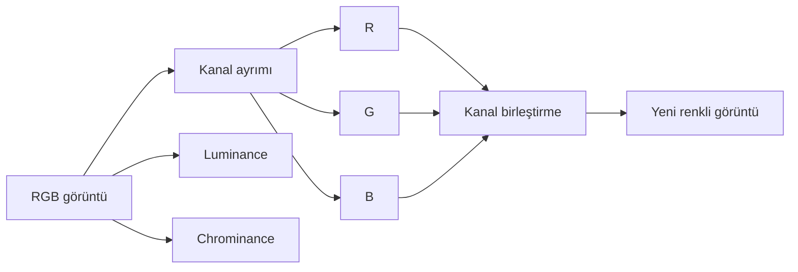

# Renk ve Kanallar

!!! info "Sayfa Bilgisi"
    **Kategori:** Görüntü İşleme Temelleri · **Düzey:** Beginner · **Tahmini okuma:** 10 dk
    **Anahtar kelimeler:** `RGB channels` · `luminance` · `chrominance` · `channel separation` · `color cast` · `neutrality` · `saturation` · `synthetic luminance`

## Bu konu neden önemlidir?

Renkli görüntü tek bir parlaklık katmanı değildir. RGB kanalları, parlaklık (luminance) ve renk bilgisi (chrominance) farklı soruları yanıtlar. Kanal ilişkileri anlaşılmadan renk cast’i, kanal clipping’i veya luminance ekleme sonrası renk kaybı yanlış process ile düzeltilmeye çalışılabilir.

## Temel kavramlar

### RGB kanalları

Bir RGB görüntüde her pikselin kırmızı, yeşil ve mavi bileşeni vardır. Bu değerler sensör, filtre transmission’ı, hedef spektrumu, calibration ve color calibration zincirinin sonucudur. RGB değerleri fiziksel spektrumun eksiksiz kopyası değildir; belirli bantların sayısal temsilidir.

### Luminance ve chrominance

Luminance görüntünün parlaklık/yapı bileşenini, chrominance renk farklarını temsil eder. Hangi ağırlıklarla ayrıldıkları kullanılan renk uzayına bağlıdır. Luminance, RGB’nin evrensel olarak basit ortalaması değildir.

Channel separation, birleşik görüntüdeki kanalları ayrı grayscale görüntüler olarak incelemeyi sağlar. Channel combination bu bileşenleri belirli bir renk uzayında yeniden birleştirir. Ayrıştırıp birleştirmenin renk uzayı ve channel mapping’i doğrulanmalıdır.

### Color cast, neutrality ve saturation

- **Color cast:** Görüntünün tamamı veya bir bölgesindeki sistematik renk eğilimi.
- **Neutrality:** Nötr kabul edilen bir referansta kanalların beklenen ilişkiye getirilmesi.
- **Saturation:** Rengin nötr gri ekseninden uzaklığı; parlaklıkla aynı değildir.

Arka planın nötrleştirilmesi gradient removal değildir. Uzamsal değişen arka plan önce modellenmeden tek nötr ayar, görüntünün farklı bölgelerini aynı anda düzeltemeyebilir.

### Kanal clipping’i

Bir kanal alt veya üst sınıra kırpılırsa hue ve saturation bilgisi bozulabilir. Birleşik RGB görüntü kabul edilebilir görünse bile parlak yıldızda yalnız R veya B kanalı doymuş olabilir. Kanal histogramları ve sayısal readout birlikte incelenmelidir.

### Synthetic luminance

Synthetic luminance, mevcut renk kanallarından tanımlı ağırlıklarla üretilen parlaklık temsilidir. Gerçek ayrı L filtresiyle çekilmiş luminance ile aynı acquisition ürünü değildir. Ağırlık seçimi SNR, kanal çözünürlüğü ve renk ilişkisini etkiler; evrensel tek formül yoktur.

!!! note "TODO Illustration"
    **Eğitim amacı:** RGB, luminance ve chrominance bileşenlerinin aynı hedefte farklı bilgi taşıdığını göstermek.
    **Gerekli kaynak:** Renk kalibrasyonu yapılmış gerçek broadband görüntü.
    **Durumlar:** RGB, R/G/B ayrımı, luminance, chrominance ve tek-kanal clipping örneği.
    **İşaretleme:** Ortak yapı, renk farkı ve kırpılmış yıldız çekirdeği.
    **Gerçek proje verisi:** Evet.

## Kavramlar arasındaki ilişki

## Yaygın yanlış anlamalar

- Luminance’ın RGB ortalaması olduğunu varsaymak.
- Arka plan neutrality işlemini gradient removal sanmak.
- Saturation artışının daha doğru renk ürettiğini düşünmek.
- Birleşik histogram temizse kanalların da unclipped olduğunu kabul etmek.
- Synthetic luminance ile ayrı L exposure’ı aynı veri saymak.
- Channel combination’ı yalnız dosyaları yan yana koymak gibi görmek.

## Karar rehberi

| Belirti veya amaç | İlk kontrol | Canonical devam |
|---|---|---|
| Genel renk cast’i | Gradient ve color calibration durumu | [Astronomik Renk Teorisi](../05-color-calibration/color-theory.md) |
| Arka plan bölgeleri farklı renkte | Uzamsal gradient | [Gradient Tanısı](../04-gradient/gradient-diagnostics.md) |
| Parlak yıldızın rengi kayboldu | Kanal clipping | [Histogram ve Ton Dağılımı](histogram.md) |
| Luminance sonrası renk zayıfladı | L/chrominance dengesi | [LRGBCombination](../08-lrgb/lrgb-combination.md) |
| Kanallar matematiksel birleştirilecek | Renk uzayı ve expression kapsamı | [Kanal Karışımları](../10-pixelmath/kanal-karisimlari.md) |

## PixInsight ile ilişkisi

- [ChannelCombination](../08-lrgb/channel-combination.md) process uygulamasını açıklar.
- [LRGBCombination](../08-lrgb/lrgb-combination.md) luminance ve chrominance birleşimini ele alır.
- [SPCC](../05-color-calibration/spcc.md) fotometrik color calibration process’idir.
- [CurvesTransformation](../13-final/curves-transformation.md) nonlineer tonal ve saturation ayarı sağlar.
- [Astronomik Renk Teorisi](../05-color-calibration/color-theory.md) fiziksel spektrumdan görüntü rengine geçişin canonical açıklamasıdır.

Bu sayfa SHO/HOO paletleri veya PixelMath reçeteleri içermez; narrowband palette foundations Phase 7.4 kapsamındadır.

## Kaynaklar

- [PixInsight — Introduction to PixInsight](https://pixinsight.com/astrophotocl/outreach/pixinsight_eccai_2006.pdf)
- [PixInsight — HistogramTransformation Reference Documentation](https://pixinsight.com/doc/tools/HistogramTransformation/HistogramTransformation.html)

## Önceki Bölüm

[← Sinyal ve Gürültü](sinyal-ve-gurultu.md)

## Sonraki Bölüm

[Dinamik Aralık ve Yerel Kontrast →](dinamik-aralik-ve-yerel-kontrast.md)
