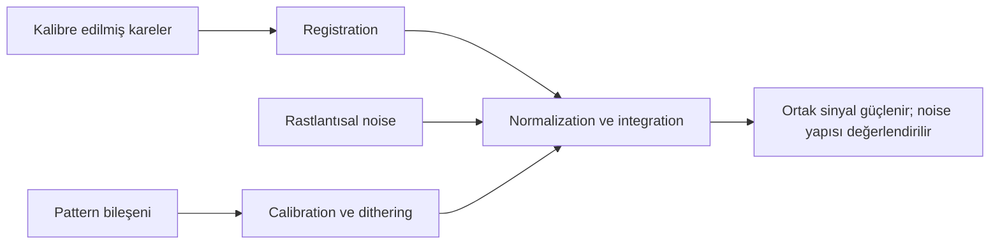

# Sinyal ve Gürültü

!!! info "Sayfa Bilgisi"
    **Kategori:** Görüntü İşleme Temelleri · **Düzey:** Beginner · **Tahmini okuma:** 10 dk
    **Anahtar kelimeler:** `signal` · `noise` · `shot noise` · `read noise` · `thermal noise` · `pattern noise` · `noise scale` · `noise estimation`

## Kapsam kararı

Bu sayfa gürültünün türü, uzamsal ölçeği ve görüntüdeki görünümüyle sınırlıdır. SNR formülü, integration time, stacking kazancı ve sensör dinamik aralığının canonical açıklaması [SNR ve Dinamik Aralık](../01-temeller/snr-ve-dinamik-aralik.md) sayfasındadır.

## Temel kavram

Sinyal, yorumlamak istediğimiz fiziksel veya görsel bilgidir. Gürültü, ölçümün belirsizliğini artıran rastlantısal değişimdir. İstenmeyen her yapı gürültü değildir: gradient, amp glow, banding ve dust shadow gibi düzenli bileşenler structured artefact veya pattern olarak ayrı modellenmelidir.

| Bileşen | Kaynak | Görüntüdeki karakter |
|---|---|---|
| Shot noise | Foton gelişinin Poisson değişimi | Sinyal ve gökyüzüyle birlikte artan rastlantısal değişim |
| Read noise | Elektronik okuma zinciri | Her okumanın eklediği belirsizlik |
| Thermal noise | Dark current’ın istatistiksel değişimi | Poz ve sıcaklıkla ilişkili rastlantısal bileşen |
| Pattern noise | Sensöre/okumaya bağlı tekrarlı yapı | Sabit veya yönlü desen |
| Quantization | Sürekli ölçümün sınırlı kodlara çevrilmesi | Uygun olmayan koşulda seviye basamakları |

### Rastlantısal ve yapılandırılmış gürültü

Rastlantısal noise kareler arasında aynı pikselde aynı değeri tekrarlamaz; uygun entegrasyonla göreli etkisi azalabilir. Yapılandırılmış bileşen aynı sensör koordinatına veya okuma yönüne bağlı kalabilir. Calibration, dithering ve rejection olmadan yalnız daha fazla kare eklemek yapıyı tamamen ortadan kaldırmayabilir.

### Noise ölçeği ve uzamsal frekans

Fine-grain noise küçük piksel ölçeğinde, mottling orta ölçekte, banding veya walking noise büyük/yönlü ölçekte görülebilir. Bir noise reduction yöntemi hangi ölçeği hedeflediğini bilmeden uygulanırsa yıldız profili, filament veya toz yapısı da noise sanılabilir.

## Noise estimation ve görünürlük

Noise estimation, yıldız ve hedef yapısından mümkün olduğunca arındırılmış temsilî bölgeler gerektirir. Tek background Preview bütün görüntüyü temsil etmeyebilir; gradient, farklı entegrasyon derinliği veya nebula alanı sonucu değiştirir.

Stretch düşük değerleri genişlettiğinde daha önce zor görülen noise görünür olur. Bu, stretch’in yeni noise ürettiği anlamına gelmez; mevcut değişimi görünür aralığa taşır. Aşırı local contrast ise gerçekten noise amplitüdünü ve yapı algısını artırabilir.

!!! note "TODO Illustration"
    **Eğitim amacı:** Rastlantısal fine noise, walking noise ve gerçek filament yapısını ayırmak.
    **Gerekli kaynak:** Dither uygulanmış ve uygulanmamış aynı hedef veri seti.
    **Durumlar:** Tek subframe, entegrasyon, stretched entegrasyon.
    **İşaretleme:** Noise ölçeği, yönlü pattern ve korunması gereken sinyal.
    **Gerçek proje verisi:** Evet.

## Yaygın yanlış anlamalar

- Bütün düzensiz yapıyı random noise saymak.
- Noise reduction’ın kayıp sinyali geri getirdiğini düşünmek.
- Stretch sonrası görünür olan noise’un stretch tarafından üretildiğini varsaymak.
- Tek küçük background Preview’dan bütün görüntü için noise sonucu çıkarmak.
- Pattern noise’u yalnız smoothing ile çözmeye çalışmak.
- Pürüzsüz görüntüyü otomatik olarak yüksek kaliteli kabul etmek.

## Karar rehberi

| Belirti | Önce sınıflandır | Sonraki bağlantı |
|---|---|---|
| İnce rastlantısal gren | Scale ve SNR | [SNR ve Dinamik Aralık](../01-temeller/snr-ve-dinamik-aralik.md) |
| Yönlü diagonal iz | Dither/pattern ilişkisi | [Veri Kalitesi Stratejileri](../15-workflows/data-quality-strategies.md) |
| Geniş aydınlık alan | Gradient mi gerçek sinyal mi? | [Gradient Teorisi](../04-gradient/gradient-theory.md) |
| Stretch sonrası yoğun gren | Stretch ve local contrast etkisi | [Stretch Temelleri](stretch-temelleri.md) |
| Noise reduction sonrası plastik yapı | Ölçek seçimi ve aşırı işlem | [NoiseXTerminator](../06-ai-eklentileri/noisexterminator.md) |

## PixInsight ile ilişkisi

[ImageIntegration](../03-kalibrasyon/image-integration.md) rastlantısal ve aykırı örnekleri weighting/rejection bağlamında ele alır. [MultiscaleMedianTransform](../12-detay-ve-kontrast/multiscale-median-transform.md) ölçek tabanlı işlem sağlar. [NoiseXTerminator](../06-ai-eklentileri/noisexterminator.md) plugin davranışını açıklar. Bu process sayfaları noise fiziğinin yerine geçmez.

## Kaynaklar

- [Hamamatsu — Calculating SNR](https://camera.hamamatsu.com/us/en/learn/technical_information/thechnical_guide/calculating_snr.html)
- [Hamamatsu — Readout Noise in CMOS Cameras](https://camera.hamamatsu.com/us/en/learn/technical_information/thechnical_guide/read_noise.html)

## Önceki Bölüm

[← Stretch Temelleri](stretch-temelleri.md)

## Sonraki Bölüm

[Renk ve Kanallar →](renk-ve-kanallar.md)
