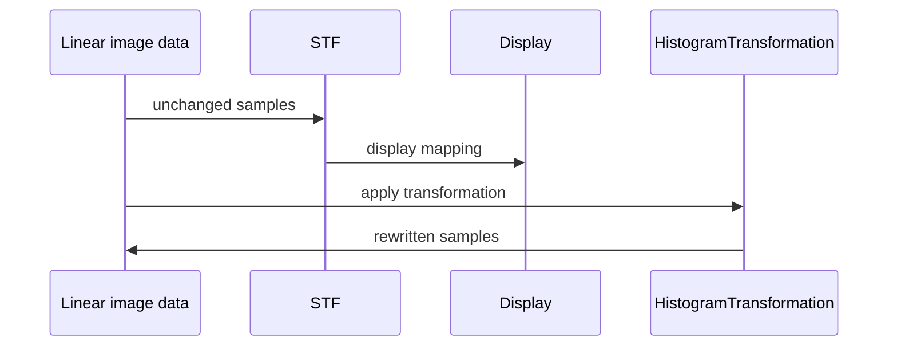
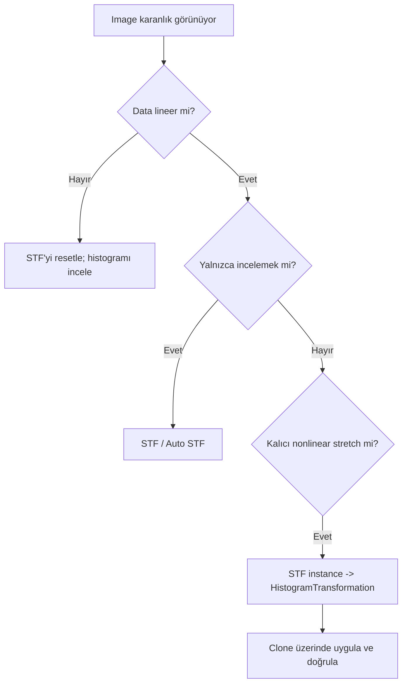

# ScreenTransferFunction (STF)

!!! info "Sayfa Bilgisi"
    **Kategori:** PixInsight Temelleri · **Düzey:** Beginner · **Tahmini okuma:** 5 dk
    **Anahtar kelimeler:** `STF` · `ScreenTransferFunction` · `Screen Transfer Function` · `PixInsight` · `arayüz` · `workflow`

**Durum: Tamamlandı — Faz 1A**

## Amaç

Lineer image data’yı değiştirmeden ekranda incelemek, kanalları görünür kılmak ve geçici bir görüntüleme stretch’i yönetmek.

## Kavramsal Açıklama

**ScreenTransferFunction image data’yı değiştirmez.** STF, seçili view’ın ekranda nasıl çizileceğini belirleyen bir screen transfer’dır. Kaydettiğiniz lineer XISF/FITS verisi, yalnızca STF açıldığı için nonlinear olmaz. STF kapatıldığında karanlık görünüm geri gelir; bu bir undo işlemi değildir, yalnızca görüntüleme aktarımının kaldırılmasıdır.

**HistogramTransformation ise image data’yı gerçekten değiştirir.** STF instance’ı HistogramTransformation’a aktarılıp HistogramTransformation image’a uygulandığında dönüşüm piksel örneklerine yazılır ve image nonlinear hale gelir.

| Özellik | ScreenTransferFunction | HistogramTransformation |
| --- | --- | --- |
| Etki katmanı | Ekran gösterimi | Image data |
| Piksel örneklerini değiştirir | Hayır | Evet |
| Lineerliği bozar | Hayır | Nonlinear stretch uygulanırsa evet |
| Kapatınca eski görünüm | Anında | Undo/önceki kopya gerekir |
| Dosyaya görünüm gibi “pişer” | Hayır | İşlenmiş image kaydedilirse evet |
| Tipik amaç | İnceleme, lineer süreç kontrolü | Kalıcı stretch |

## Matematiksel Arka Plan (gerekiyorsa)

STF, normalize edilmiş giriş (x) için shadows clipping (c_0), midtones balance (m) ve highlights clipping (c_1) içeren bir gösterim eşlemesi kullanır. Önce aralık normalleştirilir, ardından midtones transfer uygulanır. PixInsight’ın MTF’si ({0,0}), ({m,0.5}), ({1,1}) noktalarından geçen rasyonel bir interpolasyondur. (m=0.5) identity, (m<0.5) midtones parlaklaştırma, (m>0.5) karartmadır.

Auto STF, image statistics’inden bir görünüm üretir. Farklı image’lara ayrı Auto STF uygulamak, aynı screen mapping ile karşılaştırma yapmak değildir.

## Ne zaman kullanılır?

- Lineer master ve ara sonuçları görünür incelemek
- DBE/SPCC/noise reduction gibi lineer aşamaları izlemek
- Kanal yapısını ve clipping riskini ekranda değerlendirmek
- Kalıcı stretch öncesi başlangıç görünümü oluşturmak
- Birden çok view’a aynı screen transfer’ı uygulayarak adil görsel karşılaştırma yapmak

## Ne zaman kullanılmaz?

- Kalıcı nonlinear stretch gerektiğinde tek başına yeterli değildir.
- Farklı image’larda ayrı Auto STF sonuçlarını nicel parlaklık karşılaştırması olarak kullanmayın.
- STF görünümünü “işlenmiş sonuç” diye dışa aktarma beklentisiyle kullanmayın.
- Aşırı parlak STF altında noise veya clipping hakkında yalnız gözle kesin karar vermeyin.

## PixInsight Menü Yolu

`Process > IntensityTransformations > ScreenTransferFunction`

Bu process adı ve menü yolu PixInsight UI ekranında doğrudan okunmuştur. Aynı kanıt setinde STF penceresindeki `R`, `G`, `B` ve `L` kanal etiketleri de görünür durumdadır. Ayrıntılı kayıt repository içindeki `validation/ui/pi-1.9.3/screen-transfer-function/screen-transfer-function-evidence-matrix.md` dosyasındadır.

!!! warning "UI doğrulama sınırı"
    Mevcut görseller resetlenmiş bir instance, sayısal transfer değerleri, tooltip veya console çıktısı göstermiyor. Bu nedenle ekrandaki kontrol konumları fabrika varsayılanı olarak yorumlanmamalı; Auto STF hesabı ve process davranışı birincil kaynak veya kontrollü veri testiyle ayrıca doğrulanmalıdır.

STF işlevlerine ana toolbar üzerindeki screen transfer kontrollerinden de erişilebilir. Arayüz konumu platform yerleşimine göre değişebilir.

## Parametreler

| Parametre | Anlam | Kritik not |
| --- | --- | --- |
| Shadows clipping ((c_0)) | Gösterimde siyaha eşlenen alt sınır | Data’yı silmez; yalnız görünümü clip eder |
| Midtones balance ((m)) | Orta tonların display mapping’i | (0.5) identity |
| Highlights clipping ((c_1)) | Gösterimde beyaza eşlenen üst sınır | Varsayılan olarak üst uç korunur |
| RGB/K linkage | RGB kanallarını bağlı/ayrı ele alma | Renk dengesini görsel olarak etkiler |
| Auto stretch | Statistics tabanlı screen mapping | Image’a özgüdür; sabit referans değildir |

Kesin Auto STF hesap seçenekleri ve varsayılan target background değerleri kurulu 1.9.3 process documentation’ından doğrulanmalıdır; bu rehber evrensel bir sayısal değer önermiyor.

## Uygulama Adımları

1. Image’ın lineer olduğunu History Explorer ve işlem akışıyla doğrulayın.
2. ScreenTransferFunction’ı açın ve doğru view’ı aktif edin.
3. Auto STF uygulayın.
4. Shadows clipping işaretlerini kontrol edin; arka plan yapısının görsel olarak kaybolmadığını doğrulayın.
5. RGB image’da linked ve unlinked davranışın renk sunumuna etkisini bilinçli seçin.
6. STF’yi kapatıp image’ın yeniden karanlık göründüğünü doğrulayın.
7. Kalıcı stretch gerekiyorsa STF instance’ını [HistogramTransformation](histogram.md) kontrol çubuğuna aktarın.
8. HistogramTransformation uygulamasını önce clone üzerinde test edin.

## Beklenen Sonuç

Lineer data görünür olur; yıldızlar, gradient, noise ve zayıf sinyal incelenebilir. Image data ve lineerlik değişmeden kalır.

## Gerçek Kullanım Senaryosu

WBPP’den çıkan lineer luminance karanlıktır. Auto STF ile gradient görünür hale getirilir. DBE öncesi ve sonrası image’lara **aynı STF instance’ı** uygulanarak arka plan değişimi karşılaştırılır. Ayrı Auto STF kullanmak, her image’ı kendi statistics’ine göre yeniden ölçekleyip farkı gizleyebileceğinden tercih edilmez.

## Sık Yapılan Hatalar

1. STF’yi kalıcı stretch sanmak.
2. STF açık image’ı nonlinear işlemlere hazır kabul etmek.
3. Farklı image’ları farklı Auto STF’lerle karşılaştırmak.
4. RGB kanallarında linked/unlinked seçimini düşünmeden renk yorumu yapmak.
5. Aşırı shadows clipping ile zayıf arka plan yapısını görünmez kılmak.
6. STF instance’ını HT’ye aktardıktan sonra HT’yi uygulamayı unutmak.
7. STF kapatılınca işlemin kaybolduğunu sanmak.

## Sorun Giderme

| Belirti | Neden | Çözüm |
| --- | --- | --- |
| Image hâlâ karanlık | STF target’a uygulanmadı | Active view ve STF state’i kontrol edin |
| Renk çok dengesiz | Unlinked/linked seçimi | Amaca uygun linkage kullanın |
| Karşılaştırma yanıltıcı | Ayrı Auto STF | Aynı STF instance’ını iki view’a uygulayın |
| Kaydedilen dosya karanlık | Data lineer kaldı | Bu beklenen davranıştır; kalıcı stretch için HT gerekir |
| Arka plan kesilmiş görünüyor | Screen shadows clipping | (c_0)’ı kontrol edin; data’nın silinmediğini unutmayın |

## İleri Seviye Notlar

- STF instance’ı HistogramTransformation kontrol çubuğuna sürüklenerek parametreler içe aktarılabilir.
- RGB kanallarının STF değerleri aynıysa HT aktarımı RGB/K combined transformation’a; farklıysa kanal bazlı dönüşümlere karşılık gelebilir.
- Aynı STF ile karşılaştırma, process etkisini görsel olarak izole eder.
- Resmî referans: [ScreenTransferFunction documentation](https://pixinsight.com/doc/tools/ScreenTransferFunction/ScreenTransferFunction.html).

### Karar Ağacı

### SSS

??? question "STF image data’yı değiştirir mi?"
    Hayır. STF yalnızca ekrandaki gösterimi değiştirir.

??? question "STF uygulanmış lineer image kaydedilirse nonlinear olur mu?"
    Hayır. Kalıcı dönüşüm image data’ya uygulanmadıkça lineer örnekler korunur.

??? question "Auto STF bilimsel bir stretch standardı mıdır?"
    Hayır. Statistics tabanlı pratik bir görüntüleme başlangıcıdır.

??? question "STF neden iki image’ı farklı parlak gösteriyor?"
    Ayrı Auto STF’ler her image’ın statistics’ine göre farklı mapping üretebilir.

??? question "STF ayarını kalıcı stretch’e nasıl taşırım?"
    STF instance’ını HistogramTransformation kontrol çubuğuna aktarın ve HT’yi image’a uygulayın.

??? question "Linked STF her zaman doğru mudur?"
    Hayır. Amaç renk ilişkisini korumak veya kanalları ayrı görünür yapmak olabilir; seçim veriye ve değerlendirme amacına bağlıdır.

## Hızlı Referans

!!! tip "Quick Reference"
    **STF = display only.** Piksel data değişmez, image lineer kalır. Adil karşılaştırma için aynı STF instance’ını kullanın. Kalıcı stretch için parametreleri HistogramTransformation’a aktarın ve HT’yi hedefe uygulayın.

## Sonraki Bölüm

Yerel test, bağımsız karşılaştırma ve geri dönüş dalları için [Preview, Clone ve History Explorer](preview-clone-history.md) bölümüne geçin.

## Teknik Doğrulama Durumu

| Alan | Durum |
| --- | --- |
| Hedeflenen PixInsight Sürümü | 1.9.3 |
| Teknik İnceleme Durumu | Kısmen Doğrulandı |
| Resmî Kaynak Kontrolü | Kısmi |
| İş Akışı Tutarlılığı | Doğrulandı |
| Kanıt Düzeyi İncelemesi | Güncellendi |
| Son Teknik İnceleme | Phase 6.4 |

Canlı PixInsight uygulama testi yapılmadı. UI ekran kanıtı, statik ifade/iş akışı incelemesi ve yayımlanmış birincil kaynak kontrolü birbirinin yerine kullanılmamıştır.

## Önceki Bölüm

[← Workspace](workspace.md)
