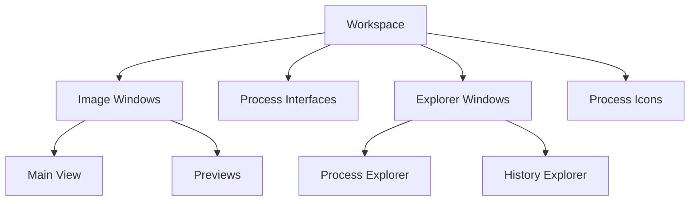
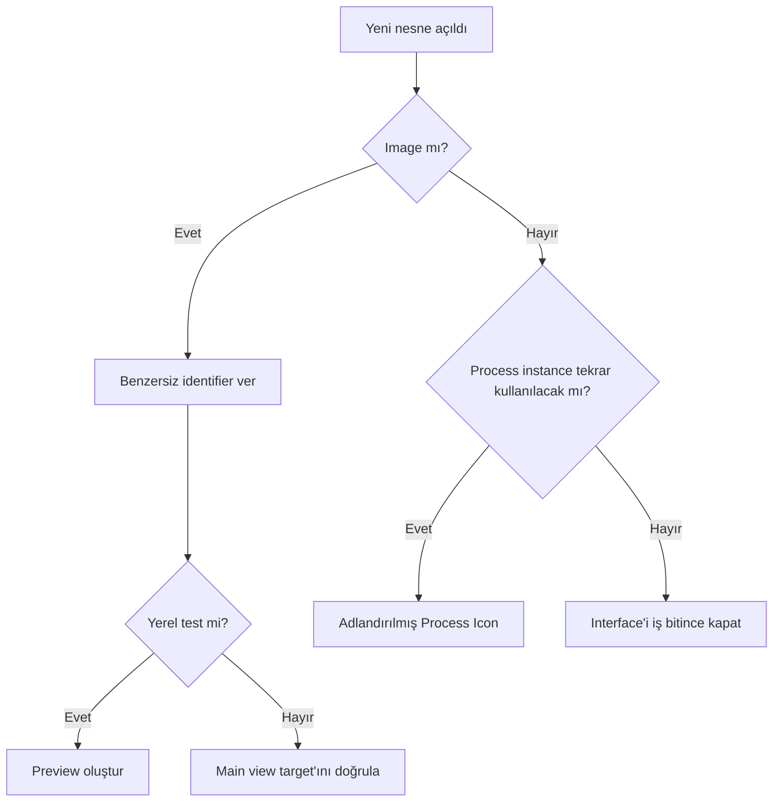

# Workspace

**Durum: Tamamlandı — Faz 1A**

## Amaç

PixInsight 1.9.3 workspace’ini; image windows, views, explorer windows, process interfaces ve process icons arasında hedef karışıklığını önleyecek profesyonel bir düzende kullanmak.

## Kavramsal Açıklama

Workspace, üzerinde çalışılan image data’nın kendisi değildir; nesnelerin yönetildiği masaüstüdür. Bir **image window** bir main view ve sıfır ya da daha fazla preview barındırabilir. **Active window** ile bir process interface’in **target view** seçimi her zaman aynı kabul edilmemelidir.

## Matematiksel Arka Plan (gerekiyorsa)

Workspace yönetimi matematiksel dönüşüm yapmaz. Ancak zoom ve screen transfer, örnek değerlerini değiştirmeden gösterimi etkiler. Bu nedenle görsel büyütme, STF ve gerçek resampling birbirinden ayrılmalıdır.

## Ne zaman kullanılır?

- Birden çok L/R/G/B/Ha image ile çalışırken
- Main view ve preview target’larını ayırırken
- Process Explorer ile process açarken
- History Explorer ile belirli view’ın geçmişini izlerken
- Çok ekranlı ya da yoğun process-icon düzeni kurarken

## Ne zaman kullanılmaz?

Workspace düzeni, dosya yedeği veya veri kalibrasyonu değildir. Düzen kaydetmek image sonuçlarını güvenli biçimde arşivlediğiniz anlamına gelmez.

## PixInsight Menü Yolu

- `View > Explorer Windows`: explorer pencerelerine erişim
- `Workspace`: workspace yönetimi
- `Window`: image/process window düzeni
- Image window üzerindeki view selector: main view ve previews

Kurulu platformda menü etiketleri yerleşik tooltip ve process documentation ile doğrulanmalıdır.

## Parametreler

| Öğe | Profesyonel kullanım |
| --- | --- |
| Image identifier | Kısa, benzersiz, kanal ve aşamayı belirten ad |
| Active view | İşlem uygulanmadan hemen önce kontrol |
| Zoom | Yapı ölçeğine uygun inceleme |
| Explorer selection | İncelenen image/view ile eşleştirme |
| Workspace layout | Akış yönünü yansıtan sade düzen |

## Uygulama Adımları

1. Image’ları kanal ve aşamaya göre yeniden adlandırın.
2. Aynı hedefe ait image windows’u birlikte düzenleyin.
3. Process Explorer ve History Explorer’ı görünür, fakat image alanını kapatmayacak konuma alın.
4. Lineer image’larda görünüm için STF kullanın.
5. Her process uygulamasından önce target view ve mask indicator’ı kontrol edin.
6. Geçici process interfaces ile yeniden kullanılacak Process Icons’ı görsel olarak ayırın.
7. Alternatif akışlar için ayrı workspace karmaşası yerine clones ve açık adlandırma kullanın.

## Beklenen Sonuç

Hangi image’ın, hangi view’ının, hangi process instance ve maskeyle işlendiği uygulamadan önce anlaşılır olur.

## Gerçek Kullanım Senaryosu

Bir LRGB setinde pencereler `M31_L_linear`, `M31_R_linear`, `M31_G_linear`, `M31_B_linear` olarak adlandırılır. Renk kanalları tek bölgede, luminance ayrı bölgede tutulur. DBE interface açıkken kullanıcı her uygulamadan önce target identifier’ı kontrol eder; karşılaştırmalar temsilî previews ile yapılır.

## Sık Yapılan Hatalar

1. Benzer isimli image windows arasında yanlış target’a uygulama yapmak.
2. Preview seçiliyken main view’ın işlendiğini sanmak.
3. Zoom ile resampling’i karıştırmak.
4. STF açık/kapalı image’ları data farkı varmış gibi karşılaştırmak.
5. Workspace düzenini proje veya yedek sanmak.
6. Çok sayıda isimsiz Process Icon biriktirmek.

## Sorun Giderme

| Belirti | Kontrol | Eylem |
| --- | --- | --- |
| İşlem yanlış image’a gitti | Active/target view | Undo edin, identifier’ları iyileştirin |
| Explorer görünmüyor | View menüsü | İlgili Explorer Window’u yeniden açın |
| Pencere ekran dışında | Window/workspace geometrisi | Arayüz geometrisini sıfırlama komutunu kullanın |
| Image’lar ayırt edilemiyor | Identifier | Kanal ve aşamaya göre yeniden adlandırın |
| Görünüm tutarsız | STF/zoom | Aynı screen transfer ve zoom ile karşılaştırın |

## İleri Seviye Notlar

- Workspace organizasyonu işlem sırasını anlatabilir, fakat bağımlılıkları zorunlu kılmaz.
- Çok ekranlı düzende process interface geometrileri taşınabilir; sürüm/platform davranışı için kurulu build’in `Window` komutlarını kullanın.
- Process Icon açıklamaları, hedef ve amaç notlarını saklamak için kullanılabilir.
- Bir project, workspace durumundan daha fazlasını saklayabilir; yine de harici yedek politikası gerekir.

### Karar Ağacı

### SSS

??? question "Active image ile target view aynı mıdır?"
    Çoğu etkileşimde ilişkili olabilir, ancak uygulama öncesinde target view açıkça doğrulanmalıdır.

??? question "Workspace image data’yı saklar mı?"
    Workspace bir çalışma ortamıdır. Kalıcı veri saklama için image/project dosyaları ve yedek gerekir.

??? question "Zoom piksel değerlerini değiştirir mi?"
    Hayır. Yalnızca gösterim ölçeğini değiştirir.

??? question "Preview neden image window altında görünür?"
    Çünkü preview aynı image’ın alt view’ıdır; bağımsız clone değildir.

??? question "Process Explorer ile Process Icon aynı şey mi?"
    Hayır. Explorer process’lere erişim sağlar; icon yapılandırılmış bir instance saklar.

## Hızlı Referans

!!! tip "Quick Reference"
    **Adlandır:** hedef_kanal_aşama · **Uygulamadan önce:** target + mask + lineerlik · **Yerel test:** Preview · **Bağımsız dal:** Clone · **Arayüz erişimi:** View/Process/Window

## Sonraki Bölüm

Workspace üzerinde lineer data’yı güvenle görünür kılmak için [ScreenTransferFunction](stf.md) bölümüne geçin.

## Önceki Bölüm

[← PixInsight Temelleri](index.md)
