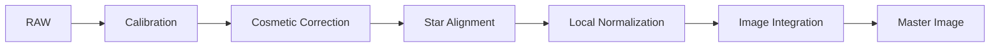
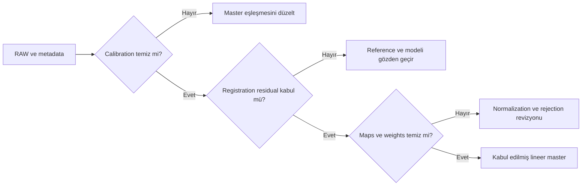
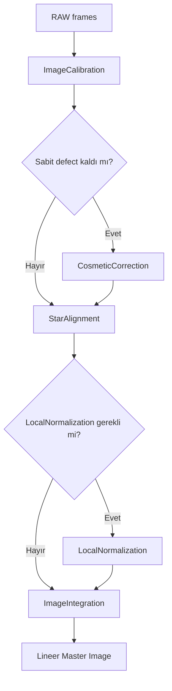

# Calibration Pipeline

!!! info "Sayfa Bilgisi"
    **Kategori:** Kalibrasyon · **Düzey:** Intermediate · **Tahmini okuma:** 3 dk
    **Anahtar kelimeler:** `Calibration Pipeline` · `calibration` · `kalibrasyon` · `linear processing`
    **Önerilen ön bilgiler:** [CMOS ve Monokrom Kamera](../01-temeller/cmos-ve-monokrom-kamera.md) · [SNR ve Dinamik Aralık](../01-temeller/snr-ve-dinamik-aralik.md)

**Durum: Tamamlandı — Faz 1B**

## Amaç

Ham frame’den lineer master image’a uzanan yaşam döngüsünü ana referans olarak açıklamak.

!!! note "Kapsam"
    PixInsight 1.9.3 hedeflenir; kurulu build’in process documentation ve console logu nihai doğrulama kaynağıdır.

## Teori

### Calibration Pipeline Nedir?

Calibration Pipeline; acquisition kaynaklı sistematik bileşenleri düzeltir, kusurları giderir, frame’leri ortak geometry’ye taşır ve istatistiksel olarak birleştirir.

### Lineer veri kavramı

Lineer data’da sinyal nonlinear stretch ile değiştirilmemiştir. ScreenTransferFunction yalnız display’i etkiler.

### Ham görüntünün yaşam döngüsü

| Aşama | Amaç | Girdi | Çıktı | Sonraki adım |
| --- | --- | --- | --- | --- |
| RAW | Ölçümü korumak | Light ve calibration frames | Gruplandırılmış data | Metadata calibration’ı belirler |
| Calibration | Bias, dark ve flat düzeltmesi | RAW + masters | Calibrated lights | Kusur kontrolü |
| Cosmetic Correction | Kalan defect’leri düzeltmek | Calibrated lights | Cosmetized lights | Star detection |
| Star Alignment | Ortak geometry | Cosmetized lights | Registered lights | Pixel stacks |
| Local Normalization | Frame uyumluluğu | Registered lights | Normalization data | Rejection |
| Image Integration | SNR ve outlier rejection | Registered stack | Master + maps | Post-processing |

!!! info "Lineer veri"
    Bu pipeline nonlinear stretch uygulamaz. Ara sonuçları görmek için ScreenTransferFunction kullanılır.

## Ne zaman kullanılır?

- Ham veya kalibre edilmiş frame setini ilgili pipeline aşamasında işlerken.
- Süreci yeniden üretilebilir parametreler ve loglarla yürütürken.
- Bir artefact’ın kök aşamasını ayırırken.

## Ne zaman kullanılmaz?

- Input metadata ve aşama durumu bilinmiyorsa.
- Nonlinear post-processing yerine kullanmak için.

!!! warning "Doğrulama sınırı"
    Kamera modeline veya script build’ine bağlı ayrıntılar test edilmeden genellenmez. Belirsiz ayrıntı: **Doğrulama bekliyor**.

!!! warning "Doğrulama durumu"
    Bu davranışların PixInsight 1.9.3 arayüzünde ve ilgili process veya script sürümünde doğrulanması gerekiyor.

### Teknik doğrulama sınıflandırması

| Sınıf | İfade grubu | İnceleme işlemi |
| --- | --- | --- |
| A | Registration ortak geometry oluşturur; pipeline lineer kalır. | Kalabilir. |
| B | LocalNormalization ve drizzle yardımcılarının 1.9.3 üretim davranışı. | Doğrulama bekliyor. |
| C | LN kullanım kararı ve reference seçimi. | Veri setine bağlıdır. |
| D | Normalization’ın rejection üzerindeki etkisi. | Birincil kaynak ve gerçek veri testi gerekir. |

## Menü yolu

Process arama alanında `Calibration`; WBPP için `Script > Batch Processing > WeightedBatchPreprocessing`. Kesin menü grubu kurulu 1.9.3 arayüzünden doğrulanmalıdır.

## Parametreler

| Parametre / kontrol | Açıklama |
| --- | --- |
| Input grouping | Frame type ve acquisition metadata |
| Reference policy | Registration ve normalization için kalite ölçütü |
| Auxiliary data | LocalNormalization ve drizzle dosyaları |
| Validation | Her aşamada sample QA ve log |

!!! tip "Parametre politikası"
    Evrensel preset yerine metadata, sample test, log ve maps birlikte değerlendirilir.

## Adım adım kullanım

1. RAW dosyaları değiştirmeden arşivleyin.
2. Metadata gruplarını belgeleyin.
3. Masters üretin veya doğrulayın.
4. ImageCalibration sample test yapın.
5. Kalan defect’leri düzeltin.
6. StarAlignment sonucu ve köşeleri inceleyin.
7. Gerekirse LocalNormalization üretin.
8. ImageIntegration ve rejection maps QA yapın.

## Gerçek kullanım senaryosu

!!! example "Saha örneği"
    Üç gecelik Ha seti matching masters ile calibrate edilir. Sabit defect’ler düzeltilir, tek kaliteli reference’a register edilir. Geceler arası arka plan farkı LN ile modellenir ve rejection maps temizse master kabul edilir.

## Aşama kapıları ve veri kabulü

Her aşama yalnız dosya ürettiği için değil, ölçülebilir kabul koşullarını sağladığı için tamamlanmış sayılır.

| Kapı | Ölçüm | Sonraki adıma geçmeme nedeni |
|---|---|---|
| Calibration | Köşe profili, glow, dust shadow, clipping | Master mismatch veya flat artefact |
| Cosmetic correction | Defect map ve blink | Gerçek sinyalin değiştirilmesi |
| Registration | Merkez/köşe residual ve valid area | Çift yıldız veya geometri hatası |
| Normalization | Reference uyumu ve lokal sapmalar | Gerçek diffuse signal'ın modellenmesi |
| Integration | Weights, low/high rejection maps | Satellite kalıntısı veya hedef reddi |

## Performans ve kayıt disiplini

Pipeline'ı küçük temsilî veri alt kümesiyle doğrulamak, yanlış master veya reference ile saatler süren yeniden çalıştırmayı önler. Process log'ları, master kimlikleri, reference dosyası, normalization ve drizzle yardımcıları final master ile aynı proje kaydında tutulmalıdır.

## Beklenen çıktı

Lineer Master Image, rejection maps, loglar ve seçime bağlı normalization/drizzle yardımcıları.

## Sık yapılan hatalar

1. RAW üzerine yazmak
2. Kalite kapılarını atlamak
3. Masters metadata’sını bilmemek
4. LocalNormalization’ı DBE sanmak
5. Drizzle data üretimini DrizzleIntegration sanmak

## Sorun giderme

| Belirti | İlk kontrol | Eylem |
| --- | --- | --- |
| Output beklenmedik | Input metadata ve target | İlk başarısız aşamayı sample frame ile tekrarlayın |
| Artefact tüm frame’lerde | Calibration/master zinciri | Eşleşmeleri ve logu inceleyin |
| Artefact yalnız master’da | Registration/normalization/rejection | Maps ve residual’ları inceleyin |
| Data clipped | Statistics ve pedestal | Önceki aşamaya dönün |
| İşlem başarısız | Console log | İlk hata mesajını çözün |

## SSS

??? question "RAW ne demek?"
    İşlenmemiş light ve calibration frame yaşam döngüsünü ifade eder.

??? question "CosmeticCorrection ne zaman?"
    Calibration sonrası kalan sabit defect’ler için.

??? question "LN gradient giderir mi?"
    Bir DBE işlemi değildir; integration uyumluluğu sağlar.

??? question "Registration rejection yapar mı?"
    Hayır.

??? question "Master neden karanlık?"
    Lineerdir; STF ile görüntülenir.

## Hızlı Referans

!!! tip "Tek sayfalık kontrol listesi"
    - [ ] Input metadata doğrulandı
    - [ ] Lineerlik korundu
    - [ ] Sample-frame QA geçti
    - [ ] Log incelendi
    - [ ] Yardımcı maps incelendi

## Karar Ağacı

## Ayrıca İnceleyin

- [Bölüm ana sayfası](index.md)
- [WBPP](wbpp.md)
- [ImageCalibration](image-calibration.md)
- [StarAlignment](star-alignment.md)
- [ImageIntegration](image-integration.md)

## İlgili Süreçler

- [WBPP](wbpp.md)
- [ImageCalibration](image-calibration.md)
- [CosmeticCorrection](cosmetic-correction.md)
- [StarAlignment](star-alignment.md)
- [ImageIntegration](image-integration.md)

## İlgili İş Akışları

- [Mono İş Akışı](../15-workflows/mono-workflow.md)
- [OSC İş Akışı](../15-workflows/osc-workflow.md)
- [Veri Kalitesi Stratejileri](../15-workflows/data-quality-strategies.md)

## Önceki Bölüm

[← Kalibrasyon](index.md)

## Sonraki Bölüm

[WBPP →](wbpp.md)
