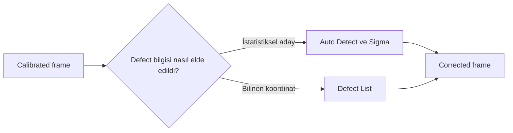
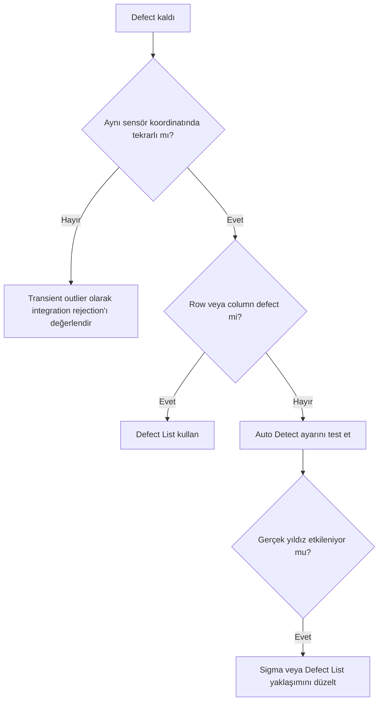

# CosmeticCorrection

!!! info "PixInsight 1.9.3 UI doğrulaması"
    Menü yolu ile görünür section ve kontrol adları supplied ekran görüntüleri üzerinden doğrulandı. Görünen değerler fabrika varsayılanı sayılmadı; davranış ve algoritma iddiaları bu statik UI kanıtının dışındadır. Ayrıntılı kayıt: `validation/ui/pi-1.9.3/cosmetic-correction/cosmetic-correction-evidence-matrix.md`.

**Durum: Tamamlandı — Faz 1B**

## Amaç

Calibration sonrası kalan hot pixel, cold pixel ve bilinen defect’leri gerçek sinyali bozmadan düzeltmek.

!!! note "Kapsam"
    PixInsight 1.9.3 hedeflenir; kurulu build’in process documentation ve console logu nihai doğrulama kaynağıdır.

## Teori

Hot pixel komşularına göre yüksek, cold pixel düşük yanıtlı sabit kusurdur. Auto Detect yerel dağılım ve sigma eşikleriyle aday bulur. Defect List doğrulanmış pixel, row ve column koordinatlarını açıkça tanımlar. Sigma için evrensel değer yoktur.

!!! info "Lineer veri"
    Bu pipeline nonlinear stretch uygulamaz. Ara sonuçları görmek için ScreenTransferFunction kullanılır.

## Ne zaman kullanılır?

- Ham veya kalibre edilmiş frame setini ilgili pipeline aşamasında işlerken.
- Süreci yeniden üretilebilir parametreler ve loglarla yürütürken.
- Bir artefact’ın kök aşamasını ayırırken.

## Ne zaman kullanılmaz?

- Input metadata ve aşama durumu bilinmiyorsa.
- Nonlinear post-processing yerine kullanmak için.

!!! warning "Doğrulama sınırı"
    Kamera modeline veya script build’ine bağlı ayrıntılar test edilmeden genellenmez. Belirsiz ayrıntı: **Doğrulama bekliyor**.

!!! warning "Doğrulama durumu"
    Bu davranışların PixInsight 1.9.3 arayüzünde ve ilgili process veya script sürümünde doğrulanması gerekiyor.

### Teknik doğrulama sınıflandırması

| Sınıf | İfade grubu | İnceleme işlemi |
| --- | --- | --- |
| A | Sabit hot/cold pixel ile transient outlier ayrımı. | Kalabilir. |
| B | Auto Detect, Sigma, Master Dark ve Defect List’in kesin 1.9.3 davranışı. | Doğrulama bekliyor. |
| C | Sigma seçimi. | Frame statistics ve gerçek defect örneğine bağlıdır. |
| D | Sigma yönü ve kullanılan detection/interpolation algoritması. | Birincil kaynak doğrulaması gerekir. |

## Menü yolu

Process arama alanında `CosmeticCorrection`; WBPP için `Script > Batch Processing > WeightedBatchPreprocessing`. Kesin menü grubu kurulu 1.9.3 arayüzünden doğrulanmalıdır.

## Parametreler

| Parametre / kontrol | Açıklama |
| --- | --- |
| Hot/Cold Auto Detect | İstatistiksel defect adayı |
| Sigma | Hassasiyet; sample test zorunlu |
| Defect List | Bilinen pixel/row/column |
| Master Dark | Uyumlu kusur tespit referansı |
| CFA | Mosaic yapı uyumu; 1.9.3 help ile doğrula |

!!! tip "Parametre politikası"
    Evrensel preset yerine metadata, sample test, log ve maps birlikte değerlendirilir.

## Adım adım kullanım

1. Calibrated frame’i STF ve %100 zoom ile inceleyin.
2. Defect’in birden çok frame’de aynı sensör koordinatında olduğunu doğrulayın.
3. Hot ve cold Auto Detect’i ayrı test edin.
4. Sigma’yı conservative seçin.
5. Bilinen line/column için Defect List kullanın.
6. Difference görüntüsüyle yıldız kaybını kontrol edin.
7. Batch’e uygulayın.

## Gerçek kullanım senaryosu

!!! example "Saha örneği"
    Aynı koordinatta kalan hot pixels üç frame’de doğrulanır. Conservative Auto Detect düzeltilir; bad column Defect List’e alınır. Difference view gerçek yıldızların korunmasını gösterir.

## Girdi gereksinimleri ve kusur sınıflandırması

CosmeticCorrection, calibration tamamlandıktan ve defect'in tekrarlanabilir olduğu gösterildikten sonra uygulanmalıdır. Aynı koordinatta birçok subframe'de görülen kusur sensör kaynaklı olabilir; tek frame'deki iz kozmik ışın, uydu veya başka geçici olay olabilir.

| Gözlem | Uygun araç | Gerekçe |
|---|---|---|
| Aynı koordinatta hot/cold pixel | CosmeticCorrection | Mekânsal olarak tekrarlanabilir kusur |
| Sabit kötü sütun/satır | Doğrulanmış `Defect List` | Sınırları açık ve denetlenebilir |
| Tek frame'de uydu izi | ImageIntegration rejection | Geniş geçici iz entegrasyonda değerlendirilir |
| Yönlü walking noise | Acquisition/calibration incelemesi | Tekil pixel onarımı kök nedeni çözmez |

## Eşik, çıktı ve performans

`Sigma` veya Auto Detect eşikleri için kamera-bağımsız bir doğru değer yoktur. Temsilî frame'de yakalanan gerçek kusur sayısı ile yanlış yakalanan yıldız çekirdeği/kompakt sinyal sayısı birlikte incelenmelidir. Corrected map ve blink, her eşik değişikliğinden sonra kontrol edilmelidir.

!!! tip "Az müdahale"
    En çok pixel'i değiştiren değil, doğrulanmış kusurları en az gerçek sinyal kaybıyla düzelten ayarı seçin.

Çıktıda persistent defect azalmalı; yıldız profilleri ve küçük ölçekli hedef sinyali yumuşamamalıdır. Büyük setlerde önce birkaç zayıf ve güçlü sinyalli frame üzerinde test yapın. `Defect List` kamera geometrisi değiştiğinde yeniden doğrulanmalıdır. Teknik davranış için PixInsight 1.9.3 içindeki process documentation esas alınmalıdır.

## Beklenen çıktı

Sabit yerel defect’leri azaltılmış lineer calibrated frames.

## Sık yapılan hatalar

1. Sigma’yı aşırı agresif yapmak
2. Yıldızı hot pixel sanmak
3. Cosmic ray’i Defect List’e almak
4. Dark calibration yerine kullanmak
5. Difference kontrolü yapmamak

## Sorun giderme

| Belirti | İlk kontrol | Eylem |
| --- | --- | --- |
| Output beklenmedik | Input metadata ve target | İlk başarısız aşamayı sample frame ile tekrarlayın |
| Artefact tüm frame’lerde | Calibration/master zinciri | Eşleşmeleri ve logu inceleyin |
| Artefact yalnız master’da | Registration/normalization/rejection | Maps ve residual’ları inceleyin |
| Data clipped | Statistics ve pedestal | Önceki aşamaya dönün |
| Process başarısız | Console log | İlk hata mesajını çözün |

## SSS

??? question "Hot pixel yıldızdan nasıl ayrılır?"
    Sensör koordinatında tekrar ve profil incelenir.

??? question "Sigma düşerse ne olur?"
    Genellikle detection agresifleşir; tooltip ile doğrulayın.

??? question "Defect List ne zaman?"
    Tekrarlı bilinen koordinatlarda.

??? question "Cosmic ray listeye girer mi?"
    Hayır, transient outlier’dır.

??? question "Lineerlik bozulur mu?"
    Nonlinear stretch uygulanmaz.

## Quick Reference

!!! tip "Tek sayfalık kontrol listesi"
    - [ ] Input metadata doğrulandı
    - [ ] Lineerlik korundu
    - [ ] Sample-frame QA geçti
    - [ ] Log incelendi
    - [ ] Yardımcı maps incelendi

## Decision Tree

## İlgili bölümler

- [Pipeline](calibration-pipeline.md)
- [ImageCalibration](image-calibration.md)
- [StarAlignment](star-alignment.md)
