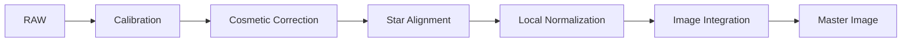

# ImageCalibration

**Durum: Tamamlandı — Faz 1B**

## Amaç

Master Bias, Master Dark ve Master Flat ile calibration’ı; dark scaling, pedestal, overscan, CFA ve Superbias sınırlarıyla açıklamak.

!!! note "Kapsam"
    PixInsight 1.9.3 hedeflenir; kurulu build’in process documentation ve console logu nihai doğrulama kaynağıdır.

## Teori

Basit modelde bias/dark bileşeni çıkarılır, flat-field yanıtı normalize edilerek bölünür. Aynı bias bileşenini iki kez çıkarmamak gerekir.\n\n| Öğe | Kullanım | Kullanılmama / risk | Avantaj | Dezavantaj |\n| --- | --- | --- | --- | --- |\n| Master Bias | Offset modeli ve uygun flat/dark zinciri | Tekrar bias çıkarımı | Çok frame ile düşük gürültü | CMOS pattern değişebilir |\n| Master Dark | Thermal signal, amp glow ve sabit dark yapı | Uyumsuz metadata | Sistematik dark düzeltir | Matching ister |\n| Master Flat | Pixel response, vignetting, dust | Değişmiş optical train | Alan yanıtını düzeltir | Doğru calibration ister |\n| Optimize Master Dark / Dark Scaling | Dark yapısı ölçeklenebiliyorsa | Amp glow gibi ölçeklenmeyen yapı | Exposure farkını modelleyebilir | Artefact riski |\n| Pedestal | Negatif/clipping riskini yönetmek | Siyah nokta aracı olarak | Sayısal pay | Background etkisi |\n| Overscan | Gerçek overscan region varsa | Crop edilmiş data | Frame bias ölçümü | Geometry şart |\n| CFA | Gerçek mosaic data | Mono/debayer edilmiş data | Pattern-aware | Yanlış pattern hatalı |\n| Superbias | Uygun bias yapısı doğrulanmışsa | Evrensel CMOS çözümü olarak | Model avantajı olabilir | Sensör testi gerekir |



!!! info "Lineer veri"
    Bu pipeline nonlinear stretch uygulamaz. Ara sonuçları görmek için ScreenTransferFunction kullanılır.

## Ne zaman kullanılır?

- Ham veya kalibre edilmiş frame setini ilgili pipeline aşamasında işlerken.
- Süreci yeniden üretilebilir parametreler ve loglarla yürütürken.
- Bir artefact’ın kök aşamasını ayırırken.

## Ne zaman kullanılmaz?

- Input metadata ve aşama durumu bilinmiyorsa.
- Nonlinear post-processing yerine kullanmak için.

!!! warning "Doğrulama sınırı"
    Kamera modeline veya script build’ine bağlı ayrıntılar test edilmeden genellenmez. Belirsiz ayrıntı: **Doğrulama bekliyor**.

## Menü yolu

Process arama alanında `ImageCalibration`; WBPP için `Script > Batch Processing > WeightedBatchPreprocessing`. Kesin menü grubu kurulu 1.9.3 arayüzünden doğrulanmalıdır.

## Parametreler

| Parametre / kontrol | Açıklama |
| --- | --- |
| Overscan | Doğrulanmış source/target geometry |
| Master Bias | Dosya ve calibration state |
| Master Dark | Calibrate, Optimize ve matching |
| Master Flat | Filter ve optical train eşleşmesi |
| Pedestal | Input/output policy |
| CFA | Doğru mosaic pattern |

!!! tip "Parametre politikası"
    Evrensel preset yerine metadata, sample test, log ve maps birlikte değerlendirilir.

## Adım adım kullanım

1. Metadata’yı karşılaştırın.
2. Masters üretim geçmişini doğrulayın.
3. Overscan geometry varsa test edin.
4. Double subtraction olmayacak zinciri kurun.
5. Dark scaling’i yalnız doğrulanmış modelle açın.
6. Tek light calibrate edin.
7. STF, Statistics ve log ile flat/dark/clipping QA yapın.
8. Sonra batch uygulayın.

## Gerçek kullanım senaryosu

!!! example "Saha örneği"
    Regulated mono CMOS setinde aynı gain/offset/binning/temperature/exposure Master Dark kullanılır. Amp glow nedeniyle Optimize kapalı test edilir. Her filter doğru calibrated Master Flat ile eşleştirilir.

## Beklenen çıktı

Bias/dark/flat sistematikleri düzeltilmiş lineer light frames.

## Sık yapılan hatalar

1. Bias’ı iki kez çıkarmak
2. Amp glow ile dark scaling kullanmak
3. Yanlış filter flat seçmek
4. Overscan koordinatı tahmin etmek
5. Yanlış CFA pattern kullanmak

## Sorun giderme

| Belirti | İlk kontrol | Eylem |
| --- | --- | --- |
| Output beklenmedik | Input metadata ve target | İlk başarısız aşamayı sample frame ile tekrarlayın |
| Artefact tüm frame’lerde | Calibration/master zinciri | Eşleşmeleri ve logu inceleyin |
| Artefact yalnız master’da | Registration/normalization/rejection | Maps ve residual’ları inceleyin |
| Data clipped | Statistics ve pedestal | Önceki aşamaya dönün |
| Process başarısız | Console log | İlk hata mesajını çözün |

## SSS

??? question "Bias her CMOS’ta gerekli mi?"
    Hayır; dark-flat stratejisine ve sensöre bağlıdır.

??? question "Dark Scaling nedir?"
    Master Dark katkısını ölçekleme modelidir.

??? question "Optimize amp glow ile güvenli mi?"
    Ölçeklenmeyen glow nedeniyle risklidir; matching dark test edilir.

??? question "Pedestal stretch mi?"
    Hayır.

??? question "Overscan her kamerada var mı?"
    Hayır.

??? question "Superbias her zaman iyi mi?"
    Hayır; sensörle doğrulanmalıdır.

## Quick Reference

!!! tip "Tek sayfalık kontrol listesi"
    - [ ] Input metadata doğrulandı
    - [ ] Lineerlik korundu
    - [ ] Sample-frame QA geçti
    - [ ] Log incelendi
    - [ ] Yardımcı maps incelendi

## Decision Tree

```mermaid
flowchart TD
 A[Calibration kötü] --> B{Flat izi mi?}\n B -- Evet --> C[Master Flat zinciri]\n B -- Hayır --> D{Amp glow mu?}\n D -- Evet --> E[Matching Dark ve Optimize kontrolü]\n D -- Hayır --> F{Clipping mi?}\n F -- Evet --> G[Pedestal ve double subtraction]
```

## İlgili bölümler

- [Pipeline](calibration-pipeline.md)
- [WBPP](wbpp.md)
- [CosmeticCorrection](cosmetic-correction.md)

