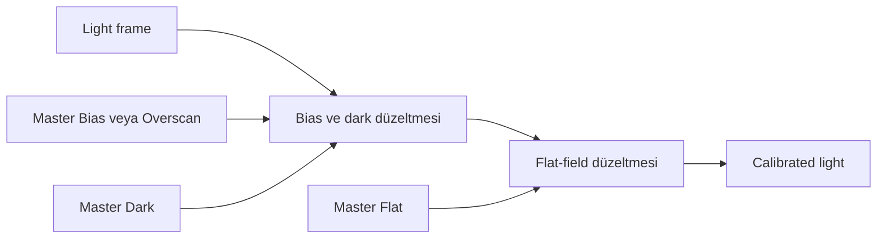
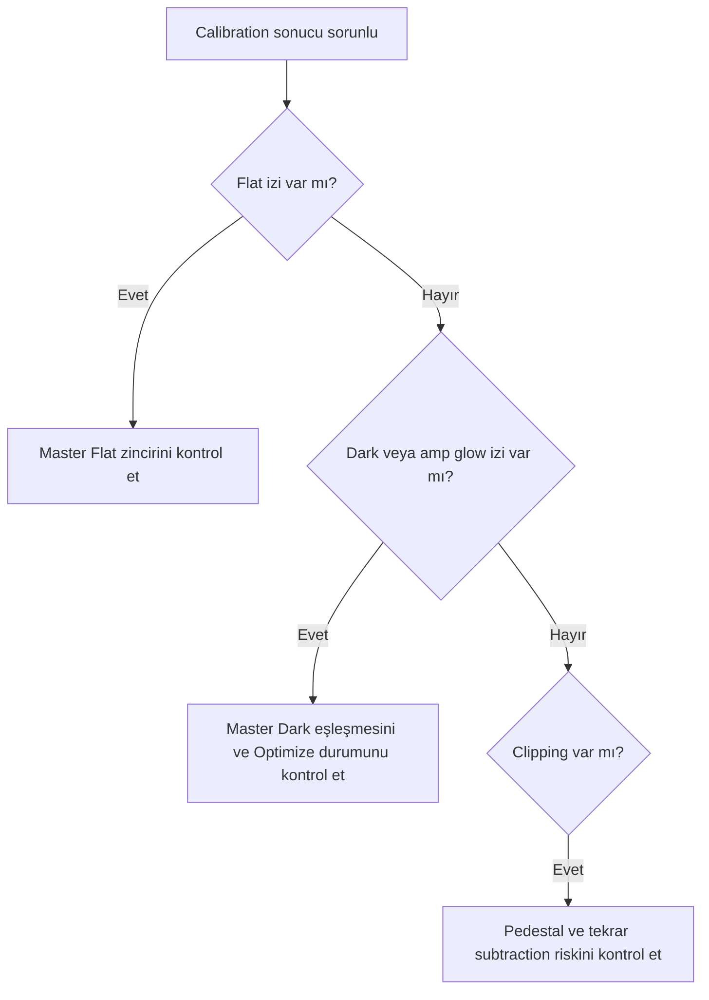

# ImageCalibration

!!! info "PixInsight 1.9.3 UI doğrulaması"
    Menü yolu ile görünür section ve kontrol adları supplied ekran görüntüleri üzerinden doğrulandı. Görünen değerler fabrika varsayılanı sayılmadı; davranış ve algoritma iddiaları bu statik UI kanıtının dışındadır. Ayrıntılı kayıt: `validation/ui/pi-1.9.3/image-calibration/image-calibration-evidence-matrix.md`.

**Durum: Tamamlandı — Faz 1B**

## Amaç

Master Bias, Master Dark ve Master Flat ile calibration’ı; dark scaling, pedestal, overscan, CFA ve Superbias sınırlarıyla açıklamak.

!!! note "Kapsam"
    PixInsight 1.9.3 hedeflenir; kurulu build’in process documentation ve console logu nihai doğrulama kaynağıdır.

## Teori

Basit modelde bias/dark bileşeni çıkarılır, flat-field yanıtı normalize edilerek bölünür. Aynı bias bileşenini iki kez çıkarmamak gerekir.

| Öğe | Kullanım | Kullanılmama / risk | Avantaj | Dezavantaj |
| --- | --- | --- | --- | --- |
| Master Bias | Offset modeli ve uygun flat/dark zinciri | Tekrar bias çıkarımı | Çok frame ile düşük gürültü | CMOS pattern değişebilir |
| Master Dark | Thermal signal, amp glow ve sabit dark yapı | Uyumsuz metadata | Sistematik dark düzeltir | Matching ister |
| Master Flat | Pixel response, vignetting, dust | Değişmiş optical train | Alan yanıtını düzeltir | Doğru calibration ister |
| Optimize Master Dark / Dark Scaling | Dark yapısı ölçeklenebiliyorsa | Amp glow gibi ölçeklenmeyen yapı | Exposure farkını modelleyebilir | Artefact riski |
| Pedestal | Negatif/clipping riskini yönetmek | Siyah nokta aracı olarak | Sayısal pay | Background etkisi |
| Overscan | Gerçek overscan region varsa | Crop edilmiş data | Frame bias ölçümü | Geometry şart |
| CFA | Gerçek mosaic data | Mono/debayer edilmiş data | Pattern-aware | Yanlış pattern hatalı |
| Superbias | Uygun bias yapısı doğrulanmışsa | Evrensel CMOS çözümü olarak | Model avantajı olabilir | Sensör testi gerekir |

!!! info "Lineer veri"
    Bu pipeline nonlinear stretch uygulamaz. Ara sonuçları görmek için ScreenTransferFunction kullanılır.

## Ne zaman kullanılır?

- Ham veya kalibre edilmiş frame setini ilgili pipeline aşamasında işlerken.
- Süreci yeniden üretilebilir parametreler ve loglarla yürütürken.
- Bir artefact’ın kök aşamasını ayırırken.

## Ne zaman kullanılmaz?

- Input metadata ve aşama durumu bilinmiyorsa.
- Nonlinear post-processing yerine kullanmak için.

!!! warning "Doğrulama sınırı"
    Kamera modeline veya script build’ine bağlı ayrıntılar test edilmeden genellenmez. Belirsiz ayrıntı: **Doğrulama bekliyor**.

!!! warning "Doğrulama durumu"
    Bu davranışların PixInsight 1.9.3 arayüzünde ve ilgili process veya script sürümünde doğrulanması gerekiyor.

### Teknik doğrulama sınıflandırması

| Sınıf | İfade grubu | İnceleme işlemi |
| --- | --- | --- |
| A | Dark ve flat frame’lerin sistematik sensör/optik bileşenleri modellemesi. | Kalabilir. |
| B | Calibrate, Optimize, Pedestal, Overscan ve CFA kontrollerinin kesin 1.9.3 davranışı. | Doğrulama bekliyor. |
| C | Gain, sıcaklık, exposure ve sensöre göre Master Dark/Flat seçimi. | Kamera ve veri setine bağlıdır. |
| D | Dark Scaling, Superbias ve calibration formülünün uygulama ayrıntıları. | Birincil kaynak ve ölçümlü test gerekir. |

## Menü yolu

Process arama alanında `ImageCalibration`; WBPP için `Script > Batch Processing > WeightedBatchPreprocessing`. Kesin menü grubu kurulu 1.9.3 arayüzünden doğrulanmalıdır.

## Parametreler

| Parametre / kontrol | Açıklama |
| --- | --- |
| Overscan | Doğrulanmış source/target geometry |
| Master Bias | Dosya ve calibration state |
| Master Dark | Calibrate, Optimize ve matching |
| Master Flat | Filter ve optical train eşleşmesi |
| Pedestal | Input/output policy |
| CFA | Doğru mosaic pattern |

!!! tip "Parametre politikası"
    Evrensel preset yerine metadata, sample test, log ve maps birlikte değerlendirilir.

## Adım adım kullanım

1. Metadata’yı karşılaştırın.
2. Masters üretim geçmişini doğrulayın.
3. Overscan geometry varsa test edin.
4. Double subtraction olmayacak zinciri kurun.
5. Dark scaling’i yalnız doğrulanmış modelle açın.
6. Tek light calibrate edin.
7. STF, Statistics ve log ile flat/dark/clipping QA yapın.
8. Sonra batch uygulayın.

## Gerçek kullanım senaryosu

!!! example "Saha örneği"
    Regulated mono CMOS setinde aynı gain/offset/binning/temperature/exposure Master Dark kullanılır. Amp glow nedeniyle Optimize kapalı test edilir. Her filter doğru calibrated Master Flat ile eşleştirilir.

## Girdi gereksinimleri ve master frame stratejisi

| Girdi | Eşleşmesi gereken özellikler | Kontrol |
|---|---|---|
| Light | Kamera modu, gain/offset, binning, geometri | Metadata ve dimensions |
| Master Dark | Sensör modu, sıcaklık ve mümkünse poz süresi | Glow ve residual karşılaştırması |
| Master Flat | Filtre, kamera açısı, fokus/optik tren ve geometri | Dust shadow ve köşe profili |
| Master Bias | Okuma modu, gain/offset, binning | Master istatistiği ve pattern incelemesi |

Flat optik throughput değişimini oranlar; dark sensör kaynaklı additive bileşenleri modellemeye çalışır. Bu görevleri birbirine devretmek, daha sonra background extraction ile gizlenmeye çalışılan yapısal hatalar üretir.

## Ayar kararları ve tipik değer yaklaşımı

Evrensel sayısal değer yoktur. `Pedestal`, dark optimization ve overscan histogramı estetik göstermek için değil, acquisition zincirindeki doğrulanmış bir koşulu karşılamak için etkinleştirilmelidir.

| Durum | Yaklaşım | Neden |
|---|---|---|
| Poz süresi eşleşen, glow içeren dark | Önce doğrudan eşleşmeyi test et | Scaling glow yapısını doğru ölçeklemeyebilir |
| Poz süresi eşleşmeyen dark | Optimize sonucunu örneklerle karşılaştır | İstatistiksel uyum fiziksel eşleşme değildir |
| Overscan bölgesi mevcut | Kamera geometrisi doğrulanmışsa kullan | Yanlış koordinat crop/model hatası üretir |
| Negatif veya clipped sonuç | Pedestal öncesi master ve offset zincirini denetle | Pedestal kök nedeni gizlememelidir |

## Çıktı kabul ölçütleri, performans ve kaynaklar

- Dust shadow ve vignetting azalmalı; yeni halka veya köşe terslenmesi oluşmamalıdır.
- Amp glow kalıntısı eşleşen dark'a göre beklenmedik yönde artmamalıdır.
- Kanal ve köşe istatistiklerinde clipping olmamalıdır.
- CFA veri, debayer öncesi doğru mosaic düzenini korumalıdır.
- Küçük bir light örneğini doğruladıktan sonra tüm seti çalıştırın.
- Birincil başvurular: [Master Calibration Frames](https://pixinsight.com/tutorials/master-frames/index.html) ve [Dark Calibration Tutorial](https://pixinsight.com/doc/docs/DC_tutorial/DC_tutorial.pdf).

## Beklenen çıktı

Bias/dark/flat sistematikleri düzeltilmiş lineer light frames.

## Sık yapılan hatalar

1. Bias’ı iki kez çıkarmak
2. Amp glow ile dark scaling kullanmak
3. Yanlış filter flat seçmek
4. Overscan koordinatı tahmin etmek
5. Yanlış CFA pattern kullanmak

## Sorun giderme

| Belirti | İlk kontrol | Eylem |
| --- | --- | --- |
| Output beklenmedik | Input metadata ve target | İlk başarısız aşamayı sample frame ile tekrarlayın |
| Artefact tüm frame’lerde | Calibration/master zinciri | Eşleşmeleri ve logu inceleyin |
| Artefact yalnız master’da | Registration/normalization/rejection | Maps ve residual’ları inceleyin |
| Data clipped | Statistics ve pedestal | Önceki aşamaya dönün |
| İşlem başarısız | Console log | İlk hata mesajını çözün |

## SSS

??? question "Bias her CMOS’ta gerekli mi?"
    Hayır; dark-flat stratejisine ve sensöre bağlıdır.

??? question "Dark Scaling nedir?"
    Master Dark katkısını ölçekleme modelidir.

??? question "Optimize amp glow ile güvenli mi?"
    Ölçeklenmeyen glow nedeniyle risklidir; matching dark test edilir.

??? question "Pedestal stretch mi?"
    Hayır.

??? question "Overscan her kamerada var mı?"
    Hayır.

??? question "Superbias her zaman iyi mi?"
    Hayır; sensörle doğrulanmalıdır.

## Hızlı Referans

!!! tip "Tek sayfalık kontrol listesi"
    - [ ] Input metadata doğrulandı
    - [ ] Lineerlik korundu
    - [ ] Sample-frame QA geçti
    - [ ] Log incelendi
    - [ ] Yardımcı maps incelendi

## Karar Ağacı

## Ayrıca İnceleyin

- [Pipeline](calibration-pipeline.md)
- [WBPP](wbpp.md)
- [CosmeticCorrection](cosmetic-correction.md)

## İlgili Süreçler

- [Calibration Pipeline](calibration-pipeline.md)
- [WBPP](wbpp.md)
- [CosmeticCorrection](cosmetic-correction.md)
- [StarAlignment](star-alignment.md)
- [ImageIntegration](image-integration.md)

## İlgili İş Akışları

- [Mono İş Akışı](../15-workflows/mono-workflow.md)
- [OSC İş Akışı](../15-workflows/osc-workflow.md)
- [Veri Kalitesi Stratejileri](../15-workflows/data-quality-strategies.md)

## Önceki Bölüm

[← WBPP](wbpp.md)

## Sonraki Bölüm

[CosmeticCorrection →](cosmetic-correction.md)
