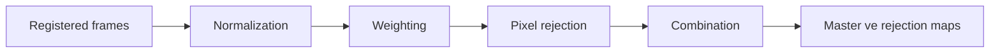
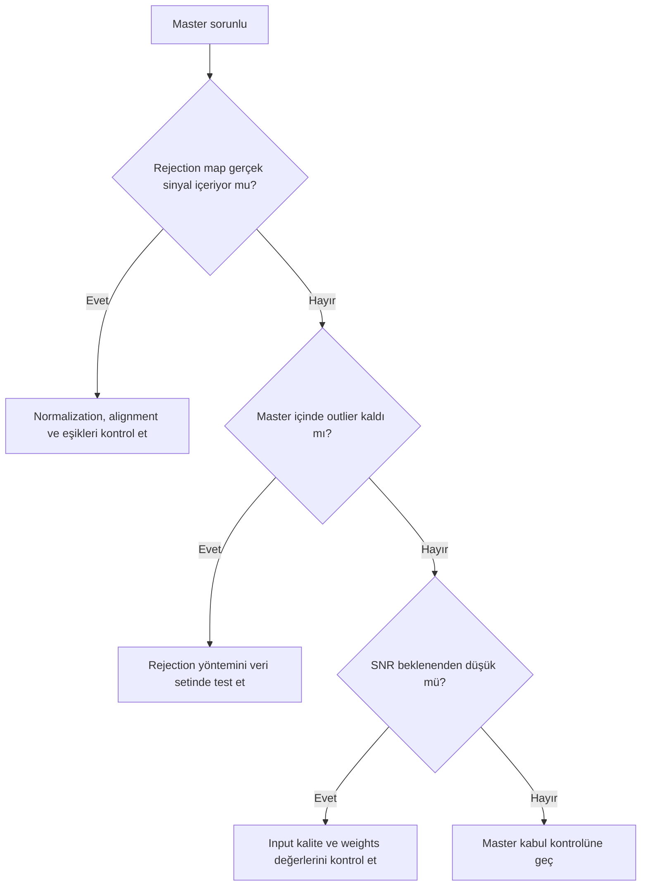

# ImageIntegration

**Durum: Tamamlandı — Faz 1B**

## Amaç

Registered frames’i combination, normalization, weighting ve pixel rejection ile lineer master’da birleştirmek.

!!! note "Kapsam"
    PixInsight 1.9.3 hedeflenir; kurulu build’in process documentation ve console logu nihai doğrulama kaynağıdır.

## Teori

Her output koordinatında pixel stack kurulur; normalization ve weights sonrası outlier rejection uygulanır.

| Yöntem | Rol | Sınır |
| --- | --- | --- |
| Average | Verimli birleşim | Outlier rejection gerekir |
| Median | Robust merkez | Average kadar SNR verimli değildir |
| Winsorized Sigma Clipping | Uç etkisini sınırlar ve sigma clipping yapar | Yeterli frame ve threshold QA |
| Linear Fit Clipping | Linear fit tabanlı rejection | Stack uygunluğu gerekir |
| ESD / Generalized ESD | Extreme outlier istatistik testi | 1.9.3 implementation help ile doğrulanmalı |
| Percentile Clipping | Sıralı uç yüzdeleri reddeder | Küçük sette veri kaybı |

!!! info "Lineer veri"
    Bu pipeline nonlinear stretch uygulamaz. Ara sonuçları görmek için ScreenTransferFunction kullanılır.

## Ne zaman kullanılır?

- Ham veya kalibre edilmiş frame setini ilgili pipeline aşamasında işlerken.
- Süreci yeniden üretilebilir parametreler ve loglarla yürütürken.
- Bir artefact’ın kök aşamasını ayırırken.

## Ne zaman kullanılmaz?

- Input metadata ve aşama durumu bilinmiyorsa.
- Nonlinear post-processing yerine kullanmak için.

!!! warning "Doğrulama sınırı"
    Kamera modeline veya script build’ine bağlı ayrıntılar test edilmeden genellenmez. Belirsiz ayrıntı: **Doğrulama bekliyor**.

!!! warning "Doğrulama durumu"
    Bu davranışların PixInsight 1.9.3 arayüzünde ve ilgili process veya script sürümünde doğrulanması gerekiyor.

### Teknik doğrulama sınıflandırması

| Sınıf | İfade grubu | İnceleme işlemi |
| --- | --- | --- |
| A | Integration register edilmiş pixel stack’leri birleştirir. | Kalabilir. |
| B | Algoritma adları, seçenekleri, varsayılanları ve output maps’in 1.9.3 davranışı. | Doğrulama bekliyor. |
| C | Frame sayısına göre rejection/weight seçimi. | Veri setine bağlıdır; kesin eşik verilmez. |
| D | Average–Median verim farkı ve rejection algoritmalarının istatistiksel davranışı. | Birincil kaynak ve kontrollü test gerekir. |

## Menü yolu

`Process > ImageIntegration > ImageIntegration`

Process adı ve bu menü yolu UI ekranında doğrudan okunmuştur. Ayrıntılı kayıt repository içindeki `validation/ui/pi-1.9.3/image-integration/image-integration-evidence-matrix.md` dosyasındadır. WBPP yolu bu UI kanıt setinin kapsamında değildir.

!!! warning "UI doğrulama sınırı"
    Mevcut görseller reset/new instance, tooltip, console veya ekran içi PixInsight sürümü göstermiyor. Seçimler default sayılmamalı; integration algoritmaları ve output davranışı ayrıca doğrulanmalıdır.

## Parametreler

| Parametre / kontrol | Açıklama |
| --- | --- |
| Combination | Average veya Median |
| Normalization | Calibration masters ve lights için farklı politika |
| Weighting | PSF/SNR/noise/keyword temelli |
| Rejection normalization | Stack uyumluluğu |
| Rejection algorithm | Frame sayısı ve dağılıma göre |
| Rejection Maps | Low/high audit |
| Weight Maps | Katkı denetimi; seçeneğe bağlı |
| Output files | Master, maps ve log |

UI kanıtı `Input Images`, `Format Hints`, `Image Integration`, `Pixel Rejection (1)`, `Pixel Rejection (2)`, `Large-Scale Pixel Rejection`, `Signal and Noise Evaluation` ve `Region of Interest` section başlıklarını doğrular. `Combination`, `PSF type`, `Noise estimator`, `Normalization`, `Rejection algorithm` ve `Weights` açık listelerindeki 40 görünür seçenek evidence matrix içinde tekil kaydedilmiştir; algoritmik anlamları statik ekran görüntülerinden çıkarılmamıştır.

!!! tip "Parametre politikası"
    Evrensel preset yerine metadata, sample test, log ve maps birlikte değerlendirilir.

## Adım adım kullanım

1. Inputs’ın register ve homojen olduğunu doğrulayın.
2. Combination ve normalization seçin.
3. Weights’i ölçümlerle doğrulayın.
4. Frame sayısına uygun rejection seçin.
5. Low/high maps üretin.
6. Test integration çalıştırın.
7. Maps’te gerçek sinyal reddini ve transient outlier’ları inceleyin.
8. Ayarlarla logu master yanında saklayın.

## Gerçek kullanım senaryosu

!!! example "Saha örneği"
    Otuz Ha frame Average ve ölçüm temelli weights ile birleştirilir. Winsorized Sigma Clipping high map’te uydu izlerini göstermeli, nebula filamentlerini sistematik reddetmemelidir.

## Girdi gereksinimleri ve Subframe quality

Geometrik registration entegrasyona kabul için tek başına yeterli değildir. Her frame; background, noise, FWHM, eccentricity, star count, clipping ve geçerli görüntü alanı açısından incelenmelidir. Sınır dışı bir frame'i çok düşük weight ile saklamak yerine aykırılığın nedeni anlaşılmalıdır.

## Normalization ve weighting karar matrisi

| Veri durumu | İncelenecek karar | Neden |
|---|---|---|
| Aynı gece, kararlı gökyüzü | Basit normalization yeterli mi? | Gereksiz karmaşıklığı önler |
| Çok geceli değişken background | Local normalization yararlı mı? | Büyük ölçekli seviye farklarını denetler |
| Çözünürlük öncelikli | FWHM/eccentricity ağırlığı | Kötü yıldız geometrisinin etkisini sınırlar |
| Zayıf sinyal öncelikli | SNR/noise temelli ağırlık | Daha temiz frame katkısını artırır |

Weighting frame katkısını, normalization karşılaştırılabilir ölçeği, rejection ise aykırı pixel örneklerini belirler. Birindeki hata diğerinin haritasında belirti verebilir.

## Rejection algoritmaları

| Yöntem | Güçlü yanı | Risk veya koşul |
|---|---|---|
| Average, rejection yok | Gürültü azaltımı verimlidir | Uydu, kozmik ışın ve defect kalır |
| Median | Aykırılara dayanıklıdır | Average kadar verimli olmayabilir |
| Winsorized Sigma Clipping | Yeterli frame sayısında robust yaklaşım | Gerçek yıldız çekirdeği reddedilebilir |
| Linear Fit Clipping | Frame ölçek farklarını ele alabilir | Fit kalitesi denetlenmelidir |
| ESD | Aykırı örnek tespitini istatistiksel ele alır | 1.9.3 ayrıntıları process docs ile doğrulanmalıdır |
| Percentile Clipping | Küçük kümelerde değerlendirilebilir | Dağılıma ve veri miktarına duyarlıdır |

Hiçbir yöntem her veri setinde en iyi değildir. Frame sayısı, aykırı türü ve rejection map sonucu kararı belirler.

## Satellite rejection, artifacts ve performans

Uydu izi için amaç tüm parlak çizgiyi maskelemek değil, ilgili pixel örneklerini reddetmektir. Rejection map'te iz görünürken master'da kalıntı olmaması beklenir. Yıldız çekirdekleri veya nebula liflerinin geniş alanlar halinde map'e girmesi aşırı rejection göstergesidir.

Walking noise için daha sert clipping öncesinde dither, calibration kalıntısı, frame sayısı ve normalization değerlendirilmelidir. Drizzle, maps ve normalization yardımcıları disk/bellek kullanımını artırır. Process log, weight tablosu ve maps master ile saklanmalıdır. Örnek iş akışı: [PixInsight M31 H-alpha](https://www.pixinsight.com/examples/M31-Ha/).

## Beklenen çıktı

Lineer integrated master; low/high rejection maps; seçime bağlı weight/slope/auxiliary maps ve log.

## Sık yapılan hatalar

1. Register edilmemiş lights kullanmak
2. Her veri türüne aynı normalization
3. Frame sayısını göz ardı etmek
4. Maps üretmemek
5. Gerçek sinyali aggressive reject etmek

## Sorun giderme

| Belirti | İlk kontrol | Eylem |
| --- | --- | --- |
| Output beklenmedik | Input metadata ve target | İlk başarısız aşamayı sample frame ile tekrarlayın |
| Artefact tüm frame’lerde | Calibration/master zinciri | Eşleşmeleri ve logu inceleyin |
| Artefact yalnız master’da | Registration/normalization/rejection | Maps ve residual’ları inceleyin |
| Data clipped | Statistics ve pedestal | Önceki aşamaya dönün |
| İşlem başarısız | Console log | İlk hata mesajını çözün |

## SSS

??? question "Average mı Median mı?"
    Amaç ve stack’e bağlıdır; Average uygun rejection ile verimlidir.

??? question "Winsorized ne yapar?"
    Uç örneklerin statistics etkisini sınırlar.

??? question "ESD nedir?"
    Generalized Extreme Studentized Deviate outlier test ailesidir.

??? question "Weighting kötü frame’i düzeltir mi?"
    Hayır.

??? question "Map’te yıldız normal mi?"
    Sistematik yıldız izi misregistration veya aşırı rejection gösterebilir.

??? question "Master neden lineer?"
    Integration stretch uygulamaz.

## Hızlı Referans

!!! tip "Tek sayfalık kontrol listesi"
    - [ ] Input metadata doğrulandı
    - [ ] Lineerlik korundu
    - [ ] Sample-frame QA geçti
    - [ ] Log incelendi
    - [ ] Yardımcı maps incelendi

## Karar Ağacı

## Ayrıca İnceleyin

- [Pipeline](calibration-pipeline.md)
- [WBPP](wbpp.md)
- [StarAlignment](star-alignment.md)
- [DBE](../04-gradient/dbe.md)

## İlgili Süreçler

- [Calibration Pipeline](calibration-pipeline.md)
- [WBPP](wbpp.md)
- [ImageCalibration](image-calibration.md)
- [CosmeticCorrection](cosmetic-correction.md)
- [StarAlignment](star-alignment.md)

## İlgili İş Akışları

- [Mono İş Akışı](../15-workflows/mono-workflow.md)
- [OSC İş Akışı](../15-workflows/osc-workflow.md)
- [Veri Kalitesi Stratejileri](../15-workflows/data-quality-strategies.md)

## Önceki Bölüm

[← StarAlignment](star-alignment.md)

## Sonraki Bölüm

[Gradient Bölümüne Giriş →](../04-gradient/index.md)
