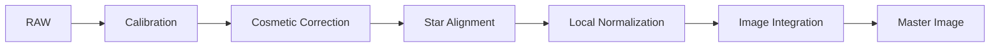

# ImageIntegration

**Durum: Tamamlandı — Faz 1B**

## Amaç

Registered frames’i combination, normalization, weighting ve pixel rejection ile lineer master’da birleştirmek.

!!! note "Kapsam"
    PixInsight 1.9.3 hedeflenir; kurulu build’in process documentation ve console logu nihai doğrulama kaynağıdır.

## Teori

Her output koordinatında pixel stack kurulur; normalization ve weights sonrası outlier rejection uygulanır.\n\n| Yöntem | Rol | Sınır |\n| --- | --- | --- |\n| Average | Verimli birleşim | Outlier rejection gerekir |\n| Median | Robust merkez | Average kadar SNR verimli değildir |\n| Winsorized Sigma Clipping | Uç etkisini sınırlar ve sigma clipping yapar | Yeterli frame ve threshold QA |\n| Linear Fit Clipping | Linear fit tabanlı rejection | Stack uygunluğu gerekir |\n| ESD / Generalized ESD | Extreme outlier istatistik testi | 1.9.3 implementation help ile doğrulanmalı |\n| Percentile Clipping | Sıralı uç yüzdeleri reddeder | Küçük sette veri kaybı |



!!! info "Lineer veri"
    Bu pipeline nonlinear stretch uygulamaz. Ara sonuçları görmek için ScreenTransferFunction kullanılır.

## Ne zaman kullanılır?

- Ham veya kalibre edilmiş frame setini ilgili pipeline aşamasında işlerken.
- Süreci yeniden üretilebilir parametreler ve loglarla yürütürken.
- Bir artefact’ın kök aşamasını ayırırken.

## Ne zaman kullanılmaz?

- Input metadata ve aşama durumu bilinmiyorsa.
- Nonlinear post-processing yerine kullanmak için.

!!! warning "Doğrulama sınırı"
    Kamera modeline veya script build’ine bağlı ayrıntılar test edilmeden genellenmez. Belirsiz ayrıntı: **Doğrulama bekliyor**.

## Menü yolu

Process arama alanında `ImageIntegration`; WBPP için `Script > Batch Processing > WeightedBatchPreprocessing`. Kesin menü grubu kurulu 1.9.3 arayüzünden doğrulanmalıdır.

## Parametreler

| Parametre / kontrol | Açıklama |
| --- | --- |
| Combination | Average veya Median |
| Normalization | Calibration masters ve lights için farklı politika |
| Weighting | PSF/SNR/noise/keyword temelli |
| Rejection normalization | Stack uyumluluğu |
| Rejection algorithm | Frame sayısı ve dağılıma göre |
| Rejection Maps | Low/high audit |
| Weight Maps | Katkı denetimi; seçeneğe bağlı |
| Output files | Master, maps ve log |

!!! tip "Parametre politikası"
    Evrensel preset yerine metadata, sample test, log ve maps birlikte değerlendirilir.

## Adım adım kullanım

1. Inputs’ın register ve homojen olduğunu doğrulayın.
2. Combination ve normalization seçin.
3. Weights’i ölçümlerle doğrulayın.
4. Frame sayısına uygun rejection seçin.
5. Low/high maps üretin.
6. Test integration çalıştırın.
7. Maps’te gerçek sinyal reddini ve transient outlier’ları inceleyin.
8. Ayarlarla logu master yanında saklayın.

## Gerçek kullanım senaryosu

!!! example "Saha örneği"
    Otuz Ha frame Average ve ölçüm temelli weights ile birleştirilir. Winsorized Sigma Clipping high map’te uydu izlerini göstermeli, nebula filamentlerini sistematik reddetmemelidir.

## Beklenen çıktı

Lineer integrated master; low/high rejection maps; seçime bağlı weight/slope/auxiliary maps ve log.

## Sık yapılan hatalar

1. Register edilmemiş lights kullanmak
2. Her veri türüne aynı normalization
3. Frame sayısını göz ardı etmek
4. Maps üretmemek
5. Gerçek sinyali aggressive reject etmek

## Sorun giderme

| Belirti | İlk kontrol | Eylem |
| --- | --- | --- |
| Output beklenmedik | Input metadata ve target | İlk başarısız aşamayı sample frame ile tekrarlayın |
| Artefact tüm frame’lerde | Calibration/master zinciri | Eşleşmeleri ve logu inceleyin |
| Artefact yalnız master’da | Registration/normalization/rejection | Maps ve residual’ları inceleyin |
| Data clipped | Statistics ve pedestal | Önceki aşamaya dönün |
| Process başarısız | Console log | İlk hata mesajını çözün |

## SSS

??? question "Average mı Median mı?"
    Amaç ve stack’e bağlıdır; Average uygun rejection ile verimlidir.

??? question "Winsorized ne yapar?"
    Uç örneklerin statistics etkisini sınırlar.

??? question "ESD nedir?"
    Generalized Extreme Studentized Deviate outlier test ailesidir.

??? question "Weighting kötü frame’i düzeltir mi?"
    Hayır.

??? question "Map’te yıldız normal mi?"
    Sistematik yıldız izi misregistration veya aşırı rejection gösterebilir.

??? question "Master neden lineer?"
    Integration stretch uygulamaz.

## Quick Reference

!!! tip "Tek sayfalık kontrol listesi"
    - [ ] Input metadata doğrulandı
    - [ ] Lineerlik korundu
    - [ ] Sample-frame QA geçti
    - [ ] Log incelendi
    - [ ] Yardımcı maps incelendi

## Decision Tree

```mermaid
flowchart TD
 A[Master kötü] --> B{Map gerçek sinyal içeriyor mu?}\n B -- Evet --> C[Normalization, alignment ve thresholds]\n B -- Hayır --> D{Outlier kaldı mı?}\n D -- Evet --> E[Rejection algoritmasını test et]\n D -- Hayır --> F{SNR düşük mü?}\n F -- Evet --> G[Inputs ve weights]\n F -- Hayır --> H[Master kabul]
```

## İlgili bölümler

- [Pipeline](calibration-pipeline.md)
- [WBPP](wbpp.md)
- [StarAlignment](star-alignment.md)
- [DBE](../04-gradient/dbe.md)

