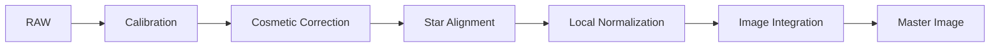

# Image Calibration Pipeline

**Durum: Tamamlandı — Faz 1B**

## Amaç

Kalibrasyon bölümünün kapsamını, işlem sırasını ve kalite kapılarını tanımlamak.

!!! note "Kapsam"
    PixInsight 1.9.3 hedeflenir; kurulu build’in process documentation ve console logu nihai doğrulama kaynağıdır.

## Teori

Image calibration, sensör ve optik sistemin ölçüme eklediği tekrar üretilebilir bileşenleri düzeltir. Calibration, registration ve integration ayrı problemlerdir. Sistematik bir calibration hatası daha çok light frame integrate edilerek giderilemez.



!!! info "Lineer veri"
    Bu pipeline nonlinear stretch uygulamaz. Ara sonuçları görmek için ScreenTransferFunction kullanılır.

## Ne zaman kullanılır?

- Ham veya kalibre edilmiş frame setini ilgili pipeline aşamasında işlerken.
- Süreci yeniden üretilebilir parametreler ve loglarla yürütürken.
- Bir artefact’ın kök aşamasını ayırırken.

## Ne zaman kullanılmaz?

- Input metadata ve aşama durumu bilinmiyorsa.
- Nonlinear post-processing yerine kullanmak için.

!!! warning "Doğrulama sınırı"
    Kamera modeline veya script build’ine bağlı ayrıntılar test edilmeden genellenmez. Belirsiz ayrıntı: **Doğrulama bekliyor**.

## Menü yolu

Process arama alanında `Image`; WBPP için `Script > Batch Processing > WeightedBatchPreprocessing`. Kesin menü grubu kurulu 1.9.3 arayüzünden doğrulanmalıdır.

## Parametreler

| Parametre / kontrol | Açıklama |
| --- | --- |
| Frame groups | Bias, Dark, Flat ve Light; filter, exposure, binning, gain/offset, sıcaklık |
| Linearity | Tüm pipeline boyunca korunur |
| References | Registration ve LocalNormalization amaçlarına göre seçilir |
| Audit outputs | Log, rejection maps ve yardımcı ölçüm dosyaları |

!!! tip "Parametre politikası"
    Evrensel preset yerine metadata, sample test, log ve maps birlikte değerlendirilir.

## Adım adım kullanım

1. Frame metadata gruplarını doğrulayın.
2. Calibration masters eşleşmelerini kontrol edin.
3. Az sayıda light üzerinde calibration QA yapın.
4. Kalan sabit kusurları CosmeticCorrection ile değerlendirin.
5. StarAlignment ile ortak geometry oluşturun.
6. Gerekliyse LocalNormalization uygulayın.
7. ImageIntegration maps ve loglarını denetleyin.

## Gerçek kullanım senaryosu

!!! example "Saha örneği"
    LRGB setinde her filter doğru Master Flat ile eşleştirilir; matching Master Dark kullanılır. Her kanal ayrı register ve integrate edilir. Master kabulünden önce calibrated örnekler ve rejection maps incelenir.

## Beklenen çıktı

Her kanal için doğrulanmış lineer master image ve denetim çıktıları.

## Sık yapılan hatalar

1. Yanlış master eşleştirmek
2. STF görünümünü data değişimi sanmak
3. Registration öncesi stretch yapmak
4. Rejection maps’i incelememek
5. WBPP’yi kara kutu saymak

## Sorun giderme

| Belirti | İlk kontrol | Eylem |
| --- | --- | --- |
| Output beklenmedik | Input metadata ve target | İlk başarısız aşamayı sample frame ile tekrarlayın |
| Artefact tüm frame’lerde | Calibration/master zinciri | Eşleşmeleri ve logu inceleyin |
| Artefact yalnız master’da | Registration/normalization/rejection | Maps ve residual’ları inceleyin |
| Data clipped | Statistics ve pedestal | Önceki aşamaya dönün |
| Process başarısız | Console log | İlk hata mesajını çözün |

## SSS

??? question "Pipeline lineer mi kalır?"
    Evet; nonlinear stretch bu pipeline’ın parçası değildir.

??? question "LocalNormalization zorunlu mu?"
    Hayır; veri setine göre değerlendirilir.

??? question "CosmeticCorrection dark yerine geçer mi?"
    Hayır.

??? question "WBPP manuel yapılabilir mi?"
    Evet, aynı core process’lerle.

??? question "Master tek başına yeterli QA mı?"
    Hayır; maps, log ve ara frame’ler gerekir.

## Quick Reference

!!! tip "Tek sayfalık kontrol listesi"
    - [ ] Input metadata doğrulandı
    - [ ] Lineerlik korundu
    - [ ] Sample-frame QA geçti
    - [ ] Log incelendi
    - [ ] Yardımcı maps incelendi

## Decision Tree

```mermaid
flowchart TD
 A[Master sorunlu] --> B{Tek frame'lerde de var mı?}\n B -- Evet --> C[Calibration veya CosmeticCorrection]\n B -- Hayır --> D{Rejection map temiz mi?}\n D -- Hayır --> E[ImageIntegration ayarlarına dön]\n D -- Evet --> F[LocalNormalization ve gradient kontrolü]
```

## İlgili bölümler

- [Ana referans](calibration-pipeline.md)
- [WBPP](wbpp.md)
- [ImageCalibration](image-calibration.md)
- [CosmeticCorrection](cosmetic-correction.md)
- [StarAlignment](star-alignment.md)
- [ImageIntegration](image-integration.md)

