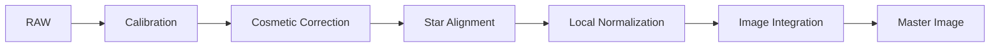

# StarAlignment

**Durum: Tamamlandı — Faz 1B**

## Amaç

Frame’leri ortak geometry’ye register etmek; reference, interpolation, distortion, drizzle data ve rejection ilişkisini açıklamak.

!!! note "Kapsam"
    PixInsight 1.9.3 hedeflenir; kurulu build’in process documentation ve console logu nihai doğrulama kaynağıdır.

## Teori

Registration, target ve reference yıldızlarını eşleştirir, geometrik model çözer ve target’ı reference grid’ine interpolation ile resample eder. Pixel rejection yapmaz; rejection ImageIntegration aşamasındadır. Generate drizzle data sonraki DrizzleIntegration için yardımcı veri üretir, drizzle sonucu üretmez. Distortion Correction farklı optikler ve wide-field mosaic gibi differential distortion vakalarında kullanılır; gereksiz açılması kalite garantisi değildir.



!!! info "Lineer veri"
    Bu pipeline nonlinear stretch uygulamaz. Ara sonuçları görmek için ScreenTransferFunction kullanılır.

## Ne zaman kullanılır?

- Ham veya kalibre edilmiş frame setini ilgili pipeline aşamasında işlerken.
- Süreci yeniden üretilebilir parametreler ve loglarla yürütürken.
- Bir artefact’ın kök aşamasını ayırırken.

## Ne zaman kullanılmaz?

- Input metadata ve aşama durumu bilinmiyorsa.
- Nonlinear post-processing yerine kullanmak için.

!!! warning "Doğrulama sınırı"
    Kamera modeline veya script build’ine bağlı ayrıntılar test edilmeden genellenmez. Belirsiz ayrıntı: **Doğrulama bekliyor**.

## Menü yolu

Process arama alanında `StarAlignment`; WBPP için `Script > Batch Processing > WeightedBatchPreprocessing`. Kesin menü grubu kurulu 1.9.3 arayüzünden doğrulanmalıdır.

## Parametreler

| Parametre / kontrol | Açıklama |
| --- | --- |
| Reference Image | İyi yıldız profili, SNR ve framing |
| Registration model | Geometry’ye uygun model |
| Interpolation | Resampling ve ringing dengesi |
| Distortion Correction | Yalnız differential distortion gerekçesiyle |
| Generate drizzle data | Planlanan DrizzleIntegration için |
| Star detection | Düşük SNR’de kontrollü ayar |

!!! tip "Parametre politikası"
    Evrensel preset yerine metadata, sample test, log ve maps birlikte değerlendirilir.

## Adım adım kullanım

1. Frames’i kalite ölçümleriyle inceleyin.
2. Reference’ı yıldız kalitesi ve framing ile seçin.
3. Az target üzerinde varsayılan model test edin.
4. Distortion’ı yalnız residual gerekçesiyle açın.
5. Drizzle planı varsa data üretin.
6. Registered/reference difference ve köşeleri inceleyin.
7. Başarısız logları ayırın.

## Gerçek kullanım senaryosu

!!! example "Saha örneği"
    Aynı teleskopla dithered dar alan mono setinde iyi yıldız profilli reference seçilir. Distortion kapalı test edilir. Difference residual temizse batch çalıştırılır; drizzle planlanıyorsa yardımcı dosyalar korunur.

## Beklenen çıktı

Reference geometry’sine resample edilmiş lineer frames ve isteğe bağlı drizzle data.

## Sık yapılan hatalar

1. En parlak frame’i otomatik reference seçmek
2. Registration’ı rejection sanmak
3. Distortion’ı her zaman açmak
4. Interpolation ringing’ini sinyal sanmak
5. Drizzle data’yı final drizzle sanmak

## Sorun giderme

| Belirti | İlk kontrol | Eylem |
| --- | --- | --- |
| Output beklenmedik | Input metadata ve target | İlk başarısız aşamayı sample frame ile tekrarlayın |
| Artefact tüm frame’lerde | Calibration/master zinciri | Eşleşmeleri ve logu inceleyin |
| Artefact yalnız master’da | Registration/normalization/rejection | Maps ve residual’ları inceleyin |
| Data clipped | Statistics ve pedestal | Önceki aşamaya dönün |
| Process başarısız | Console log | İlk hata mesajını çözün |

## SSS

??? question "Reference nasıl seçilir?"
    SNR, yıldız profili, artefact ve framing birlikte.

??? question "Registration SNR artırır mı?"
    Hayır.

??? question "Generate drizzle data image üretir mi?"
    Hayır.

??? question "Distortion her zaman iyi mi?"
    Hayır.

??? question "Interpolation data’yı değiştirir mi?"
    Resampling yeni grid örnekleri hesaplar ama stretch değildir.

??? question "Rejection ne zaman?"
    ImageIntegration sırasında.

## Quick Reference

!!! tip "Tek sayfalık kontrol listesi"
    - [ ] Input metadata doğrulandı
    - [ ] Lineerlik korundu
    - [ ] Sample-frame QA geçti
    - [ ] Log incelendi
    - [ ] Yardımcı maps incelendi

## Decision Tree

```mermaid
flowchart TD
 A[Registration kötü] --> B{Yıldız eşleşmesi var mı?}\n B -- Hayır --> C[Reference ve detection]\n B -- Evet --> D{Köşe residual sistematik mi?}\n D -- Evet --> E{Farklı optik veya mosaic mi?}\n E -- Evet --> F[Distortion Correction test]\n E -- Hayır --> G[Model/interpolation kontrolü]
```

## İlgili bölümler

- [Pipeline](calibration-pipeline.md)
- [CosmeticCorrection](cosmetic-correction.md)
- [ImageIntegration](image-integration.md)

