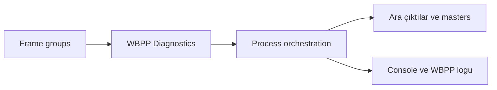
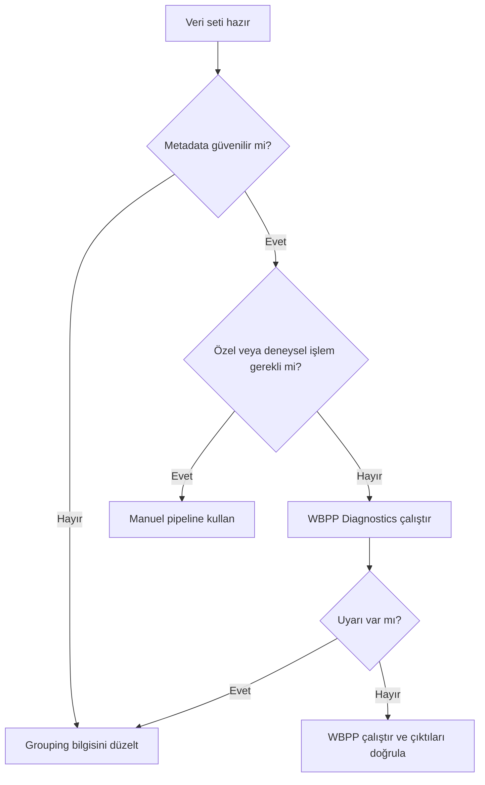

# WeightedBatchPreprocessing (WBPP)

**Durum: Tamamlandı — Faz 1B**

## Amaç

WBPP’nin avantajlarını, sınırlarını, arka planda orkestre ettiği process’leri ve manuel alternatifini açıklamak.

!!! note "Kapsam"
    PixInsight 1.9.3 hedeflenir; kurulu build’in process documentation ve console logu nihai doğrulama kaynağıdır.

## Teori

WBPP bir batch script’tir; calibration algoritmasının kendisi değildir. Seçeneklere göre ImageIntegration ile masters üretir; ImageCalibration, CosmeticCorrection, Debayer (CFA), ölçüm/weighting, StarAlignment, LocalNormalization ve ImageIntegration gibi bileşenleri orkestre edebilir. Kesin çağrı listesi kurulu 1.9.3 WBPP build’inin logundan doğrulanmalıdır. Avantajları grouping, Diagnostics, caching, standart output ve loglamadır. Sınırı, veri setine özgü kararların kullanıcı sorumluluğunda kalmasıdır.

!!! info "Lineer veri"
    Bu pipeline nonlinear stretch uygulamaz. Ara sonuçları görmek için ScreenTransferFunction kullanılır.

## Ne zaman kullanılır?

- Ham veya kalibre edilmiş frame setini ilgili pipeline aşamasında işlerken.
- Süreci yeniden üretilebilir parametreler ve loglarla yürütürken.
- Bir artefact’ın kök aşamasını ayırırken.

## Ne zaman kullanılmaz?

- Input metadata ve aşama durumu bilinmiyorsa.
- Nonlinear post-processing yerine kullanmak için.

!!! warning "Doğrulama sınırı"
    Kamera modeline veya script build’ine bağlı ayrıntılar test edilmeden genellenmez. Belirsiz ayrıntı: **Doğrulama bekliyor**.

+!!! warning "Doğrulama durumu"
    Bu davranışların PixInsight 1.9.3 arayüzünde ve ilgili process veya script sürümünde doğrulanması gerekiyor.

### Teknik doğrulama sınıflandırması

| Sınıf | İfade grubu | İnceleme işlemi |
| --- | --- | --- |
| A | WBPP bir batch orchestration script’idir. | Kalabilir. |
| B | WBPP build’i, çağrı sırası, Diagnostics, caching ve output yapısı. | Doğrulama bekliyor. |
| C | Belirli veri setinde WBPP veya manuel seçim. | İş akışına bağlıdır. |
| D | WBPP ile manuel akışın eşdeğerliği. | Aynı process instance’larıyla test edilmelidir. |

## Menü yolu

Process arama alanında `WeightedBatchPreprocessing`; WBPP için `Script > Batch Processing > WeightedBatchPreprocessing`. Kesin menü grubu kurulu 1.9.3 arayüzünden doğrulanmalıdır.

## Parametreler

| Parametre / kontrol | Açıklama |
| --- | --- |
| Frames | Metadata tabanlı gruplar |
| Calibration | Masters, overscan ve dark seçenekleri |
| Registration | Reference, interpolation, distortion ve drizzle data |
| Local Normalization | Etkinlik ve reference |
| Integration | Combination, weights, normalization, rejection ve maps |

!!! tip "Parametre politikası"
    Evrensel preset yerine metadata, sample test, log ve maps birlikte değerlendirilir.

## Adım adım kullanım

1. PixInsight ve WBPP build’ini kaydedin.
2. Frame’leri ekleyip grouping tablosunu inceleyin.
3. Diagnostics uyarılarını çözün.
4. Master eşleşmelerini doğrulayın.
5. Registration/LN/integration seçeneklerini gerekçelendirin.
6. Önce küçük bir group test edin.
7. Log, ara output ve rejection maps’i inceleyin.

## Gerçek kullanım senaryosu

!!! example "Saha örneği"
    Dört gecelik LRGB setinde WBPP, farklı binning taşıyan bir Green flat grubunu Diagnostics’te gösterir. Grup düzeltilmeden pipeline çalıştırılmaz. Finalde yalnız masters değil registered samples ve maps incelenir.

## Beklenen çıktı

Seçime bağlı masters, calibrated/registered frames, normalization/drizzle yardımcıları, integrated masters ve log.

## Sık yapılan hatalar

1. Diagnostics’i yok saymak
2. Grouping’i otomatik doğru sanmak
3. WBPP’yi tek process sanmak
4. Cache davranışını kontrol etmemek
5. Yalnız final master’a bakmak

## Sorun giderme

| Belirti | İlk kontrol | Eylem |
| --- | --- | --- |
| Output beklenmedik | Input metadata ve target | İlk başarısız aşamayı sample frame ile tekrarlayın |
| Artefact tüm frame’lerde | Calibration/master zinciri | Eşleşmeleri ve logu inceleyin |
| Artefact yalnız master’da | Registration/normalization/rejection | Maps ve residual’ları inceleyin |
| Data clipped | Statistics ve pedestal | Önceki aşamaya dönün |
| Process başarısız | Console log | İlk hata mesajını çözün |

## SSS

??? question "WBPP algoritma mı?"
    Hayır, process’leri çağıran script’tir.

??? question "Manuel daha kaliteli mi?"
    Kendiliğinden değil.

??? question "Hangi process’leri çağırır?"
    Seçeneklere göre değişir; logdan doğrulayın.

??? question "Manuel yapılabilir mi?"
    Evet, core process’lerle.

??? question "Ne zaman manuel?"
    Özel calibration, hata izolasyonu veya kontrollü deney gerektiğinde.

## Quick Reference

!!! tip "Tek sayfalık kontrol listesi"
    - [ ] Input metadata doğrulandı
    - [ ] Lineerlik korundu
    - [ ] Sample-frame QA geçti
    - [ ] Log incelendi
    - [ ] Yardımcı maps incelendi

## Decision Tree

## İlgili bölümler

- [Pipeline](calibration-pipeline.md)
- [ImageCalibration](image-calibration.md)
- [StarAlignment](star-alignment.md)
- [ImageIntegration](image-integration.md)
