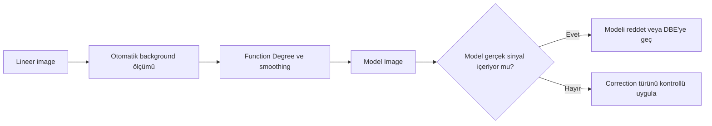
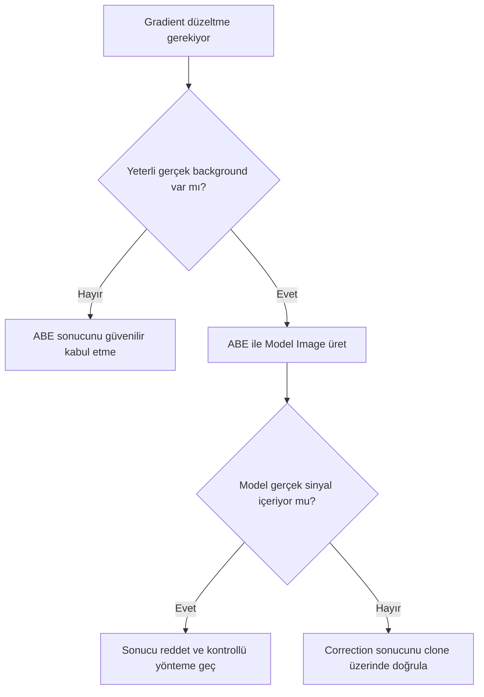

# AutomaticBackgroundExtractor (ABE)

!!! info "Sayfa Bilgisi"
    **Kategori:** Gradient Düzeltme · **Düzey:** Intermediate · **Tahmini okuma:** 7 dk
    **Anahtar kelimeler:** `AutomaticBackgroundExtractor` · `ABE` · `Automatic Background Extraction` · `gradient removal` · `gradient düzeltme` · `background modeling`
    **Önerilen ön bilgiler:** [Calibration Pipeline](../03-kalibrasyon/calibration-pipeline.md) · [Gradient Teorisi](gradient-theory.md)

**Durum: Teknik incelemeye hazır — Sprint 2.1**

## Amaç

AutomaticBackgroundExtractor ile otomatik background model üretmenin çalışma mantığını, avantajlarını, sınırlarını ve farklı hedef türlerinde neden bağlama bağlı değerlendirme gerektiğini açıklamak.

!!! note "Temel yaklaşım"
    ABE sample yerleşimini kullanıcıya tek tek göstermeden otomatik bir background model üretir. Hızlı bir ilk test sağlar; modelin doğru olduğu varsayılmaz.

## Teori

ABE, image içinden otomatik bir background model üretmeyi amaçlar ve seçilen `Correction` türüyle bu modeli hedefe uygulayabilir. Otomatik ölçüm ve model üretiminin kesin PixInsight 1.9.3 algoritması **Doğrulama bekliyor**. Gerçek diffuse signal alanın büyük kısmını kapladığında background ile hedef ayrımı zorlaşır.

### Avantajları

- Hızlı ilk model ve karşılaştırma sağlar.
- Otomatik modelin Model Image üzerinden doğrulanabildiği bazı veri setlerinde yeterli olabilir.
- Model Image ile otomatik tahminin kapsamı incelenebilir.
- Birçok image üzerinde tutarlı başlangıç testi sunabilir.

### Dezavantajları

- Background ölçümlerinin konumu doğrudan denetlenmez.
- Galaxy halo, emission/reflection nebula ve IFN gerçek sinyal olarak korunamayabilir.
- Karmaşık veya lokal gradient’i uygun modellemeyebilir.
- Function Degree yükseltmek gerçek sinyali modelleme riskini artırabilir.
- Aynı ayar narrowband ve broadband data’da aynı anlamı taşımayabilir.

## Ne zaman kullanılır?

- Otomatik modelin hızlı ve geri çevrilebilir biçimde sınanacağı ilk testte
- Background alanı geniş ve gerçek diffuse signal’dan görece ayrılabiliyorsa
- Model Image açıkça incelenecekse
- DBE’ye geçmeden önce model karmaşıklığı hakkında fikir edinmek için

### Hedef türüne göre genel yaklaşım

| Hedef/veri | ABE değerlendirmesi | Ana risk |
| --- | --- | --- |
| Galaxy | Çevrede geniş gerçek background varsa ilk test olabilir | Dış halo ve tidal yapı |
| Emission Nebula | Background ayrımı zorsa dikkatli | Zayıf emission’ın modellenmesi |
| Reflection Nebula | Renkli diffuse yapıda dikkatli | Gerçek yansıma sinyalinin çıkarılması |
| Narrowband | Kanal başına model değişebilir | Alanı dolduran zayıf emission |
| Geniş alan | Basit gradient’te test edilebilir | Karmaşık sky structure ve vignetting residual |
| Küçük gradient | Otomatik model test edilebilir | Modelin gerçek signal’a uyumu |
| Karmaşık gradient | ABE yine test edilebilir; kabul Model Image’a bağlıdır | Underfitting/yanlış yüzey |

!!! info "Bağlama bağlı seçim"
    Bu tablo kesin reçete değildir. Kabul kararı Model Image, residual ve signal preservation üzerinden verilir.

## Ne zaman kullanılmaz?

- Background’un nerede olduğunu güvenilir biçimde belirlemek mümkün değilse
- Alanı galaxy halo, emission/reflection nebula veya IFN dolduruyorsa
- Flat-field calibration hatasını örtmek için
- Otomatik model incelenmeden batch sonucu üretmek için
- Karmaşık lokal yansıma veya düzensiz gradient için tek çözüm olarak

## Menü yolu

Process adı: `AutomaticBackgroundExtractor`

Tam PixInsight 1.9.3 menü yolu: **Doğrulama bekliyor**.

## Parametreler

| Parametre | Amaç | Değişiklikte gözlenecek risk |
| --- | --- | --- |
| `Correction` | Modelin Subtraction veya Division yaklaşımıyla uygulanması | Yanlış fiziksel model |
| `Function Degree` | Model esnekliğini etkileyen kontrol | Kesin algoritmik etkisi 1.9.3’te doğrulanmalı; Model Image ile değerlendirilir |
| `Smoothing Factor` | Model smoothness davranışını etkileyen kontrol | Kesin etkisi 1.9.3’te doğrulanmalı; residual ve gerçek signal korunumu incelenir |
| `Model Image` | Tahmin edilen background’u ayrı image olarak üretmek | Devre dışıysa model QA kaybolur |
| `Replace Target` | Düzeltilmiş sonucu target’a yazmak | Orijinal karşılaştırma dalı kaybolabilir |
| `Replace Background` | Background çıktısının nasıl ele alındığına ilişkin kontrol | Kesin 1.9.3 davranışı doğrulanmalı |

!!! warning "Doğrulama durumu"
    `Smoothing Factor`, `Replace Target` ve `Replace Background` kontrollerinin tam 1.9.3 anlamı ve birbirleriyle etkileşimi yerleşik process documentation ile doğrulanmayı bekliyor.

## Adım adım kullanım

1. Calibrated lineer image’ın bir clone’unu oluşturun.
2. STF ile gradient yönünü ve gerçek diffuse signal bölgelerini belirleyin.
3. ABE’yi düşük varsayım yüküyle bir başlangıç modeli üretmek amacıyla yapılandırın.
4. `Model Image` üretimini etkin tutun.
5. İlk çalışmada orijinal target’ın korunmasını sağlayın.
6. Model Image’ı yüksek STF ile galaxy halo, nebula ve yıldız çevreleri açısından inceleyin.
7. Subtraction/Division hipotezini [Gradient Teorisi](gradient-theory.md) ile karşılaştırın; ayrıntılı yöntem karşılaştırmasını Sprint 2.2’ye bırakın.
8. Düzeltme sonrası STF’yi yeniden hesaplayın.
9. Model hedef sinyal içeriyorsa sonucu reddedin ve [DBE](dbe.md) değerlendirin.

## Gerçek kullanım senaryosu

!!! example "Basit broadband gradient"
    Küçük bir galaxy’nin çevresinde geniş gerçek background bulunan image’da arka plan değişimi görülür. ABE ile ilk model üretilir. Model Image galaxy’nin dış halosunu içermiyorsa correction clone üzerinde değerlendirilir. Bu senaryo başka galaxy alanlarına otomatik preset oluşturmaz.

## Girdi, çıktı ve karar matrisi

ABE lineer, calibration artefact'ları ayrıştırılmış ve gerçek background bölgeleri içeren bir görüntüde değerlendirilmelidir. İlk denemede corrected target'tan önce `Model Image` incelenir; model hedef morfolojisini kopyalıyorsa sonuç reddedilir.

| Veri karakteri | ABE'nin rolü | Neden |
|---|---|---|
| Küçük, düzgün, geniş ölçekli gradient | Hızlı ilk model | Otomatik model için yeterli temiz alan olabilir |
| Geniş galaxy halo | Kontrollü test | Halo/background ayrımı belirsizdir |
| Alanı dolduran emission/reflection nebula | Genellikle ilk tercih değil | Otomatik model gerçek sinyali öğrenebilir |
| Kanal bazlı narrowband | Her kanalı ayrı değerlendir | Gerçek sinyal ve gradient morfolojisi kanala göre değişir |
| Karmaşık veya keskin yön değiştiren yapı | DBE/tanıya dön | Düşük karmaşıklıklı otomatik yüzey yetersiz kalabilir |

## Önerilen ayar yaklaşımı ve performans

`Function Degree` gradient şiddetini değil model esnekliğini değiştirir. En düşük yeterli karmaşıklıkla başlayın; degree artışını yalnız residual yapının ölçülebilir ve gerçek sinyalden ayrı olduğu durumda gerekçelendirin. `Smoothing Factor` modeldeki küçük ölçekli değişimi yönetmek için test edilir; detay kaybını düzeltmek amacıyla körlemesine artırılmaz.

ABE hızlıdır ve tekrar üretimi kolaydır; ancak otomasyon denetim ihtiyacını azaltmaz. Aynı STF, histogram istatistiği ve model görünümüyle önce/sonra karşılaştırması kaydedilmelidir.

## İş Akışındaki Yeri ve ilgili süreçler

Calibration ve integration denetiminden sonra, color calibration öncesinde kullanılması yaygın bir iş akışıdır; fakat sıra veri amacına göre doğrulanmalıdır. Karmaşık alanlarda [DBE](dbe.md), kök neden ayrımında [Gradient Diagnostics](gradient-diagnostics.md), correction türünde [Subtraction ve Division](division-vs-subtraction.md) kullanın.

## Sık yapılan hatalar

1. ABE sonucunu Model Image incelemeden kabul etmek.
2. `Function Degree` yükselince sonucun otomatik iyileşeceğini sanmak.
3. Emission veya reflection nebulosity’yi gradient olarak modellemek.
4. `Correction` türünü gradient’in kaynağını düşünmeden seçmek.
5. Replace seçenekleriyle orijinal karşılaştırma görüntüsünü kaybetmek.
6. Düzeltme sonrası eski STF’yi kullanmak.

## Sorun giderme

| Belirti | Olası neden | Eylem |
| --- | --- | --- |
| Model galaxy halo içeriyor | Otomatik background ayrımı başarısız | Sonucu reddedin; DBE/sample kontrollü yaklaşım |
| Model nebula içeriyor | Gerçek diffuse signal alanı dolduruyor | ABE’yi kullanmama seçeneğini değerlendirin |
| Gradient kısmen kaldı | Model complexity yetersiz veya gradient karmaşık | Function Degree’i körlemesine artırmadan model ailesini inceleyin |
| Yeni koyu/parlak bölgeler | Yanlış correction veya overfitting | Model Image ve correction hipotezine dönün |
| Sonuç aşırı farklı görünüyor | STF yeniden hesaplanmadı | STF’yi resetleyip yeniden uygulayın |

## SSS

??? question "ABE hangi durumda yeterlidir?"
    Otomatik modelin Model Image, histogram ve residual üzerinden doğrulanabildiği veri setlerinde yeterli olabilir.

??? question "ABE hangi durumda başarısız olur?"
    Gerçek diffuse signal alanı doldurduğunda, gradient karmaşık/lokal olduğunda veya otomatik background ayrımı yanlış olduğunda.

??? question "Function Degree için doğru değer nedir?"
    Evrensel değer yoktur. En basit yeterli model, Model Image ve residual üzerinden değerlendirilir.

??? question "Smoothing Factor noise reduction mıdır?"
    Background modelinin smoothness kontrolüdür; image noise reduction process’i olarak kullanılmamalıdır. Kesin davranış doğrulanmayı bekliyor.

??? question "Narrowband image’da ABE kullanılabilir mi?"
    Kullanılabilir; fakat zayıf emission’ın background sanılması riski kanal ve hedefe göre incelenmelidir.

??? question "ABE sonrası DBE yapılır mı?"
    Otomatik bir sıra kuralı yoktur. ABE modeli reddedilirse DBE bağımsız ve kontrollü alternatif olarak denenebilir.

## Hızlı Referans

!!! tip "Tek sayfalık kontrol listesi"
    - [ ] Image lineer ve calibrated
    - [ ] Otomatik modelin sınanabileceği background alanı var
    - [ ] Gerçek diffuse signal bölgeleri belirlendi
    - [ ] En basit yeterli Function Degree
    - [ ] Model Image üretildi
    - [ ] Model gerçek sinyal içermiyor
    - [ ] Correction hipotezi gerekçeli
    - [ ] STF yeniden hesaplandı

## Karar Ağacı

## Teknik Doğrulama Notları

| Sınıf | Durum |
| --- | --- |
| A | Otomatik background model ve overfitting riski sürümden bağımsız |
| B | İşlem yolu ve control davranışları **Doğrulama bekliyor** |
| C | Hedef türlerine kesin preset verilmedi |
| D | Polynomial ve smoothing uygulama ayrıntıları birincil kaynak gerektirir |

!!! warning "Doğrulama durumu"
    ABE parametrelerinin kesin PixInsight 1.9.3 tooltip açıklamaları, varsayılan değerleri ve Replace seçeneklerinin output davranışı doğrulanmayı bekliyor.

## Teknik Doğrulama Durumu

| Alan | Durum |
| --- | --- |
| Hedeflenen PixInsight Sürümü | 1.9.3 |
| Teknik İnceleme Durumu | Kısmen Doğrulandı |
| Resmî Kaynak Kontrolü | Kısmi |
| İş Akışı Tutarlılığı | Doğrulandı |
| Kanıt Düzeyi İncelemesi | Güncellendi |
| Son Teknik İnceleme | Phase 6.4 |

Canlı PixInsight uygulama testi yapılmadı. UI ekran kanıtı, statik ifade/iş akışı incelemesi ve yayımlanmış birincil kaynak kontrolü birbirinin yerine kullanılmamıştır.

## İlgili Süreçler

- [DynamicBackgroundExtraction](dbe.md)
- [Örnek Yerleşimi](sample-placement.md)
- [Subtraction ve Division](division-vs-subtraction.md)
- [Gradient Tanısı](gradient-diagnostics.md)
- [GradientCorrection](gradient-correction.md)
- [GraXpert](graxpert.md)

## İlgili İş Akışları

- [LRGB Galaksi](../15-workflows/lrgb-galaxy.md)
- [Broadband Nebula](../15-workflows/broadband-nebula.md)
- [Emisyon Nebulası](../15-workflows/emission-nebula.md)
- [OSC İş Akışı](../15-workflows/osc-workflow.md)

## Önceki Bölüm

[← Gradient Teorisi](gradient-theory.md)

## Sonraki Bölüm

[DynamicBackgroundExtraction →](dbe.md)
