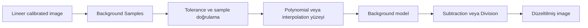
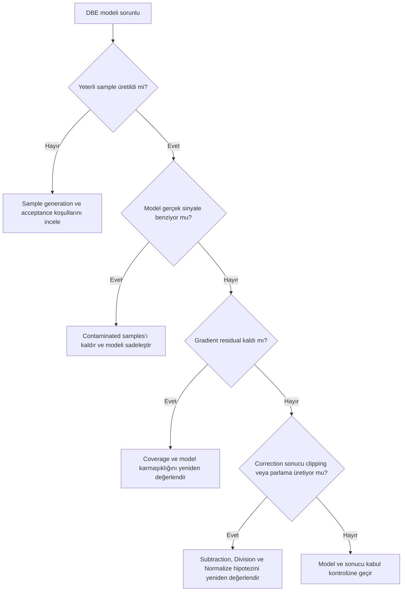

# DynamicBackgroundExtraction (DBE)

**Durum: Teknik incelemeye hazır — Sprint 2.1**

## Amaç

DynamicBackgroundExtraction ile background sample seçimi, model üretimi ve correction kararlarını ayrıntılı, denetlenebilir ve gerçek sinyali korumaya odaklı biçimde açıklamak.

!!! note "DBE’nin temel fikri"
    DBE, kullanıcının belirlediği veya otomatik üretilip denetlediği samples üzerinden tüm image için bir background model tahmin eder. Sample bir “düzeltme fırçası” değil, model için ölçüm varsayımıdır.

## Teori

### DBE mantığı

Her kabul edilen `Sample`, o bölgenin gerçek background’u temsil ettiği varsayımıyla modele katkı verir. Sample değerleri bir yüzeye fit veya interpolate edilir; oluşan `Background model`, seçilen `Correction` ile target’a uygulanır.

### Model oluşturma mantığı

Model kalitesi yalnız sample sayısıyla belirlenmez. Sample’ların spatial coverage’ı, gerçek sinyal contamination’ı, local statistics, model karmaşıklığı ve image sınırları birlikte önemlidir. Çok sayıda yanlış sample, az sayıda iyi sample’dan daha güvenilir değildir.

### Background model

Background model, image’ın hangi yapısının “arka plan” kabul edildiğini görünür kılar. Model image içinde nebula filamentleri, galaxy halo veya reflection yapısı belirginse model gerçek sinyali kaldırma riski taşır.

!!! warning "Sample ilkesi"
    Sample’lar gradient’in “koyu” veya “parlak” görünen noktalarına rastgele değil, gerçek hedef sinyali içermediği gerekçelendirilebilen background bölgelerine dağıtılmalıdır.

## Ne zaman kullanılır?

- ABE modelinin gerçek sinyal içerdiği veya residual bıraktığı durumlarda
- Background bölgelerinin kullanıcı tarafından denetlenmesi gerektiğinde
- Karmaşık veya düzensiz gradient için sample coverage tasarlanırken
- Model Image üzerinden correction öncesi kalite kontrol istendiğinde

## Ne zaman kullanılmaz?

- Alanın hiçbir yerinde güvenilir background tanımlanamıyorsa
- Hatalı Master Flat’i sentetik olarak “tamir etmek” için
- Sample’ları nebula/galaxy üzerine koyarak hedefi yeniden şekillendirmek için
- Yalnız arka planı siyahlaştırmak amacıyla
- Model Image incelenmeden `Replace Target` ile tek kopya üzerinde

## Menü yolu

Process adı: `DynamicBackgroundExtraction`

Tam PixInsight 1.9.3 menü yolu: **Doğrulama bekliyor**.

## Parametreler

| Parametre | Amacı | Ne zaman artırılır? | Ne zaman azaltılır? | Yanlış kullanım sonucu |
| --- | --- | --- | --- | --- |
| `Sample` | Background ölçüm konumlarını tanımlamak | Coverage yetersizse, yalnız güvenilir bölgelerde yeni sample | Contaminated veya redundant sample varsa | Gerçek sinyal modelde; yetersiz model |
| `Tolerance` | Sample kabul davranışını etkileyen kontrol | Yalnız kabul edilen/reddedilen samples ve Model Image gözlenerek test edilir | Contamination artıyorsa geri alınır | Çok az sample veya contaminated samples |
| `Radius` | Sample ölçüm alanının spatial kapsamını etkileyen kontrol | Geniş alanın gerçek background olduğu kanıtlanabiliyorsa test edilir | Dar background boşluğu veya yapı yakınında test edilir | Yapı contamination veya kararsız ölçüm |
| `Shadows Relaxation` | Koyu bölgelerde sample kabul davranışını etkileyen kontrol | Kesin koşul **Doğrulama bekliyor** | Kesin koşul **Doğrulama bekliyor** | Yanlış background adayları; yetersiz samples |
| `Correction` | Subtraction/Division modelini seçmek | Sayısal artırma yok; fiziksel hipotez seçilir | Sayısal azaltma yok | Yanlış düzeltme modeli |
| `Subtraction` | Additive background modelini çıkarmak | Parametre değildir; additive kanıtla seçilir | Uygulanmaz | Clipping veya gerçek sinyal kaybı |
| `Division` | Multiplicative modelle bölmek | Parametre değildir; multiplicative kanıtla seçilir | Uygulanmaz | Köşe/parlaklık amplifikasyonu, noise artışı |
| `Discard Model` | Model output’unu saklama/atma davranışı | Model ayrıca gerekmiyorsa, ancak QA sonrasında | Model inspection gerekiyorsa | Model kanıtı kaybolur |
| `Normalize` | Correction sonrası target seviyesini/ölçeğini yönetmek | Kesin koşul **Doğrulama bekliyor** | Kesin koşul **Doğrulama bekliyor** | Seviye veya renk ilişkisi değişebilir |
| `Replace Target` | Düzeltilmiş sonucu target’a yazmak | Ayrı clone ve geri dönüş noktası varsa | Karşılaştırma korunacaksa | Orijinal sonuç dalı kaybolur |
| `Polynomial Degree` | Model yüzeyinin esnekliğini etkileyen kontrol | Residual, coverage ve Model Image birlikte destekliyorsa test edilir | Model gerçek sinyale uyuyor veya kararsız yapı üretiyorsa test edilir | Overfitting/underfitting |
| `Interpolation` | Samples arasında background yüzeyi üretmek | Sayısal artırma değildir; uygun yöntem seçilir | Sayısal azaltma değildir | Edge artefact veya uygunsuz yüzey |

!!! warning "Doğrulama durumu"
    `Tolerance`, `Radius`, `Shadows Relaxation`, `Discard Model`, `Normalize`, `Replace Target`, `Polynomial Degree` ve `Interpolation` kontrollerinin tam PixInsight 1.9.3 davranışları ve seçenek adları yerleşik process documentation ile doğrulanmayı bekliyor.

## Adım adım kullanım

1. Calibrated lineer image’ın clone’unu oluşturun.
2. STF ile gerçek signal ve olası background bölgelerini haritalayın.
3. Gerekirse başlangıç sample grid’i üretin.
4. Nebula, galaxy halo, reflection, IFN, bright star halo ve artefact üzerindeki samples’ı kaldırın.
5. Image’ın tüm gradient yönlerini temsil edecek spatial coverage oluşturun.
6. `Tolerance`, `Radius` ve `Shadows Relaxation` etkisini sample kabulü üzerinden kontrollü test edin.
7. En basit yeterli `Polynomial Degree` veya uygun `Interpolation` yaklaşımını seçin.
8. İlk çalışmada model output’unu saklayın; `Discard Model` ile kanıtı kaybetmeyin.
9. Background model’i güçlü STF ile gerçek sinyal açısından inceleyin.
10. `Subtraction` ve `Division` seçeneklerini yalnız etki modeline ilişkin kanıtla, ayrı clones üzerinde temel düzeyde test edin.
11. `Normalize` ve `Replace Target` davranışını orijinalle karşılaştırın.
12. STF’yi resetleyip yeniden hesaplayın.
13. Residual gradient, clipping, noise amplification ve signal preservation kontrolü yapın.

!!! info "Sprint kapsamı"
    Subtraction ve Division yöntemlerinin ayrıntılı karşılaştırması Sprint 2.2’de ele alınacaktır. Bu sprintte seçim; STF, Background model ve histogram ile yapılan temel kabul kontrolüyle sınırlandırılır.

## Gerçek kullanım senaryosu

!!! example "Galaxy ve dış halo"
    Geniş bir galaxy’nin çevresinde background bölgeleri vardır; ancak dış halo sınırı belirsizdir. Samples, galaxy’den güvenli mesafede ve gradient boyunca dağıtılır. Model image’da halo benzeri yapı görülürse o sample seti reddedilir. Polynomial Degree yükseltmek yerine önce sample contamination ve coverage gözden geçirilir.

## Gerçek hatalar

### Less than three samples were generated

Process, model üretimi için yeterli sayıda kabul edilmiş sample elde edememiştir. Uygun background alanı yetersiz olabilir; sample generation koşulları fazla kısıtlayıcı olabilir; target yoğun nebula veya galaxy sinyaliyle kaplı olabilir; `Radius` veya model koşulları uygun olmayabilir. Otomatik üretim yerine kontrollü manuel sample yerleşimi olası bir müdahaledir, garanti çözüm değildir. PixInsight hata mesajının sunduğu olası müdahaleler ve kesin hata koşulu 1.9.3 üzerinde doğrulanmayı bekliyor.

!!! info "Görsel eklenecek"
    Hata mesajı, sample generation ayarları ve kabul edilen sample sayısını gösteren ekran görüntüsü eklenecek.

### Sample’ların nebulaya yerleştirilmesi

Nebula üzerindeki sample, gerçek emission/reflection yapısını background modeline taşıyabilir. Bu durumda correction hedef sinyali azaltabilir veya yeniden şekillendirebilir.

!!! info "Görsel eklenecek"
    Nebula üzerindeki hatalı sample dağılımı ve temizlenmiş sample seti karşılaştırması eklenecek.

### Model görüntüsünün nebulaya benzemesi

Model image’ın nebulaya benzemesi, modelin gerçek sinyali background olarak öğrendiğine dair güçlü bir uyarıdır. Model kabul edilmemeli; samples, coverage ve model karmaşıklığı yeniden incelenmelidir.

!!! info "Görsel eklenecek"
    Target ve Model Image aynı STF ölçeğinde yan yana gösterilecek.

### Division sonrası aşırı parlama

Division, düşük model değerlerinin bulunduğu bölgelerde correction etkisini büyütebilir. Aşırı parlama, multiplicative hipotezin veya model seviyesinin uygun olmadığını gösterebilir. Kesin neden model ve statistics ile incelenmelidir.

!!! info "Görsel eklenecek"
    Division öncesi/sonrası ve model statistics karşılaştırması eklenecek.

### Subtraction sonrası siyah arka plan

Siyah arka plan; modelin fazla çıkarılması, clipping, Normalize davranışı veya yalnız STF değişimiyle ilişkili olabilir. Histogram/Statistics ve yeniden hesaplanan STF görülmeden tek neden atanamaz.

!!! info "Görsel eklenecek"
    Eski ve yeniden hesaplanan STF ile histogram karşılaştırması eklenecek.

### Gradientin tamamen kaybolmaması

Residual gradient; yetersiz sample coverage, uygun olmayan model karmaşıklığı, gerçek signal/gradient belirsizliği veya correction türü uyuşmazlığından kaynaklanabilir. Gradient’i “tamamen yok etmek” uğruna gerçek sinyal modellemek doğru çözüm değildir.

!!! info "Görsel eklenecek"
    Residual model ve kontrollü sample revizyonu örneği eklenecek.

## Sık yapılan hatalar

1. Sample sayısını kaliteyle eşitlemek.
2. Samples’ı nebula, galaxy halo veya bright star halo üzerine koymak.
3. `Tolerance` yükselterek üretilen her sample’ı kabul etmek.
4. `Polynomial Degree` ile gradient şiddetini karıştırmak.
5. Model Image’ı atmadan önce incelememek.
6. Subtraction ve Division’ı fiziksel ayrım yapmadan denemek.
7. Normalize ve Replace Target davranışını doğrulamadan tek kopyada uygulamak.
8. Düzeltme sonrası eski STF ile karar vermek.

## Sorun giderme

| Belirti | Olası neden | Kanıt | Eylem |
| --- | --- | --- | --- |
| Üçten az sample | Acceptance/coverage yetersiz | Sample count ve console | Sample generation ve kabul koşullarını inceleyin |
| Model nebula içeriyor | Contaminated samples/overfitting | Model Image | Samples’ı kaldırın, modeli sadeleştirin |
| Division parlatıyor | Yanlış multiplicative model/düşük model seviyesi | Model Statistics | Correction hipotezini reddedin veya yeniden kurun |
| Subtraction karartıyor | Over-subtraction, clipping veya STF | Histogram ve yeni STF | Model, Normalize ve data seviyesini inceleyin |
| Gradient kalıyor | Underfitting/coverage/model sınırı | Residual pattern | Samples ve en basit yeterli modeli yeniden kurun |
| Kenar artefact’ı | Yetersiz edge support/interpolation | Model kenarları | Edge sample coverage’ı inceleyin |

## SSS

??? question "DBE sample nedir?"
    Background’u temsil ettiği varsayılan yerel ölçüm bölgesidir; lokal düzeltme fırçası değildir.

??? question "Kaç sample gerekir?"
    Evrensel sayı yoktur. Modelin geometry’sini temsil eden, uncontaminated ve yeterli coverage sağlayan set gerekir.

??? question "Tolerance ne yapar?"
    Sample kabul davranışını etkiler. Kesin 1.9.3 algoritmik yönü ve eşik tanımı doğrulanmayı bekliyor.

??? question "Subtraction mı Division mı?"
    Additive veya multiplicative etkiye ilişkin kanıta bağlıdır. Rastgele estetik tercih olmamalıdır.

??? question "Polynomial Degree neden yükseltilmemeli?"
    Yalnız residual kaldığı için yükseltmek gerçek sinyale uyum riskini artırabilir; sample desteğiyle değerlendirilir.

??? question "Model Image neden nebulaya benziyor?"
    Samples gerçek sinyal içeriyor veya model fazla esnek olabilir; sonuç kabul edilmemelidir.

??? question "Gradient neden tamamen kaybolmadı?"
    Veri/model ayrımı sınırlı olabilir. Kontrollü residual, gerçek sinyal kaybından daha güvenilir olabilir.

## Quick Reference

!!! tip "Tek sayfalık kontrol listesi"
    - [ ] Image lineer ve calibrated
    - [ ] Background bölgeleri gerekçeli
    - [ ] Samples tüm gradient yönünü kapsıyor
    - [ ] Nebula/halo üzerindeki samples kaldırıldı
    - [ ] Tolerance/Radius etkisi sample kabulüyle izlendi
    - [ ] En basit yeterli model seçildi
    - [ ] Model Image saklandı ve incelendi
    - [ ] Correction türü fiziksel hipoteze bağlı
    - [ ] Normalize/Replace davranışı clone üzerinde kontrol edildi
    - [ ] STF yeniden hesaplandı
    - [ ] Residual ve signal preservation incelendi

## Decision Tree

## Teknik doğrulama durumu

| Sınıf | Durum |
| --- | --- |
| A | Sample tabanlı background model, contamination ve under/overfitting kavramları sürümden bağımsız |
| B | Tüm DBE control adları ve UI davranışları **Doğrulama bekliyor** |
| C | Sample sayısı, Tolerance, Radius veya Degree için kesin değer verilmedi |
| D | Interpolation, Polynomial ve correction algoritmalarının ayrıntıları birincil kaynak gerektirir |

!!! warning "Doğrulama durumu"
    Bu sayfadaki DBE parametre adları talep kapsamına göre korunmuştur; PixInsight 1.9.3 arayüzündeki tam etiketler, seçenekler, varsayılanlar ve hata koşulları kurulu process documentation ve gerçek uygulama ile doğrulanmalıdır.
