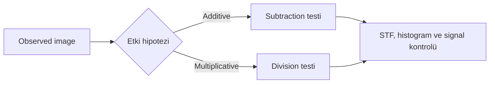
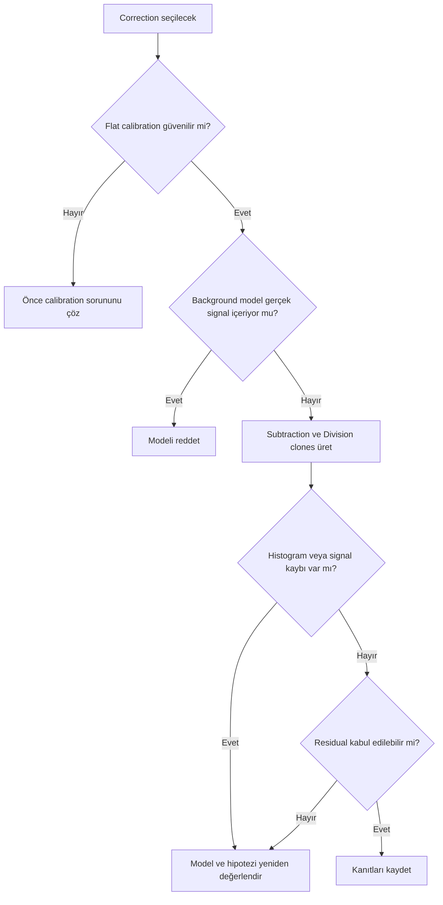
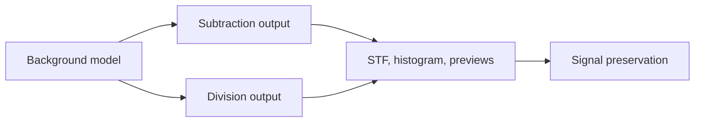

# Subtraction ve Division

**Durum: Teknik doğrulama bekliyor — Sprint 2.2**

## Amaç

Gradient correction yöntemini isim ezberiyle değil, modelin fiziksel yorumu, Background model içeriği ve correction sonrası ölçümler üzerinden değerlendirmek.

!!! note "Sınır"
    Subtraction ve Division matematiksel işlemlerdir; seçilen Background model’in gerçek fiziksel etkiyi doğru temsil ettiğini kendiliğinden kanıtlamaz.

## Kavramsal açıklama

Additive model:

```text
observed = signal + background
corrected ≈ observed - estimated_background
```

Multiplicative model:

```text
observed = signal × field_effect
corrected ≈ observed ÷ estimated_field_effect
```

Gerçek astronomik image’larda additive ve multiplicative etkiler saf biçimde ayrışmayabilir. Calibration residual, sky gradient, reflection ve gerçek diffuse signal birlikte bulunabilir.



### Flat-field correction neden DBE Division değildir?

Master Flat acquisition sırasında optical train ve pixel response’u ölçer. DBE Division ise science image’dan tahmin edilen modelle matematiksel bölme yapar. DBE’nin vignetting görünümünü azaltması doğru flat calibration’ın yerine geçtiğini kanıtlamaz.

### Sonuç kontrolü

- STF’yi resetleyip yeniden hesaplayın.
- Background model’i ayrı inceleyin.
- Histogramda clipping ve dağılım değişimini kontrol edin.
- Background previews ile kanal seviyelerini ölçün.
- Galaxy halo ve nebula dış yapısını karşılaştırın.
- Yıldızlarda parlama/ringing, noise amplification ve color imbalance arayın.
- Residual gradient’i aynı karşılaştırma koşullarında değerlendirin.

!!! warning "Aşırı düzeltme belirtileri"
    Siyah clipping, parlayan yıldızlar, halo kaybı, nebula dış bölgelerinin silinmesi, kanal dengesizliği ve noise amplification correction hipotezinin veya modelin yeniden incelenmesini gerektirir.

## Karşılaştırma tablosu

| Durum | İlk değerlendirme yaklaşımı | Kontrol edilmesi gereken risk | Tek başına yeterli mi? |
| --- | --- | --- | --- |
| Hafif light pollution gradient | Additive hipotezi modelle karşılaştır | Gerçek diffuse signal | Hayır |
| Moonlight | Yönlü background ve gece/frame kıyası | Color cast ve haze | Hayır |
| Vignetting kalıntısı | Önce flat calibration zinciri | Sentetik modelle calibration gizlemek | Hayır |
| Yanlış flat | Master Flat ve raw/calibrated kıyası | DBE ile semptom bastırma | Hayır |
| Wide-field gradient | Birden çok kaynak olasılığı | Sky structure ve edge model | Hayır |
| Narrowband background eğimi | Kanal bazlı model ve previews | Zayıf emission kaybı | Hayır |
| Galaxy halo | Halo sınırını koruma kontrolü | Gerçek signal subtraction | Hayır |
| Reflection nebula | Renkli dış yapı kontrolü | Background sanılan reflection | Hayır |
| Mosaic seam | Panel normalization/geometry incelemesi | Seam’i tek gradient saymak | Hayır |
| Sensor reflection | Rotate/filter/gece testi | Lokal artefact’ı global modellemek | Hayır |

## Ne zaman kullanılır?

- Background model correction’a uygulanmadan önce
- Subtraction/Division sonuçları ayrı clones üzerinde kıyaslanırken
- Flat residual ile sky gradient ayrılırken
- Aşırı düzeltme ve residual araştırılırken

## Ne zaman kullanılmaz?

- “Sky gradient her zaman Subtraction” gibi bağlamsız reçete için
- Yanlış flat’i DBE Division ile kesin çözülmüş saymak için
- Model Image gerçek signal içeriyorken
- Histogram ve signal preservation kontrolü yapılmadan

## Ön koşullar

- Lineer calibrated image
- İncelenmiş Background model
- Aynı başlangıçtan iki clone
- STF, histogram ve background preview ölçümleri

## Uygulama yaklaşımı

1. Gradient kaynağı için hipotez oluşturun.
2. Flat calibration kanıtını kontrol edin.
3. Background model’in hedef signal içermediğini doğrulayın.
4. Subtraction ve Division’ı ayrı clones üzerinde çalıştırın.
5. Her clone için STF’yi yeniden hesaplayın.
6. Histogram, previews, yıldızlar, halo ve nebula sınırlarını karşılaştırın.
7. Residual ve noise davranışını kaydedin.
8. Hiçbir sonuç kanıtı karşılamıyorsa modeli veya teşhisi reddedin.

## Gerçek kullanım senaryosu

!!! example "Vignetting benzeri köşe kararması"
    Önce Master Flat ve raw/calibrated frame kıyaslanır. Flat zinciri sorunluysa DBE Division “çözüm” kabul edilmez. Calibration doğru görünüyorsa iki correction clone üzerinde denenir; kabul yalnız model, histogram ve signal preservation ile yapılır.

!!! example "Görsel doğrulama ölçütü"
    Bu bölüm gerçek PixInsight 1.9.3 ekran görüntüsü ve örnek veri ile doğrulanacaktır.

## Karar kanıtı ve performans

| Kanıt | Subtraction lehine | Division lehine |
|---|---|---|
| Background farkı | Yaklaşık sabit ek ofset/yüzey | Sinyalle orantılı alan tepkisi |
| Calibration geçmişi | Flat doğru, sky glow kalmış | Multiplicative model için bağımsız kanıt var |
| Model düşük değerleri | Çıkarma sonrası clipping riski | Bölme sonrası büyütme/noise riski |
| Corrected sonuç | Seviye dengeleniyor | Oransal response dengeleniyor |

Her iki correction, orijinal lineer master'dan ayrı dallar halinde test edilmelidir. Arka arkaya uygulama kök neden yorumunu bozar. Büyük model görüntüleriyle çalışma maliyeti genellikle integration'a göre düşük olsa da iterasyon sayısı süreç kaydını zorlaştırır; her denemenin modelini ve istatistiğini saklayın.

## Sık yapılan hatalar

1. Matematiksel işlemi fiziksel kaynak kanıtı sanmak.
2. Division’ı flat-field calibration yerine kullanmak.
3. Eski STF ile sonuçları kıyaslamak.
4. Siyah background’u başarılı correction sanmak.
5. Galaxy halo veya reflection dış yapısını kaybetmek.
6. Kanal bazlı color imbalance’ı kontrol etmemek.

## Sorun giderme

| Belirti | Kontrol | Değerlendirme |
| --- | --- | --- |
| Siyah arka plan | Histogram clipping ve STF | Model/Normalize/Subtraction hipotezini inceleyin |
| Parlayan yıldızlar | Division model seviyeleri | Modelin düşük değerlerini ve halo’ları inceleyin |
| Halo kaybı | Background model correlation | Modeli reddedin |
| Noise artışı | Background preview statistics | Division/amplification ve STF ayrımını kontrol edin |
| Residual kaldı | Model coverage | Correction türünden önce modeli yeniden inceleyin |
| Color imbalance | Kanal histogramları | Kanal modellerini ve normalization’ı doğrulayın |

## SSS

??? question "Subtraction additive etkiyi kanıtlar mı?"
    Hayır. Yalnız additive hipotez altında kullanılan matematiksel correction’dır.

??? question "Division vignetting’i düzeltir mi?"
    Görünümü azaltabilir; doğru flat-field calibration’ın yerine geçtiğini kanıtlamaz.

??? question "Hangisi doğru seçimdir?"
    Modelin yapısı, flat kalitesi ve signal preservation kanıtına bağlıdır; evrensel seçim yoktur.

??? question "Neden STF yeniden hesaplanır?"
    Correction sonrası statistics değişebilir; eski display mapping yanıltıcı karşılaştırma yaratabilir.

??? question "Histogram tek başına yeterli mi?"
    Hayır. Spatial signal, Background model ve previews ile birlikte incelenir.

??? question "Residual gradient kalabilir mi?"
    Evet. Gerçek signal’ı koruyan kontrollü residual, overcorrection’dan daha güvenilir olabilir.

## Hızlı Referans

!!! tip "Tek sayfalık kontrol listesi"
    - [ ] Etki hipotezi tanımlı
    - [ ] Flat zinciri kontrol edildi
    - [ ] Background model gerçek signal içermiyor
    - [ ] İki correction ayrı clones üzerinde
    - [ ] STF yeniden hesaplandı
    - [ ] Histogram ve previews karşılaştırıldı
    - [ ] Halo/nebula/yıldızlar korundu
    - [ ] Noise ve residual değerlendirildi

## Karar Ağacı





## Teknik doğrulama durumu

| Kategori | Bekleyen doğrulama |
| --- | --- |
| UI-1 | Correction ve Normalize seçenekleri |
| DOC-1 | PixInsight Subtraction/Division implementation |
| DATA-1 | Aynı dataset üzerinde correction karşılaştırması |
| IMG-1 | STF, histogram ve before/after ekranları |

## Ayrıca İnceleyin

- [Gradient Teorisi](gradient-theory.md)
- [Sample Yerleşimi](sample-placement.md)
- [DBE](dbe.md)
- [Gradient Diagnostics](gradient-diagnostics.md)

## İlgili Süreçler

- [AutomaticBackgroundExtractor](abe.md)
- [DynamicBackgroundExtraction](dbe.md)
- [Örnek Yerleşimi](sample-placement.md)
- [Gradient Tanısı](gradient-diagnostics.md)
- [GradientCorrection](gradient-correction.md)
- [GraXpert](graxpert.md)

## İlgili İş Akışları

- [LRGB Galaksi](../15-workflows/lrgb-galaxy.md)
- [Broadband Nebula](../15-workflows/broadband-nebula.md)
- [Emisyon Nebulası](../15-workflows/emission-nebula.md)
- [OSC İş Akışı](../15-workflows/osc-workflow.md)

## Önceki Bölüm

[← Örnek Yerleşimi](sample-placement.md)

## Sonraki Bölüm

[Gradient Tanısı →](gradient-diagnostics.md)
