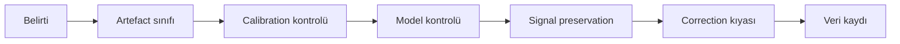
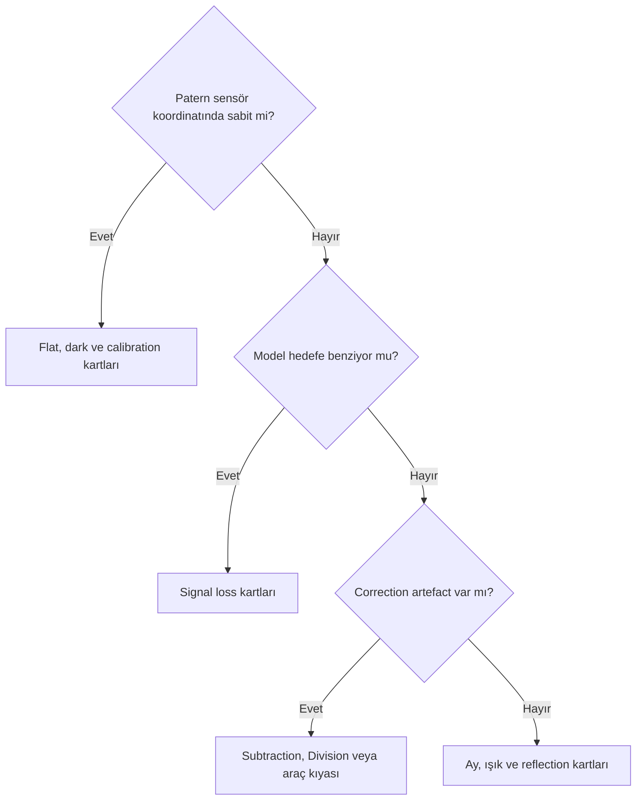

# Gradient Hata Kartları

Bu kartlar hızlı teşhis içindir. Parametre değeri veya kesin çözüm vermez; artefact sınıflandırması → calibration → model → signal preservation → correction kıyası → yeniden modelleme → gerçek veri kaydı sırasını izler.

## Hata kartları indeksi

Kartları sırayla uygulamak zorunlu değildir. Önce belirtiyi sınıflandırın; ardından **olası neden → ayırıcı test → güvenli geri dönüş** zincirini izleyin. Bir ayar değişikliği yalnız ayırıcı test onu destekliyorsa yapılmalıdır.

| Kategori | Kartlar |
| --- | --- |
| Sample generation | 1, 15, 23, 24 |
| Model contamination | 2, 3, 14 |
| Correction artefact | 4, 5, 6, 7, 8, 12, 22, 29 |
| Signal loss | 9, 10, 11 |
| Calibration confusion | 16, 17, 18, 20, 21 |
| Environmental gradient | 19, 27 |
| External tool workflow | 25, 26 |
| Color workflow | 13, 28, 30 |

## 1. Less than three samples were generated

**Belirti:** Process yeterli sample üretmediğini bildirir.  
**Muhtemel nedenler:** Güvenilir background azdır; acceptance koşulları veya hedef kapsamı sample üretimini sınırlar.  
**Önce kontrol et:** Hedef sinyali, sample adayları ve gerçek hata metni.  
**Olası müdahaleler:** Background haritasını yeniden değerlendir; kontrollü manuel yaklaşımı test et.  
**Yapılmaması gerekenler:** Kaynaksız tek parametre reçetesi vermek.  
**Doğrulama yöntemi:** 1.9.3 ekranı, sample haritası ve model çıktısı.  
**İlgili bölüm:** [Sample Placement](sample-placement.md)  
**Görsel durumu:** Gerçek hata ekranı bekleniyor.

## 2. Background model nebulaya benziyor

**Belirti:** Model diffuse yapı veya filament içerir.  
**Muhtemel nedenler:** Nebula background sanılmıştır.  
**Önce kontrol et:** Original ile Model Image geometrisi.  
**Olası müdahaleler:** Sample bölgelerini ve aracı yeniden değerlendir.  
**Yapılmaması gerekenler:** Düz görünüm uğruna correction'ı kabul etmek.  
**Doğrulama yöntemi:** Original/Model/Corrected ve fark görüntüsü.  
**İlgili bölüm:** [NGC 6888 İş Akışı](ngc6888-gradient-workflow.md)  
**Görsel durumu:** Nebula-model karşılaştırması bekleniyor.

## 3. Background model galaxy yapısını içeriyor

**Belirti:** Disk, spiral veya dış halo modelde görünür.  
**Muhtemel nedenler:** Galaxy kapsamı eksik tanımlanmıştır.  
**Önce kontrol et:** Halo koruma alanı ve sample konumları.  
**Olası müdahaleler:** Koruma bölgesini genişlet; modeli yeniden kur.  
**Yapılmaması gerekenler:** Galaxy dışını otomatik background saymak.  
**Doğrulama yöntemi:** Model, fark ve halo profile kıyası.  
**İlgili bölüm:** [M31 İş Akışı](m31-gradient-workflow.md)  
**Görsel durumu:** Galaxy-model görseli bekleniyor.

## 4. Gradient tamamen kaybolmadı

**Belirti:** Düzeltme sonrası düşük seviyeli ve geniş ölçekli bir residual hâlâ görülebilir.  
**Muhtemel nedenler:** Model sınırı, gerçek sky yapısı veya güvenli biçimde modellenemeyen belirsizlik vardır.  
**Önce kontrol et:** Calibration, model ve residual yönü.  
**Olası müdahaleler:** Residual'ın kabul edilebilirliğini kaydet; gerekirse alternatif model testi planla.  
**Yapılmaması gerekenler:** Background'u zorla siyaha çekmek.  
**Doğrulama yöntemi:** Yeniden STF, statistics ve residual harita.  
**İlgili bölüm:** [Gradient Diagnostics](gradient-diagnostics.md)  
**Görsel durumu:** Residual karşılaştırması bekleniyor.

## 5. Correction sonrasında residual gradient kaldı

**Belirti:** Correction sonrası belirgin ve aynı geometrili gradient yapısı sürer.  
**Muhtemel nedenler:** Model gradient'i temsil etmiyor veya artefact sınıfı uyumsuzdur.  
**Önce kontrol et:** Background Model ile residual geometrisi.  
**Olası müdahaleler:** Modeli yeniden kur veya correction'ı reddet.  
**Yapılmaması gerekenler:** Aynı işlemi kanıtsız tekrarlamak.  
**Doğrulama yöntemi:** Original/Model/Corrected üçlüsü.  
**İlgili bölüm:** [Gerçek İş Akışları](real-workflows.md)  
**Görsel durumu:** Üçlü çıktı bekleniyor.

## 6. Subtraction sonrası background siyaha yaklaştı

**Belirti:** Görünüm aşırı koyu veya kırpılmış görünür.  
**Muhtemel nedenler:** STF yanılsaması, overcorrection veya clipping.  
**Önce kontrol et:** STF'yi sıfırla; statistics/histogram incele.  
**Olası müdahaleler:** Model ve correction yaklaşımını yeniden test et.  
**Yapılmaması gerekenler:** Siyah görünümü başarı saymak.  
**Doğrulama yöntemi:** Eski/yeni STF ve pixel ölçümü.  
**İlgili bölüm:** [Subtraction ve Division](division-vs-subtraction.md)  
**Görsel durumu:** STF/histogram görseli bekleniyor.

## 7. Division sonrası görüntü aşırı parladı

**Belirti:** Köşe veya düşük model bölgeleri aşırı yükselir.  
**Muhtemel nedenler:** Model multiplicative kaynağı güvenilir temsil etmiyordur.  
**Önce kontrol et:** Model değer dağılımı ve STF.  
**Olası müdahaleler:** Kök nedeni ve Subtraction karşılaştırmasını yeniden değerlendir.  
**Yapılmaması gerekenler:** Division'ı flat eşdeğeri saymak.  
**Doğrulama yöntemi:** Statistics, model ve fark.  
**İlgili bölüm:** [Subtraction ve Division](division-vs-subtraction.md)  
**Görsel durumu:** Division çıktısı bekleniyor.

## 8. Division sonrası noise arttı

**Belirti:** Düşük sinyalli bölgelerde noise daha görünürdür.  
**Muhtemel nedenler:** Bölme düşük model değerlerini yükseltmiştir veya STF değişmiştir.  
**Önce kontrol et:** Aynı STF ve bölgesel statistics.  
**Olası müdahaleler:** Subtraction/original ile kontrollü karşılaştır.  
**Yapılmaması gerekenler:** Denoising ile nedeni gizlemek.  
**Doğrulama yöntemi:** Aynı ROI'de noise ölçümü.  
**İlgili bölüm:** [Subtraction ve Division](division-vs-subtraction.md)  
**Görsel durumu:** ROI kıyası bekleniyor.

## 9. Galaxy halo kayboldu

**Belirti:** Correction sonrası dış halo zayıflar.  
**Muhtemel nedenler:** Halo model contamination'a girmiştir.  
**Önce kontrol et:** Model ve halo maskesi.  
**Olası müdahaleler:** Modeli reddet; koruma alanını değiştir.  
**Yapılmaması gerekenler:** Koyu background'u tercih etmek.  
**Doğrulama yöntemi:** Fark ve radial profile.  
**İlgili bölüm:** [M31 İş Akışı](m31-gradient-workflow.md)  
**Görsel durumu:** Halo profile bekleniyor.

## 10. Faint OIII sinyali kayboldu

**Belirti:** Zayıf dış kabuk correction sonrası görünmezleşir.  
**Muhtemel nedenler:** OIII background sayılmıştır.  
**Önce kontrol et:** OIII model, sample ve fark görüntüsü.  
**Olası müdahaleler:** Sample/araç yaklaşımını değiştir.  
**Yapılmaması gerekenler:** Ha modelini OIII'ye doğrudan kopyalamak.  
**Doğrulama yöntemi:** Profile ve üçlü çıktı.  
**İlgili bölüm:** [NGC 6888 İş Akışı](ngc6888-gradient-workflow.md)  
**Görsel durumu:** OIII testi bekleniyor.

## 11. Nebula dış bölgeleri kesildi

**Belirti:** Diffuse yapı keskin sınırla sona erer.  
**Muhtemel nedenler:** Model gerçek sinyali çıkarmıştır.  
**Önce kontrol et:** Modelde aynı sınırın bulunması.  
**Olası müdahaleler:** Background kapsamını yeniden tanımla.  
**Yapılmaması gerekenler:** Sınırı estetik iyileşme saymak.  
**Doğrulama yöntemi:** Original/Corrected/fark.  
**İlgili bölüm:** [Sample Placement](sample-placement.md)  
**Görsel durumu:** Diffuse sınır görseli bekleniyor.

## 12. Yıldız haloları büyüdü veya belirginleşti

**Belirti:** Correction sonrası halo kontrastı artar.  
**Muhtemel nedenler:** Background seviyesi değişmiş veya halo modele girmiştir.  
**Önce kontrol et:** Modelde yıldız izi ve aynı STF.  
**Olası müdahaleler:** Halo çevresi sample/model kararını gözden geçir.  
**Yapılmaması gerekenler:** Halo sorununu gradient saymak.  
**Doğrulama yöntemi:** Yıldız çevresi radial kıyas.  
**İlgili bölüm:** [Gradient Diagnostics](gradient-diagnostics.md)  
**Görsel durumu:** Halo karşılaştırması bekleniyor.

## 13. Renk kanalları arasında background uyumsuzluğu oluştu

**Belirti:** Correction sonrası color cast veya kanal eğimi artar.  
**Muhtemel nedenler:** Kanal modelleri uyumsuzdur.  
**Önce kontrol et:** R/G/B model ve statistics.  
**Olası müdahaleler:** Kanal/birleşik iş akışlarını karşılaştır.  
**Yapılmaması gerekenler:** Sorunu yalnız SPCC ile örtmek.  
**Doğrulama yöntemi:** Kanal residual ve color kıyası.  
**İlgili bölüm:** [Işık Kirliliği](light-pollution-gradients.md)  
**Görsel durumu:** RGB residual bekleniyor.

## 14. Model Image yıldız izleri içeriyor

**Belirti:** Modelde yıldız merkezleri veya halolar görülür.  
**Muhtemel nedenler:** Sample contamination veya model yapısı.  
**Önce kontrol et:** Sample radius/konum ve model.  
**Olası müdahaleler:** Contaminated bölgeleri yeniden değerlendir.  
**Yapılmaması gerekenler:** Yıldız izlerini gradient kabul etmek.  
**Doğrulama yöntemi:** Sample-model eşleme.  
**İlgili bölüm:** [Sample Placement](sample-placement.md)  
**Görsel durumu:** Model yakın planı bekleniyor.

## 15. Otomatik sample üretimi gerçek sinyale yerleşiyor

**Belirti:** Sample'lar nebula, halo veya galaxy üzerinde oluşur.  
**Muhtemel nedenler:** Otomasyon hedef kapsamını bilmez.  
**Önce kontrol et:** Tüm sample haritası.  
**Olası müdahaleler:** Sample temizliği veya kontrollü manuel model.  
**Yapılmaması gerekenler:** Sample sayısını kalite sanmak.  
**Doğrulama yöntemi:** Hedef katmanı ve sample overlay.  
**İlgili bölüm:** [Sample Placement](sample-placement.md)  
**Görsel durumu:** Overlay bekleniyor.

## 16. Flat artefact gradient sanıldı

**Belirti:** Patern sensör koordinatında tekrarlanır.  
**Muhtemel nedenler:** Master Flat veya optical train uyumsuzluğu.  
**Önce kontrol et:** Raw/flat/calibrated ve kamera rotasyonu.  
**Olası müdahaleler:** Calibration zincirini düzelt.  
**Yapılmaması gerekenler:** DBE ile kök nedeni gizlemek.  
**Doğrulama yöntemi:** Sensör/gökyüzü koordinat kıyası.  
**İlgili bölüm:** [Flat-field ve Gradient](flat-field-vs-gradient.md)  
**Görsel durumu:** Flat karşılaştırması bekleniyor.

## 17. Dust donut DBE ile düzeltilmeye çalışıldı

**Belirti:** Lokal halka biçimli gölge modelle bastırılır.  
**Muhtemel nedenler:** Flat eşleşmesi veya optical train değişimi.  
**Önce kontrol et:** Master Flat'te dust karşılığı.  
**Olası müdahaleler:** Uygun flat ile calibration'ı tekrarla.  
**Yapılmaması gerekenler:** Lokal artefact'ı background saymak.  
**Doğrulama yöntemi:** Dust koordinat eşlemesi.  
**İlgili bölüm:** [Flat-field ve Gradient](flat-field-vs-gradient.md)  
**Görsel durumu:** Dust donut bekleniyor.

## 18. Amp glow gradient sanıldı

**Belirti:** Sensör kenarında tekrarlayan parlama vardır.  
**Muhtemel nedenler:** Dark calibration eşleşmesi sorunu.  
**Önce kontrol et:** Raw light, Master Dark ve calibrated light.  
**Olası müdahaleler:** Dark eşleşmesini yeniden doğrula.  
**Yapılmaması gerekenler:** Sky gradient modeliyle gizlemek.  
**Doğrulama yöntemi:** Exposure/gain/temperature eşleşmesi ve frame kıyası.  
**İlgili bölüm:** [ImageCalibration](../03-kalibrasyon/image-calibration.md)  
**Görsel durumu:** Dark karşılaştırması bekleniyor.

## 19. Internal reflection gradient sanıldı

**Belirti:** Yay, halka veya parlak kaynağa bağlı asimetrik yapı vardır.  
**Muhtemel nedenler:** Optik yansıma veya filter halo.  
**Önce kontrol et:** Parlak yıldız, kamera yönü ve filtre.  
**Olası müdahaleler:** Kök optik nedeni araştır; problemli frame'i sınıflandır.  
**Yapılmaması gerekenler:** Polynomial background ile zorla silmek.  
**Doğrulama yöntemi:** Rotate/filter/night kıyası.  
**İlgili bölüm:** [Gradient Diagnostics](gradient-diagnostics.md)  
**Görsel durumu:** Reflection örneği bekleniyor.

## 20. Walking noise gradient sanıldı

**Belirti:** Yönlü çizgisel/tekstürel patern geniş eğim gibi görünür.  
**Muhtemel nedenler:** Dithering ve integration kaynaklı correlated noise.  
**Önce kontrol et:** Subframe ve integration patern ölçeği.  
**Olası müdahaleler:** Acquisition/integration kök nedenini incele.  
**Yapılmaması gerekenler:** Background extraction ile noise'u modellemek.  
**Doğrulama yöntemi:** Registered subframe ve master kıyası.  
**İlgili bölüm:** [Gradient Diagnostics](gradient-diagnostics.md)  
**Görsel durumu:** Walking noise örneği bekleniyor.

## 21. Mosaic seam background gradient sanıldı

**Belirti:** Panel sınırında ani seviye değişimi vardır.  
**Muhtemel nedenler:** Panel calibration/normalization veya overlap farkı.  
**Önce kontrol et:** Panel ayrı çıktıları ve seam geometrisi.  
**Olası müdahaleler:** Panel kök nedenini ve normalization'ı incele.  
**Yapılmaması gerekenler:** Tek global modelle seam'i gizlemek.  
**Doğrulama yöntemi:** Panel/overlap karşılaştırması.  
**İlgili bölüm:** [Flat-field ve Gradient](flat-field-vs-gradient.md)  
**Görsel durumu:** Mosaic seam bekleniyor.

## 22. ABE sonucu aşırı düz oldu

**Belirti:** Gerçek geniş ölçekli yapı azalır.  
**Muhtemel nedenler:** Otomatik model hedef sinyalini seçmiştir.  
**Önce kontrol et:** ABE Model Image.  
**Olası müdahaleler:** Model karmaşıklığı/araç seçimini yeniden değerlendir.  
**Yapılmaması gerekenler:** Düzlüğü doğruluk saymak.  
**Doğrulama yöntemi:** Model ve fark görüntüsü.  
**İlgili bölüm:** [ABE](abe.md)  
**Görsel durumu:** ABE üçlüsü bekleniyor.

## 23. DBE sample sayısı fazla ama model kötü

**Belirti:** Çok sample'a rağmen hedef contamination veya residual vardır.  
**Muhtemel nedenler:** Sample kalitesi ve dağılımı kötüdür.  
**Önce kontrol et:** Her sample'ın konumu ve model etkisi.  
**Olası müdahaleler:** Sayı yerine temsil gücünü iyileştir.  
**Yapılmaması gerekenler:** Sample sayısını kalite metriği yapmak.  
**Doğrulama yöntemi:** Az/çok kontrollü sample setleri.  
**İlgili bölüm:** [Sample Placement](sample-placement.md)  
**Görsel durumu:** Sample set kıyası bekleniyor.

## 24. Sample sayısı az fakat model kararlı görünüyor

**Belirti:** Az sample ile görsel olarak düzgün model vardır.  
**Muhtemel nedenler:** Basit gradient veya yetersiz kapsama olabilir.  
**Önce kontrol et:** Coverage, residual ve hedef contamination.  
**Olası müdahaleler:** Bağımsız sample setiyle tekrarlanabilirliği test et.  
**Yapılmaması gerekenler:** Görsel kararlılığı kanıt saymak.  
**Doğrulama yöntemi:** Alternatif sample seti A/B testi.  
**İlgili bölüm:** [Sample Placement](sample-placement.md)  
**Görsel durumu:** A/B model bekleniyor.

## 25. GraXpert sonucu hedef sinyalini azaltmış olabilir

**Belirti:** Corrected image'da halo veya diffuse yapı zayıflar.  
**Muhtemel nedenler:** Haricî model gerçek sinyali background saymıştır.  
**Önce kontrol et:** Background output ve PixInsight fark görüntüsü.  
**Olası müdahaleler:** Yöntemi değiştir; DBE/original ile kıyasla.  
**Yapılmaması gerekenler:** AI çıktısını denetimsiz kabul etmek.  
**Doğrulama yöntemi:** Model, corrected ve fark.  
**İlgili bölüm:** [GraXpert](graxpert.md)  
**Görsel durumu:** Round-trip kıyası bekleniyor.

## 26. Round-trip sonrasında metadata veya bit depth şüphesi

**Belirti:** Header, channel veya statistics değişmiştir.  
**Muhtemel nedenler:** Format, bit depth veya color profile dönüşümü.  
**Önce kontrol et:** Orijinal/geri alınan dimensions, metadata ve statistics.  
**Olası müdahaleler:** Kayıpsız format ve aktarım ayarını yeniden test et.  
**Yapılmaması gerekenler:** Yalnız görünüşe güvenmek.  
**Doğrulama yöntemi:** Header ve numeric kıyas.  
**İlgili bölüm:** [GraXpert](graxpert.md)  
**Görsel durumu:** Metadata ekranı bekleniyor.

## 27. Ay ışığı gradienti geceler arasında değişiyor

**Belirti:** Gradient yönü veya yoğunluğu geceye göre değişir.  
**Muhtemel nedenler:** Ay, haze, nem veya kamera yönü değişmiştir.  
**Önce kontrol et:** Zaman, Ay açısı, filtre ve subframe serisi.  
**Olası müdahaleler:** Geceleri ayrı sınıflandır; kötü alt kümeleri değerlendir.  
**Yapılmaması gerekenler:** Tek global model varsaymak.  
**Doğrulama yöntemi:** Zaman/yön grafiği ve frame kıyası.  
**İlgili bölüm:** [Ay Işığı Gradientleri](moonlight-gradients.md)  
**Görsel durumu:** Gece serisi bekleniyor.

## 28. Narrowband kanallar aynı correction ile uyumlu değil

**Belirti:** Ha ve OIII farklı residual veya clipping gösterir.  
**Muhtemel nedenler:** Gerçek sinyal ve background dağılımı farklıdır.  
**Önce kontrol et:** Kanal modelleri, halo ve noise.  
**Olası müdahaleler:** Kanal bazlı modeli ve HOO sırasını test et.  
**Yapılmaması gerekenler:** Tek ayarı kanallara dayatmak.  
**Doğrulama yöntemi:** Ha/OIII üçlü çıktı kıyası.  
**İlgili bölüm:** [NGC 6888 İş Akışı](ngc6888-gradient-workflow.md)  
**Görsel durumu:** Kanal kıyası bekleniyor.

## 29. Background tamamen nötr veya siyah olmuyor

**Belirti:** Residual renk ya da parlaklık kalır.  
**Muhtemel nedenler:** Gerçek sky, model sınırı veya color workflow etkisi.  
**Önce kontrol et:** Clipping, residual ve model güvenilirliği.  
**Olası müdahaleler:** Kabul sınırını kanıta göre kaydet.  
**Yapılmaması gerekenler:** Background'u sıfıra zorlamak.  
**Doğrulama yöntemi:** Statistics ve kontrollü bölgeler.  
**İlgili bölüm:** [Gradient Teorisi](gradient-theory.md)  
**Görsel durumu:** Residual ölçümü bekleniyor.

## 30. Gradient düzeltmesi sonrasında SPCC sonucu bozuldu

**Belirti:** SPCC sonrası beklenmeyen color cast veya dengesizlik vardır.  
**Muhtemel nedenler:** Gradient correction kanal ilişkisini değiştirmiş veya sıra etkisi vardır.  
**Önce kontrol et:** Correction öncesi/sonrası modeller ve SPCC girdisi.  
**Olası müdahaleler:** İşlem sırasını gerçek veriyle karşılaştır; correction modelini yeniden incele.  
**Yapılmaması gerekenler:** SPCC'yi gradient removal olarak kullanmak.  
**Doğrulama yöntemi:** İki sıra ile kontrollü color kıyası.  
**İlgili bölüm:** [Işık Kirliliği](light-pollution-gradients.md)  
**Görsel durumu:** SPCC sıra testi bekleniyor.

## Teşhis karar ağacı

## Görsel ve doğrulama durumu

!!! example "Gerçek hata görselleri bekleniyor"
    **Target:** M31, NGC 6888 ve kontrollü calibration setleri  
    **Channel:** LRGB, Ha ve OIII  
    **Durum:** Linear masters ve ilgili ara çıktılar  
    **İstenen ekran görüntüsü:** Belirti, model, corrected ve ölçüm paneli  
    **Karşılaştırılacak çıktılar:** Original, Model, Corrected ve gerektiğinde alternate correction  
    **Kanıtlanacak teknik nokta:** Her kartın belirti ve kök neden ayrımı  
    **Önerilen dosya adı:** `gradient-error-card-atlas-01`

## Önceki Bölüm

[← NGC 6888 Gradient İş Akışı](ngc6888-gradient-workflow.md)

## Sonraki Bölüm

[Gradient Hızlı Referansı →](gradient-quick-reference.md)
