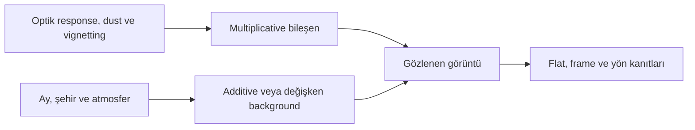
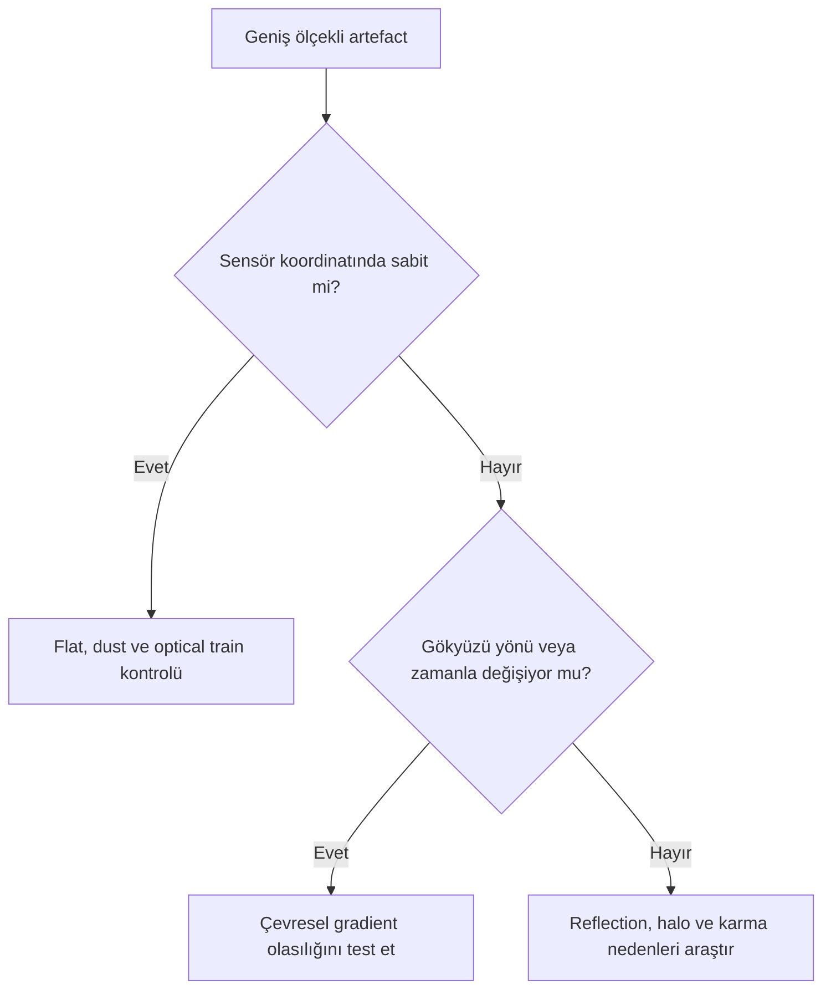
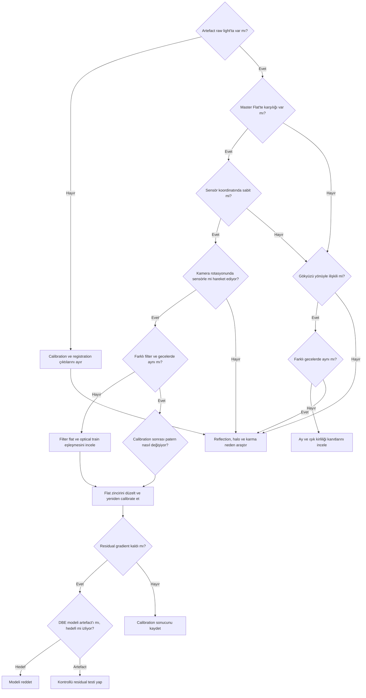

# Flat-field Hatası ve Gradient Ayrımı

## Amaç

Multiplicative flat-field response ile çoğunlukla additive gökyüzü gradient'ini kanıta dayalı biçimde ayırmak; gradient extraction'ı calibration onarımı gibi kullanmamak.

## Kavramsal açıklama

Basitleştirilmiş gözlem modeli şöyle düşünülebilir:

\[
I_{obs}(x,y) = R(x,y)\,[S(x,y)+B(x,y)] + A(x,y)
\]

Burada \(R\), pixel/optical response gibi multiplicative bileşeni; \(S\) gerçek hedef sinyalini; \(B\) gökyüzü arka planını; \(A\) ise eklenen geniş ölçekli bir bileşeni temsil eder. Gerçek kamera modeli daha karmaşıktır; denklem tanı ayrımını öğretmek içindir.

Doğru flat, aynı optical train koşullarındaki response'u modellemeyi amaçlar. Gökyüzü gradient'i ise zaman, yön ve atmosferle değişebilir. Bir background modeli vignetting görünümünü azaltabilse de hatalı calibration'ı fiziksel olarak geri kurmaz.

Pixel response non-uniformity, vignetting ve dust shadow flat'in modellemeye çalıştığı başlıca alan değişimleridir. Kamera rotasyonu, filter veya focus değişimi optical train geometrisini flat çekimine göre değiştirebilir. Flat panel illumination homojen değilse, flat exposure uygun değilse, flat dark/bias eşleşmiyorsa ya da Master Flat integration hatalıysa calibration sonrasında yeni veya güçlenmiş bir patern kalabilir.

## Ne zaman kullanılır?

- Köşe kararması, dust shadow veya yönlü sky background birbirine benziyorsa
- Optical train değişikliği, filter eşleşmesi ya da flat yaşı sorgulanıyorsa
- Gradient correction öncesi kök neden sınıflandırması gerektiğinde

## Ne zaman kullanılmaz?

- Tek STF görünümünden kesin kaynak tanısı koymak için
- Hatalı Master Flat'i DBE/ABE ile “tamir edilmiş” saymak için
- Gerçek nebula veya galaxy halo'yu calibration artefact'ı kabul etmek için

## Ön koşullar

- Light ve flat metadata'sı ile filter/binning/gain/offset kayıtları
- Optical train'in flat çekiminden sonra değişip değişmediği bilgisi
- Calibrated subframe ve integrated master'ın birlikte incelenmesi

## Menü yolu

Tanı tek bir process değildir. Calibration için `ImageCalibration`; background model testleri için `AutomaticBackgroundExtractor`, `DynamicBackgroundExtraction` veya sürümü doğrulanmışsa `GradientCorrection` değerlendirilir. Tam PixInsight 1.9.3 menü yolları **Doğrulama bekliyor**.

## Parametreler

| Belirti | Flat-field olasılığı | Gradient olasılığı | Ayırt edici kontrol |
| --- | --- | --- | --- |
| Aynı sensör konumunda dust halkası | Yüksek | Düşük | Light ve flat üzerindeki konumu karşılaştır |
| Merkez-köşe response paterni | Yüksek | Olası | Kamera döndürme ve farklı gece karşılaştırması |
| Şehir/Ay yönüne bağlı eğim | Düşük | Yüksek | Gökyüzü koordinatı ve zaman serisi |
| Kamera dönüşüyle sensörde sabit patern | Yüksek | Düşük | Sensör ve gökyüzü koordinatını ayır |
| Gece boyunca değişen geniş eğim | Düşük | Yüksek | Ardışık subframe statistics |
| Filtre değişince dust geometrisi aynı | Flat eşleşmesi sorgulanır | Tek başına kanıt değil | Her filter Master Flat'i incele |
| Köşelerde simetrik kararma | Yüksek | Orta | Master Flat ve kamera dönüş testi |
| Kamera rotasyonuyla gökyüzünde yön değiştiren yapı | Sensörde sabitse yüksek | Gökyüzünde sabitse yüksek | İki koordinat sistemini karşılaştır |
| Yalnız tek gecede görülen eğim | Düşük/orta | Yüksek | Geceleri ve çevre kayıtlarını karşılaştır |
| Tüm subframe'lerde aynı yerde yapı | Yüksek | Düşük/orta | Raw light ve flat eş konum kontrolü |
| Calibration sonrası güçlenen desen | Yüksek | Düşük | Master ve calibration ayarlarını denetle |
| Registration sonrası kenar artefact'ı | Düşük | Düşük | Registration sınırı ve overlap kontrolü |
| Mosaic seam | Panel flat farkı mümkün | Panel sky background farkı mümkün | Panelleri calibration öncesi/sonrası karşılaştır |
| Modelde nebula/halo görünmesi | Tanı koydurmaz | Yanlış background modeli riski | Modeli reddet |

## Uygulama veya tanı yaklaşımı

1. Raw light, Master Flat ve calibrated light'ı aynı sensör koordinatında karşılaştırın.
2. Dust ve vignetting geometrisinin tekrarlanıp tekrarlanmadığını kontrol edin.
3. Filter, binning, gain/offset ve optical train eşleşmesini doğrulayın.
4. Subframe'leri zaman ve kamera yönü bazında karşılaştırın.
5. Background modelinde gerçek sinyal veya calibration paterni arayın.
6. Flat zinciri hatalıysa önce calibration'ı düzeltin; correction ile gizlemeyin.
7. Karma neden olasılığında flat düzeltmesi sonrası residual gradient'i yeniden ölçün.

!!! warning "Kritik sınır"
    `DBE`, `ABE`, `GradientCorrection` veya GraXpert hatalı Master Flat'in yerine geçmez. Görsel olarak düzleşen sonuç, response kalibrasyonunun doğru olduğu kanıtı değildir.

!!! example "Görsel doğrulama ölçütü"
    Doğru Master Flat ve onunla calibrated light kayıt altında bulunmalıdır; görsel, eşleşen response modelinin dust ve vignetting paternini nasıl azalttığını gösterecek.

!!! example "Görsel doğrulama ölçütü"
    Hatalı veya eşleşmeyen Master Flat ile calibrated aynı light kayıt altında bulunmalıdır; görsel, yanlış response modelinin nasıl residual ürettiğini ya da paterni güçlendirdiğini gösterecek.

!!! example "Görsel doğrulama ölçütü"
    Dust shadow'ın light ve Master Flat üzerindeki eş konumu kayıt altında bulunmalıdır; görsel, sensör/optik koordinatında sabitliği kanıtlayacak.

!!! example "Görsel doğrulama ölçütü"
    Vignetting ve yönlü sky gradient yan yana kayıt altında bulunmalıdır; görsel, merkez-köşe simetrisi ile gökyüzü yönü farkını gösterecek.

!!! example "Görsel doğrulama ölçütü"
    Flat sonrası kalan çevresel gradient modeli kayıt altında bulunmalıdır; görsel, multiplicative düzeltme ile residual background modelinin ayrı aşamalar olduğunu gösterecek.

## Gerçek kullanım senaryosu

Bir RGB master'da köşeler koyu, sol kenar parlaktır. Tek DBE modeli uygulamak yerine her filter flat'i ve calibrated subframe incelenir. Köşe paterni sensör koordinatında sabit kaldığı için flat eşleşmesi düzeltilir; ardından sol kenardaki gece boyunca değişen residual şehir gradient'i ayrı modellenir.

## Tanı matrisi ve workflow position

| Davranış | Flat/calibration şüphesi | Sky gradient şüphesi |
|---|---|---|
| Kamera koordinatında sabit | Güçlü | Zayıf |
| Meridian/zamanla yön değiştiriyor | Zayıf | Güçlü |
| Dust donut veya vignetting profili | Güçlü | Zayıf |
| Filtre/gece/ufuk yönüne bağlı | Orta | Güçlü |
| Tek master'da, subframe'de yok | Integration/normalization incele | Integration sonrası model incele |

Flat hatası varsa önce [ImageCalibration](../03-kalibrasyon/image-calibration.md) ve master stratejisi düzeltilir. Gradient correction, calibration kusurunu kalıcı olarak onarmaz; yalnız görünümünü maskeleyebilir.

## Sık yapılan hatalar

1. Vignetting görünümünü otomatik olarak additive gradient saymak.
2. Yanlış filter Master Flat kullanmak.
3. Optical train değiştikten sonra eski flat'i sorgulamamak.
4. STF'nin paternleri abartabileceğini unutarak yalnız görsele güvenmek.
5. DBE ile düzleşen görüntüyü doğru calibration kanıtı sanmak.
6. Hem flat hem çevresel gradient bulunabileceğini göz ardı etmek.

## Sorun giderme

| Belirti | İlk kontrol | Karar |
| --- | --- | --- |
| Dust izi calibration sonrası büyüyor | Flat/light yönü ve eşleşme | Calibration'ı yeniden kur |
| Köşe residual'ı tüm gecelerde aynı | Master Flat ve optical train | Gradient modelinden önce flat |
| Eğimin yönü zamanla değişiyor | Ay/şehir/kamera yönü | Çevresel gradient analizi |
| Model vignetting'e benziyor | Flat zinciri | Correction'ı durdur |
| Flat düzeltildi ama eğim kaldı | Residual sky background | Ayrı model testi |

## SSS

??? question "Flat gradient'i kaldırır mı?"
    Flat multiplicative response'u düzeltir; değişken sky background aynı problem değildir.
??? question "DBE vignetting'i düzeltebilir mi?"
    Görünümü azaltabilir, fakat hatalı response calibration'ını geri kurduğu anlamına gelmez.
??? question "Dust izi neden gradient değildir?"
    Genellikle optical train/sensör koordinatında tekrarlanan response gölgesidir.
??? question "Flat ve gradient aynı anda bulunabilir mi?"
    Evet; önce calibration kanıtı düzeltilir, residual ayrı incelenir.
??? question "Division her multiplicative sorunu çözer mi?"
    Hayır. Correction modelinin fiziksel flat response'u doğru temsil ettiği varsayılamaz.
??? question "STF tanı için yeterli mi?"
    Hayır; statistics, frame serisi ve calibration ürünleriyle desteklenmelidir.

## Quick Reference

!!! tip "Tanı kontrol listesi"
    - [ ] Patern sensör ve gökyüzü koordinatlarında karşılaştırıldı
    - [ ] Filter/binning/gain/offset eşleşti
    - [ ] Optical train değişimi kontrol edildi
    - [ ] Dust ve vignetting Master Flat'te arandı
    - [ ] Zaman/yön değişimi ölçüldü
    - [ ] Flat sonrası residual gradient ayrı modellendi

## Decision Tree

## Teknik doğrulama durumu

| Kimlik | Kategori | Durum |
| --- | --- | --- |
| UI-3 | 1.9.3 process menüleri ve kontroller | Doğrulama bekliyor |
| DOC-3 | Flat calibration ve correction davranışı | Birincil process documentation gerekli |
| DATA-3 | Doğru/yanlış flat ve çevresel residual | Gerçek veri gerekli |
| IMG-3 | Flat, dust, vignetting ve sky karşılaştırmaları | Görsel gerekli |

## İlgili bölümler

- [ImageCalibration](../03-kalibrasyon/image-calibration.md)
- [Gradient Teorisi](gradient-theory.md)
- [Gradient Diagnostics](gradient-diagnostics.md)
- [Subtraction ve Division](division-vs-subtraction.md)
