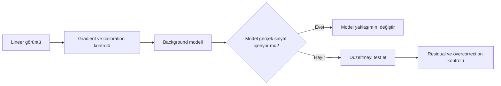
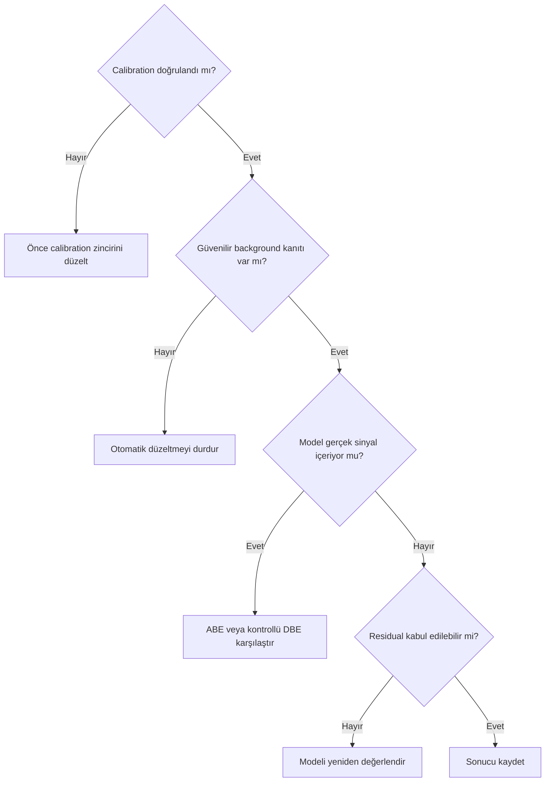

# GradientCorrection

!!! warning "Sürüm doğrulaması"
    `GradientCorrection` processinin PixInsight 1.9.3 içindeki kullanılabilirliği, arayüzü ve parametreleri gerçek kurulum ekranıyla doğrulanmayı bekliyor.

## Amaç

`GradientCorrection` yaklaşımını, gerçek hedef sinyalini bir background modeliyle karıştırmadan değerlendirmek ve sonucu model, residual ve orijinal görüntü üzerinden denetlemek.

## Kavramsal açıklama

Gradient correction, gözlenen geniş ölçekli arka plan değişimini tahmin eden bir model üretir ve bu modeli görüntüden ayırmayı amaçlar. Model, gökyüzü kaynaklı istenmeyen bileşeni temsil etmelidir; galaksi halosu, nebula veya cirrus içeriyorsa düzeltme bilimsel sinyali de azaltabilir.

Otomatik modelleme hız sağlar; kullanıcı kontrollü modelleme ise background kabul edilen bölgeler üzerinde daha fazla karar olanağı verir. Bu ayrım tek başına kalite sıralaması değildir. `ABE`, `DBE` ve `GradientCorrection` farklı veri geometrilerinde ayrı ayrı test edilmelidir.

!!! note "Renkli ve mono veri"
    Renkli görüntüde yoğunluk ve renk eğimi birlikte değerlendirilebilir. Mono veya narrowband kanallarda gerçek sinyal dağılımı kanaldan kanala değişebilir. Kanal bazlı ya da birleşik çalışma seçimi veri setiyle sınanmalıdır.

## Ne zaman kullanılır?

- Calibration zinciri doğrulanmış lineer görüntüde residual gradient kaldığında
- Background modelinin ayrıca incelenebildiği kontrollü bir testte
- ABE veya DBE sonucuna karşı bağımsız bir karşılaştırma gerektiğinde
- Renk ya da kanal davranışı orijinal görüntüyle karşılaştırılabildiğinde

## Ne zaman kullanılmaz?

- Yanlış Master Flat, dust shadow veya vignetting sorununu gizlemek için
- Hedef tüm kadrajı dolduruyor ve güvenilir background kanıtı yoksa
- Model gerçek nebula ya da galaksi halosunu içeriyorsa
- Yalnız arka planı siyaha yaklaştırmak amacıyla

## Ön koşullar

- Calibration ve registration çıktılarının kontrol edilmiş olması
- Görüntünün lineer durumunun bilinmesi
- Orijinal, model ve düzeltilmiş görüntülerin ayrı tutulması
- Aynı STF'nin veri değişikliği olmadığının, yalnız ekran gösterimi olduğunun bilinmesi

## Menü yolu

Process adı: `GradientCorrection`. Tam menü yolu ve PixInsight 1.9.3 içindeki konumu **Doğrulama bekliyor**.

## Parametreler

PixInsight 1.9.3 arayüzü görülmeden kontrol etiketleri, varsayılanlar veya sayısal öneriler verilmez.

| Özellik | GradientCorrection | ABE | DBE |
| --- | --- | --- | --- |
| Model oluşturma yaklaşımı | Sürüme bağlı davranış doğrulanmalı | Otomatik background tahmini | Kullanıcının sample dağılımıyla yönettiği model |
| Kullanıcı kontrolü | Arayüz doğrulaması gerekli | Görece sınırlı | Sample düzeyinde yüksek |
| Sample yönetimi | Doğrulama bekliyor | Kullanıcı tek tek sample yerleştirmez | Sample'lar görünür ve düzenlenebilir |
| Model denetimi | Çıktı olanakları doğrulanmalı | Model Image ile denetlenir | Model görüntüsüyle denetlenir |
| Kullanım hızı | Veri ve ayara bağlı | Genellikle hızlı başlangıç | Yerleşim nedeniyle daha fazla emek isteyebilir |
| Karmaşık hedef sinyalinde risk | Model mutlaka denetlenmeli | Otomasyon gerçek sinyali seçebilir | Yanlış sample gerçek sinyali seçebilir |
| Tekrarlanabilirlik | Process instance ve sürüme bağlı | Ayarlar kaydedilirse izlenebilir | Sample geometrisi kaydedilirse izlenebilir |
| Sürüm bağımlılığı | Yüksek; 1.9.3 doğrulanmadı | Arayüz ayrıntıları doğrulanmalı | Arayüz ayrıntıları doğrulanmalı |
| Gerçek veri doğrulama ihtiyacı | Zorunlu | Zorunlu | Zorunlu |

## Uygulama veya tanı yaklaşımı

1. Master Flat ve calibration eşleşmesini doğrulayın.
2. Lineer görüntüyü yeniden hesaplanmış STF ile inceleyin.
3. Orijinal görüntünün kopyasında bir model üretin.
4. Modelde yıldız halosu, nebula, galaksi dış halosu veya dust yapısı arayın.
5. Model güvenilir değilse düzeltmeyi kabul etmeyin.
6. Düzeltilmiş görüntüde residual gradient, renk sapması ve negatif clipping kontrolü yapın.
7. Sonucu ABE, DBE veya işlem görmemiş kopyayla aynı gösterim koşulunda karşılaştırın.

!!! example "Görsel eklenecek"
    PixInsight 1.9.3 `GradientCorrection` arayüzü eklenecek; görsel, processin kurulumda bulunduğunu ve gerçek kontrol adlarını kanıtlayacak.

## Gerçek kullanım senaryosu

Geniş alan renkli bir master'da calibration sonrası şehir yönüne doğru parlaklık ve renk eğimi kalır. Model görüntüsü galaktik cirrus içeriyorsa sonuç reddedilir; daha korumacı bir model veya kontrollü DBE testi yapılır. Kabul ölçütü arka planın koyuluğu değil, hedef sinyalinin korunması ve residual eğimin azalmasıdır.

## Sık yapılan hatalar

1. Processin 1.9.3'teki kontrol adlarını güncel bir sürümden varsaymak.
2. Model görüntüsünü incelemeden sonucu kabul etmek.
3. Flat-field artefact'ını gradient sanmak.
4. Eski STF ile önce/sonra karşılaştırmak.
5. Tüm mono kanallara aynı model kararını uygulamak.
6. Residual bırakmamak adına overcorrection yapmak.

## Sorun giderme

| Belirti | Olası açıklama | Kontrol |
| --- | --- | --- |
| Model hedefe benziyor | Gerçek sinyal background sayılmış | Modeli reddedin; alternatif yaklaşım deneyin |
| Köşeler bozuluyor | Flat residual veya model uyumsuzluğu | Calibration zincirini yeniden inceleyin |
| Renk dengesi kayıyor | Kanallar farklı modellenmiş | Kanal ve color cast davranışını karşılaştırın |
| Gradient kalıyor | Model yetersiz veya kaynak zamanla değişken | Residual haritayı ve subframe'leri inceleyin |
| Arka plan kırpılıyor | Aşırı düzeltme veya gösterim yanılgısı | Statistics ve yeniden hesaplanmış STF kullanın |

## SSS

??? question "GradientCorrection ABE'nin yerine mi geçer?"
    Hayır. Aynı veri üzerinde model ve residual kalitesi karşılaştırılmalıdır.

??? question "DBE'den daha iyi midir?"
    Evrensel bir sıralama yoktur; hedef yapısı, background erişimi ve denetim ihtiyacı belirleyicidir.

??? question "Lineer aşamada mı kullanılmalıdır?"
    Bu rehber lineer değerlendirmeyi temel alır; kesin süreç sırası gerçek pipeline ile doğrulanmalıdır.

??? question "Model tamamen düz olmalı mı?"
    Hayır. Model istenmeyen geniş ölçekli bileşeni gösterebilir; gerçek hedef sinyali göstermemelidir.

??? question "Renkli görüntü mü, ayrı kanallar mı?"
    Her iki yaklaşımın riski vardır. Hedefin kanallardaki dağılımı ve model davranışı test edilmelidir.

## Quick Reference

!!! tip "Kontrol listesi"
    - [ ] 1.9.3 process varlığı ve arayüzü doğrulandı
    - [ ] Calibration artefact olasılığı elendi
    - [ ] Görüntü lineer
    - [ ] Model gerçek sinyal içermiyor
    - [ ] Residual ve overcorrection kontrol edildi
    - [ ] Orijinal görüntü saklandı

## Decision Tree

## Teknik doğrulama durumu

| Kimlik | Kategori | Durum |
| --- | --- | --- |
| UI-3 | 1.9.3 process varlığı, menü yolu ve kontroller | Doğrulama bekliyor |
| DOC-3 | Process algoritması ve model davranışı | Birincil process documentation gerekli |
| DATA-3 | Renkli/mono gerçek veri karşılaştırması | Gerçek veri testi gerekli |
| IMG-3 | Arayüz, model ve residual ekranları | Görsel gerekli |

## İlgili bölümler

- [Gradient Diagnostics](gradient-diagnostics.md)
- [ABE](abe.md)
- [DBE](dbe.md)
- [Subtraction ve Division](division-vs-subtraction.md)

