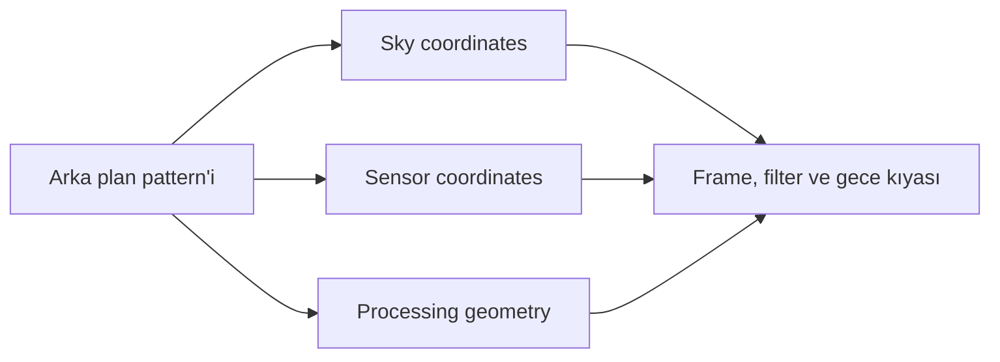
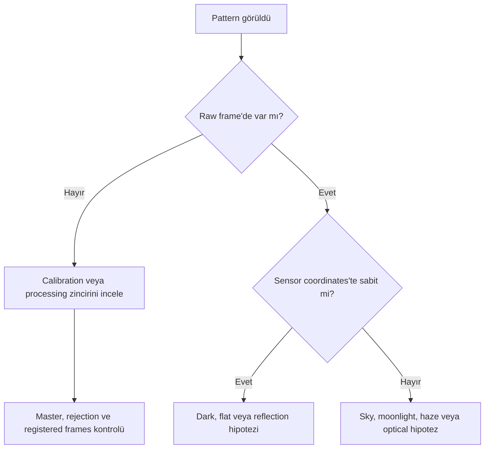
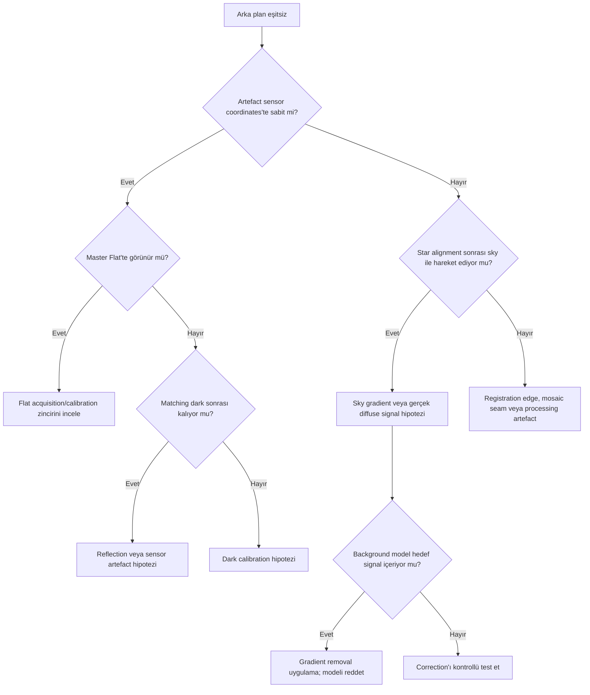
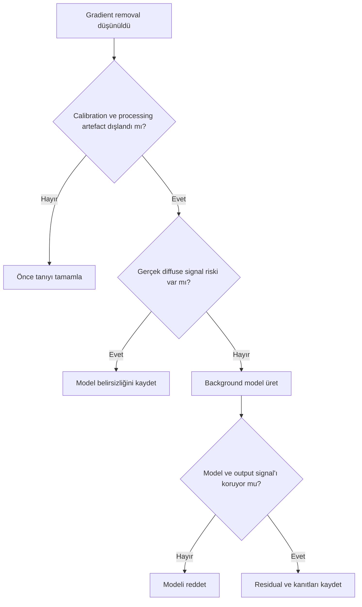

# Gradient Diagnostics

!!! info "Sayfa Bilgisi"
    **Kategori:** Gradient Düzeltme · **Düzey:** Intermediate · **Tahmini okuma:** 5 dk
    **Anahtar kelimeler:** `Gradient Tanısı` · `gradient removal` · `gradient düzeltme` · `background modeling`
    **Önerilen ön bilgiler:** [Calibration Pipeline](../03-kalibrasyon/calibration-pipeline.md) · [Gradient Teorisi](gradient-theory.md)

**Durum: Teknik doğrulama bekliyor — Sprint 2.2**

## Amaç

Arka plan eşitsizliğinin kaynağını gradient removal uygulamadan önce teşhis etmek; sky signal, calibration, optical artefact, sensor artefact ve processing artefact sınıflarını ayırmak.

!!! warning "Tanı ilkesi"
    Benzer görünen pattern’ler farklı kaynaklardan gelebilir. DBE/ABE ile görünümü azaltmak kök nedenin düzeltildiği anlamına gelmez.

## Kavramsal açıklama

Tanı üç koordinat sistemini karşılaştırır:

- **Sky coordinates:** yıldızlarla birlikte hareket eden gerçek sky signal.
- **Sensor coordinates:** kamera/sensör konumunda sabit pattern.
- **Processing geometry:** registration edge, mosaic seam veya normalization sonucu oluşan pattern.

### Kaynak tablosu

| Belirti | Muhtemel kaynak | Gradient removal uygun mu? | Önce yapılması gereken kontrol |
| --- | --- | --- | --- |
| Gökyüzü yönünde düzgün eğim | Gerçek sky gradient | Değerlendirilebilir | Farklı gece ve orientation |
| Şehir yönüne bağlı parlaklık | Light pollution | Değerlendirilebilir | Sky direction ve filter kıyası |
| Ay yönlü gradient/color | Moonlight | Değerlendirilebilir | Moon geometry, haze ve frames |
| Radial corner falloff | Vignetting | Önce calibration | Master Flat ve raw/calibrated |
| Calibration sonrası yeni pattern | Yanlış/eksik flat | Hayır, önce calibration | Flat group ve optical train |
| Sabit koyu halka/spot | Dust shadow | Önce flat | Master Flat’te aynı konum |
| Bright star çevresinde renkli halo | Filter halo | Global model riskli | Filter ve star position |
| Lokal yay/ghost | Internal reflection | Genellikle kök neden önce | Rotate/flip ve optical geometry |
| Sensör konumunda sabit ghost | Sensor reflection | Kök neden önce | Frame orientation/gece kıyası |
| Köşede sabit glow | Amp glow | Önce dark calibration | Matching Master Dark |
| Dither yönlü ince pattern | Walking noise | Hayır | Dither, rejection ve integration |
| Siyah/eksik ortak alan | Registration edge | Hayır | Registered frames ve crop |
| Panel sınırında geçiş | Mosaic seam | Tek başına yeterli değil | Panel normalization/geometry |
| Geçici geniş parlaklık | Cloud veya haze | Çoğu zaman frame QA önce | Subframes ve transparency |
| Geceler arası seviye farkı | Sky transparency | Normalization önce | Frame measurements |
| Kanal ağırlıklı arka plan rengi | Color cast | Kaynağa bağlı | Kanal histogramları/filter |
| Correction sonrası kalan eğim | Residual gradient | Yeniden model değerlendir | Model Image ve coverage |
| Ters lobe/halo veya signal kaybı | Overcorrection | Hayır, geri dön | Original/model/output |

### Tanı yöntemleri

1. STF ile aggressive fakat clipping farkındalıklı görüntüleme yapın.
2. Histogram ve background previews ile seviyeleri ölçün.
3. R/G/B veya narrowband kanalları ayrı inceleyin.
4. Model Image’ı target morphology ile karşılaştırın.
5. Rejection maps’te pattern’in integration kaynaklı olup olmadığını araştırın.
6. Master Flat’i aynı orientation’da inceleyin.
7. Raw ve calibrated frame’i aynı STF mantığıyla karşılaştırın.
8. Rotate/flip testiyle pattern’in sensor/optical koordinat ilişkisini araştırın.
9. Farklı geceleri ve filtreleri karşılaştırın.
10. Registration edges ve mosaic panel sınırlarını ayırın.

!!! info "Doğrulama sınırı"
    Rotate/flip, filtre ve gece karşılaştırmaları tek başına kesin kök neden kanıtı değildir; kontrollü acquisition metadata ve aynı processing koşulları gerekir.

## Gradient mi flat hatası mı?

## Gradient removal uygulanmaması gereken durumlar

- Gerçek nebula signal gradient sanılıyorsa
- Galaxy halo background sayılıyorsa
- Reflection nebula dış bölgeleri background sayılıyorsa
- Calibration artefact DBE ile gizlenmeye çalışılıyorsa
- Amp glow yanlış calibration nedeniyle kalmışsa
- Flat hatası yalnız DBE ile çözülmeye çalışılıyorsa

!!! example "Görsel doğrulama ölçütü"
    Bu bölüm gerçek PixInsight 1.9.3 ekran görüntüsü ve örnek veri ile doğrulanacaktır.

## Ne zaman kullanılır?

- ABE/DBE öncesinde
- Flat, dark, reflection veya sky gradient ayrılırken
- Correction sonrası residual/overcorrection araştırılırken
- Mosaic veya multi-night data değerlendirilirken

## Ne zaman kullanılmaz?

- Tek screenshot’tan kesin kök neden ilan etmek için
- Metadata olmadan rotate/flip sonucunu kesin kanıt saymak için
- Gerçek diffuse signal’ı yok varsaymak için

## Ön koşullar

- Raw ve calibrated örnekler
- Masters, logs ve acquisition metadata
- Kanal bazlı image’lar
- Aynı karşılaştırma STF/measurement planı

## Uygulama yaklaşımı

1. Pattern’i spatial olarak tanımlayın.
2. Raw/calibrated karşılaştırması yapın.
3. Sensor/sky/processing coordinates hipotezini kurun.
4. Master Flat/Dark ve rejection maps’i inceleyin.
5. Filter, gece ve orientation kıyaslarını yapın.
6. Kök neden çözülmeden gradient removal’a geçmeyin.
7. Model Image ve correction sonuçlarını ölçün.

## Gerçek kullanım senaryosu

!!! example "Calibration sonrası parlak köşe"
    Raw light’ta koyu vignetting görülürken calibrated light’ta parlak köşe oluşuyorsa önce Master Flat eşleşmesi ve calibration zinciri araştırılır. DBE ile parlak köşeyi azaltmak kök nedeni çözmüş sayılmaz.

## Ölçüm planı ve çıktı kabulü

Tanı tek bir stretched görünümle yapılmaz. Aynı STF altında görsel inceleme; köşe/merkez statistics, kanal profilleri, subframe zaman sırası ve calibration master kontrolüyle desteklenmelidir.

| Belirti | İlk hipotez | Ayırıcı test |
|---|---|---|
| Sabit dust donut | Flat mismatch | Tek tek calibrated frame ve master flat |
| Zamanla yön değiştiren parlaklık | Ay ışığı/sky gradient | Zaman, meridian ve Ay yönü dizisi |
| Registration yönünde çizgili doku | Walking noise | Dither ve frame sırası |
| Kanalda farklı büyük ölçekli yapı | Filtre/sky response | Kanal bazlı model ve subframe karşılaştırması |
| Master'da seam | Normalization/mosaic | Alt kümeleri ayrı integrate etme |

Tanı çıktısı “gradient var” cümlesi değil; kaynak hipotezi, onu destekleyen ölçüm, dışlanan alternatifler ve seçilecek correction türüdür.

## Sık yapılan hatalar

1. Her geniş pattern’i light pollution sanmak.
2. Amp glow’u gradient removal ile gizlemek.
3. Registration edge’i modellemeye çalışmak.
4. Color cast’i yalnız luminance gradient saymak.
5. Rotate/flip testini metadata olmadan kesin kanıt saymak.
6. Model Image hedef signal içerirken correction uygulamak.

## Sorun giderme

| Belirti | İlk karşılaştırma | Sonraki adım |
| --- | --- | --- |
| Calibration sonrası pattern | Raw vs calibrated | Master calibration zinciri |
| Filtreye özgü halo | Filter channels | Filter/reflection hipotezi |
| Geceye özgü eğim | Night groups | Moon/haze/transparency |
| Sensor sabit glow | Dark frames | Matching dark/amp glow |
| Panel sınırı | Mosaic inputs | Geometry/normalization |
| Correction sonrası ters pattern | Original/model/output | Overcorrection ve modeli reddetme |

## SSS

??? question "Rotate/flip testi neyi gösterir?"
    Pattern’in image, sensor veya optical geometry ile ilişkisine dair kanıt sağlar; tek başına kesin teşhis değildir.

??? question "Walking noise gradient midir?"
    Background eşitsizliği gibi görünebilir fakat dither/integration kaynaklı pattern’dir; gradient model ilk çözüm değildir.

??? question "Amp glow DBE ile çıkarılır mı?"
    Matching dark calibration önce incelenmelidir; DBE kök calibration hatasını gizleyebilir.

??? question "Mosaic seam gradient midir?"
    Panel normalization, geometry ve sky farkları birlikte olabilir; tek gradient varsayımı yeterli değildir.

??? question "Color cast nasıl incelenir?"
    Kanal histogramları, background previews, filtre ve sky koşulları birlikte karşılaştırılır.

??? question "Residual gradient ne demektir?"
    Correction sonrası kalan geniş ölçekli yapı olabilir; underfitting kadar gerçek signal korunumu da değerlendirilir.

## Hızlı Referans

!!! tip "Tek sayfalık kontrol listesi"
    - [ ] Pattern raw/calibrated karşılaştırıldı
    - [ ] Sensor/sky/processing coordinates ayrıldı
    - [ ] Master Flat ve Dark incelendi
    - [ ] Kanal, filtre ve gece kıyası yapıldı
    - [ ] Rejection maps ve registration edges kontrol edildi
    - [ ] Gerçek diffuse signal dışlanmadı
    - [ ] Model Image hedefe benzemiyor
    - [ ] Kök neden çözülmeden correction uygulanmadı

## Karar Ağacı

## Teknik doğrulama durumu

| Kategori | Bekleyen doğrulama |
| --- | --- |
| UI-1 | 1.9.3 diagnostic ekranları ve process outputs |
| DOC-1 | Artefact sınıflarının process kapsamıyla ilişkisi |
| DATA-1 | Rotate/filter/night ve raw/calibrated testleri |
| IMG-1 | Her artefact sınıfı için gerçek örnek |

## Ayrıca İnceleyin

- [Gradient Teorisi](gradient-theory.md)
- [Sample Yerleşimi](sample-placement.md)
- [Subtraction ve Division](division-vs-subtraction.md)
- [ImageCalibration](../03-kalibrasyon/image-calibration.md)

## İlgili Süreçler

- [AutomaticBackgroundExtractor](abe.md)
- [DynamicBackgroundExtraction](dbe.md)
- [Örnek Yerleşimi](sample-placement.md)
- [Subtraction ve Division](division-vs-subtraction.md)
- [GradientCorrection](gradient-correction.md)
- [GraXpert](graxpert.md)

## İlgili İş Akışları

- [LRGB Galaksi](../15-workflows/lrgb-galaxy.md)
- [Broadband Nebula](../15-workflows/broadband-nebula.md)
- [Emisyon Nebulası](../15-workflows/emission-nebula.md)
- [OSC İş Akışı](../15-workflows/osc-workflow.md)

## Önceki Bölüm

[← Subtraction ve Division](division-vs-subtraction.md)

## Sonraki Bölüm

[GradientCorrection →](gradient-correction.md)
