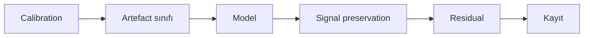
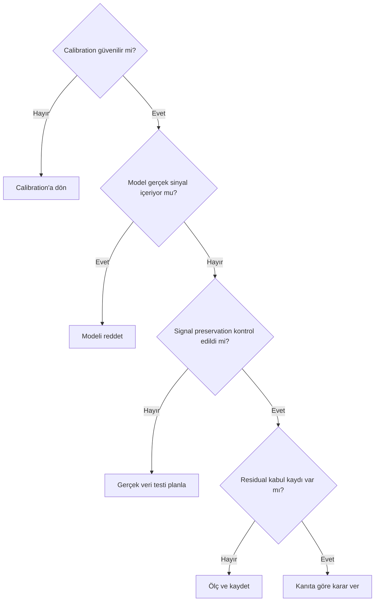

# Gradient Hızlı Referans

!!! info "Sayfa Bilgisi"
    **Kategori:** Gradient Düzeltme · **Düzey:** Intermediate · **Tahmini okuma:** 3 dk
    **Anahtar kelimeler:** `Gradient Hızlı Referansı` · `gradient removal` · `gradient düzeltme` · `background modeling`
    **Önerilen ön bilgiler:** [Calibration Pipeline](../03-kalibrasyon/calibration-pipeline.md) · [Gradient Teorisi](gradient-theory.md)

Yazdırılabilir kontrol sayfası. Sabit parametre reçetesi içermez; kararlar model ve gerçek veri kanıtına bağlanır.

## Gradient işleminden önce

- [ ] Görüntü lineer mi?
- [ ] Calibration logu ve Master Flat kontrol edildi mi?
- [ ] Raw/calibrated patern karşılaştırıldı mı?
- [ ] STF'nin yalnız ekran görünümü olduğu hatırlandı mı?
- [ ] Hedef sinyalinin uzamsal kapsamı işaretlendi mi?
- [ ] Galaxy halo, nebula ve reflection alanları ayrıldı mı?
- [ ] Filtre, gece ve kamera yönü kaydedildi mi?
- [ ] Orijinal çalışma kopyası korundu mu?
- [ ] Model output alınabilecek mi?
- [ ] Kabul ve ret kanıtı önceden tanımlandı mı?
- [ ] Registration ve rejection maps aynı yapıyı artefact olarak gösteriyor mu?
- [ ] Histogram, Statistics ve STF karşılaştırma koşulu kaydedildi mi?

## Gradient mi calibration artefact mı?

| Belirti | İlk olasılık | Kontrol |
| --- | --- | --- |
| Sensör koordinatında sabit dust/vignetting | Flat-field | Raw, flat ve calibrated kıyası |
| Gökyüzü yönüyle değişen geniş eğim | Çevresel gradient | Zaman, yön ve gece serisi |
| Kenarda tekrarlayan amp glow | Dark calibration | Master Dark eşleşmesi |
| Yay veya halka | Reflection/filter halo | Parlak kaynak, filtre ve rotasyon |
| Panel sınırı | Mosaic/normalization | Panel ve overlap çıktıları |
| Diffuse hedefe benzeyen model | Signal contamination | Modeli reddet |

## Sample yerleşimi

| Değerlendirilebilir alan | Riskli veya yanlış alan |
| --- | --- |
| Hedef sinyalinden uzak, temsil gücü olan background | Galaxy diski ve dış halo |
| Yıldız/halo etkisi düşük bölge | Nebula ve filamentler |
| Görüntü genelini dengeli temsil eden alan | Dust lane ve reflection |
| Kanala özgü doğrulanmış background | Faint OIII ve diffuse Ha |
| Modelde contamination üretmeyen sample | Yalnız sayıyı artırmak için eklenen sample |

## Model Image kontrolü

- [ ] Galaxy disk/spiral izi yok.
- [ ] Dış halo görünmüyor.
- [ ] Nebula filamentleri görünmüyor.
- [ ] Diffuse Ha veya faint OIII görünmüyor.
- [ ] Yıldız merkezleri/haloları belirgin değil.
- [ ] Dust donut veya amp glow “sky” olarak modellenmiyor.
- [ ] Model, gözlenen geniş ölçekli eğimle ilişkili.
- [ ] Alternatif sample/model setinde sonuç karşılaştırılabilir.

## Subtraction ve Division

| Konu | Subtraction değerlendirmesi | Division değerlendirmesi |
| --- | --- | --- |
| Kavramsal kaynak | Additive model için değerlendirilebilir | Multiplicative model için değerlendirilebilir |
| Temel risk | Background clipping/offset | Düşük model bölgelerinde parlaklık/noise artışı |
| Flat ilişkisi | Flat'in yerine geçmez | Doğru flat calibration'ın eşdeğeri değildir |
| Kabul kanıtı | Model, statistics, residual | Model, statistics, noise ve residual |
| Karar | Kök neden ve gerçek veri testi | Kök neden ve gerçek veri testi |

## Araç seçimi

| Araç | Değerlendirilebilecek durum | Ana denetim | Sınır |
| --- | --- | --- | --- |
| ABE | Hızlı ön model | Model Image | Otomasyon hedef sinyalini seçebilir |
| DBE | Sample kontrolü gerektiğinde | Sample haritası ve model | Background sınırlıysa risklidir |
| GradientCorrection | Alternatif PixInsight modeli | Model/output; 1.9.3 UI | Sürüm doğrulaması bekliyor |
| GraXpert | Haricî model karşılaştırması | Background output ve round-trip | Metadata/bit depth testi gerekir |

## Sinyal koruma

| Hedef türü | Kontrol |
| --- | --- |
| M31/galaxy | Disk, outer halo, dust lane ve companion çevresi |
| Genel galaxy | Radial profile, spiral yapı ve düşük yüzey parlaklığı |
| Emission nebula | Diffuse alan ve filament sürekliliği |
| Reflection nebula | Geniş yansıma yapısı ve renk eğimi ayrımı |
| Narrowband | Ha/OIII ayrı model, faint halo, noise ve clipping |

## İşlem sonrasında

- [ ] Model, corrected target ve process instance birlikte saklandı mı?
- [ ] Clipping ve residual ölçümleri kabul sınırında mı?
- [ ] Color calibration'a geçmeden signal preservation belgelendi mi?

- [ ] STF sıfırlandı ve yeniden hesaplandı.
- [ ] Original/Model/Corrected birlikte incelendi.
- [ ] Model gerçek hedef sinyali açısından kontrol edildi.
- [ ] Fark görüntüsü değerlendirildi.
- [ ] Statistics ve clipping kontrol edildi.
- [ ] Residual gradient kaydedildi.
- [ ] Kanal dengesi karşılaştırıldı.
- [ ] Halo, filament ve düşük yüzey parlaklığı incelendi.
- [ ] Araç, correction ve sample yaklaşımı kaydedildi.
- [ ] Görsel referansı ve nihai karar eklendi.

## Acil hata rehberi

| Belirti | İlk kontrol |
| --- | --- |
| Less than three samples | Background alanı ve sample haritası |
| Model nebulaya benziyor | Signal contamination |
| Model galaxy içeriyor | Disk/halo koruma alanı |
| Subtraction sonrası siyah | STF, statistics ve clipping |
| Division sonrası parlak | Model dağılımı ve kök neden |
| Division sonrası noise | Aynı ROI statistics |
| Galaxy halo kayboldu | Model ve fark görüntüsü |
| OIII zayıfladı | OIII sample/model |
| Yıldız haloları belirgin | Modelde yıldız izi |
| RGB background uyuşmuyor | Kanal modelleri |
| Dust donut kaldı | Master Flat ve optical train |
| Amp glow kaldı | Master Dark eşleşmesi |
| Reflection kaldı | Parlak kaynak, filtre, rotasyon |
| GraXpert dönüşü farklı | Metadata, bit depth, statistics |
| SPCC sonrası renk bozuk | İşlem sırası ve kanal modeli |

## Kayıt şablonu

| Alan | Kayıt |
| --- | --- |
| Target / channel | |
| Tarih / integration | |
| Calibration durumu | |
| Artefact sınıfı | |
| Araç / correction | |
| Sample yaklaşımı | |
| Model kontrolü | |
| Signal preservation | Gerçek veri bekliyor |
| Residual | Gerçek veri bekliyor |
| Karar / görsel | |

## Karar Ağacı

## Yazdırma notu

Bu sayfa A4 çıktıda başlık, tablo ve kontrol listeleriyle bağımsız okunacak biçimde tasarlanmıştır. Anlam yalnız renkli admonition kutularına bağlı değildir.

## Ayrıca İnceleyin

- [Gerçek İş Akışları](real-workflows.md)
- [Gradient Hata Kartları](error-cards.md)
- [Gradient Diagnostics](gradient-diagnostics.md)

## Önceki Bölüm

[← Gradient Hata Kartları](error-cards.md)

## Sonraki Bölüm

[Renk Kalibrasyonuna Giriş →](../05-color-calibration/index.md)
