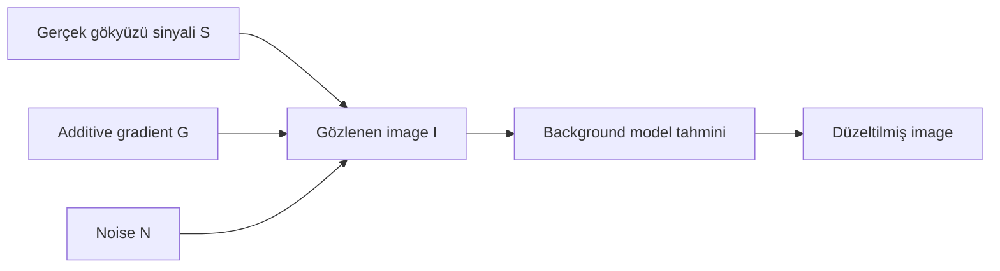
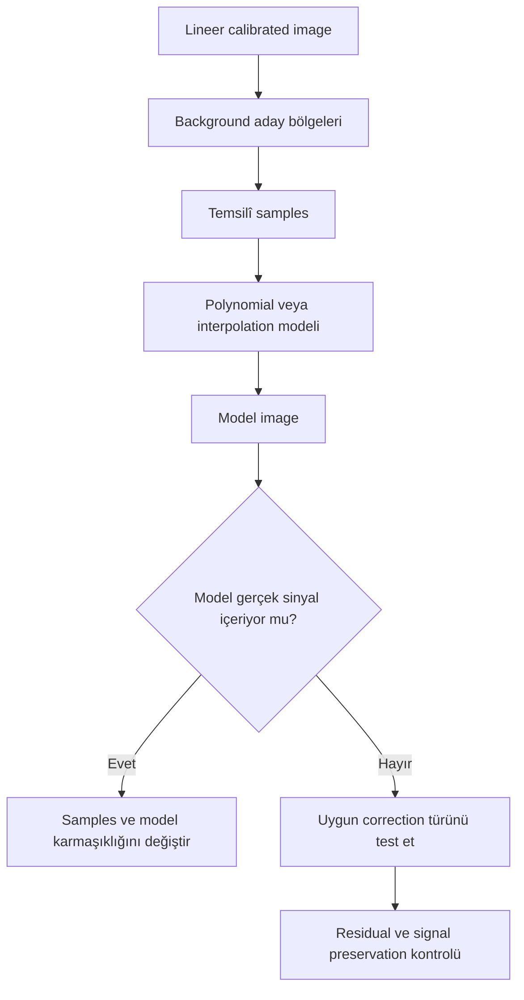
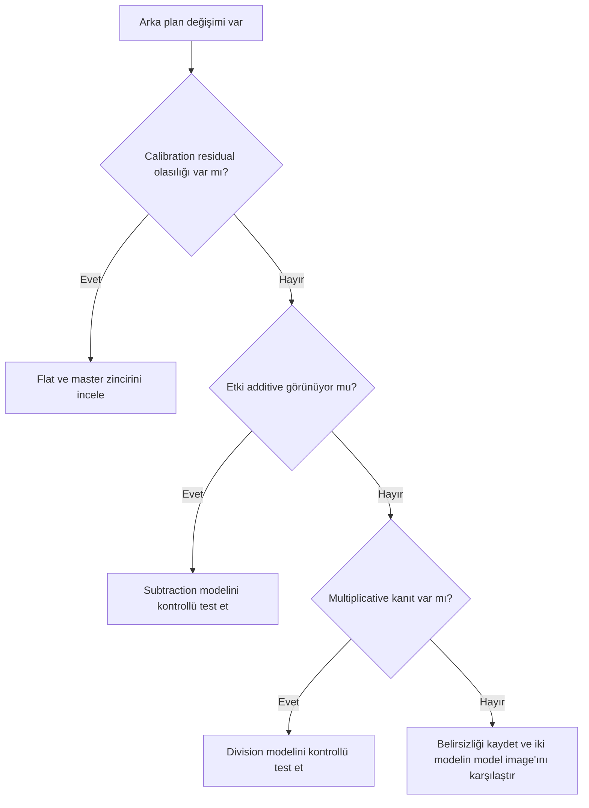

# Gradient Teorisi

!!! info "Sayfa Bilgisi"
    **Kategori:** Gradient Düzeltme · **Düzey:** Intermediate · **Tahmini okuma:** 7 dk
    **Anahtar kelimeler:** `Gradient Teorisi` · `gradient removal` · `gradient düzeltme` · `background modeling`
    **Önerilen ön bilgiler:** [Calibration Pipeline](../03-kalibrasyon/calibration-pipeline.md) · [Gradient Teorisi](gradient-theory.md)

**Durum: Teknik incelemeye hazır — Sprint 2.1**

## Amaç

Gradient düzeltmeyi “arka planı karartma” işlemi olmaktan çıkarıp gerçek sinyal, istenmeyen arka plan bileşeni ve tahmin edilen model arasındaki ayrım üzerinden öğretmek.

!!! note "Modelleme ilkesi"
    Background extraction yalnız gözlenen veriden bir model tahmin eder. Modelin fiziksel olarak doğru olması, sample’ların gerçek background’u temsil etmesine ve seçilen model ailesinin probleme uygun olmasına bağlıdır.

## Teori

### Gradient nedir?

Gradient, image koordinatları boyunca değişen ve hedef sinyalle karışan istenmeyen arka plan bileşenidir. Basit bir modelde gözlenen image şöyle yazılabilir:

[
I(x,y)=S(x,y)+G(x,y)+N(x,y)
]

Burada (S) gerçek gökyüzü sinyali, (G) additive gradient ve (N) noise bileşenidir.



### Background model nedir?

Background model, gerçek hedef yapısı olmadığı varsayılan ölçümlerden tahmin edilen düzgün veya interpolated yüzeydir. Model, gradient’in kendisiyle aynı olmak zorunda değildir; yalnız verinin ve model varsayımlarının izin verdiği bir tahmindir.

### Gerçek sinyal ve background model

Background sample içine nebula, galaksi halosunun zayıf uzantısı, IFN veya reflection nebulosity girerse model bu gerçek sinyali background sanabilir. Model image’ın hedefe benzemesi bu riskin en güçlü görsel uyarılarındandır.

!!! warning "Gerçek sinyal riski"
    Alanın büyük bölümünü gerçek diffuse signal kaplıyorsa yalnız image içinden güvenilir background modeli çıkarmak yetersiz belirlenmiş bir problem olabilir.

### Additive ve Multiplicative etkiler

Additive modelin sade gösterimi:

```text
observed = signal + gradient
corrected ≈ observed - estimated_gradient
```

Bu çıkarma yalnız additive model varsayımı geçerliyse anlamlıdır.

Multiplicative modelin sade gösterimi:

```text
observed = signal × response
corrected ≈ observed ÷ estimated_response
```

Bu bölme yalnız multiplicative response varsayımı geçerliyse anlamlıdır. Gerçek image’da iki etki birlikte bulunabilir. Flat-field calibration ile gradient removal birbirinin alternatifi değildir; correction seçimi veri ve model kanıtıyla yapılmalıdır.

!!! info "Sprint kapsamı"
    Subtraction ve Division yöntemlerinin ayrıntılı karşılaştırması Sprint 2.2’de ele alınacaktır. Bu gösterimler yalnız kavramsal ayrımı öğretir; PixInsight algoritmasının eksiksiz tanımı değildir.

### Polynomial model mantığı

Düşük dereceli polynomial yüzey, yavaş değişen background’u sınırlı sayıda coefficient ile temsil edebilir. Degree arttıkça model esnekliği artar; bunun PixInsight 1.9.3 içindeki kesin uygulaması ve sınır davranışı **Doğrulama bekliyor**.

Polynomial derece ile “gradient şiddeti” aynı kavram değildir. Güçlü ama basit bir gradient düşük karmaşıklıkta; zayıf ama şekil olarak karmaşık bir gradient daha farklı bir model gerektirebilir.

### Interpolation kavramı

Interpolation, ölçülen sample değerleri arasındaki background yüzeyini tahmin eder. Sample coverage yetersizse model, sample olmayan bölgelerde gerçeği garanti etmez. Kenarlarda ve geniş gerçek sinyal bölgelerinde extrapolation benzeri belirsizlikler artabilir.



### Neden her gradient aynı değildir?

- Kaynak additive veya multiplicative olabilir.
- Gradient tek eksenli, radial, lokal, yansıma kaynaklı ya da çok bileşenli olabilir.
- Narrowband ve broadband kanallarda arka plan yapısı farklı olabilir.
- Mosaic, wide-field ve güçlü diffuse signal alanlarında güvenilir background bölgeleri azalabilir.
- Calibration residual’ı ile sky gradient üst üste binebilir.

### Gradient düzeltmenin sınırları

Model yalnız sample’ların taşıdığı bilgiyi ve seçilen matematiksel esnekliği kullanır. Gerçek sinyalle gradient aynı spatial scale’deyse ayrım belirsizleşir. Overfitting gerçek sinyali kaldırabilir; underfitting residual gradient bırakabilir.

### Flat neden gradient yerine geçmez?

Flat, aynı optical train’de pixel sensitivity, vignetting ve dust gibi multiplicative response bileşenlerini ölçmek için acquisition sırasında elde edilen calibration verisidir. ABE/DBE ise science image içinden background modeli tahmin eder. Biri diğerinin güvenilir ikamesi değildir.

### Gradient neden tamamen yok edilemeyebilir?

- Background sample bulunmaması
- Gradient ile gerçek diffuse signal’ın aynı bölgeleri paylaşması
- Yansıma veya lokal yapıların seçilen model ailesine uymaması
- Flat-field residual ve additive gradient’in birlikte bulunması
- Image sınırlarında yetersiz model desteği
- Noise ve clipping nedeniyle background ölçümünün belirsizleşmesi

!!! info "Doğru hedef"
    Amaç sıfır varyasyonlu siyah bir zemin değil; gerçek sinyali korurken kanıtlanabilir istenmeyen background bileşenini azaltmaktır.

## Ne zaman kullanılır?

- ABE veya DBE öncesinde correction türünü anlamak için
- Flat residual ile sky gradient’i ayırırken
- Model image’ın fiziksel anlamını değerlendirirken
- Polynomial veya interpolation karmaşıklığını seçerken

## Ne zaman kullanılmaz?

- Bu teoriyi tek başına evrensel parameter preset’ine dönüştürmek için
- Calibration problemi çözülmeden sentetik modelle gizlemek için
- Gerçek diffuse signal’ın bulunmadığını varsaymak için

## Menü yolu

Bu dosya teorik referanstır; bir PixInsight process’i değildir.

## Parametreler

| Model bileşeni | Anlam | Ana risk |
| --- | --- | --- |
| Sample support | Background’u temsil ettiği varsayılan ölçümler | Gerçek sinyal contamination |
| Model complexity | Polynomial degree veya interpolation esnekliği | Underfitting/overfitting |
| Correction type | Subtraction veya Division | Yanlış fiziksel model |
| Normalization | Çıkış seviyesini/ölçeğini korumaya yönelik seçenek | Kesin 1.9.3 davranışı doğrulanmalı |
| Model inspection | Tahmin edilen background image | Modelde gerçek sinyali kaçırmak |

## Adım adım kullanım

1. Calibration geçmişini doğrulayın.
2. Gradient’in spatial biçimini STF ile inceleyin.
3. Additive ve multiplicative hipotezleri ayırın.
4. Gerçek diffuse signal bölgelerini belirleyin.
5. Temsilî background ölçümlerini seçin.
6. En basit yeterli modeli üretin.
7. Model image’ı hedef yapısıyla karşılaştırın.
8. Correction sonrası residual, noise ve signal preservation kontrolü yapın.

## Gerçek kullanım senaryosu

!!! example "Emission nebula alanı"
    Ha master’ın büyük bölümünde zayıf emission bulunuyorsa karanlık görünen her alan gerçek background değildir. Model, yalnız güvenilir bölgelerle sınanır. Tam gradient kaldırma hedefi yerine gerçek filamentlerin model image’a geçmemesi kabul ölçütü yapılır.

## Model kabul ölçütleri ve performans

| Ölçüt | Kabul edilen model | Reddedilen model |
|---|---|---|
| Ölçek | Yavaş değişen background | Yıldız/filament ölçeğinde yapı |
| Morfoloji | Kaynak hipoteziyle uyumlu yön | Galaxy veya nebula morfolojisi |
| Residual | Belirgin azalma | Yeni halka, seam veya kanal lekesi |
| Signal preservation | Halo ve diffuse sınırlar korunur | Hedef dış bölgeleri zayıflar |

Polynomial degree veya sample sayısı arttıkça model maliyeti ve overfit riski artabilir. En karmaşık modeli değil, bağımsız tanı kanıtını karşılayan en basit modeli seçin. Uygulama için [Gradient Diagnostics](gradient-diagnostics.md), [ABE](abe.md) ve [DBE](dbe.md) sayfalarını izleyin.

## Sık yapılan hatalar

1. Her gradient’i additive kabul etmek.
2. Flat-field residual’ını DBE ile fiziksel olarak çözülmüş saymak.
3. Polynomial Degree yükseldikçe modelin otomatik iyileştiğini sanmak.
4. Sample bulunmayan bölgelerde interpolation’ı kesin gerçek kabul etmek.
5. Model image’ı incelememek.
6. Background’u sıfıra yaklaştırmayı doğruluk ölçütü yapmak.

## Sorun giderme

| Belirti | Modelleme yorumu | Eylem |
| --- | --- | --- |
| Model nebula içeriyor | Sample contamination/overfitting | Sample ve karmaşıklığı yeniden kurun |
| Residual geniş ölçekli yapı | Underfitting veya yetersiz coverage | Model ailesini ve coverage’ı inceleyin |
| Division çok güçlü | Multiplicative model uygun olmayabilir | Correction hipotezini yeniden değerlendirin |
| Subtraction clipping üretiyor | Seviye/normalize davranışı | Statistics ve 1.9.3 option davranışını doğrulayın |
| Kenar hatası | Yetersiz sample desteği | Kenar coverage ve model sınırını inceleyin |

## SSS

??? question "Gradient her zaman ışık kirliliği midir?"
    Hayır. Ay, atmosfer, airglow, yansımalar ve calibration residual’ları benzer görünüm oluşturabilir.

??? question "Additive ve multiplicative aynı anda olabilir mi?"
    Evet. Bu durumda tek bir basit correction bütün bileşenleri doğru modellemeyebilir.

??? question "Polynomial Degree neden yükseltilmez?"
    Daha yüksek esneklik gerçek sinyali modelleme riskini artırabilir; yalnız veri kanıtıyla değerlendirilir.

??? question "Interpolation sample olmayan yerde gerçeği bilir mi?"
    Hayır. Seçilen model ve komşu sample’lardan tahmin üretir.

??? question "Flat neden ABE/DBE ile üretilemez?"
    Science image içindeki background modeli pixel-level response ve dust gibi flat bilgisini güvenilir biçimde yeniden kuramaz.

??? question "Residual gradient başarısızlık mıdır?"
    Her zaman değil. Gerçek sinyali korumak için kontrollü residual bırakmak aşırı düzeltmeden daha güvenilir olabilir.

## Hızlı Referans

!!! tip "Tek sayfalık kontrol listesi"
    - [ ] Calibration zinciri doğrulandı
    - [ ] Additive/multiplicative hipotez ayrıldı
    - [ ] Gerçek diffuse signal bölgeleri belirlendi
    - [ ] Sample coverage temsilî
    - [ ] En basit yeterli model kullanıldı
    - [ ] Model image gerçek sinyal içermiyor
    - [ ] Residual ve clipping kontrol edildi

## Karar Ağacı



## Teknik doğrulama durumu

| Sınıf | Durum |
| --- | --- |
| A | Additive/multiplicative ayrımı ve model belirsizliği sürümden bağımsız |
| B | ABE/DBE’nin kesin model ve Normalize davranışı **Doğrulama bekliyor** |
| C | Kamera veya exposure için kesin değer verilmedi |
| D | Polynomial ve interpolation uygulama ayrıntıları birincil kaynak gerektirir |

!!! warning "Doğrulama durumu"
    PixInsight 1.9.3’te ABE ve DBE’nin polynomial, interpolation, correction ve normalization uygulama ayrıntıları yerleşik process documentation ile doğrulanmayı bekliyor.

## Önceki Bölüm

[← Gradient Bölümüne Giriş](index.md)

## Sonraki Bölüm

[AutomaticBackgroundExtractor →](abe.md)
