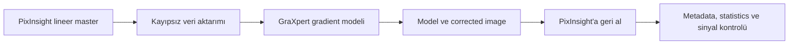
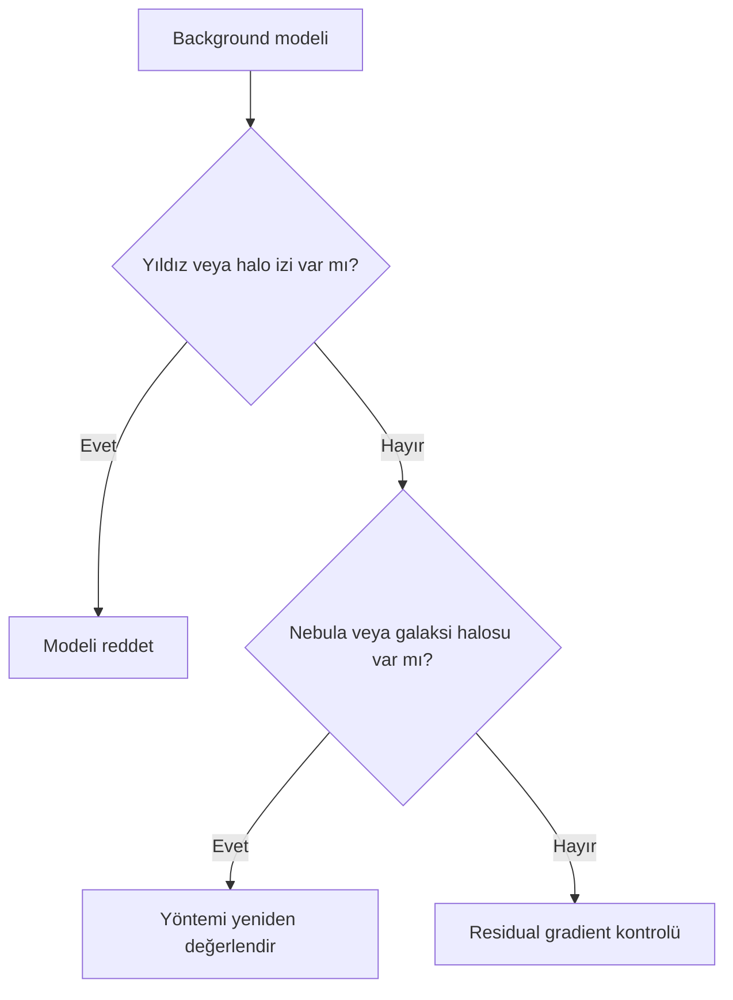
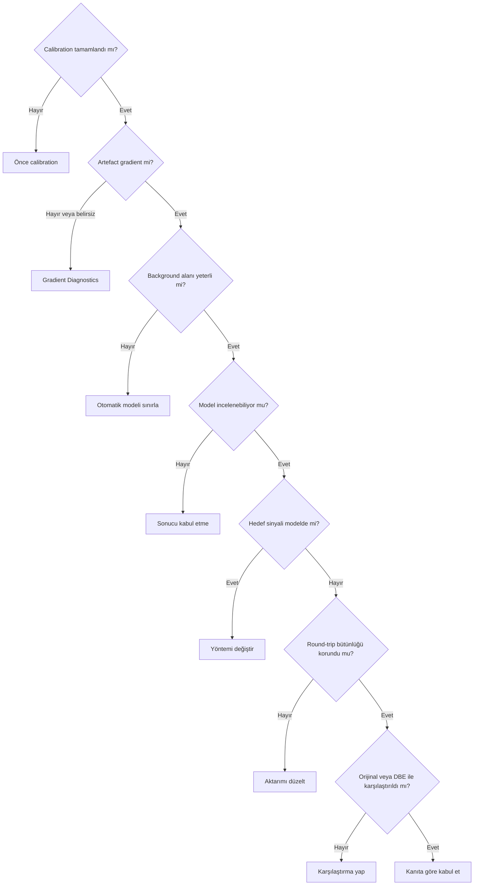

# GraXpert Entegrasyonu

!!! info "PixInsight 1.9.3 UI doğrulaması"
    Menü yolu ile görünür section ve kontrol adları supplied ekran görüntüleri üzerinden doğrulandı. Görünen değerler fabrika varsayılanı sayılmadı; davranış ve algoritma iddiaları bu statik UI kanıtının dışındadır. Ayrıntılı kayıt: `validation/ui/pi-1.9.3/graxpert/graxpert-evidence-matrix.md`.

!!! info "Haricî araç"
    GraXpert, PixInsight processi değildir. Açık kaynaklı bağımsız bir gradient extraction uygulamasıdır; bu sayfa onu PixInsight 1.9.3 iş akışına veri bütünlüğü kontrolleriyle bağlar.

## Amaç

GraXpert ile lineer veri alışverişini, background model denetimini ve round-trip risklerini tarafsız biçimde açıklamak.

## Kavramsal açıklama

GraXpert klasik interpolation yaklaşımlarıyla kullanıcı sample'larından veya AI tabanlı bir yaklaşımla background tahmini yapabilir. Sürüm, model adı ve arayüz alanları değişebileceği için burada sabitlenmez. Denoising özelliği bulunuyorsa gradient removal'dan ayrı bir işlem ve ayrı bir deney olarak değerlendirilmelidir.

`FITS`, `XISF` ve `TIFF` seçiminde yalnız dosyanın açılması yeterli kanıt değildir. Floating-point hassasiyeti, kanal düzeni, color profile ve metadata gidiş-dönüşte karşılaştırılmalıdır. Kesin format desteği ve bit-depth seçenekleri kullanılan GraXpert sürümünde **Doğrulama bekliyor**.

## Ne zaman kullanılır?

- Haricî uygulamaya aktarım kontrollü biçimde yapılabiliyorsa
- Model çıktısı gerçek hedef sinyali açısından incelenebiliyorsa
- Sonuç DBE, ABE veya orijinal görüntüyle karşılaştırılacaksa
- Geniş alan gradient için alternatif bir model deneyi gerekiyorsa

## Ne zaman kullanılmaz?

- Calibration veya flat-field hatasını örtmek için
- Dosya hassasiyeti ve metadata korunumu ölçülmeden
- Hedef tüm alanı doldururken model güvenilirliği test edilmeden
- Gradient removal ve denoising aynı anda uygulanıp etkileri ayrılamıyorsa

## Ön koşullar

- Calibration tamamlanmış ve artefact sınıflandırılmış olmalı
- Lineer veri kopyası ve orijinal dosya korunmalı
- Kullanılan GraXpert sürümü, model dosyası ve ayarlar kayda alınmalı
- PixInsight'a dönüşte ölçülebilir kontrol planı bulunmalı

## Menü yolu

GraXpert bağımsız uygulamadır; PixInsight menü yolu yoktur. Güncel uygulama arayüzü **Doğrulama bekliyor**.

## Parametreler

| Değerlendirme alanı | ABE | DBE | GradientCorrection | GraXpert |
| --- | --- | --- | --- | --- |
| Otomasyon düzeyi | Yüksek | Daha düşük | Sürüme göre doğrulanmalı | Klasik ve AI yaklaşımına göre değişir |
| Kullanıcı kontrolü | Sınırlı | Sample düzeyinde | Arayüz doğrulanmalı | Yönteme göre değişir |
| Background model görünürlüğü | Model Image | Model output | Doğrulanmalı | Background model çıktısı incelenmeli |
| Haricî uygulama gereksinimi | Yok | Yok | Yok | Var |
| Metadata korunumu riski | Uygulama içi | Uygulama içi | Uygulama içi | Round-trip nedeniyle ayrıca test edilmeli |
| Yoğun nebula alanı | Model riski | Sample riski | Model riski | Model riski |
| Galaxy halo riski | Var | Var | Var | Var |
| Geniş alan görüntü | Test gerekir | Sample erişimine bağlı | Test gerekir | Test gerekir |
| Mono narrowband kanal | Kanal bazlı doğrulama | Kanal bazlı doğrulama | Doğrulama bekliyor | Kanal bazlı doğrulama |
| Tekrarlanabilirlik | Ayar kaydıyla | Sample kaydıyla | Process instance'a bağlı | Sürüm, yöntem ve ayar kaydıyla |
| Gerçek veri testi gereksinimi | Zorunlu | Zorunlu | Zorunlu | Zorunlu |

## Uygulama veya tanı yaklaşımı

1. Calibration'ın tamamlandığını ve sorunun gradient olduğunu doğrulayın.
2. Orijinal lineer dosyayı koruyun; aktarım formatı ve hassasiyetini kaydedin.
3. Gradient extraction ile denoising'i ayrı çalıştırın.
4. Background model ve corrected image çıktılarını ayrı kaydedin.
5. Modelde star halo, galaxy halo ve nebula sinyali arayın.
6. Corrected image'ı PixInsight'a geri alın.
7. Dimensions, channels, statistics, clipping ve metadata'yı orijinalle karşılaştırın.
8. Sonucu DBE veya işlem görmemiş veriyle aynı STF koşulunda karşılaştırın.

!!! example "Görsel eklenecek"
    GraXpert ana arayüzü eklenecek; görsel, kullanılan sürümü ve seçilen model yaklaşımını kanıtlayacak.

!!! example "Görsel eklenecek"
    GraXpert Background model eklenecek; görsel, star halo, galaxy halo veya nebula sinyalinin modele girip girmediğini gösterecek.

!!! example "Görsel eklenecek"
    GraXpert corrected image eklenecek; görsel, residual gradient, clipping ve signal preservation kontrolünün nasıl yapıldığını gösterecek.

!!! example "Görsel eklenecek"
    Aynı master'ın GraXpert ve DBE sonuçları eklenecek; görsel, araç kazananı değil residual ve signal preservation farkını gösterecek.

## Gerçek kullanım senaryosu

Geniş alan lineer master, floating-point veri korunacak şekilde dışarı aktarılır. GraXpert modeli gerçek nebula yapısı açısından denetlenir. Geri alınan corrected image'ın dimensions, channel statistics ve metadata alanları orijinalle karşılaştırılır; SPCC uygulanmadan önce gradient sonucu kabul edilir veya reddedilir.

!!! warning "SPCC sırası"
    Gradient düzeltmenin SPCC öncesi veya sonrası yapılmasına ilişkin kesin reçete verilmez. Background değişiminin color calibration ölçümünü, SPCC'nin de karşılaştırma görünümünü etkileyebileceği dikkate alınmalı; sıra gerçek veriyle test edilmelidir.

## Sık yapılan hatalar

1. STF görünümünü gerçek pixel değişikliği sanmak.
2. 16-bit aktarımı kaynak floating-point veriye eşdeğer kabul etmek.
3. Metadata ve color profile kaybını kontrol etmemek.
4. AI modelini denetimsiz kabul etmek.
5. Denoising ile gradient removal etkisini aynı testte karıştırmak.
6. Güncel arayüz bilgisini sabit sürüm gerçeği gibi yazmak.

## Sorun giderme

| Belirti | Olası neden | Kontrol |
| --- | --- | --- |
| PixInsight'ta ton değişti | Format, profile veya gösterim farkı | Statistics ve STF'yi yeniden hesaplayın |
| Metadata eksik | Round-trip formatı alanları taşımadı | Orijinal header ile karşılaştırın |
| Modelde nebula var | Gerçek sinyal background sayılmış | Sonucu reddedin; yöntem/sample değiştirin |
| Renk kanalları kaydı | Kanal düzeni veya profile sorunu | Kanal isimlerini ve dimensions'ı denetleyin |
| Sonuç fazla pürüzsüz | Denoising de uygulanmış olabilir | İşlemleri ayırıp yeniden test edin |

## SSS

??? question "GraXpert PixInsight eklentisi midir?"
    Bu rehberde bağımsız haricî uygulama olarak ele alınır.

??? question "AI modu her zaman daha iyi midir?"
    Hayır. Model gerçek sinyal ve residual gradient üzerinden doğrulanmalıdır.

??? question "Hangi dosya formatı zorunludur?"
    Evrensel bir seçim verilmez; uygulama sürümünün desteği ve veri bütünlüğü test edilmelidir.

??? question "STF aktarılır mı?"
    STF bir PixInsight ekran gösterimidir; gerçek pixel verisiyle karıştırılmamalıdır.

??? question "GraXpert sonrası denoising yapılabilir mi?"
    Yapılabilirlikten ayrı olarak, etkilerin izlenebilmesi için gradient removal ile ayrı değerlendirilmelidir.

??? question "GraXpert DBE'nin yerine geçer mi?"
    Zorunlu bir ikame değildir; modeller aynı veri üzerinde karşılaştırılabilir.

## Quick Reference

!!! tip "Round-trip kontrol listesi"
    - [ ] Calibration tamamlandı
    - [ ] Sürüm, yöntem ve ayarlar kaydedildi
    - [ ] Floating-point/bit depth doğrulandı
    - [ ] Model gerçek sinyal içermiyor
    - [ ] Metadata ve channel statistics korundu
    - [ ] Denoising ayrı tutuldu
    - [ ] Orijinal ve DBE/ABE karşılaştırması yapıldı

## Decision Tree

## Teknik doğrulama durumu

| Kimlik | Kategori | Durum |
| --- | --- | --- |
| UI-3 | Güncel GraXpert sürümü ve arayüz alanları | Doğrulama bekliyor |
| DOC-3 | Klasik/AI yöntem davranışı ve format desteği | Resmî sürüm dokümanı gerekli |
| DATA-3 | Round-trip ve DBE karşılaştırması | Gerçek veri testi gerekli |
| IMG-3 | Arayüz, model, corrected image | Görsel gerekli |

## İlgili bölümler

- [Gradient Diagnostics](gradient-diagnostics.md)
- [DBE](dbe.md)
- [GradientCorrection](gradient-correction.md)
- [Flat-field ve Gradient](flat-field-vs-gradient.md)
