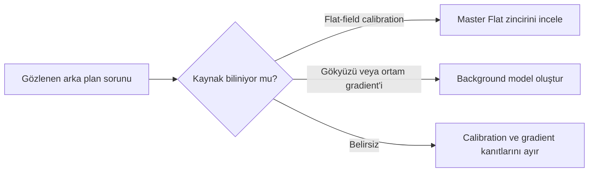
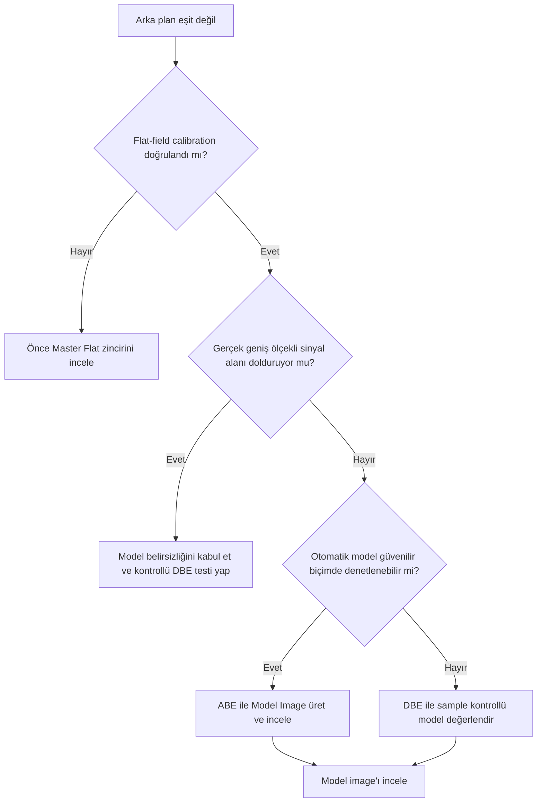

# Gradient Düzeltme

**Durum: Teknik incelemeye hazır — Sprint 2.1**

## Amaç

Gradient kavramını flat-field hatasından ayırmak, arka plan modellemenin sınırlarını tanıtmak ve [AutomaticBackgroundExtractor](abe.md) ile [DynamicBackgroundExtraction](dbe.md) arasında bilinçli bir başlangıç seçimi sağlamaktır.

!!! note "Bölüm kapsamı"
    Bu bölüm PixInsight 1.9.3’ü hedefler. Kesin process kontrolleri, varsayılanlar ve arayüz davranışları kurulu sürümün process documentation’ı ile ayrıca doğrulanmalıdır.

## Teori

Gradient, görüntü boyunca değişen istenmeyen arka plan bileşenidir. Kaynakları, matematiksel modelleri ve additive/multiplicative ayrımı bu girişte tekrarlanmaz; ayrıntılar [Gradient Teorisi](gradient-theory.md) bölümündedir.

Flat-field hatası ile gradient aynı şey değildir:

| Gözlem | Gradient | Flat-field sorunu |
| --- | --- | --- |
| Tipik kaynak | Gökyüzü/ortam kaynaklı ek sinyal veya residual | Pixel response, vignetting, dust ve optical train |
| Kavramsal başlangıç | Sıklıkla additive bileşen araştırılır | Multiplicative response araştırılır |
| Birincil düzeltme | Background model extraction | Doğru Master Flat ve calibration |
| ABE/DBE rolü | Uygun arka plan örneklerinden geniş ölçekli model | Eksik veya hatalı flat’in güvenilir yerine geçmez |

!!! warning "Kritik ayrım"
    DBE veya ABE ile vignetting görünümünü azaltabilmek, hatalı flat-field calibration’ın fiziksel olarak düzeltildiği anlamına gelmez.

## Ne zaman kullanılır?

- Lineer master image üzerinde geniş ölçekli arka plan değişimi görüldüğünde
- Flat-field calibration doğrulandıktan sonra residual gradient kaldığında
- ABE ve DBE modellerinin kontrol düzeyi, background erişimi ve hedef yapısına göre karşılaştırılması gerektiğinde
- Model image üzerinden gerçek sinyal kaybı denetlenirken

## Ne zaman kullanılmaz?

- Hatalı Master Flat, yanlış filter flat’i veya değişmiş optical train sorununu gizlemek için
- Nebula, galactic cirrus veya integrated flux nebula gibi gerçek geniş ölçekli yapıları “arka plan” varsayarak
- Nonlinear stretch ve güçlü color manipulation sonrasında ilk tanı aracı olarak
- Yalnız estetik olarak daha koyu bir arka plan üretmek için

!!! info "Okuma sırası"
    [Gradient Teorisi](gradient-theory.md) → [Gradient Diagnostics](gradient-diagnostics.md) → [ABE](abe.md) veya [DBE](dbe.md) → [Sample Yerleşimi](sample-placement.md) → [Subtraction ve Division](division-vs-subtraction.md) sırası önerilir.

## Menü yolu

Bu giriş sayfası bir process değildir. İlgili process adları:

- `AutomaticBackgroundExtractor`
- `DynamicBackgroundExtraction`

Tam menü grupları: **Doğrulama bekliyor**.

## Parametreler

| Karar | İlk soru | İlgili bölüm |
| --- | --- | --- |
| Sorunun türü | Additive gradient mi, multiplicative calibration residual’ı mı? | [Gradient Teorisi](gradient-theory.md) |
| Otomatik model | Otomatik tahmin Model Image ile doğrulanabiliyor mu? | [ABE](abe.md) |
| Kontrollü model | Background sample’ları elle denetlenmeli mi? | [DBE](dbe.md) |
| Kabul testi | Model image gerçek sinyale benziyor mu? | [DBE](dbe.md#model-goruntusunun-nebulaya-benzemesi) |

!!! tip "İlk kontrol"
    Her düzeltmeden önce orijinal image, düzeltilmiş image ve model image aynı inceleme planında karşılaştırılmalıdır.

## Adım adım kullanım

1. Image’ın lineer ve uygun biçimde calibrated olduğunu doğrulayın.
2. STF’yi yeniden hesaplayarak gradient yönünü ve ölçeğini inceleyin.
3. Flat-field hatası olasılığını calibration kayıtlarıyla ayırın.
4. [Gradient Teorisi](gradient-theory.md) içindeki additive/multiplicative model ayrımını uygulayın.
5. Basit bir ilk model gerekiyorsa ABE’yi kontrollü test edin.
6. Sample konumlarını denetlemek gerekiyorsa DBE’ye geçin.
7. Model image içinde gerçek hedef yapısı bulunup bulunmadığını kontrol edin.
8. Düzeltme sonrası STF’yi yeniden hesaplayın; eski STF ile görsel kıyas yapmayın.

## Gerçek kullanım senaryosu

!!! example "LRGB luminance master"
    Doğru Master Flat ile calibrated bir luminance master’da arka plan değişimi görülür. Otomatik ABE modeli yalnız Model Image ile denetlenebiliyorsa değerlendirilir. Model hedef galaksinin dış halo yapısını içerirse sonuç kabul edilmez; background sample kontrolü için DBE değerlendirilir.

## Sık yapılan hatalar

1. Gradient ile flat-field sorununu aynı kabul etmek.
2. Model image’ı incelemeden Replace Target kullanmak.
3. Nebula veya galaksi halosunu background saymak.
4. Düzeltme sonrası eski STF ile sonucu yorumlamak.
5. Her image için aynı correction ve model karmaşıklığını kullanmak.
6. Daha koyu arka planı otomatik olarak daha doğru sonuç sanmak.

## Sorun giderme

| Belirti | Olası neden | İlk eylem |
| --- | --- | --- |
| Model hedefe benziyor | Gerçek sinyal modellenmiş | Sample/model stratejisini değiştirin |
| Köşeler hâlâ farklı | Flat residual veya yetersiz model | Calibration zincirini ve model ölçeğini ayırın |
| Düzeltme sonrası image karardı | STF değişimi veya normalize/correction etkisi | STF’yi sıfırlayıp yeniden hesaplayın |
| Renk dengesi değişti | Kanal modelleri farklı | Kanal ve normalize davranışını doğrulayın |
| Gradient yalnız kısmen azaldı | Model gerçek gradient’i temsil etmiyor | Daha kontrollü sample dağılımı değerlendirin |

## SSS

??? question "Gradient nedir?"
    Görüntü boyunca değişen istenmeyen arka plan bileşenidir; gerçek gökyüzü sinyalinden ayrılması gerekir.

??? question "Flat gradient’i düzeltir mi?"
    Flat, multiplicative pixel/optical response’u düzeltir. Gökyüzü kaynaklı additive gradient için aynı model değildir.

??? question "ABE mi DBE mi daha iyidir?"
    Evrensel bir üstünlük yoktur. Alan, gerçek sinyal dağılımı ve model kontrol ihtiyacı seçimi belirler.

??? question "Gradient düzeltme lineer image’da mı yapılır?"
    Bu bölüm lineer iş akışını temel alır. Kesin sıra, tüm pipeline ve veri özellikleriyle doğrulanmalıdır.

??? question "Model image neden önemlidir?"
    Process’in background sandığı yapıyı gösterir; gerçek sinyal modeldeyse overcorrection riski vardır.

??? question "Gradient tamamen kaybolmalı mı?"
    Hayır. Veri, sample erişimi ve model varsayımları ayrımı sınırlar; güvenilir olmayan tam düzeltme yerine residual bırakmak daha doğru olabilir.

## Quick Reference

!!! tip "Quick Navigation ve kontrol listesi"
    - [ ] [Gradient Teorisi](gradient-theory.md): additive/multiplicative ve model sınırları
    - [ ] [ABE](abe.md): otomatik, hızlı başlangıç modeli
    - [ ] [DBE](dbe.md): kontrollü sample tabanlı model
    - [ ] [Sample Yerleşimi](sample-placement.md): sample kalitesi ve coverage
    - [ ] [Subtraction ve Division](division-vs-subtraction.md): correction kabul testi
    - [ ] [Gradient Diagnostics](gradient-diagnostics.md): kök neden ayrımı
    - [ ] Calibration ve flat zinciri doğrulandı
    - [ ] Image lineer
    - [ ] Model image gerçek sinyal içermiyor
    - [ ] Düzeltme sonrası STF yeniden hesaplandı

## Decision Tree

## Teknik doğrulama durumu

| Sınıf | Durum |
| --- | --- |
| A | Gradient/flat ayrımı ve background model kavramı sürümden bağımsızdır |
| B | Menü yolları ve 1.9.3 kontrol adları **Doğrulama bekliyor** |
| C | Kamera, filter ve çekim koşullarına bağlı kesin öneri verilmedi |
| D | Correction ve model algoritmalarının uygulama ayrıntıları process documentation ile doğrulanmalıdır |

!!! warning "Doğrulama durumu"
    AutomaticBackgroundExtractor ve DynamicBackgroundExtraction kontrollerinin PixInsight 1.9.3 arayüzündeki tam adları ve davranışları doğrulanmayı bekliyor.
