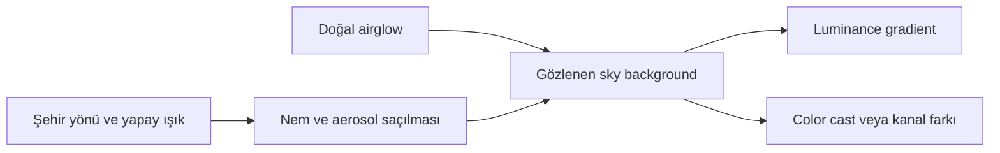
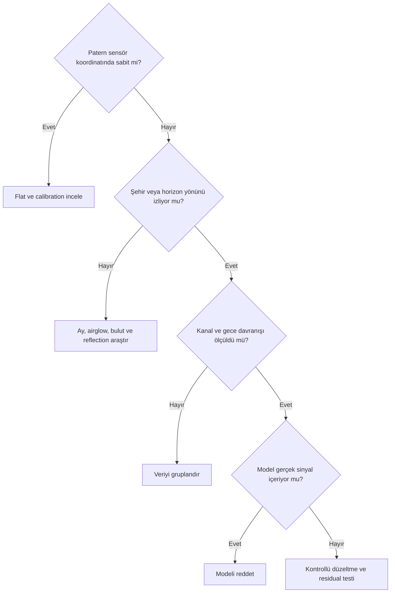

# Işık Kirliliği Gradientleri

## Amaç

Yapay aydınlatma, horizon/zenith farkı ve atmosferik saçılmayla ilişkili geniş ölçekli gradientleri tanımak; color cast, gerçek diffuse sinyal ve calibration artefact'larını ayırmak.

## Kavramsal açıklama

Şehir yönü, aydınlatma spektrumu, LED kaynakları, nem ve aerosol gökyüzü arka planının uzamsal ve spektral dağılımını değiştirebilir. Gece boyunca yön ve yoğunluk değişebilir; farklı gecelerin master'ları aynı background geometrisine sahip olmak zorunda değildir. Doğal airglow ile yapay ışığın yalnız görüntüden kesin ayrımı her zaman mümkün değildir.

## Ne zaman kullanılır?

- Ufuk veya şehir yönüne bağlı geniş ölçekli parlaklık varsa
- Gece boyunca sky background ölçülebilir biçimde değişiyorsa
- Broadband ve narrowband kanallar farklı ama açıklanabilir davranıyorsa

## Ne zaman kullanılmaz?

- Flat-field hatasını çevresel gradient diye sınıflandırmak için
- Galaxy halo veya diffuse nebula'yı “kirli background” saymak için
- Her color cast'i yalnız gradient extraction ile çözmek için

## Ön koşullar

- Calibration ve flat doğrulanmış olmalı
- Şehir, horizon ve kamera yönü kaydedilmeli
- Kanallar ile geceler ayrı incelenebilmeli

## Menü yolu

Bu bir tanı konusudur; tek bir process menü yolu yoktur. Olası modeller için [ABE](abe.md), [DBE](dbe.md) ve [GradientCorrection](gradient-correction.md) sayfalarına bakın.

## Parametreler

| Değerlendirme | Broadband | Narrowband |
| --- | --- | --- |
| Background seviyesi | Geniş spektral katkı görünür olabilir | Filtre bandına ve koşula bağlı |
| Renk bilgisi | Color cast ile luminance eğimi birlikte olabilir | Mono kanallar arasında yoğunluk farkı olabilir |
| Gradient görünürlüğü | Belirgin olabilir | Zayıf veya kanal özgü olabilir |
| Halo riski | Parlak yıldız ve optiğe bağlı | Filtre halo davranışı ayrıca incelenmeli |
| Gerçek diffuse sinyal riski | Cirrus ve nebula modelde seçilebilir | Emission yapısı alanı doldurabilir |
| Kanal bazlı çalışma ihtiyacı | Birleşik renk ve kanallar karşılaştırılır | Kanal davranışı ayrı incelenir |
| Model kontrolü | Zorunlu | Zorunlu |

## Uygulama veya tanı yaklaşımı

1. Flat ve calibration residual ihtimalini eleyin.
2. Subframe'leri zaman, filtre ve yön bazında gruplayın.
3. Color cast ile luminance gradient'i kanal görüntüleriyle ayırın.
4. Modelde halo, cirrus veya nebula bulunmadığını kontrol edin.
5. Farklı geceleri önce ayrı inceleyin.
6. Correction sonucunda background'u sıfıra zorlamayın; residual ve clipping ölçün.

!!! warning "Yanlış yaklaşımlar"
    Her renk eğimini SPCC ile çözmeye çalışmak; kalibrasyon hatasını ışık kirliliği sanmak; galaxy halo alanını kirli background kabul etmek; yoğun nebula alanında otomatik modeli denetlememek; kanalları bağımsız aşırı düzeltmek ve background'u tamamen siyaha zorlamak güvenilir değildir.

!!! example "Görsel eklenecek"
    Şehir yönü, horizon ve zenith bölgelerinin işaretlendiği broadband master eklenecek; görsel, luminance eğimiyle color cast'in aynı geometriyi izleyip izlemediğini gösterecek.

## Gerçek kullanım senaryosu

İki gecelik RGB veride ilk gecenin kırmızı kanalında şehir yönüne doğru artış, ikinci gecede ise pusla yayılmış daha geniş bir eğim görülür. Geceler ve kanallar ayrı modellenir; model galaksi halosunu içeriyorsa reddedilir. Birleştirme kararı residual ve signal preservation kontrolüyle verilir.

## Sık yapılan hatalar

1. SPCC'yi gradient removal aracı sanmak.
2. Flat mismatch'i ışık kirliliğine bağlamak.
3. Galaxy halo veya cirrus'u background saymak.
4. Broadband ve narrowband'e aynı modeli dayatmak.
5. Farklı geceleri incelemeden birleştirmek.
6. Siyah background'u doğruluk ölçütü yapmak.

## Sorun giderme

| Belirti | Olası neden | Kontrol |
| --- | --- | --- |
| Renk eğimi sürüyor | Kanalların modeli farklı | Kanal residual'larını inceleyin |
| Ufuk parlaklığı kalıyor | Model yetersiz veya gerçek sky değişken | Zaman/yön alt kümelerini karşılaştırın |
| Halo zayıfladı | Gerçek sinyal background sayılmış | Modeli reddedin |
| Köşe paterni sabit | Flat veya vignetting residual | Calibration zincirine dönün |
| Background kırpılıyor | Aşırı düzeltme | Statistics ve histogram kontrolü |

## SSS

??? question "Işık kirliliği yalnız broadband'i mi etkiler?"
    Hayır; görünüm filtre bandı ve çevresel koşullara bağlıdır.
??? question "LED ışıklarının etkisi kesin tanınabilir mi?"
    Görüntü tek başına kaynak spektrumunu kesin tanımlamayabilir.
??? question "SPCC color gradient'i kaldırır mı?"
    Color calibration ile gradient modeling farklı problemlerdir.
??? question "Airglow ile şehir ışığı ayrılır mı?"
    Bazen yön/zaman kanıtı yardımcı olur; kesin ayrım her zaman mümkün değildir.
??? question "Kanallar ayrı düzeltilmeli mi?"
    Veri setine bağlıdır; ayrı modeller renk ve gerçek sinyal açısından karşılaştırılmalıdır.

## Quick Reference

!!! tip "Kontrol listesi"
    - [ ] Flat/calibration kontrol edildi
    - [ ] Şehir ve horizon yönü kaydedildi
    - [ ] Geceler ve kanallar karşılaştırıldı
    - [ ] Color cast ile luminance gradient ayrıldı
    - [ ] Model gerçek diffuse sinyal içermiyor
    - [ ] Clipping ve residual ölçüldü

## Decision Tree

## Teknik doğrulama durumu

| Kimlik | Kategori | Durum |
| --- | --- | --- |
| UI-3 | Process arayüzleri | Sabit UI iddiası yok |
| DOC-3 | Correction ve color calibration ilişkisi | Birincil kaynak gerekli |
| DATA-3 | Broadband/narrowband ve farklı gece örnekleri | Gerçek veri gerekli |
| IMG-3 | Şehir-horizon tanı görüntüsü | Görsel gerekli |

## İlgili bölümler

- [Ay Işığı Gradientleri](moonlight-gradients.md)
- [Gradient Diagnostics](gradient-diagnostics.md)
- [Flat-field ve Gradient](flat-field-vs-gradient.md)
