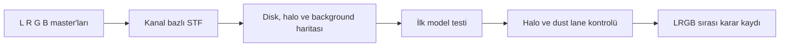
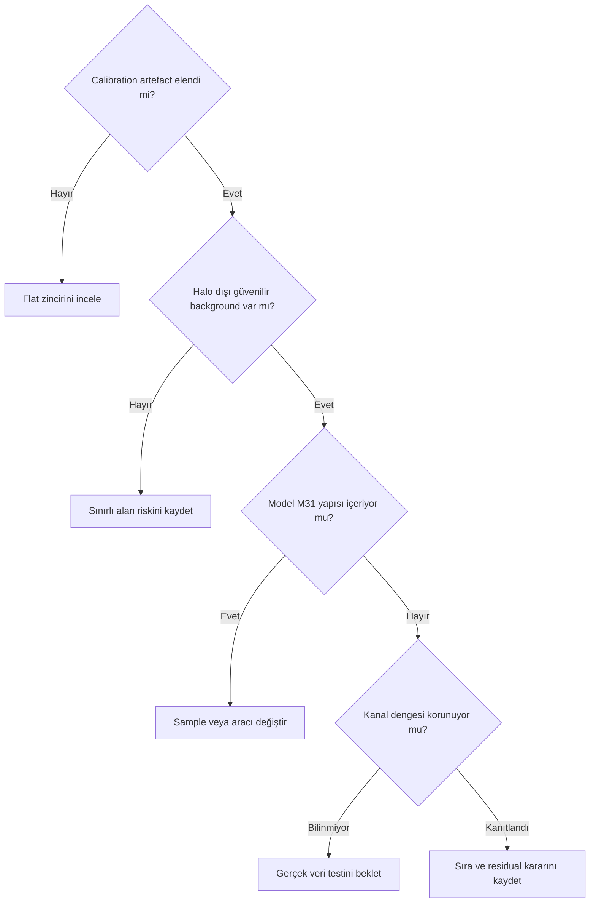

# M31 Gradient İş Akışı

## Amaç

M31 broadband/LRGB verisi için test edilebilir gradient iş akışı, veri kayıt formu ve görsel kanıt planı oluşturmak. Bu sayfada gerçek M31 testi yapılmış değildir.

## Ön koşullar

- Lineer L, R, G ve B Master Light görüntüleri
- Calibration kayıtları, kullanılan Master Flat'ler ve gece/meridian bilgisi
- M31, M32, M110, dış halo ve parlak yıldız bölgelerini işaretleyebilecek referans

## Hedefe özgü riskler

M31 geniş açısal alan kaplar; disk ve düşük yüzey parlaklıklı dış halo background sanılabilir. Dust lane alanları sample için güvenilir boş gökyüzü değildir. M32, M110, yıldız halo ve internal reflection bölgeleri kullanılabilir background'u daha da sınırlar. L/R/G/B kanalları, farklı geceler ve meridian tarafları ayrı gradient davranışı gösterebilir. Ha eklenmişse kanal uyumluluğu ayrıca incelenmelidir.

## İş akışı

1. Master Light ve kanalları kontrol edin.
2. Flat, dust, vignetting ve reflection olasılığını inceleyin.
3. L, R, G ve B kanallarına ayrı STF uygulayın.
4. Aynı yapının kanallar arasında nasıl değiştiğini inceleyin.
5. Galaxy diski ve tahmini halo alanını tanımlayın.
6. Güvenilir background bölgelerini işaretleyin.
7. İlk model yaklaşımını oluşturun.
8. Model Image üzerinde M31 yapısı arayın.
9. Corrected görüntüde outer halo ve dust lane kontrolü planlayın.
10. Kanallar arası background dengesini inceleyin.
11. LRGB birleşiminden önce/sonra çalışma kararını ve gerekçesini kaydedin.
12. Residual gradient'i orijinal ve modelle karşılaştırın.

LRGB öncesi kanal bazlı çalışma, kanala özgü gradient'i görmeyi kolaylaştırabilir; fakat bağımsız modeller yeni kanal uyumsuzluğu yaratabilir. Birleşim sonrası çalışma renk ve yoğunluk modelini birlikte değerlendirebilir; fakat kanal özgü kök nedeni gizleyebilir. Hiçbiri zorunlu sıra değildir.

!!! example "M31 sample haritası kayıt altında bulunmalıdır"
    Görsel; galaxy diski, dış halo için korunacak bölge, M32, M110, parlak yıldız haloları ve güvenilir background bölgelerini ayrı katmanlarla göstermelidir.

## Karar matrisi

| Gözlem | Eylem | Neden |
|---|---|---|
| Modelde dış halo izi | Modeli reddet | Galaxy sinyali background olarak öğrenilmiştir |
| Yalnız köşelerde düzgün eğim | Seyrek sample/model testi | Halo çevresine müdahaleyi azaltır |
| Dust donut veya sabit vignetting | Calibration'a dön | DBE flat hatasının yerine geçmez |
| Residual az, halo sabit | Aday sonucu sakla | Correction amacıyla uyumludur |

## Model kontrolü

Model Image içinde spiral yapı, disk uzantısı, dış halo, M32/M110 çevresi veya dust lane kontrastı görülürse model kabul edilmiş sayılmaz. Background'un geometrik olarak düz görünmesi tek başına yeterli değildir.

## Sinyal koruma

- Galaxy outer halo değişimi ölçülmeli.
- Disk sınırında yapay kesilme aranmalı.
- Dust lane kontrastı orijinalle karşılaştırılmalı.
- M32 ve M110 çevresinde oyuk/halo oluşumu aranmalı.
- Modelde spiral yapı kontrol edilmeli.
- Background tamamen siyaha ya da yapay nötrlüğe zorlanmamalı.
- Kanallar arası yeni dengesizlik aranmalı.
- Düşük yüzey parlaklıklı sinyal için fark görüntüsü planlanmalı.

## Gerçek veri testleri

| Test ID | Veri | Yöntem | Kontrol | Beklenen kanıt | Durum |
| --- | --- | --- | --- | --- | --- |
| M31-L-01 | L master | Model karşılaştırması | Luminance gradient ve halo | Original/Model/Corrected | Gerçek veri bekliyor |
| M31-R-01 | R master | Kanal modeli | Red background ve disk | Üçlü çıktı | Gerçek veri bekliyor |
| M31-G-01 | G master | Kanal modeli | Green background ve disk | Üçlü çıktı | Gerçek veri bekliyor |
| M31-B-01 | B master | Kanal modeli | Blue gradient ve reflection | Üçlü çıktı | Gerçek veri bekliyor |
| M31-LRGB-01 | LRGB | Önce/sonra sıra testi | Kanal dengesi | İki iş akışı kaydı | Gerçek veri bekliyor |
| M31-HALO-01 | L veya LRGB | Signal preservation | Outer halo | Fark ve profile kontrolü | Gerçek veri bekliyor |
| M31-FLAT-01 | Raw/flat/calibrated | Calibration tanısı | Flat ile halo ayrımı | Koordinat karşılaştırması | Gerçek veri bekliyor |
| M31-MODEL-01 | Tüm kanallar | Model denetimi | Spiral/disk contamination | Model atlası | Gerçek veri bekliyor |

!!! example "Gerçek veri testi bekleniyor"
    **Target:** M31  
    **Channel:** L, R, G, B ve birleşik LRGB  
    **Durum:** Linear integrated masters  
    **İstenen ekran görüntüsü:** Sample haritası ile Original, Background Model ve Corrected  
    **Karşılaştırılacak çıktılar:** Kanal bazlı ve birleşim sonrası model denemeleri  
    **Kanıtlanacak teknik nokta:** Outer halo ve disk sinyalinin background modeline girmemesi  
    **Önerilen dosya adı:** `m31-lrgb-gradient-signal-preservation-01`

## Sık yapılan hatalar

1. Galaxy diskini background kabul etmek.
2. Outer halo üzerine sample yerleştirmek.
3. Dust lane'i boş gökyüzü sanmak.
4. M32/M110 ve yıldız halolarını yok saymak.
5. Tüm kanallara aynı modeli dayatmak.
6. LRGB öncesi veya sonrası sırayı mutlaklaştırmak.

## Sorun giderme

| Belirti | Kontrol | Eylem |
| --- | --- | --- |
| Halo zayıflıyor | Modelde disk/halo izi | Modeli reddet |
| Kanallar uyuşmuyor | Kanal bazlı correction | Modelleri ve sıra kararını karşılaştır |
| Dust lane değişiyor | Sample/model contamination | Koruma alanını genişlet |
| Köşeler aynı paterni taşıyor | Flat zinciri | Calibration'a dön |
| Model güvenilir background bulamıyor | Hedef kapsamı | Belirsizliği kaydet ve zorlamayı bırak |

## SSS

??? question "M31 kanalları ayrı mı düzeltilmeli?"
    Kesin kural yoktur; kanal özgü gradient ile renk uyumluluğu birlikte test edilmelidir.
??? question "Disk dışı her alan background mudur?"
    Hayır. Dış halo ve düşük yüzey parlaklıklı yapı bulunabilir.
??? question "Dust lane sample alanı olabilir mi?"
    Gerçek galaxy yapısı olduğu için güvenilir boş background sayılmaz.
??? question "Ha eklenmişse ne değişir?"
    Ha sinyali ve gradient'i LRGB kanallarıyla aynı davranmayabilir; ayrı test gerekir.
??? question "Daha nötr background daha doğru mudur?"
    Tek başına değildir; signal preservation ve model kanıtı gerekir.

## Hızlı Referans

!!! tip "M31 kontrolü"
    Kanallar → calibration → disk/halo haritası → background bölgeleri → model → outer halo/dust lane → kanal dengesi → residual → kayıt.

## Karar Ağacı

## Teknik doğrulama durumu

| Kimlik | Durum |
| --- | --- |
| UI-4 | PixInsight 1.9.3 ekranları bekliyor |
| DOC-4 | İşlem davranışı birincil kaynak doğrulaması bekliyor |
| DATA-4 | Sekiz M31 testi gerçek veri bekliyor |
| IMG-4 | Sample haritası ve üçlü çıktı görselleri bekliyor |

## Ayrıca İnceleyin

- [Sample Placement](sample-placement.md)
- [Flat-field ve Gradient](flat-field-vs-gradient.md)
- [Gerçek İş Akışları](real-workflows.md)
- [Gradient Quick Reference](gradient-quick-reference.md)

## Önceki Bölüm

[← Gerçek İş Akışları](real-workflows.md)

## Sonraki Bölüm

[NGC 6888 Gradient İş Akışı →](ngc6888-gradient-workflow.md)
