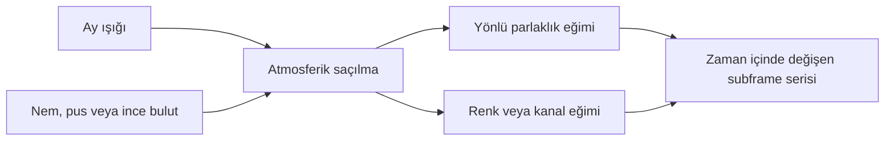
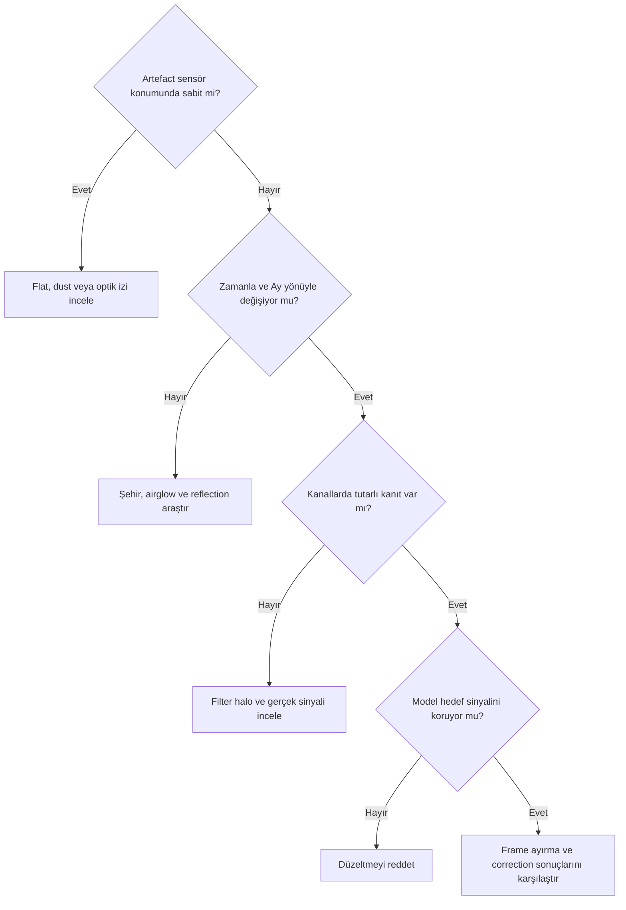

# Ay Işığı Kaynaklı Gradientler

## Amaç

Ay ışığıyla ilişkili geniş ölçekli eğimleri şehir ışığı, ince bulut, nem/pus, internal reflection, filter halo ve normal sky brightness değişiminden ayırmak.

## Kavramsal açıklama

Ay ışığı atmosferde saçılarak yönlü parlaklık ve renk eğimi oluşturabilir. Etkinin gücü yalnız Ay-hedef açısına değil; yükseklik, nem, aerosol, haze, filtre ve zaman boyunca değişen koşullara bağlıdır. Bu nedenle tek frame tanısı kesin kaynak kanıtı değildir.

Meridian geçişi, kamera yönü değişikliği veya farklı gecelerin birleşimi gradient geometrisini değiştirebilir. Filtreler aynı ortamı farklı yoğunluk ve spektral içerikle kaydedebilir. `LocalNormalization` frame uyumluluğunda değerlendirilebilir; gradient modellemenin veya doğru calibration'ın otomatik yerine geçmez.

## Ne zaman kullanılır?

- Gradient Ay yönü ve zamanla anlamlı biçimde değişiyorsa
- Subframe serisinde background seviyesi veya yönü evriliyorsa
- Filtreler arasında farklı ama çevresel koşullarla tutarlı etkiler varsa

## Ne zaman kullanılmaz?

- Tek görüntüden kaynağı kesin olarak “Ay” ilan etmek için
- Tekrarlayan dust shadow ya da vignetting'i açıklamak için
- Internal reflection veya filter halo kanıtlarını göz ardı etmek için

## Ön koşullar

- Calibration sonuçları ve flat eşleşmesi kontrol edilmiş olmalı
- Subframe zamanları, filtreleri ve kamera yönü erişilebilir olmalı
- Ay konumu ve atmosfer koşulları mümkünse kayıtlı olmalı

## Menü yolu

Bu bir tanı konusudur; tek bir PixInsight processi veya menü yolu yoktur.

## Parametreler

| Belirti | Ay ışığı olasılığı | Alternatif açıklama | Kontrol |
| --- | --- | --- | --- |
| Ay yönüne yakın geniş parlaklık | Olası | Şehir ışığı, airglow | Zaman ve yön serisi |
| Renk eğimi | Olası | Işık kirliliği, color calibration | Kanalları ayrı karşılaştırma |
| Ani frame değişimi | Tek başına zayıf kanıt | İnce bulut, nem | Ardışık subframe ölçümü |
| Sabit halka | Düşük | Internal reflection, filter halo | Kamera yönü ve parlak yıldız ilişkisi |
| Aynı sensör konumunda gölge | Düşük | Dust veya flat sorunu | Flat ve optical train kontrolü |
| Ufka doğru artış | Olası | Şehir kubbesi, aerosol | Ay/şehir yönü ve gece serisi |

## Uygulama veya tanı yaklaşımı

1. Calibration sonuçlarını kontrol edin.
2. Subframe'leri zaman sırasıyla karşılaştırın.
3. Kanal davranışını karşılaştırın.
4. Background modelini inceleyin.
5. Hedef sinyalinin modele girmediğini doğrulayın.
6. Correction sonucunu orijinal görüntüyle karşılaştırın.
7. Gerekirse sorunlu subframe'leri ayırın.

!!! note "Kanal bazlı değerlendirme"
    Mono filtrelerin farklı görünmesi tek başına filtre kusuru kanıtı değildir. Gerçek hedef sinyali, geçirgenlik ve çevresel saçılma birlikte değerlendirilmelidir.

!!! example "Görsel doğrulama ölçütü"
    Ay yönü, subframe zamanı ve gradient yönünü birlikte gösteren seri kayıt altında bulunmalıdır; görsel, yönsel ilişkinin zaman içinde tekrarlanıp tekrarlanmadığını kanıtlayacak.

!!! example "Görsel doğrulama ölçütü"
    Açık ve puslu iki gecenin aynı hedef görüntüleri kayıt altında bulunmalıdır; görsel, haze ile artan saçılmanın tek başına Ay açısıyla açıklanamayacağını gösterecek.

## Gerçek kullanım senaryosu

LRGB serisinin ilk yarısında background düzgünken Ay yükseldikçe bir köşe parlaklaşır; meridian sonrası yön değişir. Frame'ler zaman ve kanal bazında incelenir. Kötü alt kümeler ayrılır, kalan frame'lerde normalization ihtiyacı ölçülür ve entegrasyon sonrası model gerçek halo içermiyorsa gradient correction test edilir.

## Pratik karar matrisi

| Değişken | Neden kaydedilir? | Karara etkisi |
|---|---|---|
| Zaman ve meridian tarafı | Gradient yönünü izlemek | Alt kümeleri ayırmayı gerekçelendirebilir |
| Ay açısal uzaklığı ve yönü | Saçılma hipotezini sınamak | Yönsel korelasyon aranır |
| Bulut/pus | Saçılmayı kuvvetlendirebilir | Aynı Ay geometrisindeki farkı açıklar |
| Filtre | Spektral response değişir | Kanal bazlı tanı gerekir |

### Pratik örnek

Meridian öncesi ve sonrası subframe'lerde parlak köşe yön değiştiriyorsa tüm geceyi tek modelle zorlamak yerine zaman grupları ayrı blink edilir. Zayıf alt kümenin çıkarılması, normalization veya gradient correction seçenekleri yalnız final SNR ve signal preservation karşılaştırmasıyla seçilir.

## Sık yapılan hatalar

1. Her yönlü gradient'i Ay ışığı saymak.
2. Yalnız integrated master'a bakmak.
3. Filtre kanallarını aynı davranmaya zorlamak.
4. İnce bulut ve haze etkisini yok saymak.
5. Internal reflection'ı background modeliyle bastırmak.
6. Sorunlu frame'leri ayırmadan tek model uygulamak.

## Sorun giderme

| Belirti | Kontrol | Sonraki değerlendirme |
| --- | --- | --- |
| Gradient frame boyunca dönüyor | Kamera yönü ve meridian | Optik/çevresel koordinat ayrımı |
| Yalnız bir filtre etkileniyor | Filtre halo ve hedef sinyali | Kanal bazlı model |
| Model nebula içeriyor | Background yetersiz | Daha korumacı yaklaşım |
| Farklı geceler uyuşmuyor | Sky background ve şeffaflık | Alt kümeler ve LocalNormalization |
| Correction sonrası siyah alan | Overcorrection veya STF | Statistics ve residual kontrolü |

## SSS

??? question "Ay ışığı her zaman renk gradient'i üretir mi?"
    Hayır; görünüm atmosfer, filtre ve veri setine bağlıdır.
??? question "Ay-hedef açısı tek başına yeterli mi?"
    Hayır; yükseklik, haze, nem ve yön de incelenmelidir.
??? question "LocalNormalization gradient'i kaldırır mı?"
    Aynı amaç değildir; frame uyumluluğu için değerlendirilebilir.
??? question "Sorunlu frame'ler atılmalı mı?"
    Kalite, sinyal kaybı ve düzeltilebilirlik karşılaştırılmadan kesin karar verilmez.
??? question "Dar bant Ay'dan etkilenmez mi?"
    Mutlak bağışıklık varsayılmamalı; kanal verisi ölçülmelidir.

## Hızlı Referans

!!! tip "Kontrol listesi"
    - [ ] Calibration ve flat doğrulandı
    - [ ] Frame'ler zaman sırasıyla karşılaştırıldı
    - [ ] Ay, şehir ve kamera yönü ayrıldı
    - [ ] Kanallar ayrı incelendi
    - [ ] Model gerçek sinyal içermiyor
    - [ ] Sorunlu alt kümeler belirlendi

## Karar Ağacı

## Teknik doğrulama durumu

| Kimlik | Kategori | Durum |
| --- | --- | --- |
| UI-3 | İlgili process arayüzleri | Bu sayfada sabit UI iddiası yok |
| DOC-3 | LocalNormalization ve correction davranışı | Birincil kaynak gerekli |
| DATA-3 | Ay açısı, haze ve filtre serisi | Gerçek veri gerekli |
| IMG-3 | Zaman serisi ve haze karşılaştırması | Görsel gerekli |

## İlgili bölümler

- [Gradient Diagnostics](gradient-diagnostics.md)
- [Işık Kirliliği Gradientleri](light-pollution-gradients.md)
- [Flat-field ve Gradient](flat-field-vs-gradient.md)
