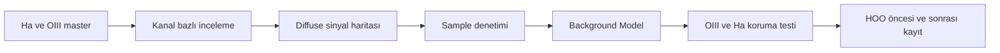
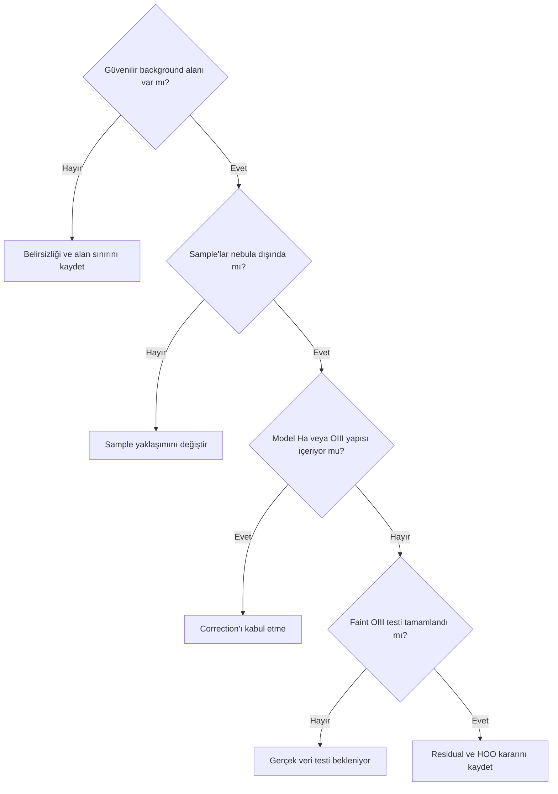

# NGC 6888 Gradient İş Akışı

## Amaç

NGC 6888 Ha/OIII verisi için diffuse sinyali korumaya odaklanan, test edilebilir narrowband gradient iş akışı hazırlamak. Gerçek veri sonucu henüz yoktur.

## Ön koşullar

- Lineer Ha ve OIII Master Light görüntüleri
- Calibration, filtre, Ay, gece ve meridian kayıtları
- Parlak kabuk, diffuse Ha, zayıf OIII dış yapı ve yıldız halo bölgelerini tanımlama planı

## Hedefe özgü riskler

Diffuse Ha geniş alana yayılabilir; zayıf OIII kabukları ve halo alanları background sanılabilir. Filamentler sample alanına girebilir ve kullanılabilir background yetersiz kalabilir. Narrowband filter halo, reflection ve Ay etkisi iki kanalda farklı görünebilir. Otomatik sample üretimi yetersiz sample uyarısı verebilir veya yanlış model nebulaya benzeyebilir. `Subtraction` sonrası clipping, `Division` sonrası aşırı parlama ya da noise amplification olasılıkları gerçek veride ayrıca ölçülmelidir. HOO kırmızı dominantlığı tek başına gradient kanıtı değildir.

## İş akışı

1. Ha ve OIII Master Light görüntülerini ayrı inceleyin.
2. Aynı STF ile kıyasın kanal dağılımları farklı olduğunda yanıltıcı olabileceğini kaydedin.
3. Her kanalın kendi background yapısını yeniden hesaplanmış STF ile inceleyin.
4. Diffuse nebula kapsamını tahmin edin.
5. Güvenilir background bölgelerini belirleyin.
6. Otomatik sample üretimini denetleyin.
7. Gerekirse kontrollü manuel sample yerleşimine geçin.
8. Background Model üzerinde Ha/OIII sinyali arayın.
9. Correction sonuçlarını kanal bazında karşılaştırın.
10. Faint OIII yapısını signal preservation testiyle kontrol edin.
11. HOO birleşiminden önce kanal dengesini kaydedin.
12. HOO sonrasında residual color gradient kontrolü planlayın.

!!! example "NGC 6888 sample haritası eklenecek"
    Görsel; parlak kabuk, diffuse Ha alanı, zayıf OIII dış yapıları, yıldız haloları ve güvenilir background bölgelerini göstermelidir.

## Model kontrolü

Background Model parlak kabuğa, filament ağına, diffuse Ha alanına veya zayıf OIII dış yapısına benziyorsa correction kabul edilmez. Sample sayısı tek başına kalite ölçütü değildir; az sample kararlı görünebilir ama genelleme kanıtı gerektirir, çok sample ise contamination üretebilir.

## Signal preservation

- Zayıf OIII kabuğu için fark ve profile kontrolü planlanmalı.
- Diffuse Ha'nın background olarak çıkarılıp çıkarılmadığı incelenmeli.
- Modelin nebulaya veya filamentlere benzemediği doğrulanmalı.
- Channel noise, clipping ve OIII kontrastı ölçülmeli.
- HOO sonrasında renk gradient'i ile kırmızı dominantlık ayrılmalı.
- Yıldız halolarının model davranışına etkisi kaydedilmeli.

## Gerçek veri testleri

| Test ID | Veri | Yöntem | Kontrol | Beklenen kanıt | Durum |
| --- | --- | --- | --- | --- | --- |
| N6888-HA-01 | Ha master | Kanal modeli | Diffuse Ha | Original/Model/Corrected | Gerçek veri bekliyor |
| N6888-OIII-01 | OIII master | Kanal modeli | Zayıf dış kabuk | Üçlü çıktı | Gerçek veri bekliyor |
| N6888-SAMPLE-01 | Ha/OIII | Sample karşılaştırması | Filament contamination | Sample haritaları | Gerçek veri bekliyor |
| N6888-MODEL-01 | Ha/OIII | Model denetimi | Nebulaya benzeyen model | Model atlası | Gerçek veri bekliyor |
| N6888-SUB-01 | OIII | Subtraction testi | Clipping ve residual | Statistics/fark | Gerçek veri bekliyor |
| N6888-DIV-01 | OIII | Division testi | Parlaklık ve noise | Statistics/fark | Gerçek veri bekliyor |
| N6888-HOO-01 | HOO | Önce/sonra sırası | Color gradient | İki workflow | Gerçek veri bekliyor |
| N6888-OIII-SIGNAL-01 | OIII | Signal preservation | Faint OIII halo | Profile/fark | Gerçek veri bekliyor |

!!! example "Gerçek veri testi bekleniyor"
    **Target:** NGC 6888  
    **Channel:** OIII  
    **Durum:** Linear integrated master  
    **İstenen ekran görüntüsü:** Sample haritası, Original, Background Model ve Corrected  
    **Karşılaştırılacak çıktılar:** Subtraction, Division ve işlem görmemiş master  
    **Kanıtlanacak teknik nokta:** Zayıf OIII dış kabuğunun model içine alınmaması  
    **Önerilen dosya adı:** `ngc6888-oiii-dbe-signal-preservation-01`

## Sık yapılan hatalar

1. Diffuse Ha'yı boş background saymak.
2. OIII dış kabuğu üzerine sample yerleştirmek.
3. Aynı STF görünümünü eşdeğer kanal karşılaştırması sanmak.
4. “Less than three samples” uyarısına sayısal reçete vermek.
5. Subtraction veya Division sonucunu yalnız parlaklığa göre seçmek.
6. HOO kırmızı dominantlığını doğrudan gradient saymak.

## Sorun giderme

| Belirti | İlk kontrol | Eylem |
| --- | --- | --- |
| Model nebulaya benziyor | Sample contamination | Modeli reddet |
| OIII zayıflıyor | Fark/model görüntüsü | Koruma alanını ve sample'ı değiştir |
| Sample üretilemiyor | Background alanı ve acceptance | Güvenilir alanı yeniden değerlendir |
| Background kırpılıyor | STF ve statistics | Correction yöntemini yeniden test et |
| Division noise artırıyor | Model ve düşük sinyal | Orijinal/Subtraction ile karşılaştır |

## SSS

??? question "Ha ve OIII aynı sample setini kullanmalı mı?"
    Zorunlu değildir; gerçek sinyal dağılımları farklı olabilir.
??? question "Aynı STF ile kanal kıyası doğru mudur?"
    Aynı gösterim bazı farkları görünür kılar ama farklı dağılımlar nedeniyle tek başına karar kanıtı değildir.
??? question "Az sample her zaman kötü müdür?"
    Hayır; kapsama ve contamination ayrıca değerlendirilmelidir.
??? question "HOO kırmızıysa gradient var mıdır?"
    Tek başına değil; kanal sinyali ve kombinasyon dengesi de etkiler.
??? question "Division narrowband için zorunlu mudur?"
    Hayır. Fiziksel kaynak ve gerçek veri sonucu değerlendirilmelidir.

## Quick Reference

!!! tip "NGC 6888 kontrolü"
    Ha/OIII ayrı inceleme → diffuse sinyal haritası → sample denetimi → model → OIII/Ha koruma → clipping/noise → HOO dengesi → kayıt.

## Decision Tree

## Teknik doğrulama durumu

| Kimlik | Durum |
| --- | --- |
| UI-4 | 1.9.3 DBE/ABE ekranları bekliyor |
| DOC-4 | Correction davranışları birincil kaynak bekliyor |
| DATA-4 | Sekiz NGC 6888 testi gerçek veri bekliyor |
| IMG-4 | Sample/model/correction görselleri bekliyor |

## İlgili bölümler

- [Sample Placement](sample-placement.md)
- [Subtraction ve Division](division-vs-subtraction.md)
- [Gradient Hata Kartları](error-cards.md)
- [Gerçek İş Akışları](real-workflows.md)
