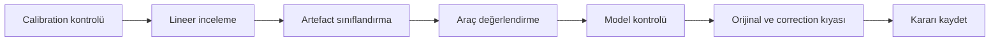
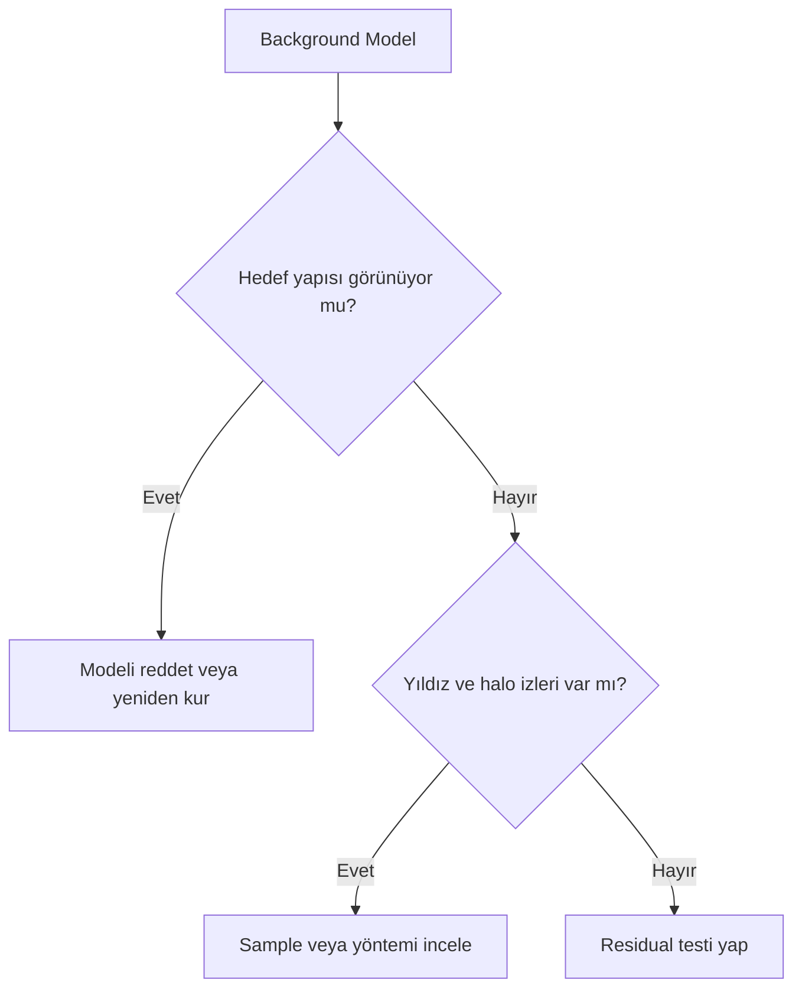
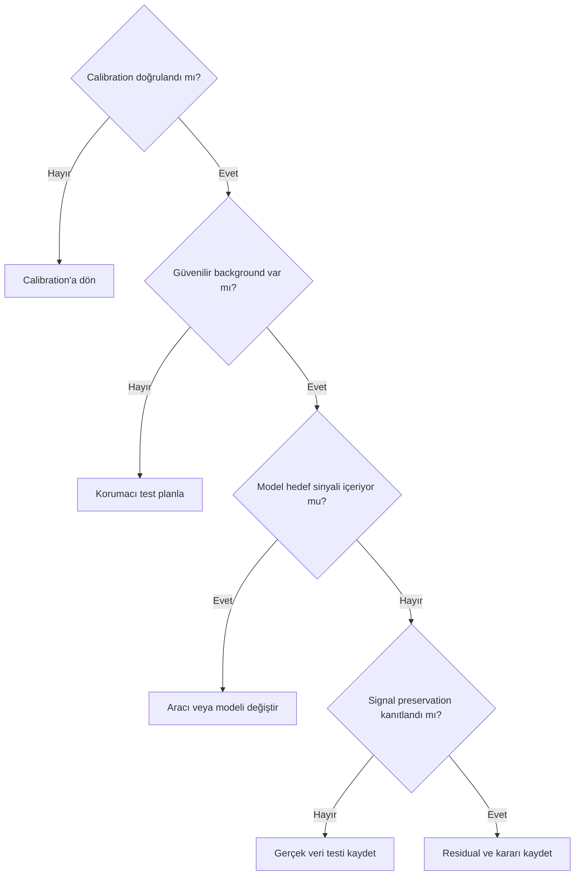

# Gerçek Gradient İş Akışları

## Amaç

Gradient teorisini, calibration doğrulamasından model kaydına kadar izlenebilir bir çalışma akışına dönüştürmek. Bu sayfadaki sonuçlar reçete değil, gerçek veriyle doldurulacak kontrol kapılarıdır.

## Ön koşullar

- Calibrated, lineer master ve mümkünse kaynak subframe'ler
- Master Dark, Master Flat ve calibration kayıtları
- Orijinal, Background Model ve corrected çıktıları ayrı saklayabilecek çalışma alanı
- Hedef sinyalinin yaklaşık uzamsal kapsamı

## Hedefe özgü riskler

Galaxy halo, diffuse emission, reflection nebula ve narrowband dış kabuklar güvenilir background alanını azaltır. Optik reflection, flat residual, amp glow ve walking noise ise gradient gibi görünebilir fakat aynı modelle güvenilir biçimde düzeltilmez.

## İş akışı

1. Calibration sonucunu ve Master Flat eşleşmesini doğrulayın.
2. Görüntüyü lineer aşamada inceleyin.
3. STF ile background yapısını görünür hale getirin; STF'nin pixel verisini değiştirmediğini unutmayın.
4. Hedef sinyalinin uzamsal kapsamını belirleyin.
5. Sorunun gradient, flat artefact, reflection veya başka bir patern olup olmadığını sınıflandırın.
6. `ABE`, `DBE`, `GradientCorrection` veya GraXpert yaklaşımını değerlendirin.
7. Model Image ya da background çıktısını inceleyin.
8. Corrected sonucu orijinalle eşdeğer gösterim altında karşılaştırın.
9. Signal preservation kontrolü yapın.
10. Residual gradient ve clipping kontrolü yapın.
11. Model güvenilir değilse yaklaşımı yeniden oluşturun.
12. Araç, correction yöntemi, model kararı ve görsel referansını kaydedin.

### Araç seçimi matrisi

| Koşul | ABE değerlendirmesi | DBE değerlendirmesi | GradientCorrection değerlendirmesi | GraXpert değerlendirmesi |
| --- | --- | --- | --- | --- |
| Background alanı geniş | Ön değerlendirmede değerlendirilebilir | Kontrollü karşılaştırma sağlar | Model kontrolü kritik | Gerçek veri testi gerekir |
| Background alanı çok sınırlı | Otomasyon riskli | Sample yerleşimi yüksek denetim ister | Model kontrolü kritik | Modelin hedefi seçme riski yüksek |
| Yoğun emission nebula | Gerçek sinyal riski | Sample kontrolü kritik | Gerçek veri testi gerekir | Background çıktısı kritik |
| Galaxy halo | Halo contamination riski | Koruma bölgesi gerektirir | Model kontrolü kritik | Modelde halo aranmalı |
| Reflection nebula | Sınırlı background nedeniyle riskli | Yüksek denetim gerektirir | Gerçek veri testi gerekir | Model kontrolü kritik |
| Mono narrowband kanal | Kanal bazlı test gerekir | Sample kontrolü kritik | 1.9.3 doğrulaması gerekir | Round-trip testi gerekir |
| Broadband renkli görüntü | Color model denetlenmeli | Kanal/birleşik test gerekir | Model kontrolü kritik | Metadata ve color kontrolü gerekir |
| Geniş alan görüntü | Ön model değerlendirilebilir | Sample coverage önemlidir | Gerçek veri testi gerekir | Geniş alan testi gerekir |
| Karmaşık yansıma | Kök neden kontrolü öncelikli | Gradient modeli eşdeğer çözüm değildir | Kök neden kontrolü öncelikli | Gradient modeli eşdeğer çözüm değildir |
| Calibration artefact şüphesi | Önce calibration | Önce calibration | Önce calibration | Önce calibration |
| Hızlı ön değerlendirme | Değerlendirilebilir | Daha fazla hazırlık ister | Sürüm doğrulaması gerekir | Haricî aktarım gerekir |
| Ayrıntılı manuel model | Sınırlı kontrol | Sample tabanlı denetim sağlar | Arayüz yetenekleri doğrulanmalı | Klasik yöntemde sürüm bazlı kontrol gerekir |

### İşlem kayıt şablonu

| Alan | Kayıt |
| --- | --- |
| Target | |
| Filter veya channel | |
| Integration tarihi | |
| Calibration durumu | |
| Şüpheli artefact | |
| Kullanılan araç | |
| Correction yöntemi | |
| Sample yaklaşımı | |
| Model kontrol sonucu | |
| Signal preservation sonucu | Gerçek veri bekliyor |
| Residual gradient | Gerçek veri bekliyor |
| Son karar | |
| Görsel referansı | |

## Neden temelli uygulama örnekleri

| Hedef/veri | İlk karar | Neden |
|---|---|---|
| M31 gibi geniş halo | Kontrollü model karşılaştırması | Halo sınırı background ile karışır |
| NGC 6888 gibi zayıf OIII çevresi | Kanal bazlı sample denetimi | Faint diffuse signal modele girebilir |
| Ay ışıklı çok geceli set | Önce zaman alt kümeleri | Tek model değişken kaynağı açıklamayabilir |
| Şehir ışığına bakan geniş alan | Kamera/sky koordinatı testi | Flat ile sky gradient ayrılır |

Her workflow'da araçtan önce hangi fiziksel veya işlemsel etkinin modellendiğini gösteren ölçüm yazılır. Ayrıntılar: [M31](m31-gradient-workflow.md), [NGC 6888](ngc6888-gradient-workflow.md), [Ay ışığı](moonlight-gradients.md) ve [ışık kirliliği](light-pollution-gradients.md).

## Model kontrolü

Modelde gradient yönü görülebilir; fakat galaxy spiral yapısı, nebula filamentleri, dış halo ya da belirgin yıldız izleri bulunmamalıdır. Daha düz model daha doğru model anlamına gelmez.

## Sinyal koruma

- Orijinal ve corrected görüntü aynı yeniden hesaplanmış STF koşulunda incelenmeli.
- Fark görüntüsü hedef sinyaline benzeyen geniş ölçekli yapı açısından kontrol edilmeli.
- Channel statistics ve clipping ayrıca ölçülmeli.
- Düşük yüzey parlaklıklı alanlar tek bir ekranda değil, model ve residual ile birlikte değerlendirilmelidir.

## Gerçek veri testleri

!!! example "Gerçek veri testi bekleniyor"
    **Target:** M31 veya NGC 6888  
    **Channel:** LRGB ya da Ha/OIII  
    **Durum:** Linear integrated master  
    **İstenen ekran görüntüsü:** Original, Background Model ve Corrected aynı görünüm planında  
    **Karşılaştırılacak çıktılar:** ABE, DBE, GradientCorrection veya GraXpert model/sonuçları  
    **Kanıtlanacak teknik nokta:** Araç seçiminin model kalitesi ve signal preservation üzerinden değerlendirilmesi  
    **Önerilen dosya adı:** `gradient-real-workflow-comparison-01`

## Sık yapılan hatalar

1. Calibration artefact'ını gradient removal ile gizlemek.
2. STF görünümünü veri değişikliği sanmak.
3. Model Image'ı incelememek.
4. Daha siyah background'u başarı ölçütü yapmak.
5. Tüm kanallara aynı model kararını uygulamak.
6. Kullanılan ayarları ve model kararını kaydetmemek.

## Sorun giderme

| Belirti | İlk kontrol | Sonraki adım |
| --- | --- | --- |
| Model hedefe benziyor | Background seçimi | Modeli reddet ve yeniden kur |
| Correction aşırı karanlık | STF ve clipping | Statistics ile karşılaştır |
| Residual sürüyor | Model kapsamı | Kök nedeni yeniden sınıflandır |
| Kanallar uyuşmuyor | Kanal modelleri | Ayrı/birleşik yaklaşımı test et |
| Dış halo kayboluyor | Signal preservation | Koruma alanını ve modeli değiştir |

## SSS

??? question "İlk araç hangisi olmalı?"
    Evrensel sıra yoktur; background erişimi, hedef kapsamı ve model denetimi belirleyicidir.
??? question "STF gradient'i düzeltir mi?"
    Hayır. STF yalnız ekran görünümünü değiştirir.
??? question "Model Image neden saklanmalı?"
    Process'in background saydığı yapının denetlenmesini ve tekrar üretilebilirliği sağlar.
??? question "Residual gradient başarısızlık mıdır?"
    Her zaman değil; güvenilmez aşırı düzeltmeden daha kabul edilebilir olabilir.
??? question "Flat sorunu DBE ile giderilir mi?"
    Doğru flat calibration'ın eşdeğeri değildir; önce kök neden düzeltilmelidir.

## Hızlı Referans

!!! tip "On iki adım"
    Calibration → lineer inceleme → STF → hedef kapsamı → artefact sınıfı → araç → model → orijinal kıyası → signal preservation → residual → revizyon → kayıt.

## Karar Ağacı

## Teknik doğrulama durumu

| Kimlik | Durum |
| --- | --- |
| UI-4 | PixInsight 1.9.3 arayüz karşılaştırmaları bekliyor |
| DOC-4 | Araç davranışları için birincil kaynak doğrulaması bekliyor |
| DATA-4 | M31 ve NGC 6888 testleri bekliyor |
| IMG-4 | Model/correction karşılaştırma görseli bekliyor |

## İlgili bölümler

- [Gradient Diagnostics](gradient-diagnostics.md)
- [M31 Gradient İş Akışı](m31-gradient-workflow.md)
- [NGC 6888 Gradient İş Akışı](ngc6888-gradient-workflow.md)
- [Gradient Hata Kartları](error-cards.md)
