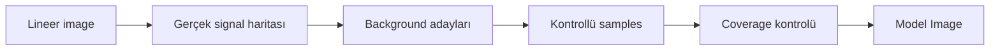
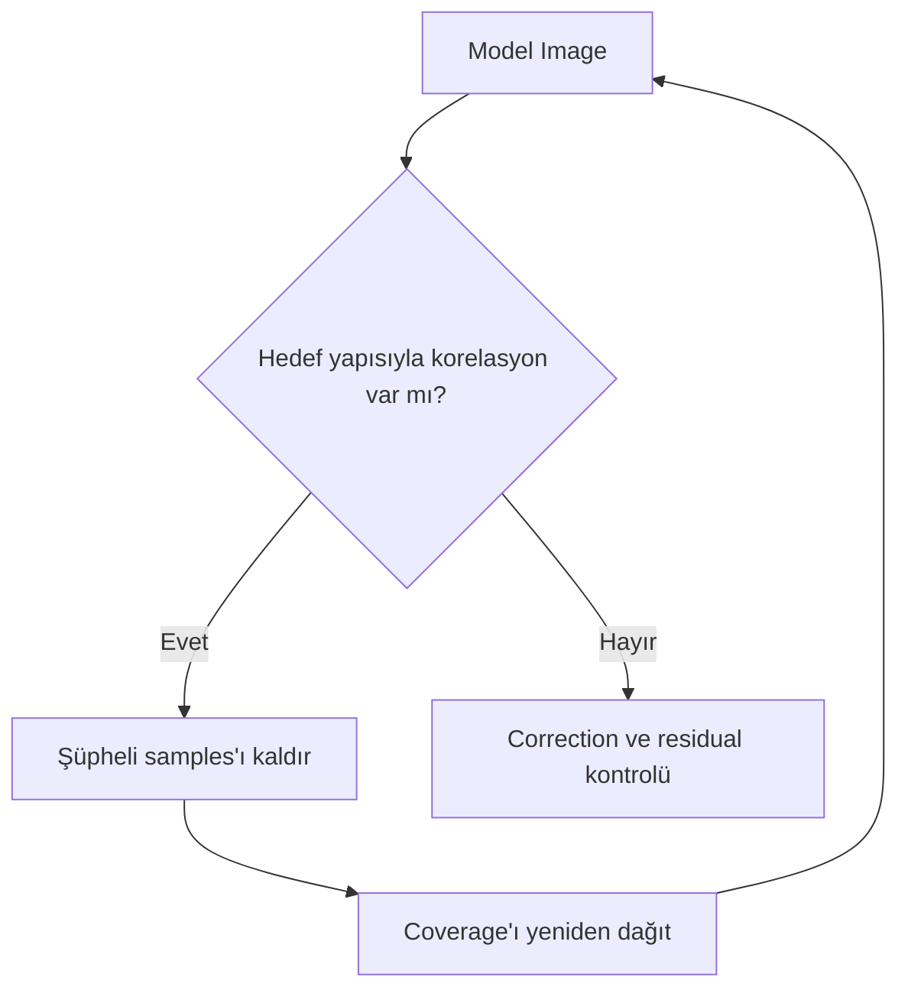
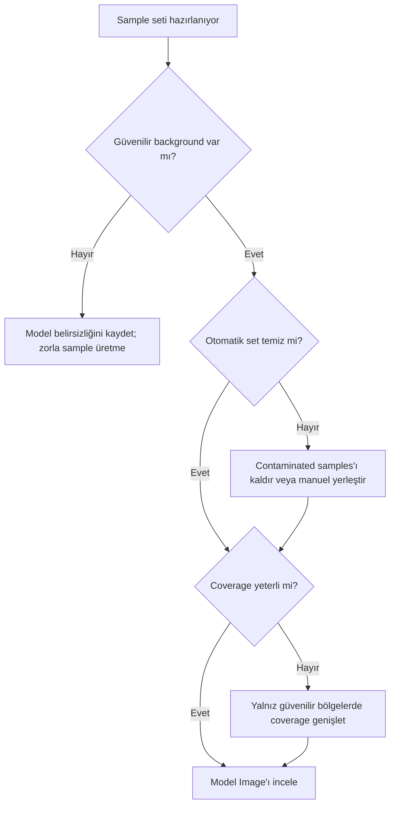

# DBE Sample Yerleşimi

**Durum: Teknik doğrulama bekliyor — Sprint 2.2**

## Amaç

DynamicBackgroundExtraction için background samples’ın nerede, neden ve hangi kanıtla yerleştirileceğini; sample sayısından çok sample kalitesi ve coverage üzerinden öğretmek.

!!! note "Ana ilke"
    Sample lokal düzeltme noktası değildir. Modelin o bölgeyi gerçek background kabul etmesi için verilen ölçüm varsayımıdır.

## Kavramsal açıklama

Background sample, hedef sinyalden arındırıldığı varsayılan küçük bir image bölgesinin istatistiksel temsilidir. Samples model yüzeyini sınırlar; bu nedenle bir sample’ın konumu, içerdiği signal ve spatial coverage’ı sayısından daha önemlidir.

- **Sample kalitesi:** Ölçüm alanının gerçek background’u temsil etme güveni.
- **Sample coverage:** Samples’ın image boyunca modellemek istenen değişimi spatial olarak desteklemesi.
- **Homojen dağılım:** Kör bir grid değil; gradient yönünü ve kenarları temsil eden dengeli kanıt dağılımı.
- **Kenar değerlendirmesi:** Edge bölgelerinde gerçek background yoksa sırf coverage için sample eklenmez.

### Sample parametreleri ve değerlendirme

| Kontrol | Kavramsal rol | Sonuç nasıl değerlendirilir? | Doğrulama |
| --- | --- | --- | --- |
| `Radius` | Ölçüm bölgesinin spatial kapsamını etkiler | Sample içindeki yıldız, halo, filament ve local variation incelenir | UI/DOC bekliyor |
| `Tolerance` | Sample acceptance davranışını etkiler | Kabul/reddedilen sample dağılımı ve Model Image karşılaştırılır | UI/DOC bekliyor |
| `Shadows Relaxation` | Koyu bölgelerde kabul davranışını etkileyebilir | Koyu gerçek signal’ın background’a karışıp karışmadığı incelenir | UI/DOC bekliyor |
| `Minimum sample weight` | Sample geçerlilik/ağırlık eşiğiyle ilişkili control | Düşük güvenli sample artışı ve model contamination kontrol edilir | UI/DOC bekliyor |
| Otomatik üretim | Başlangıç sample seti oluşturabilir | Her sample tek tek ve Model Image ile denetlenir | UI bekliyor |
| Manuel yerleşim | Kullanıcının konum kanıtını kontrol etmesini sağlar | Coverage ile contamination birlikte değerlendirilir | Temel kavram |

!!! warning "Doğrulama durumu"
    `Radius`, `Tolerance`, `Shadows Relaxation` ve `Minimum sample weight` kontrollerinin tam PixInsight 1.9.3 etiketleri, yönleri ve algoritmik etkileri doğrulanmayı bekliyor.

### Hedef türlerine göre yerleşim

- **Yoğun nebula:** Karanlık görünen alanın gerçek background olduğu varsayılmaz; güvenilir alan yoksa model belirsizliği kabul edilir.
- **Galaxy halo:** Disk dışındaki zayıf halo sınırı ayrıca araştırılır.
- **Reflection nebula:** Renkli diffuse dış yapılar background sanılmamalıdır.
- **Narrowband:** Özellikle OIII gibi zayıf geniş halo yapıları kanal bazında incelenir.
- **Wide-field:** Tek gradient varsayımı yerine farklı bölgelerin fiziksel kaynakları karşılaştırılır.
- **Mosaic:** Seam, panel normalization ve gerçek sky gradient birbirinden ayrılır; her panelin geometry’si dikkate alınır.

### Hatalı alanlar

| Hatalı alan | Neden risklidir? | Modelde oluşturabileceği hata | Nasıl kontrol edilir? |
| --- | --- | --- | --- |
| Yıldız | Background statistics’i yükseltebilir | Lokal parlak model izi | Zoom ve star mask karşılaştırması |
| Parlak yıldız halo alanı | Geniş saçılmış ışık gerçek background değildir | Geniş parlak lobe | Agresif STF ve radial profil |
| Galaxy diski | Hedef signal’dır | Disk yapısının çıkarılması | Galaxy sınırı ve catalog görüntüsü |
| Galaxy halo | Zayıf fakat gerçek signal olabilir | Halo kaybı | Derin referans ve Model Image |
| Nebula filamenti | Emission signal’dır | Filamentin modele geçmesi | Kanal bazlı STF |
| OIII halo alanı | Çok zayıf geniş signal olabilir | OIII dış yapısının bastırılması | OIII kanalını ayrı inceleme |
| Dust lane | Koyu gerçek yapı olabilir | Yapay background çukuru | Luminance/color karşılaştırması |
| Flat-field artefact | Calibration hatasıdır | Hatanın modele gömülmesi | Master Flat ve calibrated/raw kıyası |
| Amp glow bölgesi | Dark calibration residual olabilir | Sensör deseninin “gradient” sayılması | Matching dark ve sensör koordinatı |
| Sensör yansıması | Lokal optical/electronic artefact olabilir | Uygunsuz geniş model | Rotate/flip ve farklı gece testi |

!!! example "Görsel doğrulama ölçütü"
    Bu bölüm gerçek PixInsight 1.9.3 ekran görüntüsü ve örnek veri ile doğrulanacaktır.

## Model kontrolü

Model Image, samples’ın neyi background sandığını gösterir. Model hedef image’a, galaxy halo’ya veya nebula morfolojisine benziyorsa correlation riski vardır.

1. Model Image’a bağımsız STF uygulayın.
2. Target ile aynı orientation ve zoom’da karşılaştırın.
3. Yıldız, halo veya filament izlerini arayın.
4. Şüpheli samples’ı kaldırın; otomatik grid’i kutsal kabul etmeyin.
5. Samples’ı yeniden dağıtın ve modeli tekrar üretin.
6. Correction sonrası residual gradient’i histogram, previews ve aynı STF mantığıyla inceleyin.

## Ne zaman kullanılır?

- DBE sample seti hazırlanırken
- ABE modelinin gerçek signal içerdiği görüldüğünde
- Galaxy, nebula, narrowband, wide-field veya mosaic alanında background erişimi sınırlıyken
- Model Image ile sample contamination araştırılırken

## Ne zaman kullanılmaz?

- Calibration hatasını sample’larla gizlemek için
- Background olmadığı halde zorla homojen grid üretmek için
- Sabit sample sayısını kalite standardı saymak için

## Ön koşullar

- Lineer ve calibration geçmişi bilinen image
- STF ile signal/background ayrımı
- Clone veya geri dönüş noktası
- Hedef morfolojisi hakkında temel referans

## Uygulama yaklaşımı

1. Signal bölgelerini işaretleyin.
2. Güvenilir background adaylarını belirleyin.
3. Otomatik set kullanılıyorsa her sample’ı denetleyin.
4. Coverage boşluklarını yalnız güvenilir alanla doldurun.
5. Radius ve acceptance kontrollerini sonuç üzerinden test edin.
6. Model Image’ı inceleyin.
7. Contaminated samples’ı kaldırın.
8. Residual ve signal preservation kontrolü yapın.

## Gerçek kullanım senaryosu

!!! example "OIII halo"
    OIII master’da hedef çevresindeki zayıf halo karanlık background sanılabilir. Samples halo dışındaki doğrulanmış alanlarda tutulur. Model Image’da hedef çevresinde benzer oval yapı görünürse model reddedilir.

## Gerçek hata: Less than three samples were generated

Hata, process’in model için yeterli kabul edilmiş sample üretemediğini bildirir. Olası nedenler:

- Uygun background alanı yetersizdir.
- Sample generation koşulları fazla kısıtlayıcıdır.
- Target yoğun nebula veya galaxy signal’ıyla kaplıdır.
- `Radius` background boşluklarına uygun değildir.
- `Tolerance`, `Minimum sample weight` veya `Shadows Relaxation` acceptance sonucunu sınırlıyor olabilir.
- Otomatik üretim image geometry’sinde güvenilir aday bulamıyordur.

Olası müdahaleler tek tek test edilir: bir control değiştirildikten sonra üretilen samples ve Model Image yeniden incelenir. Manuel yerleşim, güvenilir background biliniyor fakat otomatik üretim başarısız oluyorsa değerlendirilir. Hiçbiri garanti çözüm değildir.

!!! example "Görsel doğrulama ölçütü"
    Bu bölüm gerçek PixInsight 1.9.3 ekran görüntüsü ve örnek veri ile doğrulanacaktır.

## Sample kalite matrisi ve performans

| Sample konumu | Karar | Gerekçe |
|---|---|---|
| Temiz, yıldız halosundan uzak background | Kabul adayı | Lokal ölçüm background'u temsil edebilir |
| Galaxy dış halo sınırı | Şüpheli | Gerçek sinyalin sınırı belirsizdir |
| Emission/reflection nebulosity | Reddet | Model hedef sinyalini çıkarabilir |
| Dust lane | Reddet | Koyu gerçek yapı background değildir |
| Mosaic seam veya calibration artefact | Önce kök nedeni çöz | Modelleme artefact'ı gizleyebilir |

Seyrek fakat alanı temsil eden temiz samples, yoğun ve contaminated bir ağdan daha değerlidir. Sample sayısını artırmak hesap yükünü yükseltir; bilgi kazancı sağlamayan kümelenmiş noktalar model güvenini artırmaz.

## Sık yapılan hatalar

1. Sample sayısını sample kalitesi sanmak.
2. Grid boşluğunu gerçek signal üzerine sample koyarak doldurmak.
3. Yıldız halo ve OIII halo’yu background saymak.
4. Radius/Tolerance değişikliğini Model Image olmadan kabul etmek.
5. Kenarlara zorunlu sample yerleştirmek.
6. Mosaic seam’i tek bir sky gradient gibi modellemek.

## Sorun giderme

| Belirti | İlk kontrol | Değerlendirme |
| --- | --- | --- |
| Çok az sample | Background erişimi ve acceptance | Control’leri tek tek test edin |
| Model hedefe benziyor | Sample contamination | Şüpheli samples’ı kaldırın |
| Kenar residual’ı | Edge coverage | Güvenilir edge alanı olup olmadığını kontrol edin |
| Model yıldız izi içeriyor | Radius/halo contamination | Sample alanını yeniden konumlandırın |
| Manuel set kararsız | Homojen olmayan coverage | Gradient yönlerine göre dağılımı gözden geçirin |

## SSS

??? question "Daha çok sample daha iyi midir?"
    Hayır. Contaminated sample sayısının artması modeli kötüleştirebilir.

??? question "Homojen dağılım eşit aralık mı demektir?"
    Hayır. Güvenilir background içinde gradient geometry’sini temsil eden dengeli coverage demektir.

??? question "Sample yıldız üzerine gelebilir mi?"
    Yıldız ve halo contamination riski vardır; sample içeriği ve Model Image kontrol edilmelidir.

??? question "Minimum sample weight nasıl ayarlanır?"
    Kesin yön doğrulanmayı bekliyor. Değişiklik yalnız kabul seti ve model sonucu gözlenerek test edilmelidir.

??? question "Yoğun nebula alanında ne yapılır?"
    Güvenilir background yoksa model belirsizliği kabul edilir; zorla sample üretmek doğru değildir.

??? question "Otomatik mi manuel mi?"
    Otomatik set başlangıç olabilir; manuel yerleşim konum kanıtını kontrol eder. Her ikisi Model Image ile doğrulanır.

## Hızlı Referans

!!! tip "Tek sayfalık kontrol listesi"
    - [ ] Gerçek signal bölgeleri işaretli
    - [ ] Sample sayısı değil kalitesi öncelikli
    - [ ] Coverage gradient yönlerini destekliyor
    - [ ] Yıldız/halo/nebula samples kaldırıldı
    - [ ] Kenarlar zorla doldurulmadı
    - [ ] Radius ve acceptance değişiklikleri tek tek test edildi
    - [ ] Model Image hedefe benzemiyor
    - [ ] Residual gradient incelendi

## Karar Ağacı

## Teknik doğrulama durumu

| Kategori | Bekleyen doğrulama |
| --- | --- |
| UI-1 | DBE control etiketleri ve error message |
| DOC-1 | Acceptance, weight ve radius algoritmaları |
| DATA-1 | Hedef türlerinde sample coverage testleri |
| IMG-1 | Hatalı/doğru samples ve Model Image ekranları |

## İlgili bölümler

- [Gradient Teorisi](gradient-theory.md)
- [DBE](dbe.md)
- [Subtraction ve Division](division-vs-subtraction.md)
- [Gradient Diagnostics](gradient-diagnostics.md)
