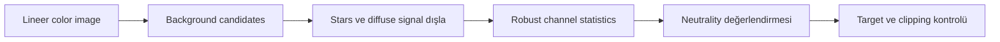
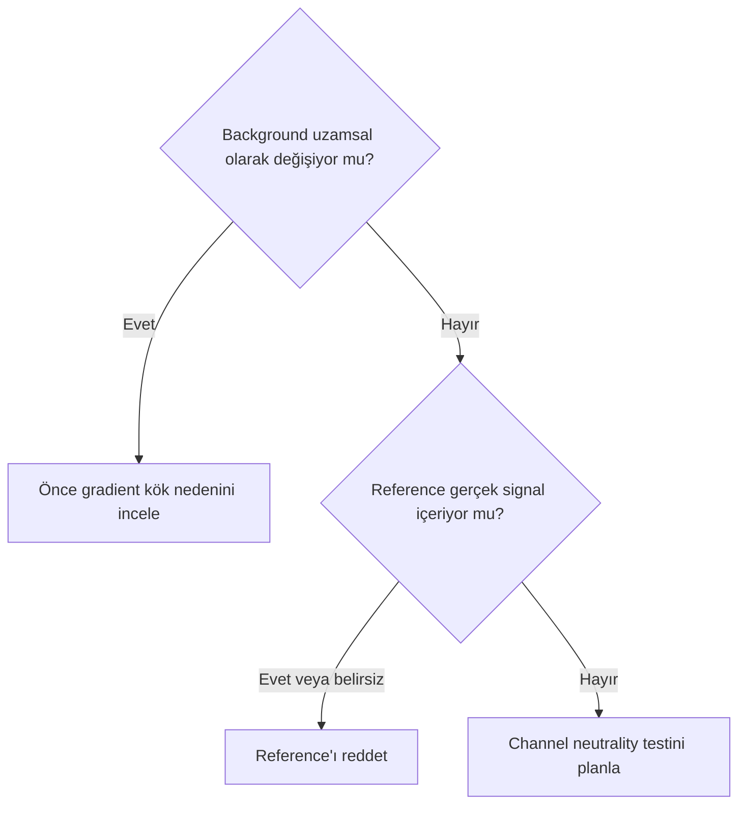
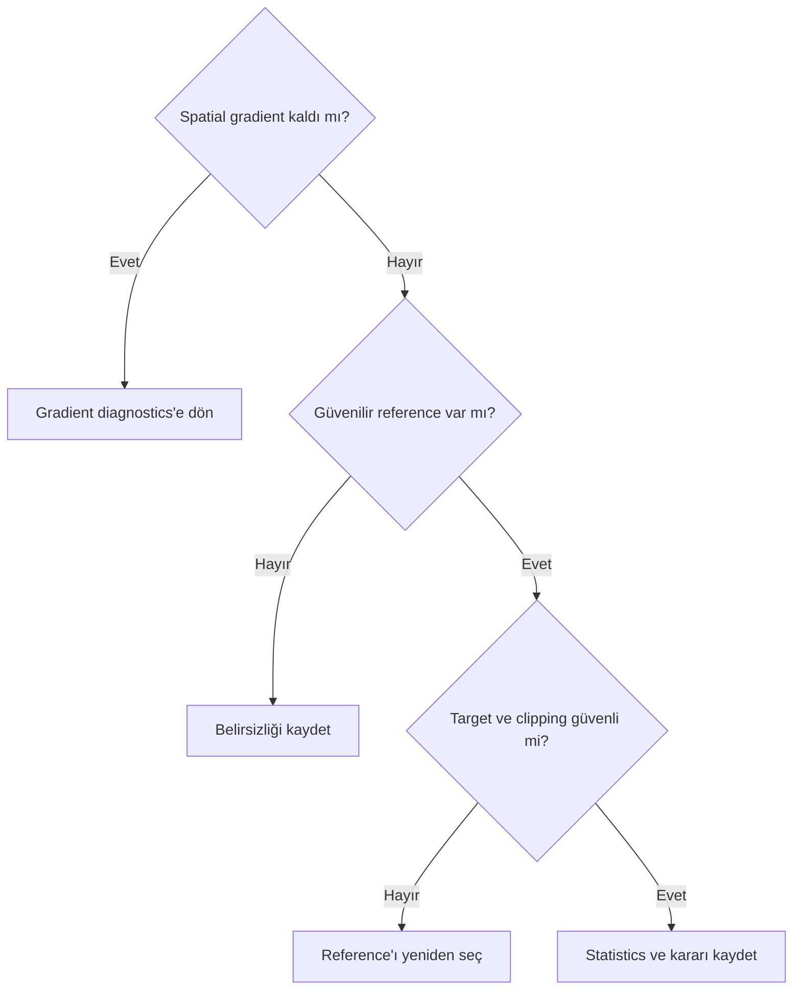

# Background Neutrality

## Amaç

Neutral background kavramını zero signal, siyah background ve gradient correction'dan ayırmak; reference seçiminin gerçek diffuse signal üzerindeki risklerini açıklamak.

## Kavramsal açıklama

Neutral background, seçilen reference bölgesinde kanalların tanımlı nötr ilişkiye getirilmesini ifade eder. Bu, background'un sıfır sinyal veya tamamen siyah olması demek değildir. Gerçek sky background airglow, light pollution, moonlight, unresolved stars, integrated flux, diffuse dust, reflection nebula, galactic cirrus, galaxy halo veya emission nebula içerebilir; fiziksel olarak nötr/gri olmak zorunda değildir.

Background reference, hedef sinyalinden ve gradient contamination'dan mümkün olduğunca bağımsız bir bölge olmalıdır. Preview kullanımı reference'ı tekrar üretilebilir kılabilir. Channel medians ve robust statistics, process algoritması iddiası değil, candidate bölgeleri genel olarak karşılaştırma yöntemleridir. `BackgroundNeutralization` içindeki exact reference statistics ve uygulama davranışı **Doğrulama bekliyor**.

!!! warning "Kavram ve process ayrımı"
    `background neutrality` genel bir renk/reference kavramıdır. `BackgroundNeutralization` ise belirli bir PixInsight processidir. Teorik kavram processin exact algoritmasıyla aynı şey değildir; process parametreleri ve uygulama davranışı Sprint 3.3'te ayrıca ele alınacaktır.

Yanlış reference belirtileri: target renginin değişmesi, galaxy halo/nebula zayıflaması, chromatic noise artışı, bir channel'da clipping veya başka bölgelerde yeni color cast oluşmasıdır. Over-neutralization gerçek sky color'ını veya düşük yüzey parlaklıklı sinyali kaldırabilir.

## Gradient ile farkı

| Konu | Gradient correction | Background neutrality |
| --- | --- | --- |
| Amaç | Spatially varying background yapısını modellemek | Seçilen reference'ta channel relationship değerlendirmek |
| Modellediği yapı | Uzamsal background yüzeyi | Channel statistics/reference ilişkisi |
| Spatial variation | Temel problemdir | Tek reference tüm spatial variation'ı açıklamaz |
| Channel relationship | Model kanal bazlı/renkli olabilir | Nötr kabul edilen kanal ilişkisi merkezde |
| Kullanılacağı aşama | Calibration sonrası residual için değerlendirilir | Gradient denetiminden sonra değerlendirilir |
| Yanlış kullanım riski | Gerçek diffuse signal çıkarılabilir | Gerçek sky color nötrleştirilebilir |
| Gerçek sinyal kaybı riski | Model contamination ile | Yanlış reference/over-neutralization ile |

Gradient correction background neutrality yerine geçmez; background neutrality de spatial gradient modeli değildir.

RGB channel statistics'i sayısal olarak eşitlemek her durumda fiziksel doğruluk anlamına gelmez. Gerçek sky nötr olmayabilir ve spatial gradient çözülmeden seçilen reference güvenilir olmayabilir.

## Ön koşullar

- Calibration ve gradient correction denetlenmiş color image; stretch öncesi kullanım genel değerlendirme açısından daha uygun olabilir
- Unclipped channels
- Target, halo, diffuse dust/nebula ve yıldızlardan uzak reference adayı
- Original/reference/sonuç karşılaştırma planı

## Ne zaman kullanılır?

- Güvenilir background reference tanımlanabildiğinde
- Channel color cast ile spatial gradient ayrıldığında
- Reference statistics ve target response birlikte incelenebildiğinde

## Ne zaman kullanılmaz?

- Background'u tamamen siyaha zorlamak için
- Gradient removal yerine
- Galaxy halo, cirrus veya emission nebula'yı background sayarak
- Channel clipping'i düzeltmek için

## Uygulama veya değerlendirme yaklaşımı

1. Gradient ve calibration artefact'ı eleyin.
2. Birden çok background candidate Preview tanımlayın.
3. Stars, halos, diffuse dust ve nebula contamination'ı kontrol edin.
4. Genel değerlendirme amacıyla channel medians/robust statistics sonuçlarını karşılaştırın; process hesabı olarak yorumlamayın.
5. Reference seçiminin target ve chromatic noise etkisini inceleyin.
6. Over-neutralization, clipping ve yeni color cast kontrolü yapın.

## Gerçek kullanım senaryosu

M31 görüntüsünde kadraj köşesi karanlık görünür; ancak galactic cirrus veya outer halo olasılığı vardır. Tek Preview nötr kabul edilmez. Alternatif bölgeler, gradient modeli ve channel statistics birlikte değerlendirilir. Sonuç gerçek veri testi bekler.

## Görsel planı

!!! example "Görsel eklenecek — doğru ve yanlış reference"
    **Amaç:** Güvenilir background ile star/gradient contaminated bölgeyi ayırmak.  
    **Gerekli ekran veya veri:** İşaretli Preview'lar ve channel statistics.  
    **Kanıtlanacak teknik nokta:** Reference geometrisinin neutrality sonucunu etkileyebilmesi.  
    **Önerilen dosya adı:** `color-background-reference-correct-wrong-v01.png`

!!! example "Görsel eklenecek — galaxy halo"
    **Amaç:** Outer halo'nun background sanılma riskini göstermek.  
    **Gerekli ekran veya veri:** M31/galaxy image, halo maskesi ve Preview.  
    **Kanıtlanacak teknik nokta:** Karanlık görünen alanın zero signal olmaması.  
    **Önerilen dosya adı:** `color-background-reference-galaxy-halo-v01.png`

!!! example "Görsel eklenecek — diffuse nebula"
    **Amaç:** Diffuse emission/reflection signal contamination'ı göstermek.  
    **Gerekli ekran veya veri:** Nebula master, model ve reference Preview.  
    **Kanıtlanacak teknik nokta:** Diffuse signal'ın neutral background yerine geçmemesi.  
    **Önerilen dosya adı:** `color-background-reference-diffuse-nebula-v01.png`

!!! example "Görsel eklenecek — neutral ve siyah"
    **Amaç:** Neutral channel relationship ile zero/black background farkını göstermek.  
    **Gerekli ekran veya veri:** Aynı Preview için RGB statistics ve iki rendering.  
    **Kanıtlanacak teknik nokta:** Neutrality'nin sıfır signal anlamına gelmemesi.  
    **Önerilen dosya adı:** `color-neutral-background-vs-black-v01.png`

## Sık yapılan hatalar

1. En karanlık pixel bölgesini otomatik reference seçmek.
2. Background'u fiziksel olarak her zaman gri varsaymak.
3. Gradient'i channel scaling ile gizlemek.
4. Galaxy halo veya cirrus'u background saymak.
5. Clipped channel statistics kullanmak.
6. Nötr sonucu siyah background ile eş tutmak.

## Sorun giderme

| Belirti | Olası neden | İlk kontrol |
| --- | --- | --- |
| Target rengi kaydı | Yanlış reference | Reference içerik haritası |
| Background hâlâ renkli | Spatial gradient veya gerçek sky | Gradient ve alternatif Preview |
| Chromatic noise arttı | Aşırı scaling | Channel statistics |
| Halo zayıfladı | Halo reference'a girdi | Model/Preview overlay |
| Bir kanal kırpıldı | Over-neutralization | Histogram ve minima/maxima |

## SSS

??? question "Neutral background siyah mıdır?"
    Hayır; neutrality channel relationship, siyah ise rendering/signal level kavramıdır.
??? question "Sky her zaman gri midir?"
    Hayır; doğal ve yapay chromatic bileşenler bulunabilir.
??? question "En karanlık Preview en iyi midir?"
    Kesin değildir; gerçek diffuse signal veya artefact içerebilir.
??? question "BackgroundNeutralization gradient'i kaldırır mı?"
    Spatial gradient modellemesiyle aynı işlem değildir.
??? question "Median tek başına yeterli mi?"
    Star/outlier/gradient contamination ve reference geometriyle birlikte değerlendirilmelidir.

## Quick Reference

!!! tip "Tek sayfalık kontrol listesi"
    - [ ] Gradient ve calibration artefact elendi
    - [ ] Birden çok reference adayı karşılaştırıldı
    - [ ] Stars/halo/diffuse signal dışlandı
    - [ ] Channel clipping yok
    - [ ] Target ve chromatic noise kontrol edildi
    - [ ] Neutral, zero ve black ayrıldı

## Decision Tree

## Teknik doğrulama durumu

| Kategori | Durum |
| --- | --- |
| UI-5 | PixInsight 1.9.3 Preview/process ekranları bekliyor |
| DOC-5 | Background statistic ve neutrality yaklaşımı bekliyor |
| DATA-5 | Galaxy ve diffuse nebula reference testleri bekliyor |
| IMG-5 | Dört planlı görsel bekliyor |

## İlgili bölümler

- [Gradient Diagnostics](../04-gradient/gradient-diagnostics.md)
- [White Balance](white-balance.md)
- [Color Calibration Diagnostics](color-calibration-diagnostics.md)
- [BackgroundNeutralization](../05-renk-kalibrasyonu/background-neutralization.md)
