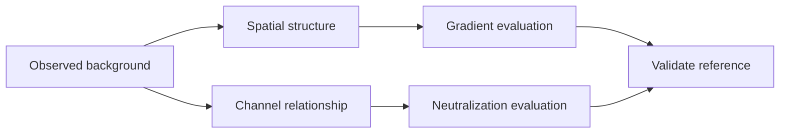
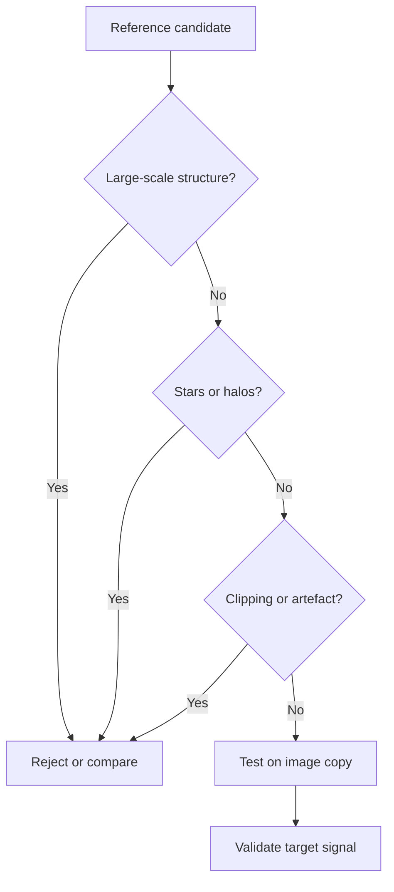
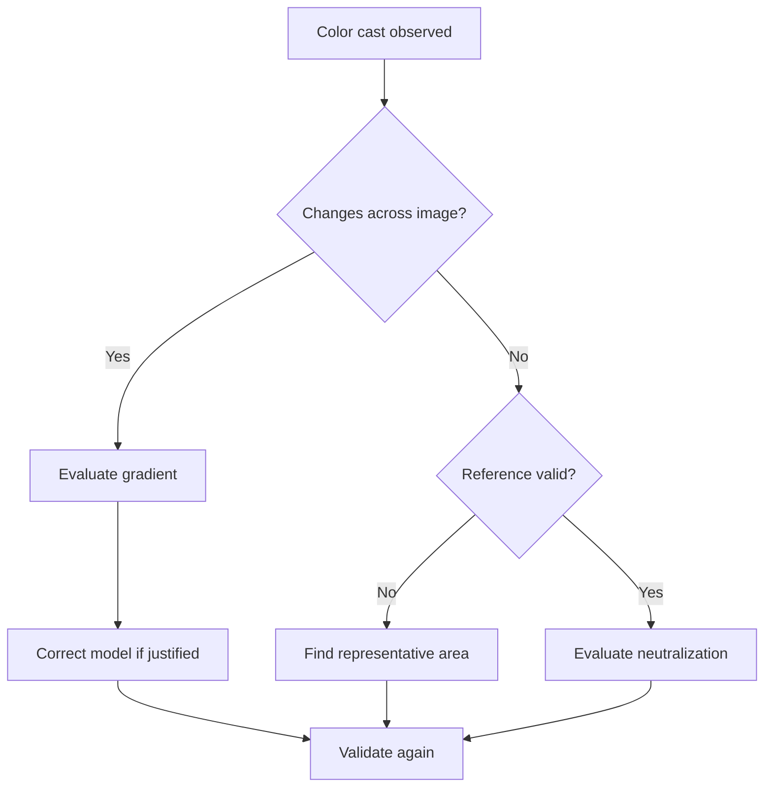
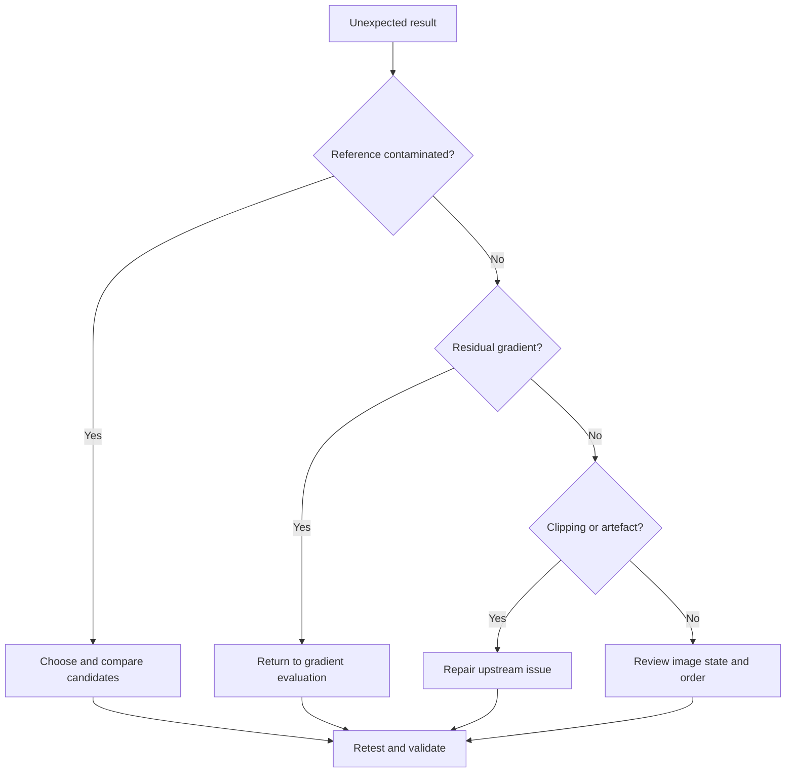
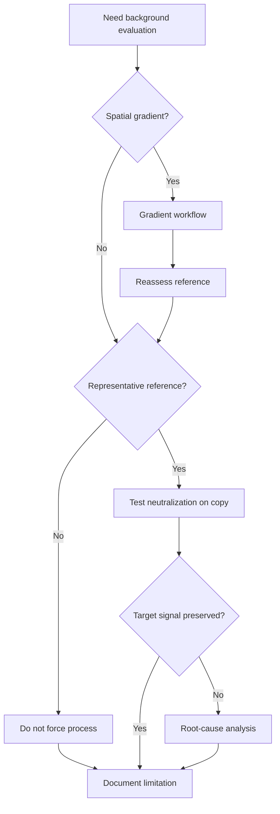

# BackgroundNeutralization

!!! info "Sayfa Bilgisi"
    **Kategori:** Renk Kalibrasyonu · **Düzey:** Intermediate · **Tahmini okuma:** 20 dk
    **Anahtar kelimeler:** `BackgroundNeutralization` · `Background Neutralization` · `BN` · `color calibration` · `renk kalibrasyonu` · `white balance`
    **Önerilen ön bilgiler:** [Gradient Tanısı](../04-gradient/gradient-diagnostics.md) · [Astronomik Renk Teorisi](color-theory.md)

## Amaç

Bu sayfa bağımsız PixInsight **BackgroundNeutralization** processini ve güvenilir background reference seçimini açıklar.

!!! warning "Beş ayrı kavram"
    **Background neutrality** genel bir renk ilişkisi kavramıdır. **BackgroundNeutralization** bir PixInsight processidir. SPCC içindeki olası background kontrolleri, PCC içindeki background/reference kontrolleri ve **gradient correction** ayrı işlemlerdir. Birbirlerinin eş anlamlısı değildir.

!!! warning "PixInsight 1.9.3 doğrulama sınırı"
    Görseller process adını, menü yolunu, `Region of Interest` section başlığını, görünen kontrol etiketlerini ve açık `Working mode` seçeneklerini doğrular. Ekran içinde sürüm numarası görünmediği için 1.9.3 kimliği kısmi kanıttır. Range, target background, statistics, clipping, default ve exact linear/nonlinear davranış hâlâ doğrulanmayı bekler.

## Kavramsal açıklama

BackgroundNeutralization, seçilen background reference içindeki kanallar arası ilişkiyi hedef görüntünün background değerlendirmesinde kullanır. Amaç background'u siyaha boyamak değildir. RGB kanallarının eşit görünmesi fiziksel doğruluk garantisi vermez; gerçek airglow, moonlight, light pollution, diffuse nebula, reflection nebula, galactic cirrus veya galaxy halo sinyali bulunabilir.

Process uzamsal gradienti modellemez; clipping, calibration artefact, dust donut, amp glow veya chromatic gradienti onarmaz ve color grading yapmaz. Spatial gradient çözülmeden seçilen reference güvenilir olmayabilir.

## Ön koşullar

- Gradient ve calibration artefact denetimi yapılmış görüntü.
- Galaxy halo, cirrus, nebula ve yıldız halelerinden ayrılmış reference adayı.
- Clipping içermeyen, temsil edilebilir noise düzeyinde yeterli alan.
- Image state ve process sırasının kaydı.

## Ne zaman değerlendirilir?

Renk kalibrasyonu akışında background kanal ilişkisinin taraflı olduğuna dair ölçülebilir kanıt varsa, uygun reference alanı bulunabiliyorsa ve gradient ayrı değerlendirilmişse.

## Ne zaman tek başına yeterli değildir?

Uzamsal veya chromatic gradient, moonlight yapısı, light pollution deseni, airglow değişimi, amp glow, flat hatası, clipping, bozuk calibration veya gerçek diffuse sinyal varsa tek başına yeterli değildir.

!!! info
    Neutral background ile black background aynı değildir. Background'da gürültü ve gerçek gök sinyali bulunabilir; sıfıra zorlamak clipping riskidir.

## Arka Plan Referansı seçimi

Uygun aday; düşük büyük ölçekli yapıya, az yıldıza, clipping olmayan piksellere, gradient sonrası daha homojen yapıya ve görüntüyü temsil eden noise düzeyine sahip olabilir. Galaxy halo, nebula, cirrus ve reflection sinyali dışlanmalıdır.

| Alan tipi | Background reference için risk | İlk kontrol | Alternatif yaklaşım |
| --- | --- | --- | --- |
| Galaxy halo | Gerçek gök sinyalini nötrleştirme | Yapı, clipping ve kanal istatistiği | Başka adayları karşılaştır; gerekirse önce kök nedeni düzelt |
| Spiral arm | Gerçek gök sinyalini nötrleştirme | Yapı, clipping ve kanal istatistiği | Başka adayları karşılaştır; gerekirse önce kök nedeni düzelt |
| IFN veya galactic cirrus | Gerçek gök sinyalini nötrleştirme | Yapı, clipping ve kanal istatistiği | Başka adayları karşılaştır; gerekirse önce kök nedeni düzelt |
| Emission nebula | Gerçek gök sinyalini nötrleştirme | Yapı, clipping ve kanal istatistiği | Başka adayları karşılaştır; gerekirse önce kök nedeni düzelt |
| Reflection nebula | Gerçek gök sinyalini nötrleştirme | Yapı, clipping ve kanal istatistiği | Başka adayları karşılaştır; gerekirse önce kök nedeni düzelt |
| Dark nebula sınırı | Kontaminasyon veya temsil hatası | Yapı, clipping ve kanal istatistiği | Başka adayları karşılaştır; gerekirse önce kök nedeni düzelt |
| Bright star halo | Kontaminasyon veya temsil hatası | Yapı, clipping ve kanal istatistiği | Başka adayları karşılaştır; gerekirse önce kök nedeni düzelt |
| Diffraction spike | Kontaminasyon veya temsil hatası | Yapı, clipping ve kanal istatistiği | Başka adayları karşılaştır; gerekirse önce kök nedeni düzelt |
| Dust donut | Kontaminasyon veya temsil hatası | Yapı, clipping ve kanal istatistiği | Başka adayları karşılaştır; gerekirse önce kök nedeni düzelt |
| Amp glow | Kontaminasyon veya temsil hatası | Yapı, clipping ve kanal istatistiği | Başka adayları karşılaştır; gerekirse önce kök nedeni düzelt |
| Mosaic seam | Kontaminasyon veya temsil hatası | Yapı, clipping ve kanal istatistiği | Başka adayları karşılaştır; gerekirse önce kök nedeni düzelt |
| Residual gradient | Kontaminasyon veya temsil hatası | Yapı, clipping ve kanal istatistiği | Başka adayları karşılaştır; gerekirse önce kök nedeni düzelt |
| Clipped black region | Kontaminasyon veya temsil hatası | Yapı, clipping ve kanal istatistiği | Başka adayları karşılaştır; gerekirse önce kök nedeni düzelt |
| Saturated star field | Kontaminasyon veya temsil hatası | Yapı, clipping ve kanal istatistiği | Başka adayları karşılaştır; gerekirse önce kök nedeni düzelt |
| Walking noise pattern | Kontaminasyon veya temsil hatası | Yapı, clipping ve kanal istatistiği | Başka adayları karşılaştır; gerekirse önce kök nedeni düzelt |

### Kavramsal kontroller

| Kontrol grubu | Amaç | Yanlış kullanım riski | Doğrulama |
| --- | --- | --- | --- |
| background reference | Kanal ilişkisini örneklemek | Gerçek sinyali background saymak | Preview ve yapı denetimi |
| reference preview | Uzamsal alanı sınırlamak | Kontaminasyon | Farklı aday karşılaştırması |
| target image | İşlem girdisini tanımlamak | Yanlış image state | History ve metadata |
| channel statistics | Kanal ilişkisini incelemek | Gürültüyü sinyal sanmak | Ölçüm ve histogram |
| clipping protection | Uç değer riskini izlemek | Siyah/beyaz clipping | Clipping maskesi |
| output validation | Sonucu kanıtlamak | Yalnız görünüşe güvenmek | Öncesi/sonrası, hedef yapı ve log |

### Görsel kanıtla doğrulanan UI

- Process adı: `BackgroundNeutralization`.
- Menü yolu: `Process → ColorCalibration → BackgroundNeutralization`.
- Görünen section: `Region of Interest`.
- Açık `Working mode` seçenekleri: `Target Background`, `Rescale`, `Rescale as needed`, `Truncate`.
- Kanıt dizini: `validation/ui/pi-1.9.3/background-neutralization/screenshots/`.
- Evidence matrix: `validation/ui/pi-1.9.3/background-neutralization/background-neutralization-evidence-matrix.md`.

!!! note "Mevcut değerler varsayılan değildir"
    Görsellerde iki farklı `Reference image` durumu ve çeşitli sayısal değerler görülür. Processin yeni/resetlenmiş olduğu kanıtlanmadığından bunlar default veya davranış kanıtı değildir.

### UI doğrulama durumu

| UI alanı | Doğrulanacak bilgi | Yayın riski | Durum |
| --- | --- | --- | --- |
| process menu location | Menü yolu | Yüksek | Doğrulandı |
| section names | `Region of Interest` section başlığı görüldü | Yüksek | Doğrulandı |
| reference image veya preview controls | `Reference image` ve `From Preview` etiketleri görüldü; davranış bekliyor | Yüksek | Kısmen doğrulandı |
| lower/upper range controls | `Lower limit` ve `Upper limit` etiketleri görüldü; davranış bekliyor | Yüksek | Kısmen doğrulandı |
| target background controls | `Target background` etiketi ve dört `Working mode` seçeneği görüldü; etki bekliyor | Yüksek | Kısmen doğrulandı |
| default values | 1.9.3 gerçek etiket ve davranış | Kritik | Doğrulama bekliyor |
| clipping behavior | 1.9.3 gerçek etiket ve davranış | Yüksek | Doğrulama bekliyor |
| exact statistics | 1.9.3 gerçek etiket ve davranış | Kritik | Doğrulama bekliyor |
| exact linear/nonlinear behavior | 1.9.3 gerçek etiket ve davranış | Kritik | Doğrulama bekliyor |
| output/log behavior | 1.9.3 gerçek etiket ve davranış | Yüksek | Doğrulama bekliyor |

## Uygulama yaklaşımı

1. Image state, calibration geçmişi ve clipping durumunu kaydedin.
2. Gradientin varlığını ve türünü değerlendirin; gerekiyorsa önce ayrı gradient iş akışını tamamlayın.
3. Birden fazla reference preview adayı oluşturun.
4. Adayları halo, cirrus, nebula, unresolved stars, artefact ve noise açısından inceleyin.
5. Doğrulanmış UI üzerinden bir çalışma kopyasında uygulayın.
6. Histogram, clipping, yıldızlar ve gerçek hedef sinyalini birlikte karşılaştırın.
7. PCC/SPCC öncesi-sonrası sırasını kayıtlı, kontrollü testle değerlendirin.

!!! example
    M31 çevresindeki soluk halo karanlık görünse bile background değildir. Halo içeren preview, galaksi rengini nötrleştirmeye çalışabilir.

## Gerçek kullanım senaryoları

### Galaxy halo ve galactic cirrus

Halo, IFN ve cirrus gerçek sinyaldir. Reference dışına alın; alternatif aday yoksa işlemin güvenilirliği sınırlıdır.

### Diffuse ve reflection nebula

Soluk emission/reflection yapıları background sanılmamalıdır. Morfoloji, broadband kanal ilişkisi ve daha geniş bağlam incelenir.

### Moonlight, light pollution ve airglow

Bunlar spatial veya chromatic gradient üretebilir. Önce gradient modeli değerlendirilir; neutralization yalnız kalan kanal ilişkisini hedefler.

### Unresolved stars ve star contamination

Yoğun yıldız alanlarında istatistikler unresolved kaynaklardan etkilenebilir. Birden fazla alan ve ölçek karşılaştırılır.

### Calibration artefact ve clipping

Dust donut, amp glow ve clipped black region uygun reference değildir; upstream sorun giderilir.

## Gradient mi neutralization mı?

## Gerçek veri test matrisi

| Test ID | Veri türü | Reference senaryosu | Karşılaştırma | Gözlenecek kanıt | Başarı değerlendirmesi | Durum |
| --- | --- | --- | --- | --- | --- | --- |
| BN-BB-EMPTYFIELD-01 | Boş broadband alan | Düşük yapı, az yıldız | BN öncesi/sonrası | Histogram, clipping, hedef sinyali ve log | Veri setine bağlı çoklu kanıt | Gerçek veri bekliyor |
| BN-BB-M31-HALO-01 | M31 | Halo içeren riskli preview | halo dışı adayla karşılaştır | Histogram, clipping, hedef sinyali ve log | Veri setine bağlı çoklu kanıt | Gerçek veri bekliyor |
| BN-BB-CIRRUS-01 | Cirrus alanı | IFN/cirrus içeren preview | farklı adaylar | Histogram, clipping, hedef sinyali ve log | Veri setine bağlı çoklu kanıt | Gerçek veri bekliyor |
| BN-BB-NEBULA-01 | Diffuse nebula | Nebula içeren preview | morfoloji koruması | Histogram, clipping, hedef sinyali ve log | Veri setine bağlı çoklu kanıt | Gerçek veri bekliyor |
| BN-BB-GRADIENT-01 | Gradientli alan | Residual gradient | gradient öncesi/sonrası | Histogram, clipping, hedef sinyali ve log | Veri setine bağlı çoklu kanıt | Gerçek veri bekliyor |
| BN-BB-STARFIELD-01 | Yıldız alanı | Yıldız kontaminasyonu | preview adayları | Histogram, clipping, hedef sinyali ve log | Veri setine bağlı çoklu kanıt | Gerçek veri bekliyor |
| BN-BB-CLIPPING-01 | Clipped görüntü | Siyah bölge | clipping maskesi | Histogram, clipping, hedef sinyali ve log | Veri setine bağlı çoklu kanıt | Gerçek veri bekliyor |
| BN-BB-REFLECTION-01 | Reflection nebula | Mavi gerçek sinyal | nebula dışı aday | Histogram, clipping, hedef sinyali ve log | Veri setine bağlı çoklu kanıt | Gerçek veri bekliyor |
| BN-BB-MOONLIGHT-01 | Moonlight etkili | Chromatic gradient | gradient modeli | Histogram, clipping, hedef sinyali ve log | Veri setine bağlı çoklu kanıt | Gerçek veri bekliyor |
| BN-COMP-SPCC-PCC-01 | Broadband karşılaştırma | Aynı doğrulanmış girdi | BN, PCC ve SPCC sıraları | Histogram, clipping, hedef sinyali ve log | Veri setine bağlı çoklu kanıt | Gerçek veri bekliyor |

## Girdi, çıktı ve performans beklentisi

Girdi lineer ve gradient açısından denetlenmiş olmalı; reference Preview galaxy halo, cirrus, nebula, bright-star halo, dust artefact ve clipping içermemelidir. Çıktıda channel background offsets daha tutarlı olabilir; background’un siyah olması veya tüm renk farklarının kaybolması başarı ölçütü değildir.

| Seçenek | Gerekçe | Red işareti |
|---|---|---|
| Ayrı BN uygula | Temsilî ROI ve ölçülebilir offset var | Diffused target color değişiyor |
| SPCC içi neutralization | Aynı calibration kaydında yönetilecek | Reference seçimi belirsiz |
| Neutralization atla | Alanın tamamı gerçek signal içeriyor | Sırf background renkli göründüğü için zorlama |

Preview kullanımı hesap yükünden çok tekrar üretilebilirlik sağlar. Birden fazla aday ROI’nin statistics karşılaştırması, tek büyük ve contaminated ROI’den daha güvenilir karar üretebilir.

## Sık yapılan hatalar

- En karanlık alanı otomatik olarak background kabul etmek.
- Galaxy halo veya cirrusu nötrleştirmek.
- Spatial gradienti process ile çözmeye çalışmak.
- RGB eşitliğini fiziksel doğruluk saymak.
- Background'u siyaha zorlamak.
- Tek küçük preview ile tüm görüntüyü temsil etmek.
- PCC/SPCC sırasını kaydetmeden sonuç karşılaştırmak.

## Sorun giderme

### Kötü sonuç kök nedeni

### BN-01 — Background hâlâ renkli

**Belirti:** Background hâlâ renkli.

**Muhtemel nedenler:** Reference kontaminasyonu, residual gradient, clipping, image state veya kanal gürültüsü.

**Önce kontrol et:** Preview içeriği, gradient modeli, histogram ve işlem sırası.

**Olası müdahaleler:** Temsil edici başka aday seç; gradienti ayrı değerlendir; kontrollü kopyada yeniden test et.

**Yapılmaması gerekenler:** Gerçek gök sinyalini background saymak veya sabit sayı reçetesi uygulamak.

**Doğrulama yöntemi:** Öncesi/sonrası histogram, clipping maskesi, hedef morfolojisi ve log.

**İlgili bölüm:** [Kötü sonuç kök nedeni](#kötü-sonuç-kök-nedeni).

**UI veya kaynak durumu:** **Doğrulama bekliyor**; PixInsight 1.9.3 UI ve gerçek veri gerekir.

### BN-02 — Background aşırı gri

**Belirti:** Background aşırı gri.

**Muhtemel nedenler:** Reference kontaminasyonu, residual gradient, clipping, image state veya kanal gürültüsü.

**Önce kontrol et:** Preview içeriği, gradient modeli, histogram ve işlem sırası.

**Olası müdahaleler:** Temsil edici başka aday seç; gradienti ayrı değerlendir; kontrollü kopyada yeniden test et.

**Yapılmaması gerekenler:** Gerçek gök sinyalini background saymak veya sabit sayı reçetesi uygulamak.

**Doğrulama yöntemi:** Öncesi/sonrası histogram, clipping maskesi, hedef morfolojisi ve log.

**İlgili bölüm:** [Kötü sonuç kök nedeni](#kötü-sonuç-kök-nedeni).

**UI veya kaynak durumu:** **Doğrulama bekliyor**; PixInsight 1.9.3 UI ve gerçek veri gerekir.

### BN-03 — Background siyaha çöktü

**Belirti:** Background siyaha çöktü.

**Muhtemel nedenler:** Reference kontaminasyonu, residual gradient, clipping, image state veya kanal gürültüsü.

**Önce kontrol et:** Preview içeriği, gradient modeli, histogram ve işlem sırası.

**Olası müdahaleler:** Temsil edici başka aday seç; gradienti ayrı değerlendir; kontrollü kopyada yeniden test et.

**Yapılmaması gerekenler:** Gerçek gök sinyalini background saymak veya sabit sayı reçetesi uygulamak.

**Doğrulama yöntemi:** Öncesi/sonrası histogram, clipping maskesi, hedef morfolojisi ve log.

**İlgili bölüm:** [Kötü sonuç kök nedeni](#kötü-sonuç-kök-nedeni).

**UI veya kaynak durumu:** **Doğrulama bekliyor**; PixInsight 1.9.3 UI ve gerçek veri gerekir.

### BN-04 — Channel clipping oluştu

**Belirti:** Channel clipping oluştu.

**Muhtemel nedenler:** Reference kontaminasyonu, residual gradient, clipping, image state veya kanal gürültüsü.

**Önce kontrol et:** Preview içeriği, gradient modeli, histogram ve işlem sırası.

**Olası müdahaleler:** Temsil edici başka aday seç; gradienti ayrı değerlendir; kontrollü kopyada yeniden test et.

**Yapılmaması gerekenler:** Gerçek gök sinyalini background saymak veya sabit sayı reçetesi uygulamak.

**Doğrulama yöntemi:** Öncesi/sonrası histogram, clipping maskesi, hedef morfolojisi ve log.

**İlgili bölüm:** [Kötü sonuç kök nedeni](#kötü-sonuç-kök-nedeni).

**UI veya kaynak durumu:** **Doğrulama bekliyor**; PixInsight 1.9.3 UI ve gerçek veri gerekir.

### BN-05 — Galaxy halo rengi bozuldu

**Belirti:** Galaxy halo rengi bozuldu.

**Muhtemel nedenler:** Reference kontaminasyonu, residual gradient, clipping, image state veya kanal gürültüsü.

**Önce kontrol et:** Preview içeriği, gradient modeli, histogram ve işlem sırası.

**Olası müdahaleler:** Temsil edici başka aday seç; gradienti ayrı değerlendir; kontrollü kopyada yeniden test et.

**Yapılmaması gerekenler:** Gerçek gök sinyalini background saymak veya sabit sayı reçetesi uygulamak.

**Doğrulama yöntemi:** Öncesi/sonrası histogram, clipping maskesi, hedef morfolojisi ve log.

**İlgili bölüm:** [Kötü sonuç kök nedeni](#kötü-sonuç-kök-nedeni).

**UI veya kaynak durumu:** **Doğrulama bekliyor**; PixInsight 1.9.3 UI ve gerçek veri gerekir.

### BN-06 — Cirrus kayboldu

**Belirti:** Cirrus kayboldu.

**Muhtemel nedenler:** Reference kontaminasyonu, residual gradient, clipping, image state veya kanal gürültüsü.

**Önce kontrol et:** Preview içeriği, gradient modeli, histogram ve işlem sırası.

**Olası müdahaleler:** Temsil edici başka aday seç; gradienti ayrı değerlendir; kontrollü kopyada yeniden test et.

**Yapılmaması gerekenler:** Gerçek gök sinyalini background saymak veya sabit sayı reçetesi uygulamak.

**Doğrulama yöntemi:** Öncesi/sonrası histogram, clipping maskesi, hedef morfolojisi ve log.

**İlgili bölüm:** [Kötü sonuç kök nedeni](#kötü-sonuç-kök-nedeni).

**UI veya kaynak durumu:** **Doğrulama bekliyor**; PixInsight 1.9.3 UI ve gerçek veri gerekir.

### BN-07 — Diffuse nebula zayıfladı

**Belirti:** Diffuse nebula zayıfladı.

**Muhtemel nedenler:** Reference kontaminasyonu, residual gradient, clipping, image state veya kanal gürültüsü.

**Önce kontrol et:** Preview içeriği, gradient modeli, histogram ve işlem sırası.

**Olası müdahaleler:** Temsil edici başka aday seç; gradienti ayrı değerlendir; kontrollü kopyada yeniden test et.

**Yapılmaması gerekenler:** Gerçek gök sinyalini background saymak veya sabit sayı reçetesi uygulamak.

**Doğrulama yöntemi:** Öncesi/sonrası histogram, clipping maskesi, hedef morfolojisi ve log.

**İlgili bölüm:** [Kötü sonuç kök nedeni](#kötü-sonuç-kök-nedeni).

**UI veya kaynak durumu:** **Doğrulama bekliyor**; PixInsight 1.9.3 UI ve gerçek veri gerekir.

### BN-08 — Yıldız renkleri değişti

**Belirti:** Yıldız renkleri değişti.

**Muhtemel nedenler:** Reference kontaminasyonu, residual gradient, clipping, image state veya kanal gürültüsü.

**Önce kontrol et:** Preview içeriği, gradient modeli, histogram ve işlem sırası.

**Olası müdahaleler:** Temsil edici başka aday seç; gradienti ayrı değerlendir; kontrollü kopyada yeniden test et.

**Yapılmaması gerekenler:** Gerçek gök sinyalini background saymak veya sabit sayı reçetesi uygulamak.

**Doğrulama yöntemi:** Öncesi/sonrası histogram, clipping maskesi, hedef morfolojisi ve log.

**İlgili bölüm:** [Kötü sonuç kök nedeni](#kötü-sonuç-kök-nedeni).

**UI veya kaynak durumu:** **Doğrulama bekliyor**; PixInsight 1.9.3 UI ve gerçek veri gerekir.

### BN-09 — Gradient daha görünür oldu

**Belirti:** Gradient daha görünür oldu.

**Muhtemel nedenler:** Reference kontaminasyonu, residual gradient, clipping, image state veya kanal gürültüsü.

**Önce kontrol et:** Preview içeriği, gradient modeli, histogram ve işlem sırası.

**Olası müdahaleler:** Temsil edici başka aday seç; gradienti ayrı değerlendir; kontrollü kopyada yeniden test et.

**Yapılmaması gerekenler:** Gerçek gök sinyalini background saymak veya sabit sayı reçetesi uygulamak.

**Doğrulama yöntemi:** Öncesi/sonrası histogram, clipping maskesi, hedef morfolojisi ve log.

**İlgili bölüm:** [Kötü sonuç kök nedeni](#kötü-sonuç-kök-nedeni).

**UI veya kaynak durumu:** **Doğrulama bekliyor**; PixInsight 1.9.3 UI ve gerçek veri gerekir.

### BN-10 — Chromatic noise arttı

**Belirti:** Chromatic noise arttı.

**Muhtemel nedenler:** Reference kontaminasyonu, residual gradient, clipping, image state veya kanal gürültüsü.

**Önce kontrol et:** Preview içeriği, gradient modeli, histogram ve işlem sırası.

**Olası müdahaleler:** Temsil edici başka aday seç; gradienti ayrı değerlendir; kontrollü kopyada yeniden test et.

**Yapılmaması gerekenler:** Gerçek gök sinyalini background saymak veya sabit sayı reçetesi uygulamak.

**Doğrulama yöntemi:** Öncesi/sonrası histogram, clipping maskesi, hedef morfolojisi ve log.

**İlgili bölüm:** [Kötü sonuç kök nedeni](#kötü-sonuç-kök-nedeni).

**UI veya kaynak durumu:** **Doğrulama bekliyor**; PixInsight 1.9.3 UI ve gerçek veri gerekir.

### BN-11 — Preview yanlış alanı içeriyor

**Belirti:** Preview yanlış alanı içeriyor.

**Muhtemel nedenler:** Reference kontaminasyonu, residual gradient, clipping, image state veya kanal gürültüsü.

**Önce kontrol et:** Preview içeriği, gradient modeli, histogram ve işlem sırası.

**Olası müdahaleler:** Temsil edici başka aday seç; gradienti ayrı değerlendir; kontrollü kopyada yeniden test et.

**Yapılmaması gerekenler:** Gerçek gök sinyalini background saymak veya sabit sayı reçetesi uygulamak.

**Doğrulama yöntemi:** Öncesi/sonrası histogram, clipping maskesi, hedef morfolojisi ve log.

**İlgili bölüm:** [Kötü sonuç kök nedeni](#kötü-sonuç-kök-nedeni).

**UI veya kaynak durumu:** **Doğrulama bekliyor**; PixInsight 1.9.3 UI ve gerçek veri gerekir.

### BN-12 — Bright star halo reference’a girdi

**Belirti:** Bright star halo reference’a girdi.

**Muhtemel nedenler:** Reference kontaminasyonu, residual gradient, clipping, image state veya kanal gürültüsü.

**Önce kontrol et:** Preview içeriği, gradient modeli, histogram ve işlem sırası.

**Olası müdahaleler:** Temsil edici başka aday seç; gradienti ayrı değerlendir; kontrollü kopyada yeniden test et.

**Yapılmaması gerekenler:** Gerçek gök sinyalini background saymak veya sabit sayı reçetesi uygulamak.

**Doğrulama yöntemi:** Öncesi/sonrası histogram, clipping maskesi, hedef morfolojisi ve log.

**İlgili bölüm:** [Kötü sonuç kök nedeni](#kötü-sonuç-kök-nedeni).

**UI veya kaynak durumu:** **Doğrulama bekliyor**; PixInsight 1.9.3 UI ve gerçek veri gerekir.

### BN-13 — Dust donut reference’a girdi

**Belirti:** Dust donut reference’a girdi.

**Muhtemel nedenler:** Reference kontaminasyonu, residual gradient, clipping, image state veya kanal gürültüsü.

**Önce kontrol et:** Preview içeriği, gradient modeli, histogram ve işlem sırası.

**Olası müdahaleler:** Temsil edici başka aday seç; gradienti ayrı değerlendir; kontrollü kopyada yeniden test et.

**Yapılmaması gerekenler:** Gerçek gök sinyalini background saymak veya sabit sayı reçetesi uygulamak.

**Doğrulama yöntemi:** Öncesi/sonrası histogram, clipping maskesi, hedef morfolojisi ve log.

**İlgili bölüm:** [Kötü sonuç kök nedeni](#kötü-sonuç-kök-nedeni).

**UI veya kaynak durumu:** **Doğrulama bekliyor**; PixInsight 1.9.3 UI ve gerçek veri gerekir.

### BN-14 — Amp glow reference’a girdi

**Belirti:** Amp glow reference’a girdi.

**Muhtemel nedenler:** Reference kontaminasyonu, residual gradient, clipping, image state veya kanal gürültüsü.

**Önce kontrol et:** Preview içeriği, gradient modeli, histogram ve işlem sırası.

**Olası müdahaleler:** Temsil edici başka aday seç; gradienti ayrı değerlendir; kontrollü kopyada yeniden test et.

**Yapılmaması gerekenler:** Gerçek gök sinyalini background saymak veya sabit sayı reçetesi uygulamak.

**Doğrulama yöntemi:** Öncesi/sonrası histogram, clipping maskesi, hedef morfolojisi ve log.

**İlgili bölüm:** [Kötü sonuç kök nedeni](#kötü-sonuç-kök-nedeni).

**UI veya kaynak durumu:** **Doğrulama bekliyor**; PixInsight 1.9.3 UI ve gerçek veri gerekir.

### BN-15 — Reflection reference’a girdi

**Belirti:** Reflection reference’a girdi.

**Muhtemel nedenler:** Reference kontaminasyonu, residual gradient, clipping, image state veya kanal gürültüsü.

**Önce kontrol et:** Preview içeriği, gradient modeli, histogram ve işlem sırası.

**Olası müdahaleler:** Temsil edici başka aday seç; gradienti ayrı değerlendir; kontrollü kopyada yeniden test et.

**Yapılmaması gerekenler:** Gerçek gök sinyalini background saymak veya sabit sayı reçetesi uygulamak.

**Doğrulama yöntemi:** Öncesi/sonrası histogram, clipping maskesi, hedef morfolojisi ve log.

**İlgili bölüm:** [Kötü sonuç kök nedeni](#kötü-sonuç-kök-nedeni).

**UI veya kaynak durumu:** **Doğrulama bekliyor**; PixInsight 1.9.3 UI ve gerçek veri gerekir.

### BN-16 — Arka Plan Referansı çok küçük

**Belirti:** Background reference çok küçük.

**Muhtemel nedenler:** Reference kontaminasyonu, residual gradient, clipping, image state veya kanal gürültüsü.

**Önce kontrol et:** Preview içeriği, gradient modeli, histogram ve işlem sırası.

**Olası müdahaleler:** Temsil edici başka aday seç; gradienti ayrı değerlendir; kontrollü kopyada yeniden test et.

**Yapılmaması gerekenler:** Gerçek gök sinyalini background saymak veya sabit sayı reçetesi uygulamak.

**Doğrulama yöntemi:** Öncesi/sonrası histogram, clipping maskesi, hedef morfolojisi ve log.

**İlgili bölüm:** [Kötü sonuç kök nedeni](#kötü-sonuç-kök-nedeni).

**UI veya kaynak durumu:** **Doğrulama bekliyor**; PixInsight 1.9.3 UI ve gerçek veri gerekir.

### BN-17 — Arka Plan Referansı temsil edici değil

**Belirti:** Background reference temsil edici değil.

**Muhtemel nedenler:** Reference kontaminasyonu, residual gradient, clipping, image state veya kanal gürültüsü.

**Önce kontrol et:** Preview içeriği, gradient modeli, histogram ve işlem sırası.

**Olası müdahaleler:** Temsil edici başka aday seç; gradienti ayrı değerlendir; kontrollü kopyada yeniden test et.

**Yapılmaması gerekenler:** Gerçek gök sinyalini background saymak veya sabit sayı reçetesi uygulamak.

**Doğrulama yöntemi:** Öncesi/sonrası histogram, clipping maskesi, hedef morfolojisi ve log.

**İlgili bölüm:** [Kötü sonuç kök nedeni](#kötü-sonuç-kök-nedeni).

**UI veya kaynak durumu:** **Doğrulama bekliyor**; PixInsight 1.9.3 UI ve gerçek veri gerekir.

### BN-18 — PCC/SPCC sonucu değişti

**Belirti:** PCC/SPCC sonucu değişti.

**Muhtemel nedenler:** Reference kontaminasyonu, residual gradient, clipping, image state veya kanal gürültüsü.

**Önce kontrol et:** Preview içeriği, gradient modeli, histogram ve işlem sırası.

**Olası müdahaleler:** Temsil edici başka aday seç; gradienti ayrı değerlendir; kontrollü kopyada yeniden test et.

**Yapılmaması gerekenler:** Gerçek gök sinyalini background saymak veya sabit sayı reçetesi uygulamak.

**Doğrulama yöntemi:** Öncesi/sonrası histogram, clipping maskesi, hedef morfolojisi ve log.

**İlgili bölüm:** [Kötü sonuç kök nedeni](#kötü-sonuç-kök-nedeni).

**UI veya kaynak durumu:** **Doğrulama bekliyor**; PixInsight 1.9.3 UI ve gerçek veri gerekir.

### BN-19 — Nonlinear görüntüde beklenmedik sonuç

**Belirti:** Nonlinear görüntüde beklenmedik sonuç.

**Muhtemel nedenler:** Reference kontaminasyonu, residual gradient, clipping, image state veya kanal gürültüsü.

**Önce kontrol et:** Preview içeriği, gradient modeli, histogram ve işlem sırası.

**Olası müdahaleler:** Temsil edici başka aday seç; gradienti ayrı değerlendir; kontrollü kopyada yeniden test et.

**Yapılmaması gerekenler:** Gerçek gök sinyalini background saymak veya sabit sayı reçetesi uygulamak.

**Doğrulama yöntemi:** Öncesi/sonrası histogram, clipping maskesi, hedef morfolojisi ve log.

**İlgili bölüm:** [Kötü sonuç kök nedeni](#kötü-sonuç-kök-nedeni).

**UI veya kaynak durumu:** **Doğrulama bekliyor**; PixInsight 1.9.3 UI ve gerçek veri gerekir.

### BN-20 — Process log veya çıktı beklenmedik

**Belirti:** Process log veya output beklenmedik.

**Muhtemel nedenler:** Reference kontaminasyonu, residual gradient, clipping, image state veya kanal gürültüsü.

**Önce kontrol et:** Preview içeriği, gradient modeli, histogram ve işlem sırası.

**Olası müdahaleler:** Temsil edici başka aday seç; gradienti ayrı değerlendir; kontrollü kopyada yeniden test et.

**Yapılmaması gerekenler:** Gerçek gök sinyalini background saymak veya sabit sayı reçetesi uygulamak.

**Doğrulama yöntemi:** Öncesi/sonrası histogram, clipping maskesi, hedef morfolojisi ve log.

**İlgili bölüm:** [Kötü sonuç kök nedeni](#kötü-sonuç-kök-nedeni).

**UI veya kaynak durumu:** **Doğrulama bekliyor**; PixInsight 1.9.3 UI ve gerçek veri gerekir.

## Görsel kanıt envanteri

### Görsel BN-01 — Process ana arayüzü

- **Gerekli PixInsight sürümü:** 1.9.3
- **Gerekli veri:** Kontrollü broadband test verisi
- **Ekran veya çıktı:** ana UI
- **Teknik kanıt amacı:** Reference, UI veya sonuç davranışını doğrulamak
- **Önerilen dosya adı:** `bn-ui-main-1.9.3.png`
- **Durum:** Görsel doğrulama ölçütü

### Görsel BN-02 — Doğru reference preview

- **Gerekli PixInsight sürümü:** 1.9.3
- **Gerekli veri:** Kontrollü broadband test verisi
- **Ekran veya çıktı:** uygun aday
- **Teknik kanıt amacı:** Reference, UI veya sonuç davranışını doğrulamak
- **Önerilen dosya adı:** `bn-reference-valid.png`
- **Durum:** Görsel doğrulama ölçütü

### Görsel BN-03 — Galaxy halo içeren yanlış preview

- **Gerekli PixInsight sürümü:** 1.9.3
- **Gerekli veri:** Kontrollü broadband test verisi
- **Ekran veya çıktı:** halo kontaminasyonu
- **Teknik kanıt amacı:** Reference, UI veya sonuç davranışını doğrulamak
- **Önerilen dosya adı:** `bn-reference-galaxy-halo.png`
- **Durum:** Görsel doğrulama ölçütü

### Görsel BN-04 — Cirrus içeren yanlış preview

- **Gerekli PixInsight sürümü:** 1.9.3
- **Gerekli veri:** Kontrollü broadband test verisi
- **Ekran veya çıktı:** cirrus kontaminasyonu
- **Teknik kanıt amacı:** Reference, UI veya sonuç davranışını doğrulamak
- **Önerilen dosya adı:** `bn-reference-cirrus.png`
- **Durum:** Görsel doğrulama ölçütü

### Görsel BN-05 — Nebula içeren yanlış preview

- **Gerekli PixInsight sürümü:** 1.9.3
- **Gerekli veri:** Kontrollü broadband test verisi
- **Ekran veya çıktı:** nebula kontaminasyonu
- **Teknik kanıt amacı:** Reference, UI veya sonuç davranışını doğrulamak
- **Önerilen dosya adı:** `bn-reference-nebula.png`
- **Durum:** Görsel doğrulama ölçütü

### Görsel BN-06 — Star halo contamination

- **Gerekli PixInsight sürümü:** 1.9.3
- **Gerekli veri:** Kontrollü broadband test verisi
- **Ekran veya çıktı:** parlak yıldız halesi
- **Teknik kanıt amacı:** Reference, UI veya sonuç davranışını doğrulamak
- **Önerilen dosya adı:** `bn-reference-star-halo.png`
- **Durum:** Görsel doğrulama ölçütü

### Görsel BN-07 — Residual gradient

- **Gerekli PixInsight sürümü:** 1.9.3
- **Gerekli veri:** Kontrollü broadband test verisi
- **Ekran veya çıktı:** uzamsal gradient
- **Teknik kanıt amacı:** Reference, UI veya sonuç davranışını doğrulamak
- **Önerilen dosya adı:** `bn-residual-gradient.png`
- **Durum:** Görsel doğrulama ölçütü

### Görsel BN-08 — Before/after histogram

- **Gerekli PixInsight sürümü:** 1.9.3
- **Gerekli veri:** Kontrollü broadband test verisi
- **Ekran veya çıktı:** kanal histogramları
- **Teknik kanıt amacı:** Reference, UI veya sonuç davranışını doğrulamak
- **Önerilen dosya adı:** `bn-histogram-before-after.png`
- **Durum:** Görsel doğrulama ölçütü

### Görsel BN-09 — Over-neutralization

- **Gerekli PixInsight sürümü:** 1.9.3
- **Gerekli veri:** Kontrollü broadband test verisi
- **Ekran veya çıktı:** aşırı nötrleşme
- **Teknik kanıt amacı:** Reference, UI veya sonuç davranışını doğrulamak
- **Önerilen dosya adı:** `bn-over-neutralization.png`
- **Durum:** Görsel doğrulama ölçütü

### Görsel BN-10 — Clipping örneği

- **Gerekli PixInsight sürümü:** 1.9.3
- **Gerekli veri:** Kontrollü broadband test verisi
- **Ekran veya çıktı:** channel clipping
- **Teknik kanıt amacı:** Reference, UI veya sonuç davranışını doğrulamak
- **Önerilen dosya adı:** `bn-clipping-example.png`
- **Durum:** Görsel doğrulama ölçütü

### Görsel BN-11 — PCC/SPCC öncesi ve sonrası

- **Gerekli PixInsight sürümü:** 1.9.3
- **Gerekli veri:** Kontrollü broadband test verisi
- **Ekran veya çıktı:** işlem sırası karşılaştırması
- **Teknik kanıt amacı:** Reference, UI veya sonuç davranışını doğrulamak
- **Önerilen dosya adı:** `bn-pcc-spcc-comparison.png`
- **Durum:** Görsel doğrulama ölçütü

## SSS

### Background tamamen siyah olmalı mı?

Hayır. Neutral background, black background değildir; sıfıra zorlama clipping üretebilir.

### RGB kanallarının eşit görünmesi doğruluk garantisi mi?

Hayır. Gerçek gök sinyali ve noise dağılımı ayrıca incelenmelidir.

### BackgroundNeutralization gradient düzeltir mi?

Hayır; uzamsal gradient modeli kuran bir gradient correction işlemi değildir.

### Gradient önce mi değerlendirilir?

Spatial gradient reference istatistiğini bozabileceği için önce kaynağı ve modeli değerlendirilir.

### Galaxy halo reference olabilir mi?

Halo gerçek hedef sinyalidir ve uygun background reference değildir.

### Nonlinear görüntüde uygulanabilir mi?

Exact linear/nonlinear davranış PixInsight 1.9.3 için **Doğrulama bekliyor**; image state test kaydının parçasıdır.

### PCC veya SPCC içinde aynı işlem var mı?

Olası background kontrolleri bağımsız process ile aynı kabul edilmemelidir; UI ve process davranışı ayrıca doğrulanır.

### Başarı nasıl doğrulanır?

Histogram, clipping, yıldız renkleri, hedef morfolojisi, background uzamsal yapısı ve log birlikte değerlendirilir.

## Hızlı Referans

- [ ] Gradient ve calibration artefact ayrı değerlendirildi.
- [ ] Reference galaxy/nebula/cirrus dışında.
- [ ] Preview star halo ve clipping içermiyor.
- [ ] Birden fazla aday karşılaştırıldı.
- [ ] İşlem çalışma kopyasında uygulandı.
- [ ] Histogram, clipping ve hedef sinyali doğrulandı.
- [ ] PCC/SPCC işlem sırası kaydedildi.

## Karar Ağacı

## Teknik doğrulama durumu

!!! warning "Doğrulama bekliyor"
    Menü, section/control adları, range ve target background davranışı, exact statistics, clipping, default değerler, exact linear/nonlinear davranış ve output/log yayımdan önce 1.9.3 UI, birincil kaynak ve gerçek veriyle doğrulanmalıdır.

## Ayrıca İnceleyin

- [Color Calibration Giriş](index.md)
- [Background Neutrality](background-neutrality.md)
- [Color Calibration Diagnostics](color-calibration-diagnostics.md)
- [PCC](pcc.md)
- [SPCC](spcc.md)
- [Gradient Removal](../04-gradient/index.md)

## İlgili Süreçler

- [SPCC](spcc.md)
- [SPCC Ön Koşulları](spcc-prerequisites.md)
- [SPCC Broadband İş Akışı](spcc-broadband.md)
- [SPCC Narrowband Kapsamı](spcc-narrowband.md)
- [SPCC Sorun Giderme](spcc-troubleshooting.md)
- [PCC](pcc.md)

## İlgili İş Akışları

- [LRGB Galaksi](../15-workflows/lrgb-galaxy.md)
- [Broadband Nebula](../15-workflows/broadband-nebula.md)
- [OSC İş Akışı](../15-workflows/osc-workflow.md)
- [Mono İş Akışı](../15-workflows/mono-workflow.md)

## Önceki Bölüm

[← PCC](pcc.md)

## Sonraki Bölüm

[AI Eklentileri →](../06-ai-eklentileri/index.md)
