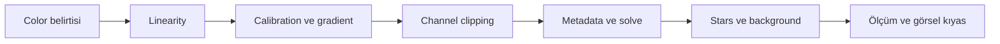
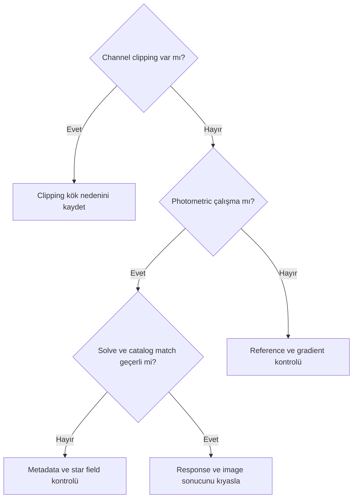
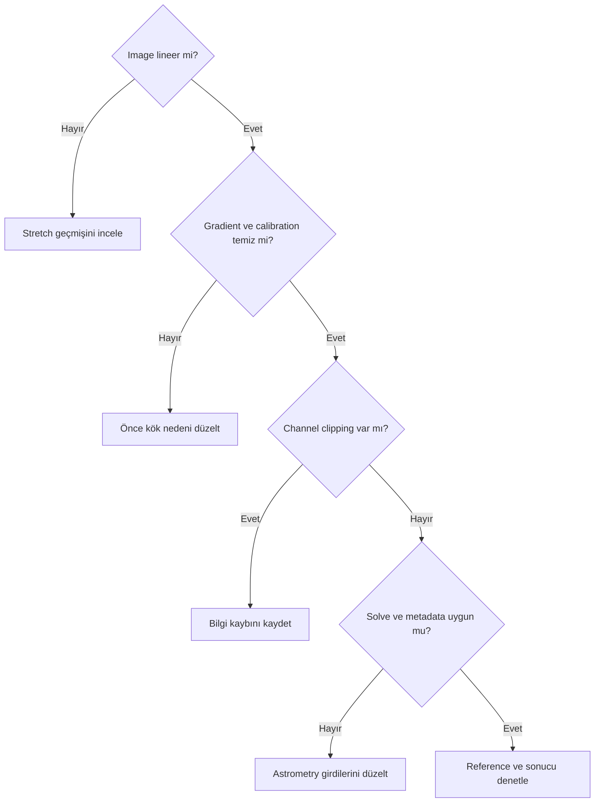

# Renk Kalibrasyonu Tanısı

!!! info "Sayfa Bilgisi"
    **Kategori:** Renk Kalibrasyonu · **Düzey:** Intermediate · **Tahmini okuma:** 5 dk
    **Anahtar kelimeler:** `Renk Kalibrasyonu Tanısı` · `color calibration` · `renk kalibrasyonu` · `white balance`
    **Önerilen ön bilgiler:** [Gradient Tanısı](../04-gradient/gradient-diagnostics.md) · [Astronomik Renk Teorisi](color-theory.md)

## Amaç

Renk sorunlarını calibration, gradient, clipping, metadata, astrometry, reference ve rendering kök nedenlerine ayıran hızlı tanı rehberi sağlamak.

## Kavramsal açıklama

Aynı belirti farklı nedenlerden oluşabilir. Green cast yalnız white balance, soluk yıldızlar yalnız saturation veya OIII kaybı yalnız channel scaling problemi değildir. Tanı; lineerlik → calibration/gradient → clipping → metadata/astrometry → star population → background reference → photometric ölçüm → estetik düzenleme sırasını izler.

## Ön koşullar

- Original lineer image ve işlem geçmişi
- Channel statistics/histogram
- Calibration/gradient durumu
- Metadata, solve ve catalog logs
- Background/star reference kayıtları

## Ne zaman kullanılır?

- Calibration öncesi/sonrası beklenmeyen color değişiminde
- Solve/match veya SPCC/PCC sonucu sorgulanırken
- Star, background ve target belirtilerini ayırmak için

## Ne zaman kullanılmaz?

- Tek belirtiden kesin kök neden ilan etmek için
- Numeric channel reçetesi üretmek için
- Estetik palette tercihini teknik hata saymak için

## Uygulama veya değerlendirme yaklaşımı

1. Görüntünün linear/nonlinear durumunu kaydedin; exact process gereksinimini process bazında doğrulayın.
2. Calibration ve gradient durumunu kontrol edin.
3. Channel clipping kontrolü yapın.
4. Metadata ve astrometric solution kontrolü yapın.
5. Star population uygunluğunu değerlendirin.
6. Background reference varsa denetleyin.
7. Photometric sonucu ölçüm ve görsel olarak karşılaştırın.
8. Estetik düzenlemeyi teknik calibration'dan sonra yapın.

### Belirti matrisi

| Belirti | Muhtemel neden | İlk kontrol | Color calibration çözebilir mi? |
| --- | --- | --- | --- |
| Görüntü tamamen yeşil | CFA/channel mapping, gradient, display | CFA, channel statistics ve spatial map | Önce kök neden kontrol edilmeli |
| Görüntü tamamen kırmızı | Channel mapping, Ha dominantlığı, palette | RGB/Ha channels ve mapping | Büyük olasılıkla farklı problem |
| Görüntü mavi dominant | Scaling, extinction, gradient | Channel medians ve model | Değerlendirilebilir |
| Yıldızlar renksiz | Saturation, clipping, star processing | Star core maxima ve processing history | Önce kök neden kontrol edilmeli |
| Yıldızlar aşırı sarı | Scaling, extinction, profile | Unclipped star population | Değerlendirilebilir |
| Yıldız çekirdekleri beyaz | Channel clipping | Histogram/maxima | Büyük olasılıkla farklı problem |
| Background renkli | Gradient, gerçek sky color, reference | Spatial channel maps | Önce kök neden kontrol edilmeli |
| Background kanallar arasında dengesiz | Gradient veya response | Kanal modelleri | Önce kök neden kontrol edilmeli |
| Galaxy core sarı, dış disk mavi değil | Stretch, calibration, clipping | Linear clone ve channels | Gerçek veri testi gerekir |
| Nebula renkleri tek kanala sıkışmış | Palette mapping, SNR, clipping | Kanal masters | Kısmen |
| OIII kaybolmuş gibi | Display stretch, scaling, noise, model | OIII master ve clipping | Önce kök neden kontrol edilmeli |
| Ha tüm görüntüyü domine ediyor | Narrowband mapping, SNR, palette | Ha/OIII ayrı statistics | Büyük olasılıkla farklı problem |
| SPCC/PCC sonrası görüntü soluk | Relative scaling, STF, expectation | Before/after statistics ve log | Gerçek veri testi gerekir |
| Calibration sonrası saturation azaldı | Scaling veya display rendering | Original data ve STF | Kısmen |
| Channel clipping | Acquisition veya processing | Histogram/min/max | Büyük olasılıkla farklı problem |
| Magenta star | Clipping, star processing, mapping | Star cores ve channels | Önce kök neden kontrol edilmeli |
| Green cast | Gradient, response, CFA | Spatial green map | Önce kök neden kontrol edilmeli |
| Chromatic gradient | Light pollution veya gradient | Kanal bazlı background model | Büyük olasılıkla farklı problem |
| Yanlış color profile | Encoding/rendering | Embedded profile | Büyük olasılıkla farklı problem |
| Nonlinear görüntüde calibration | Stretch geçmişi | History ve histogram | Gerçek veri testi gerekir |
| Starless görüntüde photometric deneme | Reference stars yok | Star population | Büyük olasılıkla farklı problem |
| Plate solve başarısız | Scale/coordinate metadata | WCS, scale ve coordinates | Büyük olasılıkla farklı problem |
| Catalog match başarısız | Solve, coverage, crowding | Catalog overlay/log | Büyük olasılıkla farklı problem |
| Metadata hatası | Yanlış/eksik header | WCS, filter, scale, date | Önce kök neden kontrol edilmeli |
| Yanlış focal length/pixel size | Başlangıç image scale tahmini hatası | WCS ve calculated scale | Önce kök neden kontrol edilmeli |
| Saturation nedeniyle star rejection | Bright star clipping | Rejection log ve maxima | Önce kök neden kontrol edilmeli |

## Gerçek kullanım senaryosu

SPCC/PCC sonrasında görüntü soluk görünebilir. Sonuç “başarısız” ilan edilmez; display stretch, channel statistics, star rejection, background gradient ve metadata logu incelenir. SPCC ve PCC exact linear-image gereksinimleri ayrı doğrulama kayıtlarıdır; gerçek broadband test sonucu beklenir.

## Görsel planı

!!! example "Görsel doğrulama ölçütü — channel clipping"
    **Amaç:** Beyaz star core ile channel clipping ilişkisini göstermek.  
    **Gerekli ekran veya veri:** Star close-up, RGB histogram ve pixel readout.  
    **Kanıtlanacak teknik nokta:** Clipped color bilgisinin calibration ile geri getirilememesi.  
    **Önerilen dosya adı:** `color-diagnostics-channel-clipping-v01.png`

!!! example "Görsel doğrulama ölçütü — renk baskısı"
    **Amaç:** Global cast ile chromatic gradient'i ayırmak.  
    **Gerekli ekran veya veri:** RGB image, kanal background maps ve Preview statistics.  
    **Kanıtlanacak teknik nokta:** Spatial variation'ın yalnız global channel scaling olmaması.  
    **Önerilen dosya adı:** `color-diagnostics-cast-vs-gradient-v01.png`

## Gerçek dünya renk belirtileri

| Belirti | Olası neden | Doğrulama | Düzeltici workflow |
|---|---|---|---|
| Green background | Residual gradient/yanlış ROI | Kanal maps ve farklı ROI | Gradient’e dön; reference’ı değiştir |
| Magenta stars | Green suppression veya layer mismatch | SPCC sonrası stars ile kıyas | SCNR/recombine adımını geri al |
| Yellow galaxy core | Clipping veya white reference | Channel histogram ve linear core | Clipping’i düzelt; yeniden kalibre et |
| Cyan nebula | Narrowband mapping/yanlış profile | Kanal katkılarını ayrı görüntüle | Mapping’i calibration’dan ayır |
| Oversaturated stars | Nonlinear Curves/saturation | Linear SPCC çıktısıyla kıyas | Star mask ile saturation’ı azalt |
| Renkli background | Yanlış ROI, cirrus veya moonlight | Çoklu Preview statistics | Temsilî ROI veya gradient workflow |

## Sık yapılan hatalar

1. Green cast için doğrudan tek process uygulamak.
2. Clipped stars'ı calibration reference saymak.
3. Soluk sonucu hatalı calibration kanıtı saymak.
4. Nonlinear image geçmişini göz ardı etmek.
5. Metadata/log kontrol etmeden catalog'u suçlamak.
6. Narrowband palette tercihini broadband calibration problemi saymak.

## Sorun giderme

| Aşama | Kontrol | Kayıt |
| --- | --- | --- |
| Linearity | History/histogram | Linear/nonlinear |
| Calibration | Master/gradient model | Artefact durumu |
| Clipping | Channel min/max | Etkilenen channel |
| Astrometry | Solve/log/metadata | Başarılı eşleşme değil, kanıt durumu |
| Reference | Star/background contamination | Kabul/ret gerekçesi |
| Rendering | STF/profile/stretch | Data/rendering ayrımı |

## SSS

??? question "Green cast her zaman color calibration sorunu mudur?"
    Hayır; gradient, CFA mapping veya display etkisi olabilir.
??? question "Beyaz star core düzeltilebilir mi?"
    Clipping ile kaybedilen channel bilgisi calibration ile geri kurulmaz.
??? question "Soluk sonuç yanlış mıdır?"
    Tek başına değil; measurements, STF ve reference kalitesi incelenmelidir.
??? question "Starless image photometric calibrated olabilir mi?"
    Catalog star measurement gerektiren yaklaşım için uygun source population eksiktir; process davranışı doğrulanmalıdır.
??? question "OIII görünmüyorsa scaling mi hatalıdır?"
    Noise, STF, gradient model, clipping ve gerçek signal birlikte kontrol edilmelidir.

## Hızlı Referans

!!! tip "Tek sayfalık kontrol listesi"
    - [ ] Linearity
    - [ ] Calibration ve gradient
    - [ ] Channel clipping
    - [ ] Metadata ve astrometric solution
    - [ ] Star population ve rejection
    - [ ] Background reference
    - [ ] Measurement/rendering ayrımı
    - [ ] Grading en sona bırakıldı

## Karar Ağacı

## Teknik doğrulama durumu

| Kategori | Durum |
| --- | --- |
| UI-5 | 1.9.3 solve, SPCC/PCC ve log ekranları bekliyor |
| DOC-5 | Linearity, metadata ve rejection gereksinimleri bekliyor |
| DATA-5 | Broadband, LRGB, OSC ve narrowband tanı setleri bekliyor |
| IMG-5 | İki planlı görsel bekliyor |

## Ayrıca İnceleyin

- [Photometric Calibration Teorisi](photometric-calibration-theory.md)
- [Background Neutrality](background-neutrality.md)
- [Gradient Diagnostics](../04-gradient/gradient-diagnostics.md)
- [SPCC](spcc.md)
- [PCC](pcc.md)
- [BackgroundNeutralization](background-neutralization-process.md)

## Önceki Bölüm

[← Arka Plan Nötrlüğü](background-neutrality.md)

## Sonraki Bölüm

[SPCC →](spcc.md)
