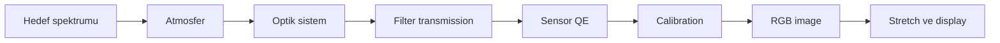
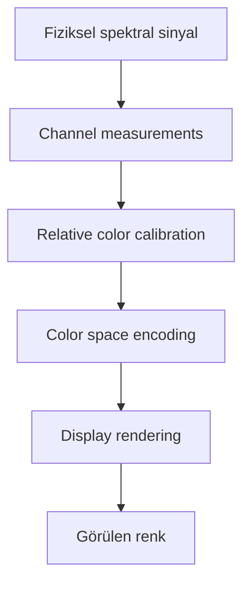
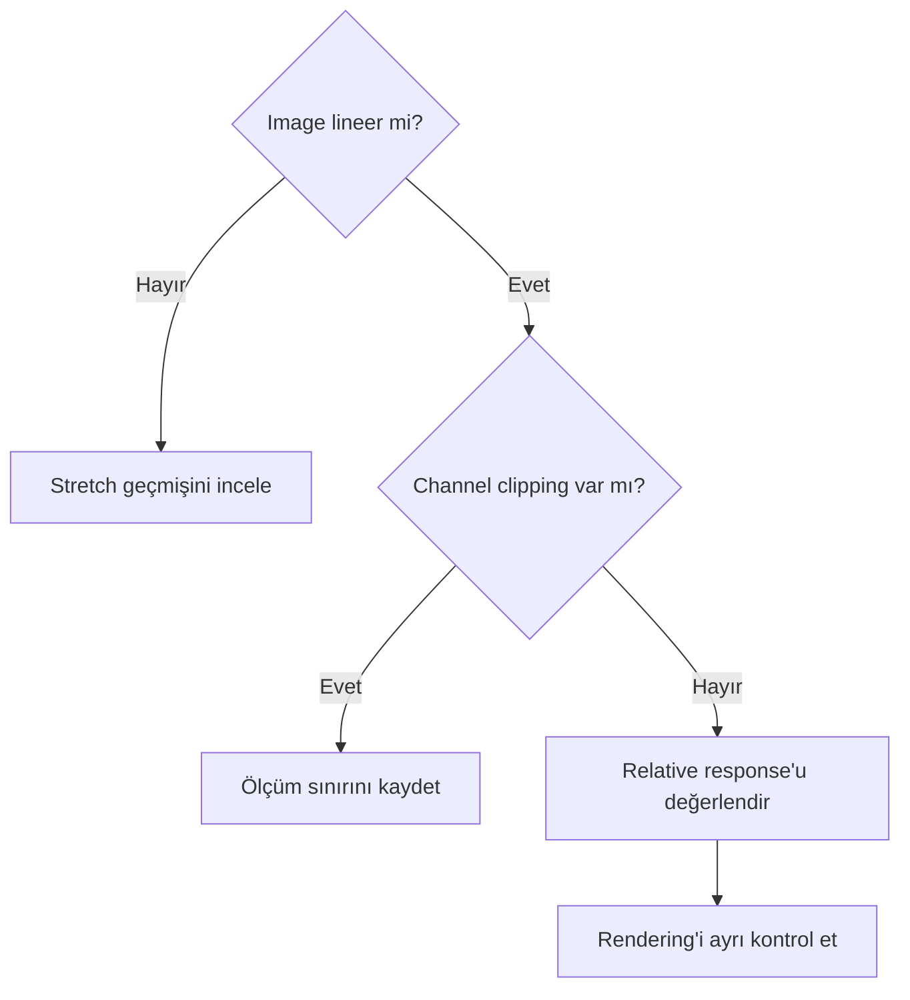
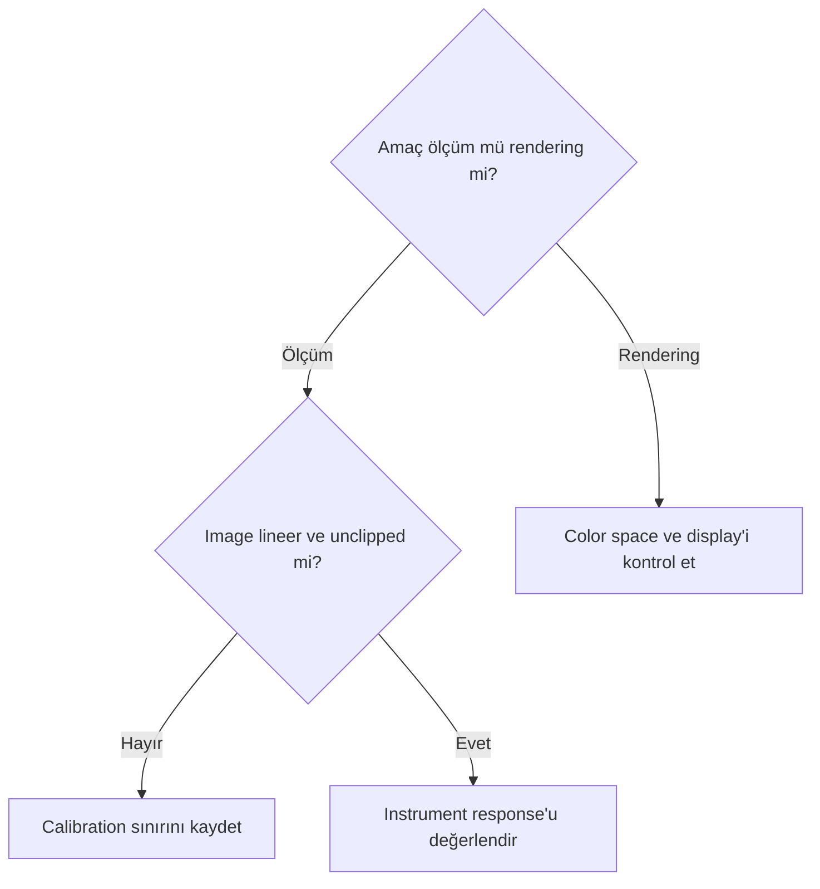

# Astronomik Renk Teorisi

## Amaç

Gökyüzünden gelen spektral sinyalin sensor, filter, calibration, RGB temsil, stretch ve display zincirinde nasıl dönüştüğünü sade bir modelle açıklamak.

## Kavramsal açıklama

Işık, dalga boyuna bağlı elektromanyetik enerjidir. Görünür spektrum insan görmesinin sınırlı bir aralığıdır; RGB ise sürekli spektrumu üç kanal üzerinden temsil eden bir sistemdir. Bir pixel'in kanal sinyali yaklaşık olarak şöyle düşünülebilir:

\[
C_k \propto t\int F(\lambda)\,A(\lambda)\,T_k(\lambda)\,Q(\lambda)\,d\lambda
\]

Burada \(F\) hedef spektrumu, \(A\) atmosfer/optik transmission, \(T_k\) kanal filtresi, \(Q\) sensor quantum efficiency ve \(t\) exposure süresidir. Bu öğretici denklem gain, noise, nonlinear response ve tüm calibration terimlerini eksiksiz modellemez.

Mono kamera L/R/G/B filtreleri ayrı exposure'larla kaydeder; registration ve channel combination ile renk oluşturulur. OSC kamera ise Color Filter Array üzerinden komşu pixel'lerde farklı renk örnekleri toplar ve debayer/interpolation ile kanal görüntüsü üretir. Her iki zincirde de relative color response; filter, QE, exposure, atmosfer ve calibration tarafından etkilenir.

Linear image'da pixel değerleri ölçülen sinyalle yaklaşık doğrusal ilişkiyi korur. Nonlinear stretch tonları yeniden eşler; saturation ve chromaticity görünümünü değiştirebilir. Luminance parlaklık yapısını, chrominance renk farkı bilgisini temsil eden kavramsal ayrımdır. White point, hangi nötr referansın ekranda nötr gösterileceğini etkiler. Color space, sayıların nasıl yorumlandığını; image data ise o sayıların kendisini tanımlar.

Channel response, filter transmission, sensor QE, atmospheric extinction ve optical response birlikte instrumental balance ihtiyacını etkileyebilir. Exposure, yeterli SNR ve clipping sınırları içinde kanal ölçümünü etkiler; exposure süreleri veya gain doğrudan color balance katsayısı değildir. Reference-based color calibration, stellar/catalog/background gibi tanımlı bir referansla channel ilişkisi kurar. Display white point çıktı ortamında beyazın nasıl görüntülendiğini; artistic color grading ise estetik değişikliği tanımlar. Chromaticity, parlaklıktan ayrılmış renk niteliğine sade bir giriş sağlar; absolute photometry ile aynı değildir.

!!! warning "Kritik ayrım"
    Ekrandaki RGB renk, ölçülmüş fiziksel spektrumun doğrudan kopyası değildir. Estetik color grading de bilimsel calibration ile aynı işlem değildir.

!!! info "Renk hedefini adlandırın"
    “Doğru renk” yerine hedefi belirtin: ölçümsel olarak izlenebilir renk, catalog referansına göre calibrated renk, görsel olarak doğal algılanan renk veya estetik olarak tercih edilen renk. OSC debayer sonrası RGB değerleri de fiziksel spektrumun doğrudan ölçümü değildir.

## Ön koşullar

- Linear/nonlinear durumunun bilinmesi
- Channel clipping ve calibration artefact kontrolü
- Filter/sensor bilgisinin bağlam olarak kaydedilmesi
- Display profile ile image data'nın karıştırılmaması

## Ne zaman kullanılır?

- Color calibration kararlarının fiziksel sınırını anlamak için
- Mono LRGB ile OSC zincirlerini karşılaştırırken
- Stretch sonrası color değişimini yorumlarken

## Ne zaman kullanılmaz?

- Sabit RGB oranı çıkarmak için
- Tek bir white point'i evrensel doğru ilan etmek için
- Display görünümünü absolute photometry saymak için

## Uygulama veya değerlendirme yaklaşımı

1. Acquisition zincirini target → atmosphere → optics → filter/CFA → sensor olarak kaydedin.
2. Kanal exposure, clipping ve response farklarını belirleyin.
3. Calibration'ın lineer veriyi koruyup korumadığını denetleyin.
4. Relative color calibration ile display rendering'i ayrı değerlendirin.
5. Stretch öncesi ve sonrası channel/chromaticity davranışını karşılaştırın.

## Gerçek kullanım senaryosu

Mono LRGB master'larda B kanalının daha zayıf görünmesi, hedefin yalnız fiziksel spektrumuna bağlanmaz. Exposure, atmospheric extinction, filter transmission ve sensor QE kayıtlarıyla birlikte değerlendirilir; channel scaling sonucu gerçek veri testi bekler.

## Görsel planı

!!! example "Görsel doğrulama ölçütü — görünür spektrum"
    **Amaç:** Görünür spektrum ile RGB filter passband ilişkisini göstermek.  
    **Gerekli ekran veya veri:** Dalga boyu ekseni üzerinde temsili R/G/B transmission eğrileri.  
    **Kanıtlanacak teknik nokta:** RGB kanalların spektrumu kesikli ve örtüşen response'larla örneklemesi.  
    **Önerilen dosya adı:** `color-visible-spectrum-rgb-filters-v01.png`

!!! example "Görsel doğrulama ölçütü — mono LRGB zinciri"
    **Amaç:** Ayrı filter exposure'larından RGB image üretimini göstermek.  
    **Gerekli ekran veya veri:** L/R/G/B masters ve ChannelCombination aşamaları.  
    **Kanıtlanacak teknik nokta:** Mono channel response'ların ayrı ölçülüp birleştirilmesi.  
    **Önerilen dosya adı:** `color-mono-lrgb-chain-v01.png`

!!! example "Görsel doğrulama ölçütü — OSC CFA zinciri"
    **Amaç:** CFA sampling ve debayer sonrası RGB üretimini göstermek.  
    **Gerekli ekran veya veri:** CFA pattern, raw mosaic ve debayered image.  
    **Kanıtlanacak teknik nokta:** OSC pixel'lerinin başlangıçta tüm renkleri doğrudan ölçmemesi.  
    **Önerilen dosya adı:** `color-osc-cfa-chain-v01.png`

!!! example "Görsel doğrulama ölçütü — linear ve nonlinear"
    **Amaç:** Stretch'in color görünümünü nasıl değiştirebildiğini göstermek.  
    **Gerekli ekran veya veri:** Aynı lineer master'ın STF görünümü ve kalıcı stretched kopyası.  
    **Kanıtlanacak teknik nokta:** Display stretch ile pixel transformation ayrımı.  
    **Önerilen dosya adı:** `color-linear-nonlinear-comparison-v01.png`

## Photometric renk ve estetik renk

Photometric calibration, ölçülen yıldız sinyalini tanımlı bir reference sistemiyle ilişkilendirir. Estetik color grading saturation, hue ve local contrast tercihidir. İlki ikincisini yasaklamaz; yalnız başlangıç transformunu ölçülebilir kılar.

| Katman | Fiziksel etki | İşleme kararı |
|---|---|---|
| Atmosfer | Dalga boyuna bağlı extinction | Hedef yüksekliği/air mass kaydedilir |
| Filter | Passband transmission | Gerçek filter profile seçilir |
| Sensor | Wavelength-dependent QE | Doğru sensor response kullanılır |
| Optics | Toplam throughput | Biliniyorsa modele katılır |
| Display | White point ve gamut | Calibration’dan ayrı yönetilir |

## Sık yapılan hatalar

1. RGB değerlerini doğrudan spectrum saymak.
2. Display profile'ı calibration verisiyle karıştırmak.
3. Gain'i white balance kontrolü gibi kullanmak.
4. Stretch sonrası calibration ölçümünü lineer veriyle eşdeğer görmek.
5. Narrowband channel normalization veya palette mapping'i broadband stellar color calibration ile eş tutmak.

## Sorun giderme

| Belirti | Olası neden | İlk kontrol |
| --- | --- | --- |
| Kanal beklenmedik zayıf | Exposure/response/extinction | Acquisition metadata |
| Stretch sonrası hue değişti | Nonlinear mapping | Linear clone ile kıyas |
| Ekranlar farklı gösteriyor | Color profile/rendering | Image ve display profile |
| Yıldız çekirdeği beyaz | Clipping | Channel maxima |
| OSC renkleri dengesiz | CFA/debayer/response | CFA metadata ve pipeline |

## SSS

??? question "RGB fiziksel spektrum mudur?"
    Hayır; sürekli spektrumun instrument response ve üç kanal üzerinden temsilidir.
??? question "Luminance renk içermez mi?"
    Luminance/chrominance ayrımı temsil modelidir; gerçek kanal katkıları iş akışına bağlıdır.
??? question "Gain renk dengesini belirler mi?"
    Tek başına hayır; response zinciri ve clipping/SNR bağlamı gerekir.
??? question "Stretch renk kalibrasyonunu değiştirir mi?"
    Nonlinear dönüşüm kanal ilişkilerinin görünümünü değiştirebilir; exact etki dönüşüme bağlıdır.
??? question "White point fiziksel beyaz mıdır?"
    Bir görüntüleme/referans seçimidir; evrensel astronomik beyaz değildir.

## Quick Reference

!!! tip "Tek sayfalık kontrol listesi"
    - [ ] Spectrum ile RGB ayrıldı
    - [ ] Filter, sensor QE ve atmosfer kaydedildi
    - [ ] Image lineerliği ve clipping kontrol edildi
    - [ ] Relative calibration ile color grading ayrıldı
    - [ ] Image data ile display rendering ayrıldı

## Decision Tree

## Teknik doğrulama durumu

| Kategori | Durum |
| --- | --- |
| UI-5 | Process UI iddiası yok |
| DOC-5 | Response, linearity ve color space kaynakları bekliyor |
| DATA-5 | Mono LRGB ve OSC karşılaştırması bekliyor |
| IMG-5 | Dört planlı görsel bekliyor |

## İlgili bölümler

- [White Balance](white-balance.md)
- [Photometric Calibration Teorisi](photometric-calibration-theory.md)
- [PixInsight Temelleri — STF](../02-pixinsight-temelleri/stf.md)
