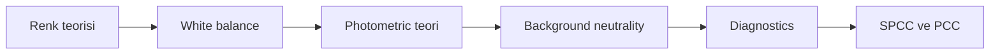

# Color Calibration Giriş

## Amaç

Renk kalibrasyonunun amacını, ön koşullarını ve teoriden diagnostics'e okuma yolunu tanıtmak.

## Renk kalibrasyonu nedir?

Color calibration, görüntü kanalları arasındaki relative response farklarını seçilmiş fiziksel ya da istatistiksel referansa göre değerlendirme ve dengeleme işlemidir. Amaç, veriyi estetik olarak “güzel” yapmak değil; instrument, filter, sensor ve acquisition zincirinin oluşturduğu renk yanıtını izlenebilir bir referansla ilişkilendirmektir.

!!! warning "Doğru renk sınırı"
    Astronomik görüntüde tek ve evrensel bir “doğru renk” yoktur. Ölçümsel olarak izlenebilir renk, catalog referansına göre calibrated renk, görsel olarak doğal algılanan renk ve estetik olarak tercih edilen renk farklı hedeflerdir. Görünen renk nesne spektrumu kadar sensor response, filter transmission, atmosfer, calibration, stretch, color space ve display rendering'den etkilenir.

## Neden ve hangi aşamada yapılır?

Broadband color calibration için stretch öncesi veri, kanal ilişkilerinin değerlendirilmesi açısından genellikle daha uygun olabilir. Bu bir genel workflow önerisidir. `SpectrophotometricColorCalibration`, `PhotometricColorCalibration`, `ColorCalibration` ve `BackgroundNeutralization` processlerinin exact linear-image gereksinimleri birbirinden bağımsız olarak PixInsight 1.9.3 üzerinde **Doğrulama bekliyor**. Gradient veya calibration artefact kanal ilişkilerini değiştiriyorsa önce kök neden ele alınmalıdır.

Ön koşullar:

- Calibration ve registration tamamlanmış olmalı.
- Gradient correction denetlenmiş olmalı.
- Channel clipping bulunmamalı.
- Photometric yaklaşım için metadata ve astrometric solution yeterli olmalı.
- Görüntünün linear/nonlinear durumu bilinmeli.

Color calibration, saturation artırma veya color grading değildir. Kalibrasyon referans ve response ilişkisini kurar; grading, nihai estetik görünümü değiştirir. Ha, OIII ve SII geniş bant RGB kanalları değildir. HOO/SHO çalışması; narrowband channel normalization, palette mapping, star color reconstruction ve estetik channel mixing hedeflerini broadband stellar color calibration'dan ayrı kaydetmelidir. SPCC'nin olası narrowband seçenekleri Sprint 3.2'de UI ve birincil kaynakla ele alınacaktır.

## Okuma sırası

1. [Astronomik Renk Teorisi](color-theory.md): fiziksel sinyalden RGB gösterime.
2. [White Balance](white-balance.md): referans ve channel scaling seçenekleri.
3. [Photometric Calibration Teorisi](photometric-calibration-theory.md): plate solving, catalog matching ve response estimation.
4. [Background Neutrality](background-neutrality.md): neutral reference ile gradient ayrımı.
5. [Color Calibration Diagnostics](color-calibration-diagnostics.md): belirti, kök neden ve ilk kontroller.
6. [SPCC](../05-renk-kalibrasyonu/spcc.md), [PCC](../05-renk-kalibrasyonu/pcc.md) ve [BackgroundNeutralization](../05-renk-kalibrasyonu/background-neutralization.md): sonraki process sayfaları.

## Quick Navigation

| Soru | Sayfa |
| --- | --- |
| RGB değerleri fiziksel spektrum mudur? | [Astronomik Renk Teorisi](color-theory.md) |
| Referans beyaz nasıl düşünülür? | [White Balance](white-balance.md) |
| Catalog star neden kullanılır? | [Photometric Calibration Teorisi](photometric-calibration-theory.md) |
| Background siyah mı olmalı? | [Background Neutrality](background-neutrality.md) |
| Green cast veya clipping nasıl teşhis edilir? | [Color Calibration Diagnostics](color-calibration-diagnostics.md) |
| Gradient önce neden incelenir? | [Gradient Diagnostics](../04-gradient/gradient-diagnostics.md) |

## Teknik doğrulama durumu

| Kategori | Durum |
| --- | --- |
| UI-5 | PixInsight 1.9.3 process menü ve ekranları bekliyor |
| DOC-5 | Lineer workflow ve photometric algoritma kaynakları bekliyor |
| DATA-5 | Broadband, mono LRGB ve OSC testleri bekliyor |
| IMG-5 | Teori, workflow ve diagnostics görselleri bekliyor |
