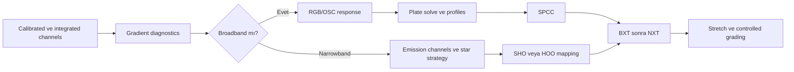

# Color Calibration Giriş

## Amaç

Renk kalibrasyonunun amacını, ön koşullarını ve teoriden diagnostics'e okuma yolunu tanıtmak.

## Renk kalibrasyonu nedir?

Color calibration, görüntü kanalları arasındaki relative response farklarını seçilmiş fiziksel ya da istatistiksel referansa göre değerlendirme ve dengeleme işlemidir. Amaç, veriyi estetik olarak “güzel” yapmak değil; instrument, filter, sensor ve acquisition zincirinin oluşturduğu renk yanıtını izlenebilir bir referansla ilişkilendirmektir.

!!! warning "Doğru renk sınırı"
    Astronomik görüntüde tek ve evrensel bir “doğru renk” yoktur. Ölçümsel olarak izlenebilir renk, catalog referansına göre calibrated renk, görsel olarak doğal algılanan renk ve estetik olarak tercih edilen renk farklı hedeflerdir. Görünen renk nesne spektrumu kadar sensor response, filter transmission, atmosfer, calibration, stretch, color space ve display rendering'den etkilenir.

## Neden ve hangi aşamada yapılır?

Broadband color calibration için stretch öncesi veri, kanal ilişkilerinin değerlendirilmesi açısından genellikle daha uygun olabilir. Bu bir genel workflow önerisidir. `SpectrophotometricColorCalibration`, `PhotometricColorCalibration`, `ColorCalibration` ve `BackgroundNeutralization` processlerinin exact linear-image gereksinimleri birbirinden bağımsız olarak PixInsight 1.9.3 üzerinde **Doğrulama bekliyor**. Gradient veya calibration artefact kanal ilişkilerini değiştiriyorsa önce kök neden ele alınmalıdır.

Ön koşullar:

- Calibration ve registration tamamlanmış olmalı.
- Gradient correction denetlenmiş olmalı.
- Channel clipping bulunmamalı.
- Photometric yaklaşım için metadata ve astrometric solution yeterli olmalı.
- Görüntünün linear/nonlinear durumu bilinmeli.

Color calibration, saturation artırma veya color grading değildir. Kalibrasyon referans ve response ilişkisini kurar; grading, nihai estetik görünümü değiştirir. Ha, OIII ve SII geniş bant RGB kanalları değildir. HOO/SHO çalışması; narrowband channel normalization, palette mapping, star color reconstruction ve estetik channel mixing hedeflerini broadband stellar color calibration'dan ayrı kaydetmelidir. SPCC'nin olası narrowband seçenekleri Sprint 3.2'de UI ve birincil kaynakla ele alınacaktır.

## Okuma sırası

1. [Astronomik Renk Teorisi](color-theory.md): fiziksel sinyalden RGB gösterime.
2. [White Balance](white-balance.md): referans ve channel scaling seçenekleri.
3. [Photometric Calibration Teorisi](photometric-calibration-theory.md): plate solving, catalog matching ve response estimation.
4. [Background Neutrality](background-neutrality.md): neutral reference ile gradient ayrımı.
5. [Color Calibration Diagnostics](color-calibration-diagnostics.md): belirti, kök neden ve ilk kontroller.
6. [SPCC Ana Referans](spcc.md), [Ön Koşullar](spcc-prerequisites.md), [Broadband](spcc-broadband.md), [Narrowband](spcc-narrowband.md) ve [Sorun Giderme](spcc-troubleshooting.md): Sprint 3.2 process rehberi.
7. [PCC](pcc.md): legacy photometric alternatif ve SPCC ile kontrollü karşılaştırma.
8. [BackgroundNeutralization](background-neutralization-process.md): genel background neutrality kavramından ayrı, gradient correction yerine geçmeyen ve reference seçimi kritik olan process.

## Yaklaşım karşılaştırmaları

| Yaklaşım | Referans | Güçlü yanı | Sınır |
|---|---|---|---|
| SPCC | Spectral catalog ve instrument response | Passband/sensor bağlamını modele katar | Gaia DR3/SP, WCS ve doğru profiles gerekir |
| PCC | Broadband catalog photometry | Legacy karşılaştırma için yararlı | Tam spectral response modellemez |
| Manual calibration | Seçilmiş reference veya katsayı | Catalog olmayan özel veride denetlenebilir | Reference seçimine duyarlıdır |
| Aesthetic grading | Görsel hedef | İfade özgürlüğü | Fiziksel calibration değildir |

| Veri | Calibration felsefesi | Neden |
|---|---|---|
| Broadband LRGB/OSC | Instrument response ve stellar reference | Sürekli spektrum renk ilişkisi kurulabilir |
| LRGB + Ha | Önce broadband calibration, sonra kontrollü Ha | Ha katkısı broadband yıldız modelini bozmamalıdır |
| SHO/HOO | Kanal mapping ve palette kararı | Dar band emisyonları broadband white balance değildir |

## Uçtan uca workflow örnekleri

| Veri seti | Önerilen karar zinciri | Neden farklı? |
|---|---|---|
| Broadband mono LRGB | RGB combine → gradient → solve → SPCC → BXT → NXT → stretch → L combine | Luminance renk response çözümünden ayrıdır |
| LRGB + Ha | Broadband SPCC → BXT/NXT → kontrollü Ha blend → stretch | Ha, continuum yıldız fitine karıştırılmaz |
| OSC dark sky | Debayer/integrate → gradient kontrolü → solve → SPCC → AI → stretch | Tek sensör/profile zinciri vardır |
| OSC heavy light pollution | Calibration → gradient diagnostics/correction → solve → SPCC | Spatial color gradient önce ayrılmalıdır |
| SHO | Kanal bazlı calibration/gradient → star strategy → palette mapping → stretch | Mapping estetik; emission sinyali fizikseldir |
| HOO | Ha/OIII ayrımı → star calibration → HOO mapping → color diagnostics | OIII düşük SNR ve cyan mapping ayrıca korunur |
| Dark sky broadband | Gradient doğrulaması → SPCC → minimal grading | Düşük çevresel gradient yine kanıtlanmalıdır |
| Heavy light pollution mono | Filtre/gece bazlı integrate → gradient → RGB combine → SPCC | Kanalların background ve extinction farkı büyüktür |

## Quick Navigation

| Soru | Sayfa |
| --- | --- |
| RGB değerleri fiziksel spektrum mudur? | [Astronomik Renk Teorisi](color-theory.md) |
| Referans beyaz nasıl düşünülür? | [White Balance](white-balance.md) |
| Catalog star neden kullanılır? | [Photometric Calibration Teorisi](photometric-calibration-theory.md) |
| Background siyah mı olmalı? | [Background Neutrality](background-neutrality.md) |
| Green cast veya clipping nasıl teşhis edilir? | [Color Calibration Diagnostics](color-calibration-diagnostics.md) |
| Gradient önce neden incelenir? | [Gradient Diagnostics](../04-gradient/gradient-diagnostics.md) |
| SPCC hangi veride nasıl değerlendirilir? | [SPCC Ana Referans](spcc.md) |
| SPCC neden çalışmadı? | [SPCC Sorun Giderme](spcc-troubleshooting.md) |
| PCC hangi legacy ve karşılaştırmalı bağlamda değerlendirilir? | [PCC](pcc.md) |
| Background reference nasıl seçilir? | [BackgroundNeutralization](background-neutralization-process.md) |

## Teknik doğrulama durumu

| Kategori | Durum |
| --- | --- |
| UI-5 | PixInsight 1.9.3 process menü ve ekranları bekliyor |
| DOC-5 | Lineer workflow ve photometric algoritma kaynakları bekliyor |
| DATA-5 | Broadband, mono LRGB ve OSC testleri bekliyor |
| IMG-5 | Teori, workflow ve diagnostics görselleri bekliyor |
