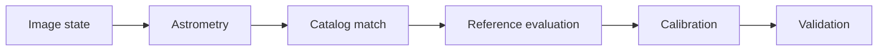
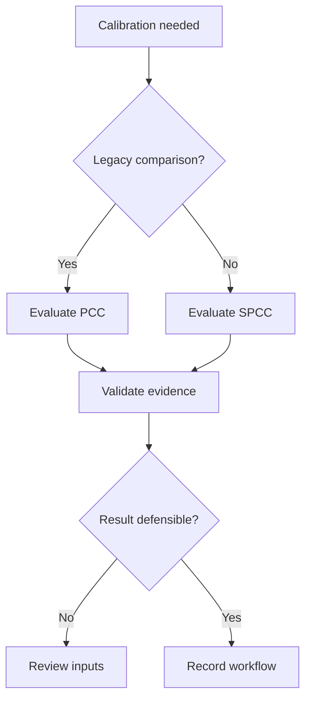
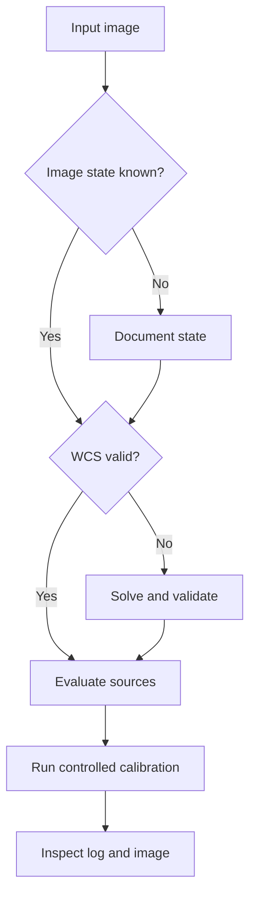
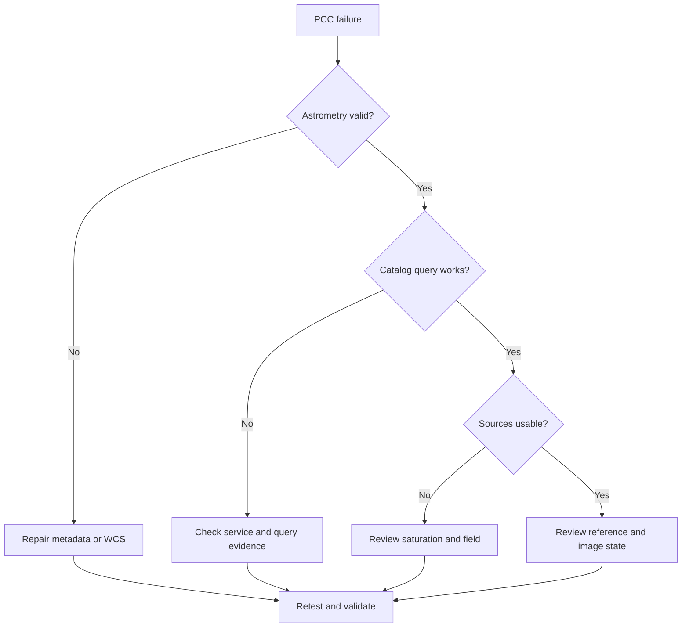
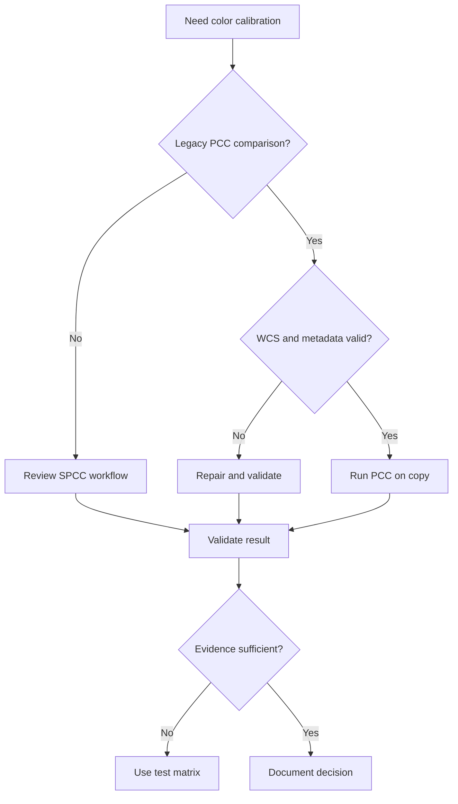

# PhotometricColorCalibration (PCC)

!!! info "Sayfa Bilgisi"
    **Kategori:** Renk Kalibrasyonu · **Düzey:** Intermediate · **Tahmini okuma:** 25 dk
    **Anahtar kelimeler:** `PCC` · `PhotometricColorCalibration` · `Photometric Color Calibration` · `color calibration` · `renk kalibrasyonu` · `white balance`
    **Önerilen ön bilgiler:** [Gradient Tanısı](../04-gradient/gradient-diagnostics.md) · [Astronomik Renk Teorisi](color-theory.md)

## Amaç

Bu sayfa, PixInsight 1.9.3 bağlamında **PhotometricColorCalibration** (PCC) sürecini; astrometry, catalog matching, yıldız örneklemi, background ilişkisi ve sonuç doğrulamasıyla birlikte ele alır. PCC, legacy iş akışlarını yeniden üretmek veya SPCC ile kontrollü karşılaştırma yapmak için değerlendirilebilen bir alternatiftir.

!!! warning "PixInsight 1.9.3 doğrulama sınırı"
    Görseller process adını, menü yolunu, beş section başlığını, görünen kontrol etiketlerini ve açık VizieR server seçeneklerini doğrular. Ekran içinde sürüm numarası görünmediği için 1.9.3 kimliği kısmi kanıttır. Default değerler, process davranışı, exact linear/nonlinear kabulü ve log/output hâlâ doğrulanmayı bekler.

!!! note "Tarafsız kapsam"
    PCC'nin artık kullanılmaması ya da SPCC'nin her durumda daha doğru olması gibi bir sonuç çıkarılamaz. İki process aynı girdide aynı sonucu üretmek zorunda değildir; fark, tek başına hata kanıtı değildir.

## Kavramsal açıklama

PCC'nin hedefi, görüntüde ölçülen uygun yıldız kaynakları ile fotometrik bir referans arasındaki ilişkiyi kullanarak kanallar arası renk kalibrasyonunu değerlendirmektir. Zincir; geçerli astrometric solution, doğru metadata, catalog matching, source detection, uygun yıldız örneklemi, white reference ve background yaklaşımının birlikte denetlenmesini gerektirir.

Plate solving görüntü piksellerini gök koordinatlarına bağlar; catalog matching bu koordinatlarda beklenen kaynaklarla görüntüde ölçülen kaynakları ilişkilendirir. Saturated stars, crowded fields, low star density, galaxy/nebula baskın alanlar ve residual gradient örneklem güvenilirliğini azaltabilir. Background neutralization, uzamsal gradient düzeltme ve channel calibration aynı işlem değildir.

## Ön koşullar

- Kalibrasyon geçmişi bilinen, clipping uygulanmamış bir çalışma görüntüsü.
- Geometriyle uyumlu WCS veya plate solving için doğrulanabilir metadata.
- Focal length, pixel size ve target coordinates bilgilerinin kaynağı.
- Gradient, star saturation ve channel noise incelemesi.
- Mono RGB/LRGB için kanalların kayıtlı ve karşılaştırılabilir olması; OSC için doğru CFA/debayer geçmişi.

!!! tip
    Süreci bir kopyada çalıştırın; logu, image state'i ve metadata kaynağını birlikte kaydedin.

## Ne zaman değerlendirilir?

- Legacy PCC iş akışını yeniden üretirken.
- Broadband mono RGB/LRGB veya OSC veride SPCC ile kontrollü karşılaştırma yaparken.
- Arşivlenmiş bir sonucu aynı process ailesiyle yeniden denetlerken.

## Ne zaman tek başına yeterli değildir?

PCC; calibration artefact, clipping, yanlış debayer, bozuk WCS, uzamsal gradient veya fiziksel olarak uygunsuz background referansını tek başına düzeltmez. Narrowband veriye broadband varsayımlarını doğrudan taşımak uygun değildir.

## PCC işlem zinciri

### Kavramsal kontrol grupları

| Kontrol grubu | Amaç | Yanlış kullanım riski | Doğrulama yöntemi |
| --- | --- | --- | --- |
| astrometry | astrometry bağlamını denetlemek | Yanlış referans veya yorum | UI, log ve kontrollü veri |
| catalog/reference | catalog/reference bağlamını denetlemek | Yanlış referans veya yorum | UI, log ve kontrollü veri |
| source detection | source detection bağlamını denetlemek | Yanlış referans veya yorum | UI, log ve kontrollü veri |
| star sample | star sample bağlamını denetlemek | Yanlış referans veya yorum | UI, log ve kontrollü veri |
| white reference | white reference bağlamını denetlemek | Yanlış referans veya yorum | UI, log ve kontrollü veri |
| background | background bağlamını denetlemek | Yanlış referans veya yorum | UI, log ve kontrollü veri |
| channel calibration | channel calibration bağlamını denetlemek | Yanlış referans veya yorum | UI, log ve kontrollü veri |
| output validation | output validation bağlamını denetlemek | Yanlış referans veya yorum | UI, log ve kontrollü veri |
| log and diagnostics | log and diagnostics bağlamını denetlemek | Yanlış referans veya yorum | UI, log ve kontrollü veri |

### Görsel kanıtla doğrulanan UI

- Process adı: `PhotometricColorCalibration`.
- Menü yolu: `Process → ColorCalibration → PhotometricColorCalibration`.
- Section başlıkları: `Calibration`, `Catalog Search`, `Signal Evaluation`, `Background Neutralization`, `Region of Interest`.
- Kanıt dizini: `validation/ui/pi-1.9.3/pcc/screenshots/`.
- Evidence matrix: `validation/ui/pi-1.9.3/pcc/pcc-evidence-matrix.md`.

!!! note "Mevcut değerler varsayılan değildir"
    Görsellerdeki seçimler ve checkbox durumları yalnız ekran anını kanıtlar. Processin yeni veya resetlenmiş olduğu gösterilmediğinden bu değerler default olarak kullanılamaz.

### UI doğrulama durumu

| UI alanı | Doğrulanacak bilgi | Yayın riski | Durum |
| --- | --- | --- | --- |
| process menu location | Menü yolu | Yüksek | Doğrulandı |
| section names | Beş section başlığı | Yüksek | Doğrulandı |
| catalog selector | `Catalog`, `VizieR server` etiketleri ve yedi açık server seçeneği görüldü; query davranışı bekliyor | Yüksek | Kısmen doğrulandı |
| white reference controls | `White reference` etiketi ve mevcut seçim görüldü; seçenek listesi/anlam bekliyor | Yüksek | Kısmen doğrulandı |
| background reference controls | Section, `Lower limit` ve `Upper limit` etiketleri görüldü; etki bekliyor | Yüksek | Kısmen doğrulandı |
| source detection controls | Signal Evaluation etiketleri görüldü; davranış bekliyor | Yüksek | Kısmen doğrulandı |
| star rejection controls | Saturation/source etiketleri görüldü; rejection davranışı ve log bekliyor | Yüksek | Kısmen doğrulandı |
| astrometry controls | Bu üç görselde ayrı astrometry kontrolü görülmedi | Yüksek | Doğrulama bekliyor |
| output controls | Output etiketleri görüldü; üretilen dosya ve log davranışı bekliyor | Yüksek | Kısmen doğrulandı |
| log behavior | PixInsight 1.9.3 gerçek etiket ve davranış | Yüksek | Doğrulama bekliyor |
| default values | PixInsight 1.9.3 gerçek etiket ve davranış | Kritik | Doğrulama bekliyor |
| exact linear/nonlinear behavior | PixInsight 1.9.3 gerçek etiket ve davranış | Kritik | Doğrulama bekliyor |

## PCC ve SPCC karşılaştırması

| Değerlendirme alanı | PCC | SPCC | Kullanıcı için anlamı |
| --- | --- | --- | --- |
| reference model | Fotometrik referans yaklaşımı; ayrıntı doğrulanmalı | Spektrofotometrik yaklaşım; ayrıntı doğrulanmalı | Aynı hedefe farklı model yollarıyla yaklaşabilir |
| instrument response | Sınırlı veya dolaylı temsil; doğrulanmalı | Instrument response kapsamı UI/kaynakla doğrulanmalı | Profil kapsamı sonucu etkileyebilir |
| sensor profile | Kesin davranış doğrulanmalı | Profil seçimi davranışı doğrulanmalı | Sensör tanımı ayrı kanıttır |
| filter profile | Kesin davranış doğrulanmalı | Profil seçimi davranışı doğrulanmalı | Filtre aktarımı sonucu etkileyebilir |
| astrometric requirement | Astrometric çözüm zincirin parçasıdır | Astrometric gereksinim sürümde doğrulanmalı | Geçerli WCS kontrol edilir |
| catalog dependence | Katalog eşlemesi gerekir; seçenekler doğrulanmalı | Katalog/model ilişkisi doğrulanmalı | Ağ ve kaynak seçimi önemlidir |
| source evaluation | Yıldız örneklemi değerlendirilir | Kaynak değerlendirmesi doğrulanmalı | Aynı kaynak havuzu garanti değildir |
| white reference | Referans seçimi vardır; kontroller doğrulanmalı | Referans modeli/denetimleri doğrulanmalı | Renk hedefi farklılaşabilir |
| background handling | Reference/neutralization ilişkisi doğrulanmalı | Background kontrolleri doğrulanmalı | Gradient ile karıştırılmaz |
| broadband mono RGB | Değerlendirilebilir | Değerlendirilebilir | Kontrollü test gerekir |
| OSC | Değerlendirilebilir | Değerlendirilebilir | Debayer ve metadata önemlidir |
| narrowband | Broadband varsayımları genellenemez | Ayrı narrowband kapsamı vardır | Tek reçete verilmez |
| metadata dependence | Plate scale/koordinat etkili olabilir | Metadata gereksinimi doğrulanmalı | Başlık doğruluğu kanıtlanır |
| version dependence | Legacy process davranışı sürüme bağlı olabilir | 1.9.3 davranışı ayrıca doğrulanır | Sürüm kaydı tutulur |
| legacy compatibility | Eski iş akışlarıyla karşılaştırma sağlar | Yeni akışlarda alternatif değerlendirme | PCC otomatik olarak geçersiz değildir |
| validation requirement | Log ve görüntü kanıtı gerekir | Log ve görüntü kanıtı gerekir | İsim tek başına sonuç garantisi değildir |
| typical hata modes | WCS, katalog, kaynak ve referans | Profil, katalog, kaynak ve metadata | Kök neden logla ayrıştırılır |

### PCC ve SPCC sonucu neden farklı olabilir?

Farklı reference model, instrument profile kapsamı, catalog/source seçimi, white reference, background handling, star rejection, metadata, image state, gradient, clipping ve sürüm/implementation farkı sonuçları ayırabilir. Önce girdileri eşitleyin; ardından log ve ölçüm kanıtlarını karşılaştırın.

## Uygulama yaklaşımı

1. Image state, kanal yapısı ve clipping durumunu kaydedin.
2. WCS ile focal length, pixel size ve coordinates tutarlılığını doğrulayın.
3. Gradient ve background ayrımını değerlendirin.
4. PCC'yi doğrulanmış UI üzerinden çalışma kopyasına uygulayın.
5. Logu, catalog/source başarısını ve output davranışını kaydedin.
6. Yıldız renkleri, background, galaxy/nebula sinyali ve histogramları birlikte inceleyin.
7. Gerekliyse aynı girdiyle SPCC karşılaştırması yapın; farkı otomatik hata saymayın.

!!! example
    M31 alanında gökyüzü örneği galaksi halosundan seçilirse renk sonucu yanıltıcı olabilir. Önce halo sınırı ve residual gradient incelenir.

## Gerçek kullanım senaryoları

### Mono RGB

- **Girdi durumu:** Lineer, ayrı R/G/B masterlar.
- **Ön kontroller:** kanal hizası, clipping, metadata.
- **PCC’den beklenebilecek kapsam:** kanallar arası fotometrik ölçek ve renk dengesi.
- **Ana risk:** kanal eşleşmesi ve zayıf yıldız örneklemi.
- **Sonuç doğrulaması:** yıldız renkleri, arka plan ve kanal histogramlarını birlikte incele.
- **SPCC ile karşılaştırma gereği:** aynı girdiyi ve görüntü durumunu koruyarak karşılaştır.

### Mono LRGB

- **Girdi durumu:** Lineer RGB renk verisi ve ayrı L.
- **Ön kontroller:** RGB birleşiminin durumu; L kanalını renk kalibrasyon girdisi sanmama.
- **PCC’den beklenebilecek kapsam:** RGB renk bileşenini kalibre etme.
- **Ana risk:** L ekleme sırası ve renk bilgisinin seyrelmesi.
- **Sonuç doğrulaması:** RGB sonucu ve LRGB birleşimini ayrı doğrula.
- **SPCC ile karşılaştırma gereği:** RGB aşamasında kontrollü çift işlem değerlendir.

### OSC broadband

- **Girdi durumu:** Debayer edilmiş, lineer OSC entegrasyonu.
- **Ön kontroller:** CFA/debayer geçmişi, WCS, gradient.
- **PCC’den beklenebilecek kapsam:** broadband renk dengesini değerlendirme.
- **Ana risk:** yanlış metadata veya chromatic gradient.
- **Sonuç doğrulaması:** yıldız locus'u, doygunluk ve arka plan.
- **SPCC ile karşılaştırma gereği:** aynı master üzerinde kontrollü karşılaştır.

### M31 gibi galaxy-dominated field

- **Girdi durumu:** Geniş galaksi alanı.
- **Ön kontroller:** halo ile gerçek background ayrımı.
- **PCC’den beklenebilecek kapsam:** yıldız örneklerinden renk kalibrasyonu.
- **Ana risk:** background referansının halo içermesi.
- **Sonuç doğrulaması:** halo renk sürekliliği ve yıldızlar.
- **SPCC ile karşılaştırma gereği:** referans seçim farkını kaydet.

### Star-rich field

- **Girdi durumu:** Yoğun yıldız alanı.
- **Ön kontroller:** crowding, saturation, gradient.
- **PCC’den beklenebilecek kapsam:** geniş yıldız örneklemi.
- **Ana risk:** blend ve yanlış source match.
- **Sonuç doğrulaması:** farklı ölçeklerde yıldız renkleri.
- **SPCC ile karşılaştırma gereği:** rejection ve log kanıtını karşılaştır.

### Reflection nebula

- **Girdi durumu:** Yansıma nebulası içeren alan.
- **Ön kontroller:** mavi gerçek sinyali background sanmama.
- **PCC’den beklenebilecek kapsam:** uygun yıldızlarla kalibrasyon.
- **Ana risk:** nebula renginin nötrleştirilmesi.
- **Sonuç doğrulaması:** nebula morfolojisi ve yıldız renkleri.
- **SPCC ile karşılaştırma gereği:** background yaklaşımını eşitle.

### Low star density field

- **Girdi durumu:** Az yıldızlı alan.
- **Ön kontroller:** WCS ve tespit edilebilir kaynak sayısı.
- **PCC’den beklenebilecek kapsam:** yalnız yeterli eşleşme varsa değerlendirme.
- **Ana risk:** kararsız katalog eşleşmesi.
- **Sonuç doğrulaması:** log, eşleşme kanıtı ve tekrar üretilebilirlik.
- **SPCC ile karşılaştırma gereği:** başarısızlık biçimlerini kıyasla.

### Strong gradient içeren veri

- **Girdi durumu:** Belirgin uzamsal gradient.
- **Ön kontroller:** önce gradient kaynağı ve modelini değerlendir.
- **PCC’den beklenebilecek kapsam:** gradient sonrası uygun veri üzerinde kalibrasyon.
- **Ana risk:** gradientin reference ve kaynak ölçümlerini çarpıtması.
- **Sonuç doğrulaması:** model görüntüsü, arka plan ve yıldızlar.
- **SPCC ile karşılaştırma gereği:** aynı gradient-düzeltme durumunu kullan.

### Saturated star içeren veri

- **Girdi durumu:** Parlak yıldızları doygun alan.
- **Ön kontroller:** clipping ve kullanılabilir sönük yıldızlar.
- **PCC’den beklenebilecek kapsam:** doygun olmayan kaynaklarla sınırlı değerlendirme.
- **Ana risk:** saturated yıldızların örneklemi bozması.
- **Sonuç doğrulaması:** clipping maskesi, log ve yıldız profilleri.
- **SPCC ile karşılaştırma gereği:** aynı source havuzunu mümkün olduğunca koru.

### Eksik metadata

- **Girdi durumu:** Focal length/pixel size/koordinat eksik.
- **Ön kontroller:** başlıklardaki gerçek ve türetilmiş bilgileri ayır.
- **PCC’den beklenebilecek kapsam:** metadata düzeltilip doğrulandıktan sonra işlem.
- **Ana risk:** yanlış plate scale veya hedef alanı.
- **Sonuç doğrulaması:** çözümün astrometric residual ve log kanıtı.
- **SPCC ile karşılaştırma gereği:** iki processin metadata tepkisini belgeleyerek kıyasla.

### Mevcut WCS içeren veri

- **Girdi durumu:** Önceden çözülmüş görüntü.
- **Ön kontroller:** WCS'nin güncel geometriyle uyumu.
- **PCC’den beklenebilecek kapsam:** geçerli çözümü katalog eşlemesinde kullanma.
- **Ana risk:** crop/resample sonrası bozuk WCS.
- **Sonuç doğrulaması:** koordinat dönüşümü ve eşleşme.
- **SPCC ile karşılaştırma gereği:** aynı doğrulanmış WCS ile çalış.

### PCC ve SPCC karşılaştırma testi

- **Girdi durumu:** Aynı kontrollü broadband master.
- **Ön kontroller:** aynı image state, WCS ve gradient durumu.
- **PCC’den beklenebilecek kapsam:** sonuç farklarını kanıtla açıklama.
- **Ana risk:** farkı otomatik doğru/yanlış saymak.
- **Sonuç doğrulaması:** log, yıldız renkleri, background ve clipping.
- **SPCC ile karşılaştırma gereği:** karşılaştırmanın ana amacı.

## Gerçek veri test matrisi

| Test ID | Veri türü | Girdi durumu | Test senaryosu | Karşılaştırılacak çıktılar | Gözlenecek kanıt | Durum |
| --- | --- | --- | --- | --- | --- | --- |
| PCC-BB-OSC-01 | OSC broadband | Lineer master | OSC temel akış | İşlem öncesi/sonrası ve uygun karşılaştırma | Log, histogram, yıldız ve background | Gerçek veri bekliyor |
| PCC-BB-RGB-01 | Mono RGB | Ayrı RGB masterlar | kanal kalibrasyonu | İşlem öncesi/sonrası ve uygun karşılaştırma | Log, histogram, yıldız ve background | Gerçek veri bekliyor |
| PCC-BB-LRGB-01 | Mono LRGB | RGB ve L ayrı | RGB öncesi/sonrası | İşlem öncesi/sonrası ve uygun karşılaştırma | Log, histogram, yıldız ve background | Gerçek veri bekliyor |
| PCC-BB-M31-01 | Galaksi alanı | Halo içeren | background riski | İşlem öncesi/sonrası ve uygun karşılaştırma | Log, histogram, yıldız ve background | Gerçek veri bekliyor |
| PCC-BB-STARFIELD-01 | Yıldız alanı | Crowded | source/rejection | İşlem öncesi/sonrası ve uygun karşılaştırma | Log, histogram, yıldız ve background | Gerçek veri bekliyor |
| PCC-BB-REFLECTION-01 | Reflection nebula | Mavi gerçek sinyal | referans ayrımı | İşlem öncesi/sonrası ve uygun karşılaştırma | Log, histogram, yıldız ve background | Gerçek veri bekliyor |
| PCC-BB-LOWSTAR-01 | Az yıldızlı alan | Düşük kaynak yoğunluğu | eşleşme sınırı | İşlem öncesi/sonrası ve uygun karşılaştırma | Log, histogram, yıldız ve background | Gerçek veri bekliyor |
| PCC-BB-GRADIENT-01 | Gradientli broadband | Residual gradient | önce/sonra gradient | İşlem öncesi/sonrası ve uygun karşılaştırma | Log, histogram, yıldız ve background | Gerçek veri bekliyor |
| PCC-BB-METADATA-01 | Broadband | Eksik/yanlış metadata | metadata düzeltme | İşlem öncesi/sonrası ve uygun karşılaştırma | Log, histogram, yıldız ve background | Gerçek veri bekliyor |
| PCC-COMP-SPCC-01 | Broadband karşılaştırma | Aynı doğrulanmış master | PCC ve SPCC | İşlem öncesi/sonrası ve uygun karşılaştırma | Log, histogram, yıldız ve background | Gerçek veri bekliyor |

## Legacy konum, çıktı ve performans

PCC, mevcut projelerin yeniden üretimi ve SPCC ile kontrollü A/B karşılaştırması için korunur. Yeni broadband workflow’da SPCC’nin Gaia spectral catalog ile filter/sensor response kullanabilmesi daha ayrıntılı bir instrument modeli sağlar. Buna rağmen yanlış WCS veya profile ile SPCC’ye geçmek, doğrulanmış PCC sonucunu otomatik olarak iyileştirmez.

PCC çıktısı; process log, matched/rejected sources, channel statistics ve aynı STF altında star/background karşılaştırmasıyla kabul edilir. Plate solve/catalog işlemleri ağ, disk ve source sayısına bağlı süre oluşturabilir; başarısızlığı yalnız daha yüksek detection tolerance ile bastırmak yerine metadata zinciri düzeltilmelidir.

## Sık yapılan hatalar

- WCS mevcut diye geçerli olduğunu varsaymak.
- Gradient ile background neutralization'ı aynı işlem sanmak.
- Saturated yıldızları güvenilir örnek kabul etmek.
- Mono L kanalını renk referansı gibi yorumlamak.
- PCC/SPCC farkını otomatik olarak birinin yanlışlığı saymak.
- Narrowband için broadband sonucu genellemek.
- Logu kaydetmeden yalnız stretched görünümü değerlendirmek.

## Sorun giderme

### PCC hata kök nedeni { #pcc-failure-root-cause }

### PCC-01 — Astrometric solution yok

**Belirti:** Astrometric solution yok ile ilişkili başarısızlık veya beklenmeyen çıktı.

**Muhtemel nedenler:** WCS, metadata, kaynak örneklemi, gradient, clipping ya da sürüm davranışı.

**Önce kontrol et:** Girdi durumu, process logu, astrometry ve öncesi/sonrası karşılaştırması.

**Olası müdahaleler:** Kök nedeni ayır; metadata veya WCS'yi doğrula; kontrollü kopyada yeniden değerlendir.

**Yapılmaması gerekenler:** Kanıt olmadan sabit eşik kopyalamak veya sonucu yalnız görsel nötrlükle onaylamak.

**Doğrulama yöntemi:** Log, ölçüm, yıldız profili ve karşılaştırmalı çıktı.

**İlgili bölüm:** [PCC failure root-cause](#pcc-failure-root-cause).

**UI veya kaynak durumu:** **Doğrulama bekliyor**; PixInsight 1.9.3 UI ve birincil kaynak gerekir.

### PCC-02 — Plate solve başarısız

**Belirti:** Plate solve başarısız ile ilişkili başarısızlık veya beklenmeyen çıktı.

**Muhtemel nedenler:** WCS, metadata, kaynak örneklemi, gradient, clipping ya da sürüm davranışı.

**Önce kontrol et:** Girdi durumu, process logu, astrometry ve öncesi/sonrası karşılaştırması.

**Olası müdahaleler:** Kök nedeni ayır; metadata veya WCS'yi doğrula; kontrollü kopyada yeniden değerlendir.

**Yapılmaması gerekenler:** Kanıt olmadan sabit eşik kopyalamak veya sonucu yalnız görsel nötrlükle onaylamak.

**Doğrulama yöntemi:** Log, ölçüm, yıldız profili ve karşılaştırmalı çıktı.

**İlgili bölüm:** [PCC failure root-cause](#pcc-failure-root-cause).

**UI veya kaynak durumu:** **Doğrulama bekliyor**; PixInsight 1.9.3 UI ve birincil kaynak gerekir.

### PCC-03 — Catalog query başarısız

**Belirti:** Catalog query başarısız ile ilişkili başarısızlık veya beklenmeyen çıktı.

**Muhtemel nedenler:** WCS, metadata, kaynak örneklemi, gradient, clipping ya da sürüm davranışı.

**Önce kontrol et:** Girdi durumu, process logu, astrometry ve öncesi/sonrası karşılaştırması.

**Olası müdahaleler:** Kök nedeni ayır; metadata veya WCS'yi doğrula; kontrollü kopyada yeniden değerlendir.

**Yapılmaması gerekenler:** Kanıt olmadan sabit eşik kopyalamak veya sonucu yalnız görsel nötrlükle onaylamak.

**Doğrulama yöntemi:** Log, ölçüm, yıldız profili ve karşılaştırmalı çıktı.

**İlgili bölüm:** [PCC failure root-cause](#pcc-failure-root-cause).

**UI veya kaynak durumu:** **Doğrulama bekliyor**; PixInsight 1.9.3 UI ve birincil kaynak gerekir.

### PCC-04 — Yetersiz star match

**Belirti:** Yetersiz star match ile ilişkili başarısızlık veya beklenmeyen çıktı.

**Muhtemel nedenler:** WCS, metadata, kaynak örneklemi, gradient, clipping ya da sürüm davranışı.

**Önce kontrol et:** Girdi durumu, process logu, astrometry ve öncesi/sonrası karşılaştırması.

**Olası müdahaleler:** Kök nedeni ayır; metadata veya WCS'yi doğrula; kontrollü kopyada yeniden değerlendir.

**Yapılmaması gerekenler:** Kanıt olmadan sabit eşik kopyalamak veya sonucu yalnız görsel nötrlükle onaylamak.

**Doğrulama yöntemi:** Log, ölçüm, yıldız profili ve karşılaştırmalı çıktı.

**İlgili bölüm:** [PCC failure root-cause](#pcc-failure-root-cause).

**UI veya kaynak durumu:** **Doğrulama bekliyor**; PixInsight 1.9.3 UI ve birincil kaynak gerekir.

### PCC-05 — Source detection başarısız

**Belirti:** Source detection başarısız ile ilişkili başarısızlık veya beklenmeyen çıktı.

**Muhtemel nedenler:** WCS, metadata, kaynak örneklemi, gradient, clipping ya da sürüm davranışı.

**Önce kontrol et:** Girdi durumu, process logu, astrometry ve öncesi/sonrası karşılaştırması.

**Olası müdahaleler:** Kök nedeni ayır; metadata veya WCS'yi doğrula; kontrollü kopyada yeniden değerlendir.

**Yapılmaması gerekenler:** Kanıt olmadan sabit eşik kopyalamak veya sonucu yalnız görsel nötrlükle onaylamak.

**Doğrulama yöntemi:** Log, ölçüm, yıldız profili ve karşılaştırmalı çıktı.

**İlgili bölüm:** [PCC failure root-cause](#pcc-failure-root-cause).

**UI veya kaynak durumu:** **Doğrulama bekliyor**; PixInsight 1.9.3 UI ve birincil kaynak gerekir.

### PCC-06 — Çok fazla source rejection

**Belirti:** Çok fazla source rejection ile ilişkili başarısızlık veya beklenmeyen çıktı.

**Muhtemel nedenler:** WCS, metadata, kaynak örneklemi, gradient, clipping ya da sürüm davranışı.

**Önce kontrol et:** Girdi durumu, process logu, astrometry ve öncesi/sonrası karşılaştırması.

**Olası müdahaleler:** Kök nedeni ayır; metadata veya WCS'yi doğrula; kontrollü kopyada yeniden değerlendir.

**Yapılmaması gerekenler:** Kanıt olmadan sabit eşik kopyalamak veya sonucu yalnız görsel nötrlükle onaylamak.

**Doğrulama yöntemi:** Log, ölçüm, yıldız profili ve karşılaştırmalı çıktı.

**İlgili bölüm:** [PCC failure root-cause](#pcc-failure-root-cause).

**UI veya kaynak durumu:** **Doğrulama bekliyor**; PixInsight 1.9.3 UI ve birincil kaynak gerekir.

### PCC-07 — Saturated stars

**Belirti:** Saturated stars ile ilişkili başarısızlık veya beklenmeyen çıktı.

**Muhtemel nedenler:** WCS, metadata, kaynak örneklemi, gradient, clipping ya da sürüm davranışı.

**Önce kontrol et:** Girdi durumu, process logu, astrometry ve öncesi/sonrası karşılaştırması.

**Olası müdahaleler:** Kök nedeni ayır; metadata veya WCS'yi doğrula; kontrollü kopyada yeniden değerlendir.

**Yapılmaması gerekenler:** Kanıt olmadan sabit eşik kopyalamak veya sonucu yalnız görsel nötrlükle onaylamak.

**Doğrulama yöntemi:** Log, ölçüm, yıldız profili ve karşılaştırmalı çıktı.

**İlgili bölüm:** [PCC failure root-cause](#pcc-failure-root-cause).

**UI veya kaynak durumu:** **Doğrulama bekliyor**; PixInsight 1.9.3 UI ve birincil kaynak gerekir.

### PCC-08 — Yanlış focal length

**Belirti:** Yanlış focal length ile ilişkili başarısızlık veya beklenmeyen çıktı.

**Muhtemel nedenler:** WCS, metadata, kaynak örneklemi, gradient, clipping ya da sürüm davranışı.

**Önce kontrol et:** Girdi durumu, process logu, astrometry ve öncesi/sonrası karşılaştırması.

**Olası müdahaleler:** Kök nedeni ayır; metadata veya WCS'yi doğrula; kontrollü kopyada yeniden değerlendir.

**Yapılmaması gerekenler:** Kanıt olmadan sabit eşik kopyalamak veya sonucu yalnız görsel nötrlükle onaylamak.

**Doğrulama yöntemi:** Log, ölçüm, yıldız profili ve karşılaştırmalı çıktı.

**İlgili bölüm:** [PCC failure root-cause](#pcc-failure-root-cause).

**UI veya kaynak durumu:** **Doğrulama bekliyor**; PixInsight 1.9.3 UI ve birincil kaynak gerekir.

### PCC-09 — Yanlış pixel size

**Belirti:** Yanlış pixel size ile ilişkili başarısızlık veya beklenmeyen çıktı.

**Muhtemel nedenler:** WCS, metadata, kaynak örneklemi, gradient, clipping ya da sürüm davranışı.

**Önce kontrol et:** Girdi durumu, process logu, astrometry ve öncesi/sonrası karşılaştırması.

**Olası müdahaleler:** Kök nedeni ayır; metadata veya WCS'yi doğrula; kontrollü kopyada yeniden değerlendir.

**Yapılmaması gerekenler:** Kanıt olmadan sabit eşik kopyalamak veya sonucu yalnız görsel nötrlükle onaylamak.

**Doğrulama yöntemi:** Log, ölçüm, yıldız profili ve karşılaştırmalı çıktı.

**İlgili bölüm:** [PCC failure root-cause](#pcc-failure-root-cause).

**UI veya kaynak durumu:** **Doğrulama bekliyor**; PixInsight 1.9.3 UI ve birincil kaynak gerekir.

### PCC-10 — Yanlış target coordinates

**Belirti:** Yanlış target coordinates ile ilişkili başarısızlık veya beklenmeyen çıktı.

**Muhtemel nedenler:** WCS, metadata, kaynak örneklemi, gradient, clipping ya da sürüm davranışı.

**Önce kontrol et:** Girdi durumu, process logu, astrometry ve öncesi/sonrası karşılaştırması.

**Olası müdahaleler:** Kök nedeni ayır; metadata veya WCS'yi doğrula; kontrollü kopyada yeniden değerlendir.

**Yapılmaması gerekenler:** Kanıt olmadan sabit eşik kopyalamak veya sonucu yalnız görsel nötrlükle onaylamak.

**Doğrulama yöntemi:** Log, ölçüm, yıldız profili ve karşılaştırmalı çıktı.

**İlgili bölüm:** [PCC failure root-cause](#pcc-failure-root-cause).

**UI veya kaynak durumu:** **Doğrulama bekliyor**; PixInsight 1.9.3 UI ve birincil kaynak gerekir.

### PCC-11 — Bozuk WCS

**Belirti:** Bozuk WCS ile ilişkili başarısızlık veya beklenmeyen çıktı.

**Muhtemel nedenler:** WCS, metadata, kaynak örneklemi, gradient, clipping ya da sürüm davranışı.

**Önce kontrol et:** Girdi durumu, process logu, astrometry ve öncesi/sonrası karşılaştırması.

**Olası müdahaleler:** Kök nedeni ayır; metadata veya WCS'yi doğrula; kontrollü kopyada yeniden değerlendir.

**Yapılmaması gerekenler:** Kanıt olmadan sabit eşik kopyalamak veya sonucu yalnız görsel nötrlükle onaylamak.

**Doğrulama yöntemi:** Log, ölçüm, yıldız profili ve karşılaştırmalı çıktı.

**İlgili bölüm:** [PCC failure root-cause](#pcc-failure-root-cause).

**UI veya kaynak durumu:** **Doğrulama bekliyor**; PixInsight 1.9.3 UI ve birincil kaynak gerekir.

### PCC-12 — PCC sonrası green cast

**Belirti:** PCC sonrası green cast ile ilişkili başarısızlık veya beklenmeyen çıktı.

**Muhtemel nedenler:** WCS, metadata, kaynak örneklemi, gradient, clipping ya da sürüm davranışı.

**Önce kontrol et:** Girdi durumu, process logu, astrometry ve öncesi/sonrası karşılaştırması.

**Olası müdahaleler:** Kök nedeni ayır; metadata veya WCS'yi doğrula; kontrollü kopyada yeniden değerlendir.

**Yapılmaması gerekenler:** Kanıt olmadan sabit eşik kopyalamak veya sonucu yalnız görsel nötrlükle onaylamak.

**Doğrulama yöntemi:** Log, ölçüm, yıldız profili ve karşılaştırmalı çıktı.

**İlgili bölüm:** [PCC failure root-cause](#pcc-failure-root-cause).

**UI veya kaynak durumu:** **Doğrulama bekliyor**; PixInsight 1.9.3 UI ve birincil kaynak gerekir.

### PCC-13 — PCC sonrası red cast

**Belirti:** PCC sonrası red cast ile ilişkili başarısızlık veya beklenmeyen çıktı.

**Muhtemel nedenler:** WCS, metadata, kaynak örneklemi, gradient, clipping ya da sürüm davranışı.

**Önce kontrol et:** Girdi durumu, process logu, astrometry ve öncesi/sonrası karşılaştırması.

**Olası müdahaleler:** Kök nedeni ayır; metadata veya WCS'yi doğrula; kontrollü kopyada yeniden değerlendir.

**Yapılmaması gerekenler:** Kanıt olmadan sabit eşik kopyalamak veya sonucu yalnız görsel nötrlükle onaylamak.

**Doğrulama yöntemi:** Log, ölçüm, yıldız profili ve karşılaştırmalı çıktı.

**İlgili bölüm:** [PCC failure root-cause](#pcc-failure-root-cause).

**UI veya kaynak durumu:** **Doğrulama bekliyor**; PixInsight 1.9.3 UI ve birincil kaynak gerekir.

### PCC-14 — PCC sonrası blue cast

**Belirti:** PCC sonrası blue cast ile ilişkili başarısızlık veya beklenmeyen çıktı.

**Muhtemel nedenler:** WCS, metadata, kaynak örneklemi, gradient, clipping ya da sürüm davranışı.

**Önce kontrol et:** Girdi durumu, process logu, astrometry ve öncesi/sonrası karşılaştırması.

**Olası müdahaleler:** Kök nedeni ayır; metadata veya WCS'yi doğrula; kontrollü kopyada yeniden değerlendir.

**Yapılmaması gerekenler:** Kanıt olmadan sabit eşik kopyalamak veya sonucu yalnız görsel nötrlükle onaylamak.

**Doğrulama yöntemi:** Log, ölçüm, yıldız profili ve karşılaştırmalı çıktı.

**İlgili bölüm:** [PCC failure root-cause](#pcc-failure-root-cause).

**UI veya kaynak durumu:** **Doğrulama bekliyor**; PixInsight 1.9.3 UI ve birincil kaynak gerekir.

### PCC-15 — Yıldız renkleri kayboldu

**Belirti:** Yıldız renkleri kayboldu ile ilişkili başarısızlık veya beklenmeyen çıktı.

**Muhtemel nedenler:** WCS, metadata, kaynak örneklemi, gradient, clipping ya da sürüm davranışı.

**Önce kontrol et:** Girdi durumu, process logu, astrometry ve öncesi/sonrası karşılaştırması.

**Olası müdahaleler:** Kök nedeni ayır; metadata veya WCS'yi doğrula; kontrollü kopyada yeniden değerlendir.

**Yapılmaması gerekenler:** Kanıt olmadan sabit eşik kopyalamak veya sonucu yalnız görsel nötrlükle onaylamak.

**Doğrulama yöntemi:** Log, ölçüm, yıldız profili ve karşılaştırmalı çıktı.

**İlgili bölüm:** [PCC failure root-cause](#pcc-failure-root-cause).

**UI veya kaynak durumu:** **Doğrulama bekliyor**; PixInsight 1.9.3 UI ve birincil kaynak gerekir.

### PCC-16 — Background renkli kaldı

**Belirti:** Background renkli kaldı ile ilişkili başarısızlık veya beklenmeyen çıktı.

**Muhtemel nedenler:** WCS, metadata, kaynak örneklemi, gradient, clipping ya da sürüm davranışı.

**Önce kontrol et:** Girdi durumu, process logu, astrometry ve öncesi/sonrası karşılaştırması.

**Olası müdahaleler:** Kök nedeni ayır; metadata veya WCS'yi doğrula; kontrollü kopyada yeniden değerlendir.

**Yapılmaması gerekenler:** Kanıt olmadan sabit eşik kopyalamak veya sonucu yalnız görsel nötrlükle onaylamak.

**Doğrulama yöntemi:** Log, ölçüm, yıldız profili ve karşılaştırmalı çıktı.

**İlgili bölüm:** [PCC failure root-cause](#pcc-failure-root-cause).

**UI veya kaynak durumu:** **Doğrulama bekliyor**; PixInsight 1.9.3 UI ve birincil kaynak gerekir.

### PCC-17 — Background aşırı nötrleşti

**Belirti:** Background aşırı nötrleşti ile ilişkili başarısızlık veya beklenmeyen çıktı.

**Muhtemel nedenler:** WCS, metadata, kaynak örneklemi, gradient, clipping ya da sürüm davranışı.

**Önce kontrol et:** Girdi durumu, process logu, astrometry ve öncesi/sonrası karşılaştırması.

**Olası müdahaleler:** Kök nedeni ayır; metadata veya WCS'yi doğrula; kontrollü kopyada yeniden değerlendir.

**Yapılmaması gerekenler:** Kanıt olmadan sabit eşik kopyalamak veya sonucu yalnız görsel nötrlükle onaylamak.

**Doğrulama yöntemi:** Log, ölçüm, yıldız profili ve karşılaştırmalı çıktı.

**İlgili bölüm:** [PCC failure root-cause](#pcc-failure-root-cause).

**UI veya kaynak durumu:** **Doğrulama bekliyor**; PixInsight 1.9.3 UI ve birincil kaynak gerekir.

### PCC-18 — Galaxy rengi dengesiz

**Belirti:** Galaxy rengi dengesiz ile ilişkili başarısızlık veya beklenmeyen çıktı.

**Muhtemel nedenler:** WCS, metadata, kaynak örneklemi, gradient, clipping ya da sürüm davranışı.

**Önce kontrol et:** Girdi durumu, process logu, astrometry ve öncesi/sonrası karşılaştırması.

**Olası müdahaleler:** Kök nedeni ayır; metadata veya WCS'yi doğrula; kontrollü kopyada yeniden değerlendir.

**Yapılmaması gerekenler:** Kanıt olmadan sabit eşik kopyalamak veya sonucu yalnız görsel nötrlükle onaylamak.

**Doğrulama yöntemi:** Log, ölçüm, yıldız profili ve karşılaştırmalı çıktı.

**İlgili bölüm:** [PCC failure root-cause](#pcc-failure-root-cause).

**UI veya kaynak durumu:** **Doğrulama bekliyor**; PixInsight 1.9.3 UI ve birincil kaynak gerekir.

### PCC-19 — PCC ve SPCC sonucu uyuşmuyor

**Belirti:** PCC ve SPCC sonucu uyuşmuyor ile ilişkili başarısızlık veya beklenmeyen çıktı.

**Muhtemel nedenler:** WCS, metadata, kaynak örneklemi, gradient, clipping ya da sürüm davranışı.

**Önce kontrol et:** Girdi durumu, process logu, astrometry ve öncesi/sonrası karşılaştırması.

**Olası müdahaleler:** Kök nedeni ayır; metadata veya WCS'yi doğrula; kontrollü kopyada yeniden değerlendir.

**Yapılmaması gerekenler:** Kanıt olmadan sabit eşik kopyalamak veya sonucu yalnız görsel nötrlükle onaylamak.

**Doğrulama yöntemi:** Log, ölçüm, yıldız profili ve karşılaştırmalı çıktı.

**İlgili bölüm:** [PCC failure root-cause](#pcc-failure-root-cause).

**UI veya kaynak durumu:** **Doğrulama bekliyor**; PixInsight 1.9.3 UI ve birincil kaynak gerekir.

### PCC-20 — Process log hata veriyor

**Belirti:** Process log hata veriyor ile ilişkili başarısızlık veya beklenmeyen çıktı.

**Muhtemel nedenler:** WCS, metadata, kaynak örneklemi, gradient, clipping ya da sürüm davranışı.

**Önce kontrol et:** Girdi durumu, process logu, astrometry ve öncesi/sonrası karşılaştırması.

**Olası müdahaleler:** Kök nedeni ayır; metadata veya WCS'yi doğrula; kontrollü kopyada yeniden değerlendir.

**Yapılmaması gerekenler:** Kanıt olmadan sabit eşik kopyalamak veya sonucu yalnız görsel nötrlükle onaylamak.

**Doğrulama yöntemi:** Log, ölçüm, yıldız profili ve karşılaştırmalı çıktı.

**İlgili bölüm:** [PCC failure root-cause](#pcc-failure-root-cause).

**UI veya kaynak durumu:** **Doğrulama bekliyor**; PixInsight 1.9.3 UI ve birincil kaynak gerekir.

## Görsel kanıt envanteri

### Görsel PCC-01 — PCC ana arayüzü

- **Gerekli PixInsight sürümü:** 1.9.3
- **Gerekli veri:** Kontrollü broadband test verisi
- **Ekran veya çıktı:** ana UI
- **Teknik kanıt amacı:** UI veya sonuç davranışını doğrulamak
- **Önerilen dosya adı:** `pcc-ui-main-1.9.3.png`
- **Durum:** Görsel doğrulama ölçütü

### Görsel PCC-02 — Astrometry bölümü

- **Gerekli PixInsight sürümü:** 1.9.3
- **Gerekli veri:** Kontrollü broadband test verisi
- **Ekran veya çıktı:** astrometry kontrolleri
- **Teknik kanıt amacı:** UI veya sonuç davranışını doğrulamak
- **Önerilen dosya adı:** `pcc-ui-astrometry-1.9.3.png`
- **Durum:** Görsel doğrulama ölçütü

### Görsel PCC-03 — Catalog controls

- **Gerekli PixInsight sürümü:** 1.9.3
- **Gerekli veri:** Kontrollü broadband test verisi
- **Ekran veya çıktı:** catalog alanı
- **Teknik kanıt amacı:** UI veya sonuç davranışını doğrulamak
- **Önerilen dosya adı:** `pcc-ui-catalog-1.9.3.png`
- **Durum:** Görsel doğrulama ölçütü

### Görsel PCC-04 — White reference controls

- **Gerekli PixInsight sürümü:** 1.9.3
- **Gerekli veri:** Kontrollü broadband test verisi
- **Ekran veya çıktı:** white reference alanı
- **Teknik kanıt amacı:** UI veya sonuç davranışını doğrulamak
- **Önerilen dosya adı:** `pcc-ui-white-reference-1.9.3.png`
- **Durum:** Görsel doğrulama ölçütü

### Görsel PCC-05 — Background controls

- **Gerekli PixInsight sürümü:** 1.9.3
- **Gerekli veri:** Kontrollü broadband test verisi
- **Ekran veya çıktı:** background alanı
- **Teknik kanıt amacı:** UI veya sonuç davranışını doğrulamak
- **Önerilen dosya adı:** `pcc-ui-background-1.9.3.png`
- **Durum:** Görsel doğrulama ölçütü

### Görsel PCC-06 — Source detection controls

- **Gerekli PixInsight sürümü:** 1.9.3
- **Gerekli veri:** Kontrollü broadband test verisi
- **Ekran veya çıktı:** source alanı
- **Teknik kanıt amacı:** UI veya sonuç davranışını doğrulamak
- **Önerilen dosya adı:** `pcc-ui-source-detection-1.9.3.png`
- **Durum:** Görsel doğrulama ölçütü

### Görsel PCC-07 — Process log başarı

- **Gerekli PixInsight sürümü:** 1.9.3
- **Gerekli veri:** Kontrollü broadband test verisi
- **Ekran veya çıktı:** başarı logu
- **Teknik kanıt amacı:** UI veya sonuç davranışını doğrulamak
- **Önerilen dosya adı:** `pcc-log-success-1.9.3.png`
- **Durum:** Görsel doğrulama ölçütü

### Görsel PCC-08 — Process log hata

- **Gerekli PixInsight sürümü:** 1.9.3
- **Gerekli veri:** Kontrollü broadband test verisi
- **Ekran veya çıktı:** hata logu
- **Teknik kanıt amacı:** UI veya sonuç davranışını doğrulamak
- **Önerilen dosya adı:** `pcc-log-error-1.9.3.png`
- **Durum:** Görsel doğrulama ölçütü

### Görsel PCC-09 — Mono RGB before/after

- **Gerekli PixInsight sürümü:** 1.9.3
- **Gerekli veri:** Kontrollü broadband test verisi
- **Ekran veya çıktı:** RGB karşılaştırması
- **Teknik kanıt amacı:** UI veya sonuç davranışını doğrulamak
- **Önerilen dosya adı:** `pcc-mono-rgb-before-after.png`
- **Durum:** Görsel doğrulama ölçütü

### Görsel PCC-10 — OSC before/after

- **Gerekli PixInsight sürümü:** 1.9.3
- **Gerekli veri:** Kontrollü broadband test verisi
- **Ekran veya çıktı:** OSC karşılaştırması
- **Teknik kanıt amacı:** UI veya sonuç davranışını doğrulamak
- **Önerilen dosya adı:** `pcc-osc-before-after.png`
- **Durum:** Görsel doğrulama ölçütü

### Görsel PCC-11 — PCC ve SPCC

- **Gerekli PixInsight sürümü:** 1.9.3
- **Gerekli veri:** Kontrollü broadband test verisi
- **Ekran veya çıktı:** kontrollü karşılaştırma
- **Teknik kanıt amacı:** UI veya sonuç davranışını doğrulamak
- **Önerilen dosya adı:** `pcc-spcc-comparison.png`
- **Durum:** Görsel doğrulama ölçütü

## SSS

### PCC yalnız linear image kabul eder mi?

Kesin davranış PixInsight 1.9.3 UI ve birincil kaynakla **Doğrulama bekliyor**; test matrisi farklı image state'leri ayrıca kaydetmelidir.

### PCC, SPCC'den daha mı eski bir yaklaşım?

Legacy iş akışlarında PCC yaygındır; bu tarihsel rol tek başına teknik üstünlük veya geçersizlik göstermez.

### WCS varsa plate solve atlanabilir mi?

Yalnız WCS'nin mevcut geometriyle geçerli olduğu doğrulanırsa kullanılabilir; varlık tek başına yeterli değildir.

### PCC narrowband veride kullanılabilir mi?

Broadband varsayımları narrowband veriye genellenemez; kapsam gerçek veri ve kaynakla ayrıca doğrulanmalıdır.

### Background renkli kaldıysa PCC başarısız mıdır?

Hayır. Gradient, gerçek gök sinyali ve background referansı ayrıştırılmadan bu hüküm verilemez.

### PCC ile SPCC neden uyuşmaz?

Referans modeli, profil kapsamı, kaynak seçimi, metadata ve background yaklaşımı farklı olabilir.

### Varsayılan değerler kullanılmalı mı?

Bu sayfa doğrulanmamış varsayılan değer yayımlamaz; temiz 1.9.3 instance ve veri testi gerekir.

### Başarı nasıl doğrulanır?

Log, WCS/catalog kanıtı, yıldız renkleri, background, clipping ve tekrarlanabilirlik birlikte incelenir.

## Hızlı Referans

- [ ] Image state ve kanal yapısı kaydedildi.
- [ ] WCS ve metadata doğrulandı.
- [ ] Gradient ve clipping incelendi.
- [ ] Source/star örneklemi sorgulandı.
- [ ] Log ve output saklandı.
- [ ] Yıldız, background ve hedef sinyali birlikte karşılaştırıldı.
- [ ] PCC/SPCC farkı kanıtla yorumlandı.

## Karar Ağacı

## Teknik Doğrulama Notları

!!! warning "Doğrulama bekliyor"
    Menü, gerçek section/control adları, catalog seçenekleri, default değerler, metadata fallback, algoritmik PCC/SPCC ayrımı ve exact linear/nonlinear davranış yayımdan önce PixInsight 1.9.3 UI, birincil process dokümantasyonu ve gerçek veriyle doğrulanmalıdır.

## Teknik Doğrulama Durumu

| Alan | Durum |
| --- | --- |
| Hedeflenen PixInsight Sürümü | 1.9.3 |
| Teknik İnceleme Durumu | Kısmen Doğrulandı |
| Resmî Kaynak Kontrolü | Kısmi |
| İş Akışı Tutarlılığı | Doğrulandı |
| Kanıt Düzeyi İncelemesi | Güncellendi |
| Son Teknik İnceleme | Phase 6.4 |

Canlı PixInsight uygulama testi yapılmadı. UI ekran kanıtı, statik ifade/iş akışı incelemesi ve yayımlanmış birincil kaynak kontrolü birbirinin yerine kullanılmamıştır.

## Ayrıca İnceleyin

- [Color Calibration Giriş](index.md)
- [Photometric Calibration Teorisi](photometric-calibration-theory.md)
- [SPCC](spcc.md)
- [Background Neutrality](background-neutrality.md)
- [BackgroundNeutralization](background-neutralization-process.md)
- [Color Calibration Diagnostics](color-calibration-diagnostics.md)

## İlgili Süreçler

- [SPCC](spcc.md)
- [SPCC Ön Koşulları](spcc-prerequisites.md)
- [SPCC Broadband İş Akışı](spcc-broadband.md)
- [SPCC Narrowband Kapsamı](spcc-narrowband.md)
- [SPCC Sorun Giderme](spcc-troubleshooting.md)
- [BackgroundNeutralization](background-neutralization-process.md)

## İlgili İş Akışları

- [LRGB Galaksi](../15-workflows/lrgb-galaxy.md)
- [Broadband Nebula](../15-workflows/broadband-nebula.md)
- [OSC İş Akışı](../15-workflows/osc-workflow.md)
- [Mono İş Akışı](../15-workflows/mono-workflow.md)

## Önceki Bölüm

[← SPCC Sorun Giderme](spcc-troubleshooting.md)

## Sonraki Bölüm

[BackgroundNeutralization →](background-neutralization-process.md)
