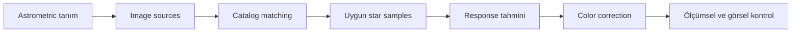
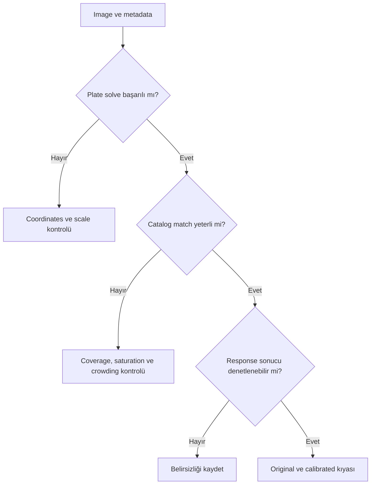
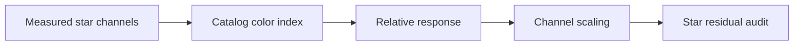
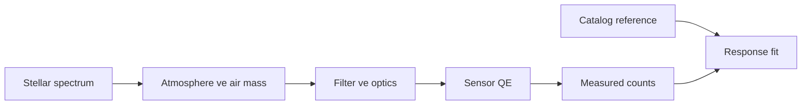
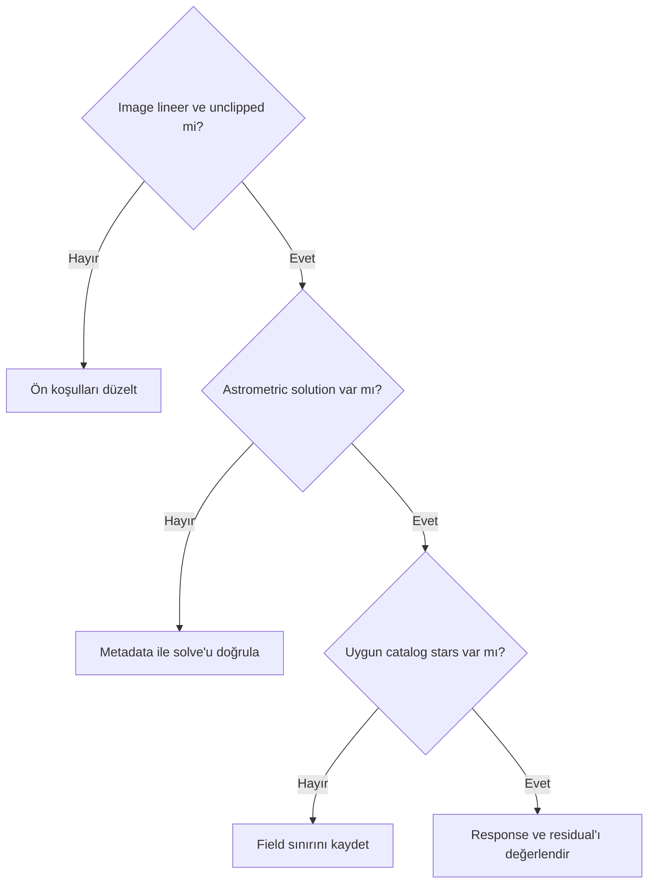

# Fotometrik Kalibrasyon Teorisi

## Amaç

Plate solving, catalog matching, stellar color index ve instrument response üzerinden relative color calibration yaklaşımını açıklamak; absolute photometry ve estetik görünümden ayırmak.

## Kavramsal açıklama

Photometry, kaynak parlaklığını tanımlı bandlarda ölçme ve referanslarla ilişkilendirme disiplinidir. Photometric color calibration processi, catalog ve image kaynakları arasındaki eşleşmelerden color response hakkında bir tahmin üretebilir. Exact PixInsight response estimation, source detection, reference selection ve rejection davranışı **Doğrulama bekliyor**.

Plate solving, image coordinates ile sky coordinates arasında astrometric solution kurar. Catalog query uygun sky bölgesindeki catalog kaynaklarını getirir; catalog matching görüntü kaynaklarıyla catalog kayıtları arasında aday eşleşmeler kurar. Source detection, image üzerindeki ölçülebilir kaynakları belirleme aşamasıdır. Reference star selection ve star rejection, hangi eşleşmelerin response tahminine katkı vereceğini etkileyebilir. Stellar color index iki band ölçümü arasındaki göstergedir; eksiksiz fiziksel spektrum veya doğrudan RGB coefficient değildir. Bu aşamaların exact uygulaması process ve sürüm dokümantasyonuyla doğrulanmalıdır.

Photometric zero point, instrumental ölçümü referans magnitude sistemine bağlayan offset kavramıdır. Bir color calibration processinin zero point'i kullanıp kullanmadığı veya nasıl kullandığı sürüme/process'e bağlıdır ve burada zorunlu varsayılmaz. Relative color calibration kanal ilişkisine odaklanabilir; absolute photometry ise flux/magnitude ölçümünü standard system'e izlenebilir biçimde bağlamayı gerektirir. Amaç ve doğruluk düzeyi eşdeğer değildir.

### Metadata grupları

Görüntünün gökyüzündeki konumunu tanımlayan bilgiler target coordinates, mevcut astrometric solution ve WCS metadata olabilir. Görüntü ölçeğini tanımlamaya yardımcı bilgiler focal length, pixel size, image dimensions ve plate scale olabilir. Observation date, filter, sensor/kamera ve acquisition metadata ise gözlem/sistem bağlamı sağlar.

| Bilgi | Potansiyel kullanım | Astrometric solution varsa durumu | Doğrulama durumu |
| --- | --- | --- | --- |
| Target coordinates | İlk sky konumu tahmini | Geçerli WCS daha doğrudan kullanılabilir | İşlem/sürüm doğrulaması bekliyor |
| WCS metadata | Image-sky coordinate dönüşümü | Astrometric solution'ın temel parçası olabilir | 1.9.3 doğrulaması bekliyor |
| Focal length | Başlangıç image scale tahmini | Mevcut plate scale daha doğrudan olabilir | Fallback doğrulaması bekliyor |
| Pixel size | Başlangıç scale hesabı | Çözülmüş scale varken rolü değişebilir | Fallback doğrulaması bekliyor |
| Image dimensions | Field of view/scale bağlamı | Çözümün image geometrisiyle ilişkisini taşır | İşlem davranışı bekliyor |
| Plate scale | Source search/solve başlangıcı | Geçerli solution içinde bulunabilir | 1.9.3 doğrulaması bekliyor |
| Observation date | Epoch/observation bağlamı | WCS'nin yerini tutmaz | Exact kullanım bekliyor |
| Filter bilgisi | Passband/response bağlamı | Astrometry'den ayrı işlev | Exact model kullanımı bekliyor |
| Sensor/kamera bilgisi | Instrument response bağlamı | Astrometry'den ayrı işlev | Exact model kullanımı bekliyor |

Bazı bilgiler plate solving için başlangıç tahmini sağlayabilir. Geçerli astrometric solution bazı ham acquisition bilgilerinden daha doğrudan kullanılabilir. Zorunlu alanlar ve fallback davranışı process/sürüme bağlı olabilir; yanlış metadata, eksik metadata'dan daha yanıltıcı olabilir.

Atmospheric extinction, filter response ve sensor response star measurements'ı dalga boyuna bağlı etkiler. Catalog coverage, star saturation, rejection, crowded field, dust extinction, galaxy-dominated ve nebula-dominated alanlar eşleşme/response tahminini sınırlayabilir.

## Ön koşullar

- Calibration ve gradient correction denetlenmiş broadband image; stretch öncesi kullanım genel workflow açısından daha uygun olabilir
- Channel clipping bulunmaması
- Yeterli ve ölçülebilir star population
- Güvenilir scale/coordinate/filter/date bağlamı veya geçerli astrometric solution; exact zorunluluklar doğrulanmalıdır

## Ne zaman kullanılır?

- Broadband RGB/LRGB/OSC veride catalog tabanlı relative response aranırken
- Star population solve ve match için yeterliyse
- Calibration sonucunun ölçüm ve log çıktısı incelenebiliyorsa

## Ne zaman kullanılmaz?

- Narrowband HOO/SHO'ya broadband color index mantığını doğrudan uygulamak için
- Gradient, flat artefact veya clipping'i çözmek için
- Starless ya da yetersiz/saturated star field'da doğrulamasız sonuç üretmek için

## Uygulama veya değerlendirme yaklaşımı

1. Image'ın linear/nonlinear durumunu kaydedin; stretch öncesi çalışma genel workflow olarak değerlendirilebilir, exact process gereksinimini ayrıca doğrulayın.
2. Metadata ve astrometric solution'ı kontrol edin.
3. Catalog coverage ile matched/unmatched star population'ını değerlendirin.
4. Saturated/rejected stars ve crowded field etkisini inceleyin.
5. Response/channel scaling sonucunu log ve image measurements ile karşılaştırın.
6. Background neutrality, clipping ve color grading'i ayrı adımlar olarak tutun.

## Gerçek kullanım senaryosu

Broadband M31 LRGB master plate solve edilir ve catalog stars ile eşleşme planlanır. Saturated yıldızlar, dust extinction ve galaxy-dominated alanın etkisi incelenmeden sonuç kabul edilmez. Calibration sonucu henüz gerçek veriyle doğrulanmamıştır.

## Görsel planı

!!! example "Görsel doğrulama ölçütü — fotometrik zincir"
    **Amaç:** Solve'dan channel calibration'a veri akışını göstermek.  
    **Gerekli ekran veya veri:** Astrometric solution, catalog match, response/log ve calibrated output.  
    **Kanıtlanacak teknik nokta:** Photometric calibration'ın tek adımlı color grading olmaması.  
    **Önerilen dosya adı:** `color-photometric-calibration-chain-v01.png`

!!! example "Görsel doğrulama ölçütü — katalog yıldız eşleşmesi"
    **Amaç:** Matched, rejected ve saturated stars ayrımını göstermek.  
    **Gerekli ekran veya veri:** Catalog overlay ve rejection/log listesi.  
    **Kanıtlanacak teknik nokta:** Response tahmininin değerlendirilen star sample population'ına bağlı olabilmesi.  
    **Önerilen dosya adı:** `color-catalog-star-match-v01.png`

!!! example "Görsel doğrulama ölçütü — plate solve tanısı"
    **Amaç:** Başarılı ve başarısız solve durumlarını karşılaştırmak.  
    **Gerekli ekran veya veri:** İki solve logu, metadata ve coordinate overlay.  
    **Kanıtlanacak teknik nokta:** Scale/coordinate metadata hatasının eşleşmeyi engelleyebilmesi.  
    **Önerilen dosya adı:** `color-plate-solve-success-failure-v01.png`

## Flux, atmospheric extinction ve air mass

Catalog magnitude doğrudan image pixel değeri değildir. Instrumental flux; exposure, aperture/PSF ölçümü, passband, sensor QE, optik throughput ve atmosferden etkilenir. Color calibration bu zincirdeki channel response ilişkisini tahmin eder; absolute physical flux birimine dönüşüm yaptığı varsayılmamalıdır.

Hedef ufka yaklaştıkça air mass artar ve atmosferik extinction wavelength’e göre değişir. Bu nedenle farklı gecelerden kanalları yalnız exposure süresiyle ölçeklemek color response eşitliği sağlamaz.

## Sık yapılan hatalar

1. Yanlış focal length veya pixel size kullanmak.
2. Saturated stars'ı güvenilir reference saymak.
3. Catalog match sayısını tek kalite ölçütü yapmak.
4. Narrowband channel normalization veya palette mapping'i broadband stellar calibration ile eş tutmak.
5. Photometric sonucu estetik renk garantisi saymak.
6. Gradient veya clipping'i calibration ile çözmeye çalışmak.

## Sorun giderme

| Belirti | Olası neden | İlk kontrol |
| --- | --- | --- |
| Plate solve başarısız | Scale/coordinates/metadata | Focal length, pixel size, target coordinates |
| Catalog match az | Coverage/crowding/date | Catalog alanı ve astrometric solution |
| Yıldızların çoğu reddedildi | Saturation veya ölçüm kalitesi | Star maxima ve rejection logu |
| Sonuç soluk | Scaling/rendering veya expectation | Channel statistics ve STF |
| Nebula rengi bozuldu | Star calibration ile diffuse signal farkı | Model ve target channels |

## SSS

??? question "Plate solving color calibration mıdır?"
    Hayır; sky/image coordinate eşlemesini sağlayan ön koşuldur.
??? question "Color index spectrum mudur?"
    Hayır; belirli band measurements arasındaki göstergedir.
??? question "Photometric calibration absolute photometry midir?"
    Eşdeğer değildir; amaç ve gerekli standardization farklıdır.
??? question "Metadata'nın tamamı zorunlu mudur?"
    PixInsight 1.9.3 process gereksinimleri gerçek arayüz ve documentation ile doğrulanmalıdır.
??? question "Narrowband neden sınırlıdır?"
    Narrowband star measurements filter bandpass nedeniyle broadband stellar color ilişkisini eksik temsil edebilir. Process'e özgü narrowband model ve seçenekler Sprint 3.2'de doğrulanacaktır.
??? question "Sonuç estetik olmak zorunda mı?"
    Hayır; estetik grading ayrı bir aşamadır.

## Hızlı Referans

!!! tip "Tek sayfalık kontrol listesi"
    - [ ] Linear, calibrated, gradient-denetlenmiş image
    - [ ] Astrometric solution ve metadata kontrolü
    - [ ] Catalog coverage yeterliliği
    - [ ] Saturated/rejected stars denetimi
    - [ ] Response ve channel scaling logu
    - [ ] Background/clipping/grading ayrı tutuldu

## Karar Ağacı

## Teknik doğrulama durumu

| Kategori | Durum |
| --- | --- |
| UI-5 | PixInsight 1.9.3 process UI ve metadata alanları bekliyor |
| DOC-5 | Response estimation, color index, zero point ve rejection bekliyor |
| DATA-5 | Broadband star field testi bekliyor |
| IMG-5 | Üç planlı görsel bekliyor |

## Ayrıca İnceleyin

- [Astronomik Renk Teorisi](color-theory.md)
- [White Balance](white-balance.md)
- [Color Calibration Diagnostics](color-calibration-diagnostics.md)
- [SPCC](spcc.md)
- [PCC](pcc.md)

## Önceki Bölüm

[← Beyaz Dengesi](white-balance.md)

## Sonraki Bölüm

[Arka Plan Nötrlüğü →](background-neutrality.md)
