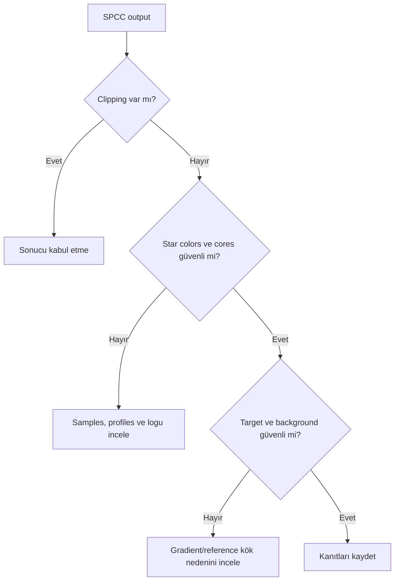
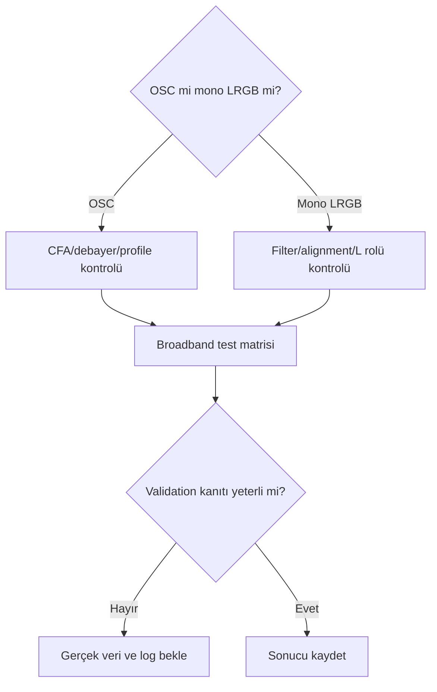

# SPCC Broadband İş Akışı

## Amaç

OSC ve mono LRGB broadband veride SPCC testini instrument response, astrometry, star samples ve sonuç doğrulaması üzerinden planlamak.

## Kavramsal açıklama

Broadband stellar color reference, OSC CFA/debayer zinciri veya mono filter seti ve sensor response bağlamıyla yorumlanır. L channel intensity/detail rolü taşıyabilir; RGB color calibration'ın otomatik ikamesi değildir.

!!! warning "Luminance kapsamı"
    SPCC renk kalibrasyonunun ana konusu RGB veya renk taşıyan channel ilişkisidir. Luminance doğrudan color reference değildir. Mono LRGB workflow'da RGB calibration ile L channel'ın daha sonra birleştirilmesi ayrı aşamalardır. Birleşik LRGB image üzerinde SPCC davranışı PixInsight 1.9.3 UI ve gerçek veriyle doğrulanmadan genellenmez.

## Ön koşullar

- [SPCC Ön Koşulları](spcc-prerequisites.md) tamamlanmış olmalı
- Gradient correction ve clipping denetlenmeli
- WCS, profile context ve stars uygun olmalı
- Original, log ve output saklanmalı

## Ne zaman değerlendirilir?

- OSC broadband veya birleşik mono RGB master'da
- Star-rich, wide-field, galaxy veya reflection nebula alanında riskler kaydedilebildiğinde
- White/background reference ve dust extinction bağlamı denetlenebildiğinde

## Ne zaman tek başına yeterli değildir?

- LRGB combination, gradient correction veya background neutrality yerine
- Saturated/clipped star color onarımı için
- Estetik saturation/color grading için

## Mono LRGB ve OSC ayrımı

| Değerlendirme | Mono LRGB | OSC |
| --- | --- | --- |
| Instrument response | Sensor + external filters + optics | Sensor + CFA + optics |
| Filter tanımı | R/G/B set profile | CFA response/profile |
| CFA etkisi | Yok | Acquisition/debayer zincirinde var |
| Channel alignment | Ayrı masters arasında kritik | Debayer/registration geçmişine bağlı |
| White balance geçmişi | Manual/channel workflow olabilir | Kamera/debayer katsayı geçmişi olabilir |
| Debayer etkisi | Yok | CFA interpolation etkisi vardır |
| Metadata | Filter/channel acquisition kayıtları | CFA/sensor/acquisition kayıtları |
| Calibration riski | Channel mismatch | CFA/debayer/profile mismatch |
| Result validation | Stars, galaxy, background, channels | Stars, galaxy, background, CFA residual |

## Uygulama veya teşhis yaklaşımı

1. OSC/mono pipeline ve L channel rolünü kaydedin.
2. Gradient/color gradient, WCS ve profiles'ı doğrulayın.
3. Saturated stars, catalog matching ve dust/extinction riskini inceleyin.
4. SPCC testini clone üzerinde çalıştırın; exact UI ayarları doğrulanmadıysa kaydedin.
5. Log ile Original/Output histogram, channels, stars, galaxy/reflection nebula ve background'u karşılaştırın.

## SPCC sonrası kontrol listesi

- [ ] Channel clipping oluşumu kontrol edildi.
- [ ] Star cores saturation açısından incelendi.
- [ ] Star color diversity karşılaştırıldı.
- [ ] Galaxy core/outer disk ilişkisi incelendi.
- [ ] Background color gradient kontrol edildi.
- [ ] Calibration artefact görünürlüğü kontrol edildi.
- [ ] Saturation değişiminin display etkisi ayrıldı.
- [ ] STF yeniden hesaplandı.
- [ ] Original ile eşdeğer gösterim kıyası yapıldı.
- [ ] Process log incelendi.
- [ ] Astrometric solution kontrol edildi.
- [ ] Metadata korunumu kontrol edildi.

## Gerçek veri testleri

| Test ID | Veri | Senaryo | Kanıt | Durum |
| --- | --- | --- | --- | --- |
| SPCC-BB-OSC-01 | OSC broadband | CFA/profile workflow | Star/background response | Gerçek veri bekliyor |
| SPCC-BB-LRGB-01 | Mono LRGB RGB | Filter/sensor workflow | Channel calibration | Gerçek veri bekliyor |
| SPCC-BB-M31-01 | M31 LRGB | Galaxy field | Core/outer disk preservation | Gerçek veri bekliyor |
| SPCC-BB-STARFIELD-01 | Star-rich field | Sample population | Color diversity/rejection | Gerçek veri bekliyor |
| SPCC-BB-GRADIENT-01 | Color gradient set | Before/after root cause | SPCC'nin gradient'i onarmaması | Gerçek veri bekliyor |
| SPCC-BB-SATURATION-01 | Saturated star set | Rejection/clipping | Sample sınırı | Gerçek veri bekliyor |
| SPCC-BB-METADATA-01 | WCS variants | Metadata fallback | Solve/query behavior | Gerçek veri bekliyor |
| SPCC-BB-REFERENCE-01 | Reference variants | White/background context | Output sensitivity | Gerçek veri bekliyor |

## Gerçek kullanım senaryosu

M31 RGB master için `SPCC-BB-M31-01` planlanır; outer disk, core, stars ve background Original/Output ile karşılaştırılacaktır. Henüz sonuç yoktur.

## Görsel planı

!!! example "Görsel doğrulama ölçütü — mono LRGB sonucu"
    **PixInsight sürümü:** 1.9.3  
    **Target veya veri:** Mono LRGB broadband master  
    **Ekran veya çıktı:** Original/SPCC output/log  
    **Kanıtlanacak konu:** Filter/profile ve channel result  
    **Önerilen dosya adı:** `spcc-193-broadband-lrgb-result-v01.png`

!!! example "Görsel doğrulama ölçütü — OSC sonucu"
    **PixInsight sürümü:** 1.9.3  
    **Target veya veri:** OSC broadband master  
    **Ekran veya çıktı:** Original/SPCC output/log  
    **Kanıtlanacak konu:** CFA/profile ve star color karşılaştırması  
    **Önerilen dosya adı:** `spcc-193-broadband-osc-result-v01.png`

!!! example "Görsel doğrulama ölçütü — M31 renk koruma"
    **PixInsight sürümü:** 1.9.3  
    **Target veya veri:** M31 LRGB  
    **Ekran veya çıktı:** Original/output/difference ve log  
    **Kanıtlanacak konu:** Core, outer disk ve halo color preservation  
    **Önerilen dosya adı:** `spcc-193-m31-color-preservation-v01.png`

## Tam iş akışı karar matrisi

| İş Akışı | SPCC girdisi | Sonraki karar | Neden |
|---|---|---|---|
| Mono LRGB | Linear combined RGB | Luminance’i sonra ekle | L channel color response çözmez |
| LRGB + Ha | Önce broadband RGB | Ha’yı maskeli ekle | Emission star color fitini bozmamalı |
| OSC dark sky | Debayered integrated color | Broadband profile | Stellar spectrum örneklenebilir |
| OSC light pollution | Gradient düzeltilmiş color | Residual kanalları kontrol et | SPCC spatial gradient çözmez |

## Sık yapılan hatalar

1. L channel'ı RGB response yerine kullanmak.
2. OSC white balance/debayer geçmişini yok saymak.
3. Saturation düşüşünü doğrudan hata saymak.
4. Reflection nebula veya galaxy color'ını reference dışı bırakmamak.
5. Gradient'i SPCC çıktısıyla gizlemek.

## Sorun giderme

| Belirti | İlk kontrol | Kart |
| --- | --- | --- |
| Output soluk | STF/statistics/log | [Sorun Giderme](spcc-troubleshooting.md) |
| Stars beyaz | Clipping/saturation | [Sorun Giderme](spcc-troubleshooting.md) |
| Galaxy color değişti | Profiles/reference/gradient | Test matrisi |
| OSC cast | CFA/debayer/profile | Ön koşullar |
| LRGB mismatch | Filter/channel alignment | Ön koşullar |

## SSS

??? question "L channel SPCC ile calibrated olur mu?"
    RGB calibration ve L intensity rolü ayrı değerlendirilmelidir; exact process davranışı doğrulanmalıdır.
??? question "OSC white balance kullanılmalı mı?"
    Acquisition/debayer geçmişi kaydedilir; üretici katsayısı tek bilimsel referans değildir.
??? question "SPCC saturation artırır mı?"
    Color grading aracı değildir; görünüm STF/rendering ile ayrıca değerlendirilir.
??? question "Galaxy field uygunsuz mu?"
    Kesin hüküm yoktur; star population, dust, target ve background riskleri test edilir.
??? question "Gradient önce mi?"
    General workflow'da gradient kök nedeni önce denetlenir; SPCC gradient modeling değildir.

## Hızlı Referans

!!! tip "Tek sayfalık kontrol listesi"
    - [ ] OSC/LRGB zinciri kaydedildi
    - [ ] Profiles/WCS/stars güvenilir
    - [ ] Gradient/clipping yok
    - [ ] Log ve metadata saklandı
    - [ ] Stars/target/background kıyaslandı

## Karar Ağacı

## Teknik doğrulama durumu

| Kategori | Durum |
| --- | --- |
| UI-6 | Broadband UI/options bekliyor |
| DOC-6 | Profile/reference/model davranışı bekliyor |
| DATA-6 | Sekiz test bekliyor |
| IMG-6 | LRGB/OSC/M31 görselleri bekliyor |

## İlgili bölümler

- [SPCC Ana Referans](spcc.md)
- [SPCC Ön Koşulları](spcc-prerequisites.md)
- [SPCC Sorun Giderme](spcc-troubleshooting.md)
- [Background Neutrality](background-neutrality.md)
