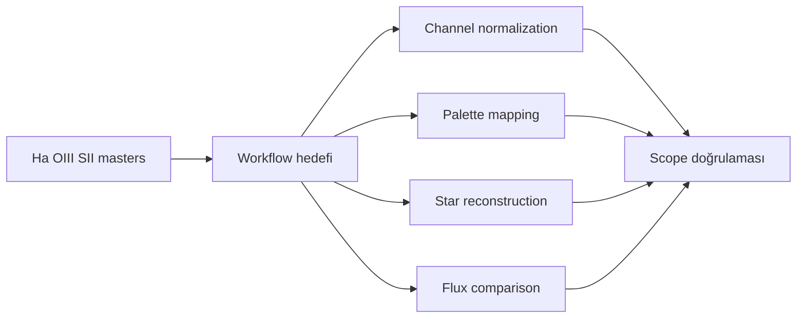
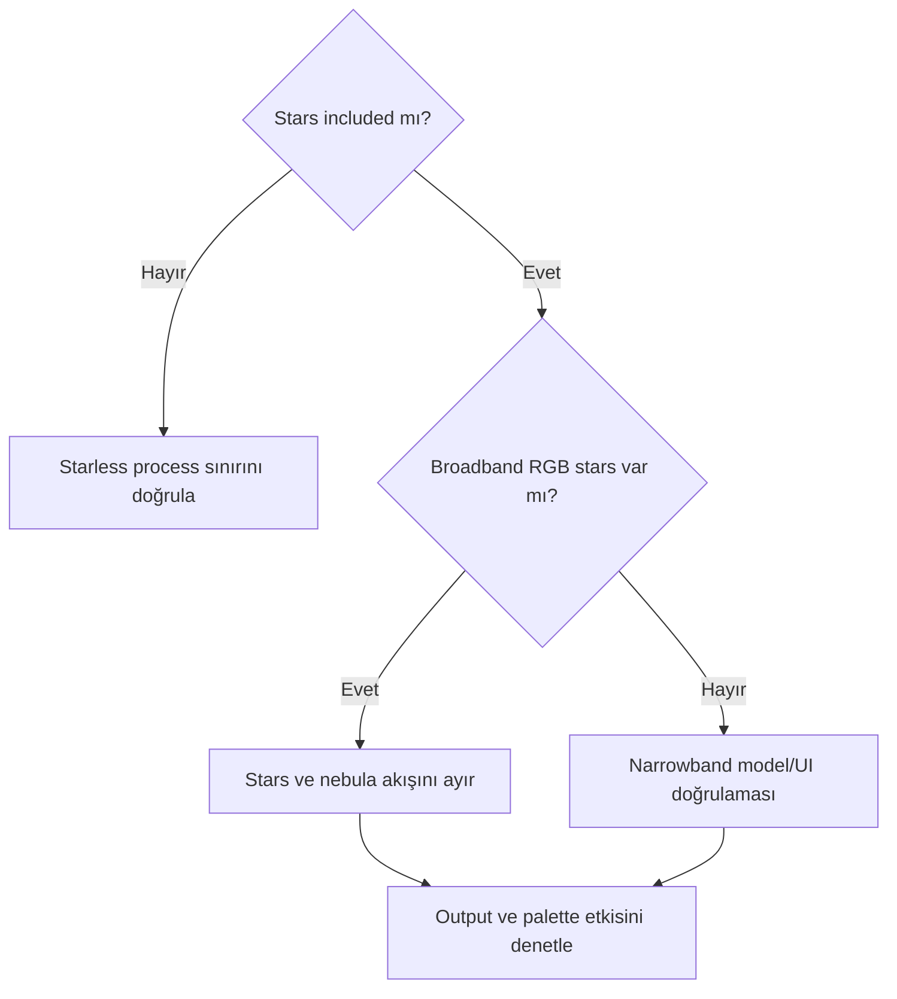
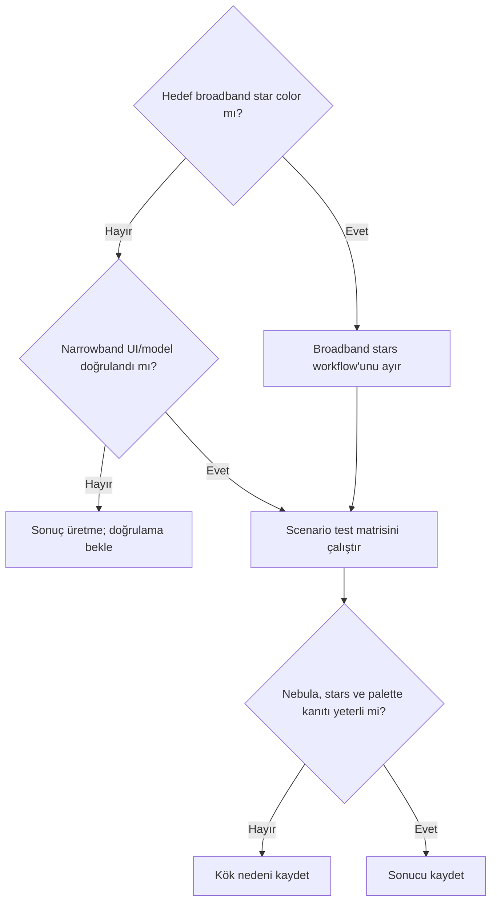

# SPCC Narrowband Kapsamı

## Amaç

SPCC'nin narrowband veride olası kapsamını broadband stellar calibration, channel normalization, palette mapping ve star reconstruction'dan ayırmak.

## Kavramsal açıklama

Ha, OIII ve SII broadband RGB değildir. SHO/HOO palette mapping içerir; narrowband channel normalization broadband stellar color calibration ile aynı değildir. Narrowband stars, filter bandpass nedeniyle broadband stellar color ilişkisini eksik temsil edebilir. SPCC'de özel narrowband seçenek/model varsa exact ad ve davranış PixInsight 1.9.3 UI/birincil kaynakla doğrulanmalıdır.

Continuum subtraction, star color reconstruction, nebula palette mapping ve color grading ayrı işlemlerdir. SPCC'nin nebula estetiğini otomatik belirlediği varsayılmaz.

## Ön koşullar

- Filter/channel türü, stars-included/starless ve combination durumu kayıtlı
- Gradient, clipping, halo/reflection ve channel alignment denetlenmiş
- SPCC narrowband UI/model kapsamı doğrulanmış veya açıkça bekliyor
- Nebula ve star hedefleri ayrı kabul ölçütlerine sahip

## Ne zaman değerlendirilir?

- Process'te doğrulanmış narrowband model/seçenek varsa kontrollü testte
- RGB stars + narrowband nebula veya Ha-enhanced RGB bağlamı ayrılabildiğinde
- Result, log ve original ayrı tutulabildiğinde

## Ne zaman tek başına yeterli değildir?

- SHO/HOO palette estetiğini belirlemek için
- Continuum subtraction veya star reconstruction yerine
- Gradient, clipping ve filter halo onarımı için

## Konu ayrımı

| İşlem | Amaç | SPCC ile ilişkisi | Ayrı doğrulama gerekir mi? |
| --- | --- | --- | --- |
| Broadband stellar color calibration | Catalog/reference star color | SPCC ana broadband bağlamı olabilir | Evet |
| Narrowband channel normalization | Channel scale ilişkisi | Aynı amaç varsayılmaz | Evet |
| SHO palette mapping | S/H/O → display colors | SPCC estetik mapping değildir | Evet |
| HOO palette mapping | H/O → RGB mapping | SPCC kapsamı ayrı | Evet |
| Star color reconstruction | Broadband-like stars üretmek | Stars/nebula pipeline ayrılmalı | Evet |
| Continuum subtraction | Line/continuum ayrımı | Ayrı fiziksel işlem | Evet |
| Nebula color grading | Estetik color mixing | SPCC değildir | Evet |
| Background neutralization | Reference/channel relationship | Spatial gradient veya palette değildir | Evet |
| Photometric flux comparison | Band ölçümlerini karşılaştırmak | Color calibration ile absolute flux eşdeğer değil | Evet |

## Narrowband senaryoları

| Senaryo | SPCC öncesi kontrol | SPCC’den beklenebilecek kapsam | Ana risk |
| --- | --- | --- | --- |
| Saf Ha/OIII/SII mono masters | Filter profiles ve signal | Exact narrowband model doğrulanırsa test | Broadband color beklentisi |
| Linear SHO combination | Mapping ve channel scale | UI/model kapsamı kadar | Palette'in otomatik belirlendiği sanısı |
| Linear HOO combination | Ha/OIII mapping | UI/model kapsamı kadar | Red dominance ile gradient karışması |
| RGB stars + NB nebula | Star/nebula ayrımı | RGB stars üzerinde broadband test | Nebula palette etkilenmesi |
| Starless NB nebula | Star sample yok | Exact behavior doğrulaması | Catalog reference eksikliği |
| Narrowband stars retained | Saturation/bandpass | Mode/model varsa test | Eksik broadband star colors |
| Broadband RGB + NB blend | Blend sırası ve metadata | RGB component testi | Mixed response |
| Ha-enhanced RGB galaxy | Ha contribution ve galaxy | RGB/Ha ayrımıyla test | Galaxy color bias |
| Dual-band OSC | CFA + dual-band profile | Exact profile/model varsa test | Instrument model mismatch |

## Uygulama veya teşhis yaklaşımı

1. Senaryoyu tablodan seçin ve hedefi adlandırın.
2. Filter bandpass, stars ve combination/mapping geçmişini kaydedin.
3. Exact narrowband UI/model doğrulanmadıysa process sonucu üretmeyin.
4. Original, log ve output'u nebula, stars, background ve channel statistics ile karşılaştırın.
5. Palette grading ve star reconstruction'ı ayrı kaydedin.

## Gerçek veri testleri

| Test ID | Veri | Senaryo | Kanıt | Durum |
| --- | --- | --- | --- | --- |
| SPCC-NB-HA-01 | Ha | Mono master | Mode/profile kapsamı | Gerçek veri bekliyor |
| SPCC-NB-OIII-01 | OIII | Mono master | Faint signal ve stars | Gerçek veri bekliyor |
| SPCC-NB-SHO-01 | SHO | Linear combination | Palette/model ayrımı | Gerçek veri bekliyor |
| SPCC-NB-HOO-01 | HOO | Linear combination | Red dominance/gradient ayrımı | Gerçek veri bekliyor |
| SPCC-NB-RGBSTARS-01 | RGB stars + NB | Ayrı star layer | Star reconstruction ilişkisi | Gerçek veri bekliyor |
| SPCC-NB-STARLESS-01 | Starless NB | No star samples | Process error/scope | Gerçek veri bekliyor |
| SPCC-NB-HA-RGB-01 | HaRGB galaxy | Blend | Galaxy color preservation | Gerçek veri bekliyor |
| SPCC-NB-DUALBAND-01 | Dual-band OSC | CFA/profile | Instrument/model scope | Gerçek veri bekliyor |

## Gerçek kullanım senaryosu

NGC 6888 HOO data için `SPCC-NB-HOO-01` tasarlanır. Ha/OIII masters, star layer, mapping, gradient ve filter profiles kaydedilir. Exact SPCC narrowband mode doğrulanmadan sonuç kabul edilmez.

## Görsel planı

!!! example "Görsel eklenecek — narrowband scope"
    **PixInsight sürümü:** 1.9.3  
    **Target veya veri:** SHO, HOO, RGB stars + NB ve starless examples  
    **Ekran veya çıktı:** Doğrulanmış narrowband UI, log ve scenario outputs  
    **Kanıtlanacak konu:** Mode/options kapsamı ile palette/star workflow ayrımı  
    **Önerilen dosya adı:** `spcc-193-narrowband-scope-v01.png`

## Sık yapılan hatalar

1. Narrowband'ı broadband RGB saymak.
2. SPCC'yi palette generator gibi anlatmak.
3. Starless data'da catalog sample varmış gibi davranmak.
4. Continuum subtraction ve channel normalization'ı karıştırmak.
5. Dual-band OSC için profile davranışı uydurmak.

## Sorun giderme

| Belirti | İlk kontrol | Karar |
| --- | --- | --- |
| Palette anlamsız | Workflow hedefi | Color grading'i ayrı tut |
| Starless error | Star sample ihtiyacı | UI/log doğrula |
| Stars renksiz | Bandpass/saturation | RGB stars alternatifini değerlendir |
| HOO red dominant | Mapping/SNR/gradient | Kök nedenleri ayır |
| Dual-band mismatch | Profile/CFA | Instrument modelini doğrula |

## SSS

??? question "SPCC SHO palette seçer mi?"
    Böyle bir estetik garanti verilmez; exact UI/model ve palette workflow ayrılmalıdır.
??? question "Starless narrowband çalışır mı?"
    Exact process davranışı 1.9.3 UI/log ile doğrulanmalıdır.
??? question "Channel normalization SPCC midir?"
    Aynı amaç varsayılmaz; ayrı doğrulama gerekir.
??? question "RGB stars eklemek yeterli mi?"
    Star/nebula layers, blend ve output gerçek data ile test edilmelidir.
??? question "Dual-band OSC için hangi profile?"
    Sabit reçete verilmez; database/model kapsamı doğrulanmalıdır.

## Quick Reference

!!! tip "Tek sayfalık kontrol listesi"
    - [ ] Filter bands ve scenario kaydedildi
    - [ ] Stars-included/starless ayrıldı
    - [ ] UI/model doğrulandı veya bekliyor
    - [ ] Palette/normalization/reconstruction ayrıldı
    - [ ] Original/log/output saklandı

## Decision Tree

## Teknik doğrulama durumu

| Kategori | Durum |
| --- | --- |
| UI-6 | Narrowband controls/modes bekliyor |
| DOC-6 | Model/passband scope bekliyor |
| DATA-6 | Sekiz test bekliyor |
| IMG-6 | Narrowband UI/scenario görseli bekliyor |

## İlgili bölümler

- [SPCC Ana Referans](spcc.md)
- [SPCC Ön Koşulları](spcc-prerequisites.md)
- [SPCC Broadband](spcc-broadband.md)
- [NGC 6888 Gradient İş Akışı](../04-gradient/ngc6888-gradient-workflow.md)
